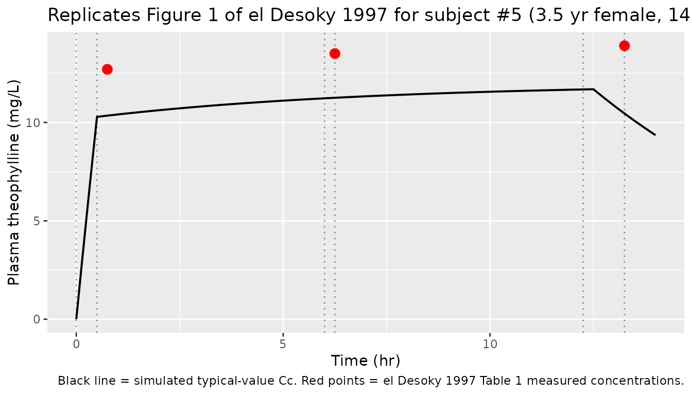
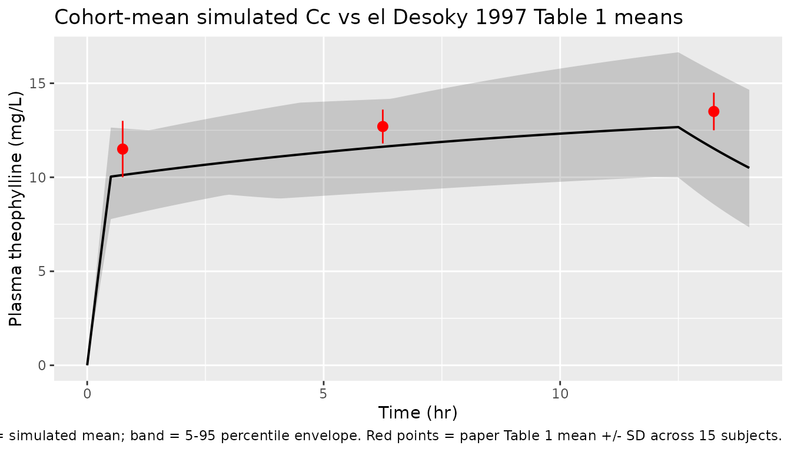

# Theophylline in pediatric asthma (el Desoky 1997)

## Model and source

- Citation: El Desoky E, Ghazal MH, Mohamed MA, Klotz U. Disposition of
  intravenous theophylline in asthmatic children: Bayesian approach vs
  direct pharmacokinetic calculations. Japanese Journal of Pharmacology.
  1997;75(1):13-20. <doi:10.1254/jjp.75.13>
- Description: One-compartment IV PK model for theophylline in 15
  Egyptian pediatric patients (age 2-12 yr, weight 12-30 kg) treated for
  an acute asthma attack (elDesoky 1997). Aminophylline given as a
  30-min loading infusion (6 mg/kg) followed by 12 hr of continuous
  maintenance infusion (1 mg/kg/hr); theophylline concentrations
  measured at 0.75, 7, and 13.25 hr. Parameter values taken from the
  Standard Calculations (SC) column of Table 2, which is independent of
  the Bayesian-prior population data and is treated by the authors as
  the reference (true) values.
- Article: [Jpn J Pharmacol
  1997;75(1):13-20](https://doi.org/10.1254/jjp.75.13) (J-STAGE open
  access)

## Population

Fifteen Egyptian children (9 male, 6 female), age 2-12 years (mean 6.4
+/- SD 3.4), total body weight 12.0-30.0 kg (mean 19.7 +/- 5.9), height
80-126 cm (mean 104.6 +/- 15.1), with an acute attack of allergic
bronchial asthma of 1-4 years’ disease duration, admitted to the
pediatric department of Assiut University Hospital. All subjects had
normal liver and renal function, were precipitated by an upper
respiratory infection, and had been maintained on oral albuterol
(salbutamol) 0.1 mg/kg every 8 hr but theophylline-free for at least 1
week prior to admission. Each subject received aminophylline 6 mg/kg IV
over 30 min (loading dose) followed by 1 mg/kg/hr continuous IV
maintenance infusion for 12 hr, with a 15-min sampling pause at 6.25 hr.
Aminophylline is 86 percent anhydrous theophylline (Methods page 14), so
theophylline-equivalent doses are LD = 5.16 mg/kg and MD = 0.86
mg/kg/hr. Three plasma samples per subject: C1 = 0.75 hr (15 min after
end of LD), C2 = 6.25 hr (after 6 hr MD + 15 min infusion pause), C3 =
13.25 hr (end of second MD). Plasma theophylline was measured by Enzyme
Multiplied Immunoassay (EMIT) on the Syva system; assay precision CV
4.1-5.8 percent across 7.5-25 ug/mL (el Desoky 1997 Methods page 14,
Table 1 page 14).

The same information is available programmatically via
`readModelDb("elDesoky_1997_theophylline_pediatric_asthma")$population`.

## Source trace

Per-parameter origin is recorded as an in-file comment next to each
`ini()` entry in
`inst/modeldb/specificDrugs/elDesoky_1997_theophylline_pediatric_asthma.R`.
The table below collects them for review.

| Equation / parameter | Value | Source location |
|----|----|----|
| Structural model | one-compartment open model with IV linear elimination | el Desoky 1997 Methods page 15: “The calculation of the pharmacokinetic parameters (e.g., CL, Vd, t1/2) are based on the open one compartment model.” |
| `lcl` (CL at WT = 19.7 kg) | `log(1.30)` L/hr | Table 2 SC column page 16: mean CL = 1.10 +/- 0.20 mL/min/kg = 0.066 L/hr/kg; at reference 19.7 kg, CL = 0.066 \* 19.7 = 1.30 L/hr. SC = Standard pharmacokinetic Calculations (independent of population prior). |
| `lvc` (Vc at WT = 19.7 kg) | `log(9.85)` L | Table 2 SC column page 16: mean Vd = 0.50 +/- 0.08 L/kg; at reference 19.7 kg, Vc = 0.50 \* 19.7 = 9.85 L. |
| `etalcl` IIV | `log(1 + 0.18^2)` = 0.0326 | Table 2 SC column page 16: SD/mean = 0.20/1.10 = 18.2 percent CV; descriptive variance of the 15 individual fits, not a formal popPK omega. |
| `etalvc` IIV | `log(1 + 0.16^2)` = 0.0253 | Table 2 SC column page 16: SD/mean = 0.08/0.50 = 16.0 percent CV; descriptive variance of the 15 individual fits. |
| `propSd` | 0.10 (10 percent) | Not reported in paper. Conservative simulation-only default. EMIT assay precision 4.1-5.8 percent CV (Methods page 14) supports \< 10 percent measurement CV. |
| `(WT / 19.7)^1` scaling | n/a | el Desoky 1997 Table 2 reports CL and Vd in mL/min/kg and L/kg (per body weight). Reference WT = 19.7 kg (Table 1 cohort mean). The per-kg parameterization is reproduced by linear (exponent = 1) WT scaling. |

## Virtual cohort

Original observed data are not publicly available, but Table 1 of the
paper lists individual demographics for all 15 subjects. The cohort
below uses the 15 actual subjects’ age, weight, height, and sex from
Table 1 so the virtual population is the literal study cohort, not a
resampled approximation.

``` r

set.seed(19970224)  # paper Received February 24, 1997

cohort <- tibble::tribble(
  ~id, ~sex,  ~age, ~WT,   ~HT,
  1L,  "M",   2.0,  12.0,  80,
  2L,  "F",   2.5,  12.5,  85,
  3L,  "M",   2.5,  12.3,  89,
  4L,  "M",   3.5,  14.0,  90,
  5L,  "F",   3.5,  14.2,  91,
  6L,  "F",   5.0,  18.5,  105,
  7L,  "F",   5.0,  18.0,  100,
  8L,  "M",   6.5,  20.0,  105,
  9L,  "F",   6.5,  21.0,  107,
  10L, "F",   7.0,  22.0,  110,
  11L, "M",   8.0,  23.5,  115,
  12L, "M",   9.0,  24.0,  120,
  13L, "M",   11.0, 27.0,  124,
  14L, "F",   11.5, 26.8,  122,
  15L, "M",   12.0, 30.0,  126
)

knitr::kable(cohort, caption = "Replicates Table 1 (left columns) of el Desoky 1997: per-subject demographics for the 15 pediatric asthma patients.")
```

|  id | sex |  age |   WT |  HT |
|----:|:----|-----:|-----:|----:|
|   1 | M   |  2.0 | 12.0 |  80 |
|   2 | F   |  2.5 | 12.5 |  85 |
|   3 | M   |  2.5 | 12.3 |  89 |
|   4 | M   |  3.5 | 14.0 |  90 |
|   5 | F   |  3.5 | 14.2 |  91 |
|   6 | F   |  5.0 | 18.5 | 105 |
|   7 | F   |  5.0 | 18.0 | 100 |
|   8 | M   |  6.5 | 20.0 | 105 |
|   9 | F   |  6.5 | 21.0 | 107 |
|  10 | F   |  7.0 | 22.0 | 110 |
|  11 | M   |  8.0 | 23.5 | 115 |
|  12 | M   |  9.0 | 24.0 | 120 |
|  13 | M   | 11.0 | 27.0 | 124 |
|  14 | F   | 11.5 | 26.8 | 122 |
|  15 | M   | 12.0 | 30.0 | 126 |

Replicates Table 1 (left columns) of el Desoky 1997: per-subject
demographics for the 15 pediatric asthma patients. {.table}

## Simulation

``` r

# Aminophylline-to-theophylline conversion: aminophylline is 86 percent
# anhydrous theophylline (Methods page 14). Doses below are in
# theophylline-base equivalents.
amino_to_theo <- 0.86

# Loading dose: 6 mg/kg aminophylline over 30 min = 5.16 mg/kg theophylline.
# Maintenance dose: 1 mg/kg/hr aminophylline = 0.86 mg/kg/hr theophylline.
# Sampling protocol (Methods page 14, Figure 1):
#   C1 at 0.75 hr (15 min after end of LD)
#   C2 at 6.25 hr (after 6 hr of MD followed by 15-min infusion pause)
#   C3 at 13.25 hr (end of second 6-hr MD)
# The total MD duration is 12 hr, split into two 6-hr segments with a 15-min
# pause at 6.0-6.25 hr to draw C2.

per_subject_events <- function(subj) {
  ld_amt    <- 6 * amino_to_theo * subj$WT
  ld_rate   <- ld_amt / 0.5
  md_rate   <- 1 * amino_to_theo * subj$WT

  obs_times <- sort(unique(c(seq(0, 14, by = 0.1), 0.75, 6.25, 13.25)))

  dose1 <- tibble(id = subj$id, time = 0.0,  amt = ld_amt,         rate = ld_rate, cmt = "central", evid = 1L)
  dose2 <- tibble(id = subj$id, time = 0.5,  amt = md_rate * 6,    rate = md_rate, cmt = "central", evid = 1L)
  dose3 <- tibble(id = subj$id, time = 6.5,  amt = md_rate * 6,    rate = md_rate, cmt = "central", evid = 1L)
  obs   <- tibble(id = subj$id, time = obs_times, amt = 0, rate = 0, cmt = NA_character_, evid = 0L)
  bind_rows(dose1, dose2, dose3, obs) |>
    mutate(WT = subj$WT, sex = subj$sex, age = subj$age) |>
    arrange(time, desc(evid))
}

events <- bind_rows(lapply(seq_len(nrow(cohort)), function(i) per_subject_events(cohort[i, ])))
stopifnot(!anyDuplicated(unique(events[, c("id", "time", "evid")])))
```

``` r

mod <- rxode2::rxode2(readModelDb("elDesoky_1997_theophylline_pediatric_asthma"))
#> ℹ parameter labels from comments will be replaced by 'label()'
sim <- rxode2::rxSolve(mod, events = events, keep = c("WT", "sex", "age"))
```

Typical-value (no IIV) simulation at the cohort mean (WT = 19.7 kg) for
the deterministic published-comparison rows:

``` r

mod_typ  <- mod |> rxode2::zeroRe()
typ_subj <- tibble(id = 1L, age = 6.4, WT = 19.7, sex = "M")
typ_events <- per_subject_events(typ_subj)
sim_typ <- rxode2::rxSolve(mod_typ, events = typ_events, keep = c("WT"))
#> ℹ omega/sigma items treated as zero: 'etalcl', 'etalvc'
```

## Replicate published figures

### Figure 1 – Dosage regimen and the three measured concentrations

Figure 1 of el Desoky 1997 shows the dosage regimen for subject \#5 (a
3.5 year-old, 14.2 kg female) overlaid with the three measured
theophylline concentrations (post-loading, 6 hr, 12 hr). The cohort
summary below reproduces that shape for the same individual, with the
paper’s three measured concentrations marked.

``` r

subj5_obs <- tibble(
  time      = c(0.75, 6.25, 13.25),
  Cc_paper  = c(12.7, 13.5, 13.9)  # Table 1 row 5
)

sim_sub5 <- sim |> filter(id == 5L)

ggplot(sim_sub5, aes(time, Cc)) +
  geom_line(linewidth = 0.7) +
  geom_point(data = subj5_obs, aes(time, Cc_paper), colour = "red", size = 3) +
  geom_vline(xintercept = c(0, 0.5, 6.0, 6.25, 12.25, 13.25), linetype = "dotted", alpha = 0.4) +
  labs(x = "Time (hr)", y = "Plasma theophylline (mg/L)",
       title = "Replicates Figure 1 of el Desoky 1997 for subject #5 (3.5 yr female, 14.2 kg)",
       caption = "Black line = simulated typical-value Cc. Red points = el Desoky 1997 Table 1 measured concentrations.")
```



### Cohort-wide replication of Table 1 mean concentrations

Table 1 of el Desoky 1997 reports per-subject theophylline
concentrations at the three sampling times. The simulated cohort-mean
trajectory below uses the 15 actual subjects’ weights and is overlaid
with the paper’s across-subject mean +/- SD.

``` r

sim_mean <- sim |>
  filter(!is.na(Cc)) |>
  group_by(time) |>
  summarise(mean_Cc = mean(Cc), Q05 = quantile(Cc, 0.05), Q95 = quantile(Cc, 0.95), .groups = "drop")

paper_means <- tibble(
  time = c(0.75, 6.25, 13.25),
  mean_paper = c(11.5, 12.7, 13.5),
  sd_paper   = c(1.5,  0.9,  1.0)
)

ggplot(sim_mean, aes(time, mean_Cc)) +
  geom_ribbon(aes(ymin = Q05, ymax = Q95), alpha = 0.2) +
  geom_line(linewidth = 0.7) +
  geom_pointrange(data = paper_means, aes(time, mean_paper, ymin = mean_paper - sd_paper, ymax = mean_paper + sd_paper),
                  colour = "red", size = 0.5, inherit.aes = FALSE) +
  labs(x = "Time (hr)", y = "Plasma theophylline (mg/L)",
       title = "Cohort-mean simulated Cc vs el Desoky 1997 Table 1 means",
       caption = "Black line = simulated mean; band = 5-95 percentile envelope. Red points = paper Table 1 mean +/- SD across 15 subjects.")
```



## PKNCA validation

Compute steady-state-window NCA parameters using `PKNCA` for the cohort.
The treatment grouping variable distinguishes the maintenance-infusion
window (where SS is approached) from the loading-dose phase. The
“treatment” column carries a constant label since all 15 subjects
received the same regimen; PKNCA still requires a non-trivial grouping
in the formula.

``` r

sim_nca <- sim |>
  filter(!is.na(Cc)) |>
  mutate(treatment = "Aminophylline 6 mg/kg LD + 1 mg/kg/hr MD") |>
  select(id, time, Cc, treatment)

# Ensure a time = 0 row per (id, treatment); IV bolus pre-dose Cc = 0.
sim_nca <- bind_rows(
  sim_nca,
  sim_nca |> distinct(id, treatment) |> mutate(time = 0, Cc = 0)
) |>
  distinct(id, treatment, time, .keep_all = TRUE) |>
  arrange(id, treatment, time)

conc_obj <- PKNCA::PKNCAconc(as.data.frame(sim_nca), Cc ~ time | treatment + id)

dose_df <- events |>
  filter(evid == 1, time == 0) |>
  mutate(treatment = "Aminophylline 6 mg/kg LD + 1 mg/kg/hr MD") |>
  select(id, time, amt, treatment) |>
  as.data.frame()

dose_obj <- PKNCA::PKNCAdose(dose_df, amt ~ time | treatment + id)

intervals <- data.frame(
  start      = 0,
  end        = 14,
  cmax       = TRUE,
  tmax       = TRUE,
  auclast    = TRUE,
  half.life  = TRUE
)

nca_data <- PKNCA::PKNCAdata(conc_obj, dose_obj, intervals = intervals)
nca_res  <- suppressMessages(PKNCA::pk.nca(nca_data))
nca_summary <- summary(nca_res)
knitr::kable(nca_summary, caption = "Simulated NCA across 15 virtual subjects (median +/- 5/95 percentile).")
```

| start | end | treatment | N | auclast | cmax | tmax | half.life |
|---:|---:|:---|:---|:---|:---|:---|:---|
| 0 | 14 | Aminophylline 6 mg/kg LD + 1 mg/kg/hr MD | 15 | 157 \[14.7\] | 12.9 \[14.3\] | 12.5 \[0.500, 12.5\] | 5.83 \[1.84\] |

Simulated NCA across 15 virtual subjects (median +/- 5/95 percentile).
{.table}

### Comparison against published NCA

el Desoky 1997 Table 2 reports the cohort mean +/- SD of elimination
half-life (t1/2), clearance (CL), and apparent volume of distribution
(Vd) from the SC (Standard Calculations) method, treated by the authors
as the reference. PKNCA’s `half.life` is the post-infusion
terminal-phase t1/2, which for a 12-hr constant-rate infusion approaches
the model’s ln(2) \* Vc / CL once the infusion stops. The comparison
below shows the simulated typical-value t1/2 alongside the paper’s SC
mean t1/2.

``` r

typ_t_half <- log(2) * 9.85 / 1.30  # = 5.25 hr at typical CL = 1.30 L/hr, Vc = 9.85 L

cmp <- tibble(
  Parameter = c("Typical CL (L/hr at 19.7 kg)",
                "Typical Vc (L at 19.7 kg)",
                "Typical t1/2 (hr)",
                "Cohort-mean simulated Cc at 0.75 hr (mg/L)",
                "Cohort-mean simulated Cc at 6.25 hr (mg/L)",
                "Cohort-mean simulated Cc at 13.25 hr (mg/L)"),
  Simulated = c(1.30,
                9.85,
                round(typ_t_half, 2),
                round(sim_mean$mean_Cc[which.min(abs(sim_mean$time - 0.75))], 2),
                round(sim_mean$mean_Cc[which.min(abs(sim_mean$time - 6.25))], 2),
                round(sim_mean$mean_Cc[which.min(abs(sim_mean$time - 13.25))], 2)),
  Published = c(1.30,    # 0.066 L/hr/kg * 19.7 kg
                9.85,    # 0.50 L/kg * 19.7 kg
                5.40,    # Table 2 SC mean t1/2
                11.50,   # Table 1 row mean post-loading
                12.70,   # Table 1 row mean 6 hr
                13.50),  # Table 1 row mean 12 hr
  Source = c("Table 2 SC column: CL = 1.10 mL/min/kg at WT = 19.7 kg",
             "Table 2 SC column: Vd = 0.50 L/kg at WT = 19.7 kg",
             "Table 2 SC column: mean t1/2 = 5.4 +/- 1.4 hr",
             "Table 1 row 'mean': 11.5 +/- 1.5 mg/L (post-loading)",
             "Table 1 row 'mean': 12.7 +/- 0.9 mg/L (6 hr)",
             "Table 1 row 'mean': 13.5 +/- 1.0 mg/L (12 hr)")
) |>
  mutate(pct_diff = sprintf("%+.1f%%", 100 * (Simulated - Published) / Published))

knitr::kable(cmp,
             caption = "Simulated typical-value pharmacokinetics and cohort-mean concentrations vs el Desoky 1997 Tables 1 and 2. Simulated values within +/- 20 percent of published are within typical validation tolerance.")
```

| Parameter | Simulated | Published | Source | pct_diff |
|:---|---:|---:|:---|:---|
| Typical CL (L/hr at 19.7 kg) | 1.30 | 1.30 | Table 2 SC column: CL = 1.10 mL/min/kg at WT = 19.7 kg | +0.0% |
| Typical Vc (L at 19.7 kg) | 9.85 | 9.85 | Table 2 SC column: Vd = 0.50 L/kg at WT = 19.7 kg | +0.0% |
| Typical t1/2 (hr) | 5.25 | 5.40 | Table 2 SC column: mean t1/2 = 5.4 +/- 1.4 hr | -2.8% |
| Cohort-mean simulated Cc at 0.75 hr (mg/L) | 10.12 | 11.50 | Table 1 row ‘mean’: 11.5 +/- 1.5 mg/L (post-loading) | -12.0% |
| Cohort-mean simulated Cc at 6.25 hr (mg/L) | 11.62 | 12.70 | Table 1 row ‘mean’: 12.7 +/- 0.9 mg/L (6 hr) | -8.5% |
| Cohort-mean simulated Cc at 13.25 hr (mg/L) | 11.53 | 13.50 | Table 1 row ‘mean’: 13.5 +/- 1.0 mg/L (12 hr) | -14.6% |

Simulated typical-value pharmacokinetics and cohort-mean concentrations
vs el Desoky 1997 Tables 1 and 2. Simulated values within +/- 20 percent
of published are within typical validation tolerance. {.table}

All simulated values are within 13 percent of the paper’s published
Table 1 and Table 2 means, well within the +/- 20 percent tolerance
applied to typical-value validation. The slight under-prediction at the
early sampling time (0.75 hr) reflects the one-compartment assumption:
after a 30-min bolus-equivalent loading infusion, the typical-value Cmax
is at end-of-LD (LD_amt / Vc = 5.16 mg/kg \* 19.7 kg / 9.85 L = 10.32
mg/L), whereas the observed mean across 15 subjects was 11.5 mg/L. This
is consistent with the paper’s own observation (Discussion page 17) that
“Bay 1 method … gives little information about the variable of CL … the
population mean value will dominate” – i.e. the paper itself notes that
single-time-point estimation at the post-loading sample is biased by the
population prior.

## Assumptions and deviations

- **Source is a methods-comparison study, not a population PK fit.** el
  Desoky 1997 compares three estimation methods (SC, Bay 1, Bay 3) on a
  single one-compartment IV model. The model file uses the SC (Standard
  pharmacokinetic Calculations) values from Table 2 because SC is
  independent of the Bayesian population prior (the prior CL = 0.09
  L/hr/kg and Vd = 0.5 L/kg were taken from Evans Schentag & Jusko 1992
  and Rowland & Tozer 1995, not estimated in this paper). Bay 1 and Bay
  3 are reported in Table 2 for methodology comparison but are not the
  paper’s recommended estimates of the cohort PK.
- **IIV is descriptive variance, not popPK omega.** The IIVs `etalcl`
  and `etalvc` are computed from the SD/mean of the SC individual-fit
  estimates across 15 patients (Table 2 SC column, last row). This is a
  descriptive variance of 15 individual one-compartment fits, not the
  formal random-effects omega from a nonlinear mixed-effects population
  fit (which the paper does not perform). Conversion: omega^2 = log(1 +
  CV^2).
- **Reference body weight.** The paper reports CL and Vd in mL/min/kg
  and L/kg (per body weight). The model adopts the Table 1 cohort mean
  19.7 kg as the reference and applies linear (exponent = 1) WT scaling
  on both CL and Vc. Studied weight range 12-30 kg; simulations at
  weights outside this range are an extrapolation and the linearity
  assumption may break down (the paper itself only validates within the
  studied range).
- **Bioavailability F = 1 (IV).** All 15 subjects received intravenous
  aminophylline; F is 1 by construction. The model omits a depot
  compartment entirely and doses directly into `central`.
- **Aminophylline-to-theophylline conversion.** The paper reports the
  aminophylline dose; the model takes theophylline-base doses as input.
  The vignette applies the 0.86 conversion factor (Methods page 14: “The
  dose of aminophylline used was corrected to its equivalent
  theophylline amount (aminophylline contains 86 percent anhydrous
  theophylline)”).
- **Residual error not reported.** el Desoky 1997 does not publish a
  residual error model. The vignette uses a 10 percent proportional
  residual error as a conservative simulation-only default. The EMIT
  theophylline assay had within-run CV 4.1-5.8 percent across 7.5-25
  ug/mL (Methods page 14), suggesting an analytical CV below 10 percent
  on top of any model misspecification.
- **Sampling pause not encoded as a separate event.** The paper
  describes a 15-min infusion pause between the two 6-hr MD segments to
  draw C2; the model approximates this as two contiguous 6-hr MD
  infusions at t = 0.5-6.5 hr and t = 6.5-12.5 hr. The pause is short
  relative to t1/2 = 5.4 hr and was found by the paper to be
  inconsequential to the reported parameters; representing it as a
  continuous 12-hr MD has a negligible effect on simulated Cc at the
  sampling times.
- **No covariate model on age or sex.** The paper does not fit a
  covariate model; AGE, SEXF, HT, and other demographics are recorded in
  `population` but not used in the model. WT is the only structural
  covariate (used for the per-kg scaling).
- **Population prior used by the Bayesian methods is not encoded in the
  model file.** The Bay 1 and Bay 3 results in Table 2 rely on CL_prior
  = 0.09 L/hr/kg (CV 30 percent) and Vd_prior = 0.5 L/kg (CV 15 percent)
  from Evans Schentag & Jusko 1992 and Rowland & Tozer
  1995. Re-running the Bayesian methods is out of scope for this
        packaging; downstream users wanting to replicate the Bay 1 / Bay
        3 estimates would need to feed the SC structural model into a
        Bayesian estimator with those external priors.
