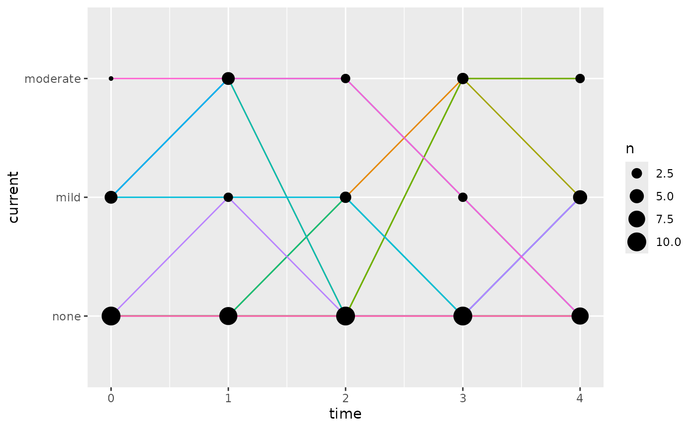

# Markov modeling

``` r

library(nlmixr2lib)
library(ggplot2)
```

## Create your dataset

Start from an initial dataset that has a previous state and a current
state column. For this exercise, we will use a hypothetical adverse
event profile switching between “none”, “mild”, and “moderate”
severities.

``` r

dMarkov <-
  rbind(
    data.frame(
      ID = 1,
      TIME = 0:4,
      previous = c("none", "mild", "moderate", "mild", "mild"),
      current = c("mild", "moderate", "mild", "mild", "none")
    ),
    data.frame(
      ID = 2,
      TIME = 0:4,
      previous = c("none", "moderate", "moderate", "none", "none"),
      current = c("moderate", "moderate", "none", "none", "none")
    ),
    data.frame(
      ID = 3,
      TIME = 0:4,
      previous = c("none", "mild", "mild", "mild", "none"),
      current = c("none", "mild", "mild", "none", "mild")
    )
  )
```

To make interpretability easier later, put the states in order, if they
are not numeric. Putting the levels in order is not required, but if not
done, then they will be sorted alphabetically in the modeling which may
not make sense (e.g. “none” coming after “moderate”).

``` r

stateLevels <- c("none", "mild", "moderate")
dMarkov$previous <- factor(dMarkov$previous, levels = stateLevels)
dMarkov$current <- factor(dMarkov$current, levels = stateLevels)
```

The dataset for estimation requires one-hot encoded columns in the
dataset. That more simply means we need columns set to 1 for when a
Markov state applies and 0 when it does not.

``` r

dMarkov <- createMarkovModelDataset(dMarkov, colPrev = "previous", colCur = "current")
knitr::knit_print(dMarkov)
#>    ID TIME previous  current prevnone curnone prevmild curmild prevmoderate
#> 1   1    0     none     mild     TRUE   FALSE    FALSE    TRUE        FALSE
#> 2   1    1     mild moderate    FALSE   FALSE     TRUE   FALSE        FALSE
#> 3   1    2 moderate     mild    FALSE   FALSE    FALSE    TRUE         TRUE
#> 4   1    3     mild     mild    FALSE   FALSE     TRUE    TRUE        FALSE
#> 5   1    4     mild     none    FALSE    TRUE     TRUE   FALSE        FALSE
#> 6   2    0     none moderate     TRUE   FALSE    FALSE   FALSE        FALSE
#> 7   2    1 moderate moderate    FALSE   FALSE    FALSE   FALSE         TRUE
#> 8   2    2 moderate     none    FALSE    TRUE    FALSE   FALSE         TRUE
#> 9   2    3     none     none     TRUE    TRUE    FALSE   FALSE        FALSE
#> 10  2    4     none     none     TRUE    TRUE    FALSE   FALSE        FALSE
#> 11  3    0     none     none     TRUE    TRUE    FALSE   FALSE        FALSE
#> 12  3    1     mild     mild    FALSE   FALSE     TRUE    TRUE        FALSE
#> 13  3    2     mild     mild    FALSE   FALSE     TRUE    TRUE        FALSE
#> 14  3    3     mild     none    FALSE    TRUE     TRUE   FALSE        FALSE
#> 15  3    4     none     mild     TRUE   FALSE    FALSE    TRUE        FALSE
#>    curmoderate
#> 1        FALSE
#> 2         TRUE
#> 3        FALSE
#> 4        FALSE
#> 5        FALSE
#> 6         TRUE
#> 7         TRUE
#> 8        FALSE
#> 9        FALSE
#> 10       FALSE
#> 11       FALSE
#> 12       FALSE
#> 13       FALSE
#> 14       FALSE
#> 15       FALSE
```

A DV column is required for `nlmixr2` to work, but it will be ignored
for this model.

``` r

dMarkov$DV <- 0
```

## Create your model

To automatically generate a Markov model structure from your data, use
the
[`createMarkovModel()`](https://nlmixr2.github.io/nlmixr2lib/reference/createMarkovModel.md)
function:

``` r

mod <- createMarkovModel(colPrev = dMarkov$previous, colCur = dMarkov$current)
cat(mod)
#> function() {
#>   markovStates <- c(none = "none", mild = "mild", moderate = "moderate")
#>   ini({
#>     logitnonetonone <- -0; label("Probability of transition from state none to none (logit probability)")
#>     lognonetomild <- -1.099; label("Probability of transition from state none to mild (log-logit link difference from prior state)")
#>     logitmildtonone <- -0.6931; label("Probability of transition from state mild to none (logit probability)")
#>     logmildtomild <- -0.6931; label("Probability of transition from state mild to mild (log-logit link difference from prior state)")
#>     logitmoderatetonone <- -0.6931; label("Probability of transition from state moderate to none (logit probability)")
#>     logmoderatetomild <- -1.099; label("Probability of transition from state moderate to mild (log-logit link difference from prior state)")
#>   })
#>   model({
#>     # Create the following one-hot encoded columns for previous and current Markov states (this can be done with `createMarkovModelDataset()`)
#>     # For state none: prevnone, curnone
#>     # For state mild: prevmild, curmild
#>     # For state moderate: prevmoderate, curmoderate
#>     # transition from state "none" to state "none"
#>     linknonetonone <- logitnonetonone
#>     cumprnonetonone <- expit(linknonetonone)
#>     # transition from state "none" to state "mild"
#>     linknonetomild <- linknonetonone + exp(lognonetomild)
#>     cumprnonetomild <- expit(linknonetomild)
#>     # Probability of each state transition
#>     prnonetonone <- cumprnonetonone # Probability of transition from state none to none
#>     prnonetomild <- cumprnonetomild - cumprnonetonone # Probability of transition from state none to mild
#>     prnonetomoderate <- 1 - cumprnonetomild # Probability of transition from state none to moderate
#>     # log-likelihood of any transition from state none
#>     llnone <- prevnone*(curnone*log(prnonetonone) + curmild*log(prnonetomild) + curmoderate*log(prnonetomoderate))
#>     # transition from state "mild" to state "none"
#>     linkmildtonone <- logitmildtonone
#>     cumprmildtonone <- expit(linkmildtonone)
#>     # transition from state "mild" to state "mild"
#>     linkmildtomild <- linkmildtonone + exp(logmildtomild)
#>     cumprmildtomild <- expit(linkmildtomild)
#>     # Probability of each state transition
#>     prmildtonone <- cumprmildtonone # Probability of transition from state mild to none
#>     prmildtomild <- cumprmildtomild - cumprmildtonone # Probability of transition from state mild to mild
#>     prmildtomoderate <- 1 - cumprmildtomild # Probability of transition from state mild to moderate
#>     # log-likelihood of any transition from state mild
#>     llmild <- prevmild*(curnone*log(prmildtonone) + curmild*log(prmildtomild) + curmoderate*log(prmildtomoderate))
#>     # transition from state "moderate" to state "none"
#>     linkmoderatetonone <- logitmoderatetonone
#>     cumprmoderatetonone <- expit(linkmoderatetonone)
#>     # transition from state "moderate" to state "mild"
#>     linkmoderatetomild <- linkmoderatetonone + exp(logmoderatetomild)
#>     cumprmoderatetomild <- expit(linkmoderatetomild)
#>     # Probability of each state transition
#>     prmoderatetonone <- cumprmoderatetonone # Probability of transition from state moderate to none
#>     prmoderatetomild <- cumprmoderatetomild - cumprmoderatetonone # Probability of transition from state moderate to mild
#>     prmoderatetomoderate <- 1 - cumprmoderatetomild # Probability of transition from state moderate to moderate
#>     # log-likelihood of any transition from state moderate
#>     llmoderate <- prevmoderate*(curnone*log(prmoderatetonone) + curmild*log(prmoderatetomild) + curmoderate*log(prmoderatetomoderate))
#>     # Overall Markov model log-likelihood
#>     llMarkov <- llnone + llmild + llmoderate
#>     ll(err) ~ llMarkov
#>   })
#> }
```

At this point, the model is a character string. Use advanced R methods
(with standard R functions) to convert that to a function for `nlmixr2`.

``` r

modFun <- eval(str2lang(mod))
```

The model can subsequently be modified the same as any other `nlmixr2`
model, for example to add drug effects, etc.

## Fit the model

``` r

fit <- nlmixr2est::nlmixr(modFun, data = dMarkov, est = "focei", control = list(print = 0))
#> ℹ parameter labels from comments are typically ignored in non-interactive mode
#> ℹ Need to run with the source intact to parse comments
#> ℹ moved zero initial estimate(s) off 0 (foceiControl(zeroTheta)): logitnonetonone
#> → loading into symengine environment...
#> → pruning branches (`if`/`else`) of full model...
#> ✔ done
#> → optimizing duplicate expressions in EBE model (2 chunks)...
#> [====|====|====|====|====|====|====|====|====|====] 0:00:00 
#> 
#> [====|====|====|====|====|====|====|====|====|====] 0:00:00 
#> 
#> [====|====|====|====|====|====|====|====|====|====] 0:00:00 
#> 
#> [====|====|====|====|====|====|====|====|====|====] 0:00:00
#> → compiling EBE model...
#> ✔ done
#> rxode2 5.1.6 using 2 threads (see ?getRxThreads)
#>   no cache: create with `rxCreateCache()`
#> calculating covariance matrix
#> done
#> → Calculating residuals/tables
#> ✔ done
fit
#> ── nlmixr² log-likelihood Population Only (outer: bobyqa) ──
#> 
#>          OBJF      AIC    BIC Log-likelihood Condition#(Cov) Condition#(Cor)
#> lPop 58.43353 98.00169 102.25      -43.00085        9.582164        2.999777
#> 
#> ── Time (sec fit$time): ──
#> 
#>            setup   optimize  covariance preprocess postprocess table compress
#> elapsed 4.241146 0.08604341 0.004546247      0.067       0.014 0.049    0.002
#>             other
#> elapsed 0.6482639
#> 
#> ── (fit$parFixed or fit$parFixedDf): ──
#> 
#>                                                                                                              Parameter
#> logitnonetonone                                  Probability of transition from state none to none (logit probability)
#> lognonetomild           Probability of transition from state none to mild (log-logit link difference from prior state)
#> logitmildtonone                                  Probability of transition from state mild to none (logit probability)
#> logmildtomild           Probability of transition from state mild to mild (log-logit link difference from prior state)
#> logitmoderatetonone                          Probability of transition from state moderate to none (logit probability)
#> logmoderatetomild   Probability of transition from state moderate to mild (log-logit link difference from prior state)
#>                        Est.    SE  %RSE Back-transformed(95%CI)
#> logitnonetonone     0.00118 0.816 69200   0.00118 (-1.60, 1.60)
#> lognonetomild         0.476 0.642   135    0.476 (-0.782, 1.73)
#> logitmildtonone      -0.693 0.866   125    -0.693 (-2.39, 1.00)
#> logmildtomild         0.834 0.505  60.5    0.834 (-0.155, 1.82)
#> logitmoderatetonone  -0.693  1.22   177    -0.693 (-3.09, 1.71)
#> logmoderatetomild     0.326 0.884   271     0.326 (-1.41, 2.06)
#>  
#>   Covariance Type (fit$covMethod): r
#>   Information about run found (fit$runInfo):
#>    • gradient problems with covariance; see $scaleInfo 
#>   Censoring (fit$censInformation): No censoring
#>   Minimization message (fit$message):  
#>     Normal exit from bobyqa 
#> 
#> ── Fit Data (object fit is a modified tibble): ──
#> # A tibble: 15 × 29
#>   ID     TIME    DV IPRED linknonetonone cumprnonetonone linknonetomild
#>   <fct> <dbl> <dbl> <dbl>          <dbl>           <dbl>          <dbl>
#> 1 1         0     0 -1.10        0.00118           0.500           1.61
#> 2 1         1     0 -1.79        0.00118           0.500           1.61
#> 3 1         2     0 -1.10        0.00118           0.500           1.61
#> # ℹ 12 more rows
#> # ℹ 22 more variables: cumprnonetomild <dbl>, prnonetonone <dbl>,
#> #   prnonetomild <dbl>, prnonetomoderate <dbl>, llnone <dbl>,
#> #   linkmildtonone <dbl>, cumprmildtonone <dbl>, linkmildtomild <dbl>,
#> #   cumprmildtomild <dbl>, prmildtonone <dbl>, prmildtomild <dbl>,
#> #   prmildtomoderate <dbl>, llmild <dbl>, linkmoderatetonone <dbl>,
#> #   cumprmoderatetonone <dbl>, linkmoderatetomild <dbl>, …
```

## Simulate your data

To simulate from a Markov model, you first need to run a typical
simulation from the model to get probabilities of each state. Then,
post-process the simulation results to get the states.

``` r

dSimRaw <- nlmixr2est::nlmixr(fit, est = "rxSolve", control = list(nStud = 5))
#> ℹ use `data` from prior/supplied fit
#> ℹ using population uncertainty from fitted model (`thetaMat`)
#> ℹ using `dfObs=15` from the number of observations in fitted model
#> ℹ using `dfSub=0` from the number of subjects in fitted model
#> ℹ using diagonal `sigma` based on model
#> Warning in FUN(X[[i]], ...): multi-subject simulation without without 'omega'
dSim <- simMarkov(dSimRaw, states = fit$markovStates, initialState = "none", colPrev = "previous", colCur = "current")
```

### Summarize the simulations

Simulations can be plotted,

``` r

ggplot(dSim, aes(x = time, y = current)) +
  geom_line(
    aes(colour = paste(sim.id, id), group = paste(sim.id, id)),
    show.legend = FALSE
  ) +
  geom_count()
```



tabulated,

``` r

createMarkovTransitionMatrix(colPrev = dMarkov$previous, colCur = dMarkov$current)
#>               none      mild  moderate
#> none     0.5000000 0.3333333 0.1666667
#> mild     0.3333333 0.5000000 0.1666667
#> moderate 0.3333333 0.3333333 0.3333333
createMarkovTransitionMatrix(colPrev = dSim$previous, colCur = dSim$current)
#>               none      mild   moderate
#> none     0.7407407 0.2037037 0.05555556
#> mild     0.4545455 0.1818182 0.36363636
#> moderate 0.2000000 0.3000000 0.50000000
```

or summarized in any other useful way.
