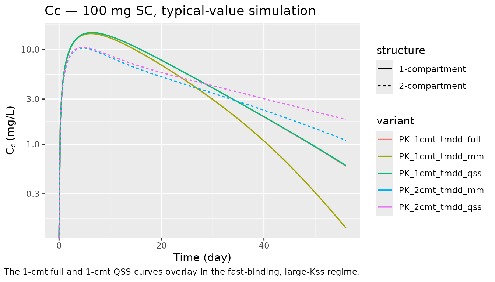
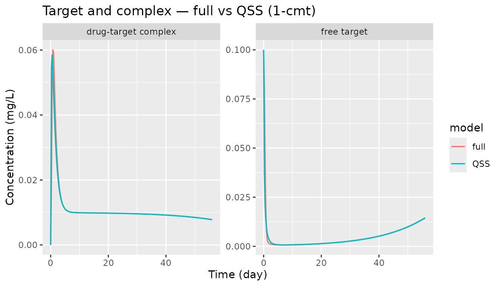
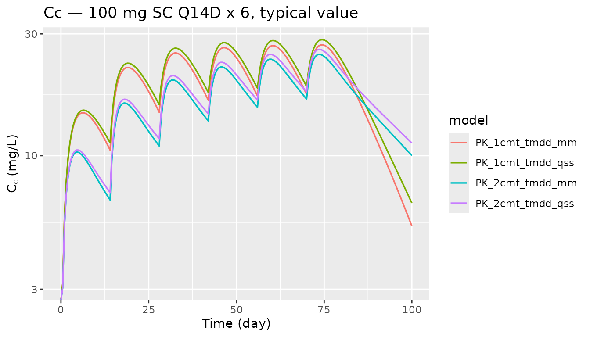

# TMDD archetypes: full, QSS, and Michaelis-Menten approximations

## Overview

`nlmixr2lib` ships five canonical target-mediated drug disposition
(TMDD) archetypes. They are intended as starting scaffolds for mAb PK
modelling, not drug-specific fits; the initial estimates are plausible
mAb-scale defaults.

| Model               | Structural form       | Drug compartments             | Target states                  |
|---------------------|-----------------------|-------------------------------|--------------------------------|
| `PK_1cmt_tmdd_full` | Mager & Jusko 2001    | depot + central               | free `target` + `complex`      |
| `PK_1cmt_tmdd_qss`  | Gibiansky et al. 2008 | depot + central               | `total_target` (QSS algebraic) |
| `PK_1cmt_tmdd_mm`   | Gibiansky et al. 2008 | depot + central               | none (saturable elimination)   |
| `PK_2cmt_tmdd_qss`  | Gibiansky et al. 2008 | depot + central + peripheral1 | `total_target` (QSS algebraic) |
| `PK_2cmt_tmdd_mm`   | Gibiansky et al. 2008 | depot + central + peripheral1 | none (saturable elimination)   |

Source citations, stored in each model’s `reference` field:

``` r
vapply(
  c("PK_1cmt_tmdd_full", "PK_1cmt_tmdd_qss", "PK_1cmt_tmdd_mm",
    "PK_2cmt_tmdd_qss", "PK_2cmt_tmdd_mm"),
  function(nm) nlmixr2est::nlmixr(readModelDb(nm))$reference,
  character(1)
)
#>                                                                                                                                                                                                                PK_1cmt_tmdd_full 
#>                                          "Mager DE, Jusko WJ. General pharmacokinetic model for drugs exhibiting target-mediated drug disposition. J Pharmacokinet Pharmacodyn. 2001;28(6):507-532. doi:10.1023/A:1014414520282" 
#>                                                                                                                                                                                                                 PK_1cmt_tmdd_qss 
#> "Gibiansky L, Gibiansky E, Kakkar T, Ma P. Approximations of the target-mediated drug disposition model and identifiability of model parameters. J Pharmacokinet Pharmacodyn. 2008;35(5):573-591. doi:10.1007/s10928-008-9102-8" 
#>                                                                                                                                                                                                                  PK_1cmt_tmdd_mm 
#> "Gibiansky L, Gibiansky E, Kakkar T, Ma P. Approximations of the target-mediated drug disposition model and identifiability of model parameters. J Pharmacokinet Pharmacodyn. 2008;35(5):573-591. doi:10.1007/s10928-008-9102-8" 
#>                                                                                                                                                                                                                 PK_2cmt_tmdd_qss 
#> "Gibiansky L, Gibiansky E, Kakkar T, Ma P. Approximations of the target-mediated drug disposition model and identifiability of model parameters. J Pharmacokinet Pharmacodyn. 2008;35(5):573-591. doi:10.1007/s10928-008-9102-8" 
#>                                                                                                                                                                                                                  PK_2cmt_tmdd_mm 
#> "Gibiansky L, Gibiansky E, Kakkar T, Ma P. Approximations of the target-mediated drug disposition model and identifiability of model parameters. J Pharmacokinet Pharmacodyn. 2008;35(5):573-591. doi:10.1007/s10928-008-9102-8"
```

- Articles:
  - Mager & Jusko 2001 — <https://doi.org/10.1023/A:1014414520282>
  - Gibiansky et al. 2008 — <https://doi.org/10.1007/s10928-008-9102-8>

## Population and units

These are generic archetypes; no specific population is represented.
Units are `time = day`, `dosing = mg`, `concentration = mg/L`. Free
drug, free target, and drug-target complex are all carried as
concentrations in `mg/L` so the rate constants are unit-consistent
without a molecular-weight conversion. A user who prefers molar units
(nM) can re-interpret the concentration-bearing parameters (`lT0`,
`lkon`, `lKss`, `lVm`, `propSd`) in that system.

Initial estimates are plausible mAb-scale defaults (Mager & Jusko 2001
canonical TMDD behaviour; Davda 2014 linear-PK meta-analysis anchors for
clearance/volume). They are **not** fit to any specific dataset; the
per-field `population$notes` metadata in each model file states this
explicitly.

## Source trace

Per-parameter origin is recorded as an in-file comment next to each
[`ini()`](https://nlmixr2.github.io/rxode2/reference/ini.html) entry in
the model source under `inst/modeldb/pharmacokinetics/PK_*_tmdd_*.R`.
The table below collects the equation references.

| Parameter (symbol)          | Mager & Jusko 2001                 | Gibiansky et al. 2008                     |
|-----------------------------|------------------------------------|-------------------------------------------|
| CL, Vc (linear disposition) | Eq 1 (k_el \* V, V)                | Eq 8 / Eq 10 (k_el \* V, V)               |
| Vp, Q (peripheral, 2-cmt)   | n/a                                | two-compartment extension (implicit)      |
| Ka, F (absorption)          | Eq 1 (input term)                  | Eq 6 (input term)                         |
| T0 = ksyn / kdeg            | Eq 2 (R0)                          | Eq 9 (Rtot(0))                            |
| kdeg                        | Eq 2 (k_deg)                       | Eq 9 (k_deg)                              |
| kint                        | Eq 3 (k_int)                       | Eq 9 / Eq 10 (k_int)                      |
| kon, koff (full only)       | Eq 1 (k_on, k_off)                 | n/a (eliminated by QSS / MM)              |
| Kss = (koff + kint)/kon     | n/a (full keeps kon/koff explicit) | Eq 7 (Kss)                                |
| Vm, Km (MM only)            | n/a                                | Eq 10 (V_m = k_int \* R0, K_m approx Kss) |

## Typical-value simulations

The three 1-compartment variants share the same drug-disposition
parameters and differ only in how target binding is handled. The two
2-compartment variants add a peripheral distribution compartment for
drug. The code below simulates each model with between-subject
variability zeroed out (typical individual) over 56 days after a single
SC dose and after repeated SC dosing.

``` r
solve_typical <- function(model_name, events) {
  ui <- nlmixr2est::nlmixr(readModelDb(model_name))
  ui_typ <- rxode2::zeroRe(ui)
  sim <- rxode2::rxSolve(ui_typ, events, returnType = "data.frame")
  sim$model <- model_name
  sim
}
```

### Single-dose profiles (100 mg SC)

``` r
ev_single <- rxode2::et(amt = 100, cmt = "depot") |>
  rxode2::et(seq(0, 56, by = 0.25))

sims_single <- dplyr::bind_rows(lapply(
  c("PK_1cmt_tmdd_full", "PK_1cmt_tmdd_qss", "PK_1cmt_tmdd_mm",
    "PK_2cmt_tmdd_qss", "PK_2cmt_tmdd_mm"),
  solve_typical, events = ev_single
))
#> ℹ omega/sigma items treated as zero: 'etalcl', 'etalvc', 'etalka'
#> ℹ omega/sigma items treated as zero: 'etalcl', 'etalvc', 'etalka'
#> ℹ omega/sigma items treated as zero: 'etalcl', 'etalvc', 'etalka'
#> ℹ omega/sigma items treated as zero: 'etalcl', 'etalvc', 'etalka'
#> ℹ omega/sigma items treated as zero: 'etalcl', 'etalvc', 'etalka'

sims_single |>
  dplyr::mutate(structure = ifelse(grepl("1cmt", model), "1-compartment", "2-compartment"),
                variant   = sub("PK_._cmt_tmdd_", "", model)) |>
  ggplot(aes(time, Cc, colour = variant, linetype = structure)) +
  geom_line(linewidth = 0.6) +
  scale_y_log10() +
  labs(x = "Time (day)", y = expression(C[c] ~ "(mg/L)"),
       title = "Cc — 100 mg SC, typical-value simulation",
       caption = "The 1-cmt full and 1-cmt QSS curves overlay in the fast-binding, large-Kss regime.",
       colour = "variant", linetype = "structure")
#> Warning in scale_y_log10(): log-10 transformation introduced
#> infinite values.
```



### Target and complex trajectories (1-cmt models)

The full model carries `target` (free) and `complex` as explicit ODE
states. The QSS model carries `total_target = free + complex` as a
single state and derives the split algebraically. The MM model collapses
target into a saturable elimination pathway and does not expose target
state variables.

``` r
sim_full <- solve_typical("PK_1cmt_tmdd_full", ev_single)
#> ℹ omega/sigma items treated as zero: 'etalcl', 'etalvc', 'etalka'
sim_qss  <- solve_typical("PK_1cmt_tmdd_qss",  ev_single)
#> ℹ omega/sigma items treated as zero: 'etalcl', 'etalvc', 'etalka'

target_long <- dplyr::bind_rows(
  tibble::tibble(time = sim_full$time, value = sim_full$target,
                 species = "free target",          model = "full"),
  tibble::tibble(time = sim_full$time, value = sim_full$complex,
                 species = "drug-target complex",  model = "full"),
  tibble::tibble(time = sim_qss$time,
                 value = sim_qss$total_target - sim_qss$complex,
                 species = "free target",          model = "QSS"),
  tibble::tibble(time = sim_qss$time, value = sim_qss$complex,
                 species = "drug-target complex",  model = "QSS")
)

ggplot(target_long, aes(time, value, colour = model)) +
  geom_line(linewidth = 0.6) +
  facet_wrap(~ species, scales = "free_y") +
  labs(x = "Time (day)", y = "Concentration (mg/L)",
       title = "Target and complex — full vs QSS (1-cmt)")
```



### Repeated SC dosing — drug-concentration difference across structures

``` r
ev_multi <- rxode2::et(amt = 100, cmt = "depot", ii = 14, addl = 5) |>
  rxode2::et(seq(0, 100, by = 0.5))

sims_multi <- dplyr::bind_rows(lapply(
  c("PK_1cmt_tmdd_qss", "PK_2cmt_tmdd_qss",
    "PK_1cmt_tmdd_mm",  "PK_2cmt_tmdd_mm"),
  solve_typical, events = ev_multi
))
#> ℹ omega/sigma items treated as zero: 'etalcl', 'etalvc', 'etalka'
#> ℹ omega/sigma items treated as zero: 'etalcl', 'etalvc', 'etalka'
#> ℹ omega/sigma items treated as zero: 'etalcl', 'etalvc', 'etalka'
#> ℹ omega/sigma items treated as zero: 'etalcl', 'etalvc', 'etalka'

sims_multi |>
  ggplot(aes(time, Cc, colour = model)) +
  geom_line(linewidth = 0.6) +
  scale_y_log10() +
  labs(x = "Time (day)", y = expression(C[c] ~ "(mg/L)"),
       title = "Cc — 100 mg SC Q14D x 6, typical value")
#> Warning in scale_y_log10(): log-10 transformation introduced
#> infinite values.
```



## Regime-convergence check

The Gibiansky 2008 derivation shows that the QSS approximation should
recover the full Mager–Jusko model when drug-target binding and
unbinding are fast relative to internalization and drug disposition.
Equivalently `Kss = (koff + kint)/kon` should be small relative to drug
concentration for the approximation to hold.

The default parameter values put the model in that regime (kon = 1
L/mg/day, koff = 0.1 /day, kint = 1 /day so Kss = 1.1 mg/L, well below
the Cc peak of ~15 mg/L for a 100-mg SC dose). The overlay of the full
and QSS curves above is the asymptotic result.

## Assumptions and deviations

- Initial estimates are generic mAb-scale defaults, not derived from any
  specific trial. The archetypes are scaffolds; users must override the
  numeric starting values in
  [`ini()`](https://nlmixr2.github.io/rxode2/reference/ini.html) when
  fitting a real dataset.
- All concentration-bearing quantities (drug, free target, complex) are
  in `mg/L`. The `kon` parameter has units `L/(mg*day)`. For a given
  molecular weight, a conversion to the more conventional molar units
  (nM, 1/(nM\*day)) is a multiplicative factor on `T0`, `kon`, and
  `Kss`.
- The full model’s `Cc` is **free** drug concentration (Mager & Jusko
  2001 convention). The QSS and MM models’ `Cc` is **total** drug
  concentration (Gibiansky 2008 convention) because the central
  compartment state holds the total drug amount in those reductions.
  Users whose assay reads total drug on the full model can compute it as
  `Cc_total <- Cc + complex`.
- No population (IIV, residual error) simulation is shown here; the
  between-subject variance defaults in the models are placeholders. VPCs
  belong in drug-specific vignettes.
- `PKNCA` validation is intentionally omitted: these archetypes do not
  target any published NCA table. Drug-specific TMDD vignettes (future
  `specificDrugs/` entries) should include a full PKNCA comparison
  against their source tables.
