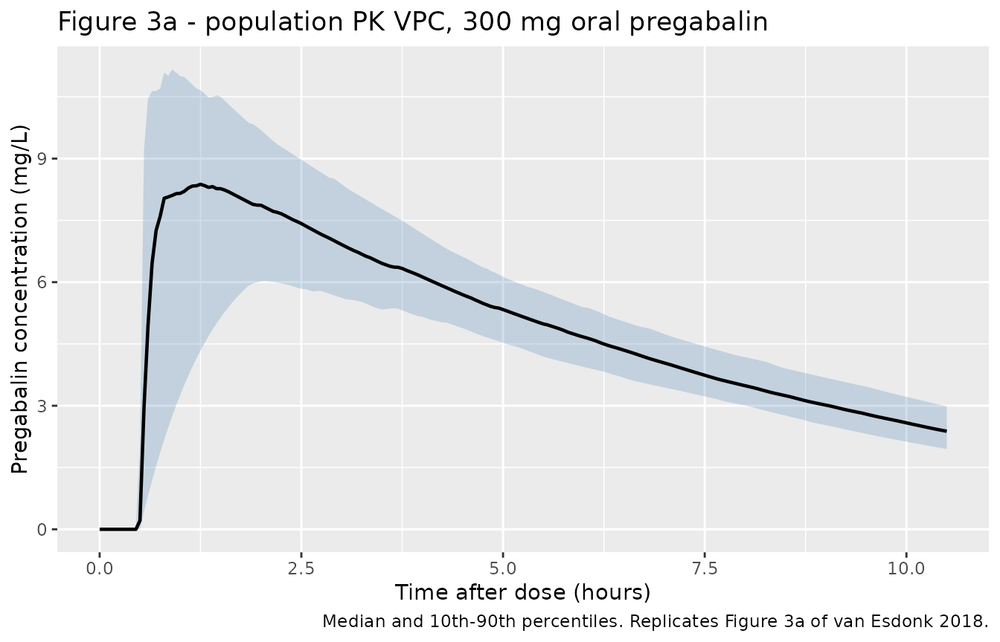
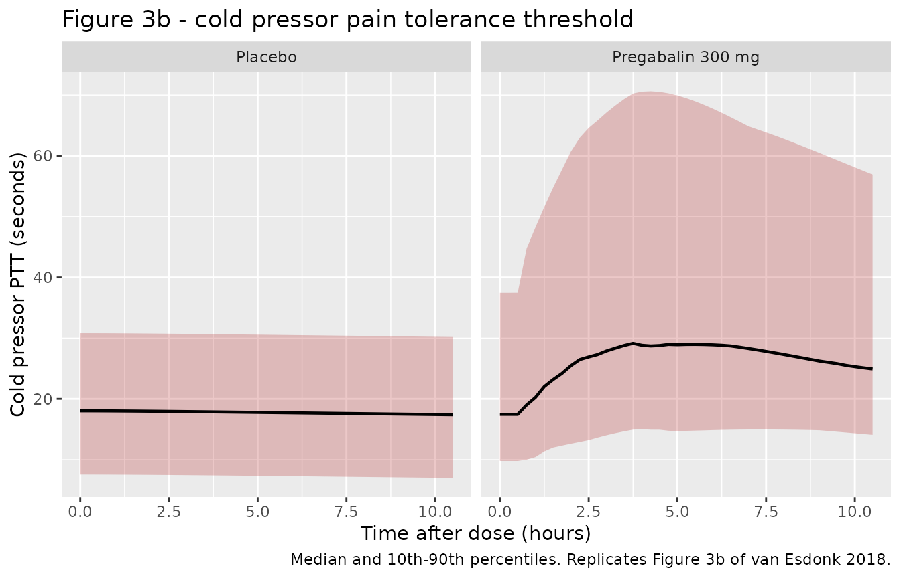
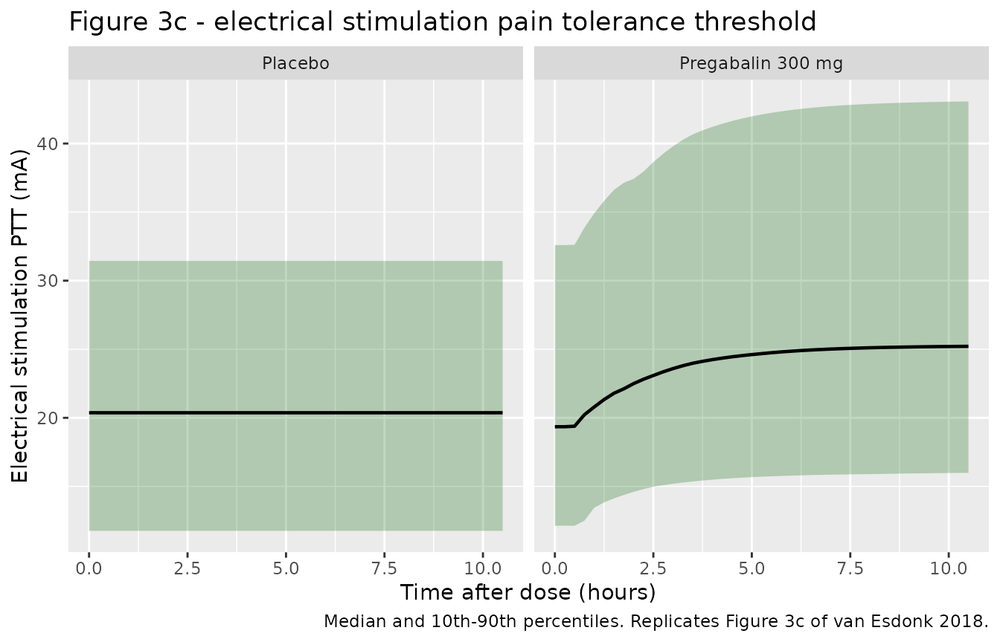

# Pregabalin nociceptive pain models (van Esdonk 2018)

## Model and source

van Esdonk 2018 fitted three models in sequence and reports each as a
separate result, so this paper contributes three model files to
`nlmixr2lib`:

| Model file | Paper result |
|----|----|
| `vanEsdonk_2018_pregabalin` | Population PK of a single 300 mg oral dose (Table 2, Figure 1a, Figure 3a) |
| `vanEsdonk_2018_pregabalin_coldpressor` | Cold pressor pain tolerance threshold (PTT) turnover PD model (Table 3 left, Figure 1b, Figure 3b) |
| `vanEsdonk_2018_pregabalin_electricalstim` | Electrical stimulation PTT turnover PD model (Table 3 right, Figure 1b, Figure 3c) |

- Citation: van Esdonk MJ, Lindeman I, Okkerse P, de Kam ML, Groeneveld
  GJ, Stevens J. (2018). Population pharmacokinetic/pharmacodynamic
  analysis of nociceptive pain models following an oral pregabalin dose
  administration to healthy subjects. CPT Pharmacometrics Syst Pharmacol
  7(9):573-580. <doi:10.1002/psp4.12318>.
- Article: <https://doi.org/10.1002/psp4.12318>
- Study design: Okkerse 2017, Br J Clin Pharmacol 83:976-990,
  <https://doi.org/10.1111/bcp.13204>

``` r

mod_pk <- readModelDb("vanEsdonk_2018_pregabalin")
mod_cp <- readModelDb("vanEsdonk_2018_pregabalin_coldpressor")
mod_es <- readModelDb("vanEsdonk_2018_pregabalin_electricalstim")
```

## Population

Sixteen healthy volunteers (8 men, 8 women) took part in part 2 (oral
analgesics) of a two-part, four-way randomised, placebo-controlled
crossover study run at the Centre for Human Drug Research, Leiden. Each
subject attended four visits separated by a one-week washout, receiving
imipramine, pregabalin, ibuprofen or placebo; only the placebo and
pregabalin occasions enter this analysis. Baseline demographics (van
Esdonk 2018 Table 1): weight 68.0 kg (SD 8.22, range 54.25-77.50),
height 176 cm (SD 8.54), age 21.75 years (SD 1.61, range 19-25), BMI
21.89 kg/m^2 (SD 1.60), fat-free mass 50.26 kg (SD 9.95, Janmahasatian
equation), serum creatinine 82.19 umol/L (SD 12.95) and Cockcroft-Gault
GFR 112.7 mL/min (SD 18.18).

Pregabalin 300 mg was given as a single oral dose. PK samples were drawn
predose and at 0.5, 1, 2, 3, 4, 5, 6, 8 and 10 h; 136 of 144 planned
samples were above the 20 ug/L lower limit of quantification. The pain
battery was performed 10 times per visit, including two predose
measurements up to 1 h before dosing.

One subject was excluded from the cold pressor analysis for a
continuously maximal PTT of 120 s on both visits, so that endpoint used
15 subjects (291 measurements) while the electrical stimulation endpoint
used all 16 (313 measurements).

``` r

str(rxode2::rxode(mod_pk)$population)
#> ℹ parameter labels from comments will be replaced by 'label()'
#> List of 17
#>  $ species              : chr "human"
#>  $ n_subjects           : int 16
#>  $ n_studies            : int 1
#>  $ age_range            : chr "19-25 years"
#>  $ age_mean             : chr "21.75 years (SD 1.61)"
#>  $ weight_range         : chr "54.25-77.50 kg"
#>  $ weight_mean          : chr "68.0 kg (SD 8.22)"
#>  $ height_mean          : chr "176 cm (SD 8.54); range 163.5-192.5 cm"
#>  $ bmi_mean             : chr "21.89 kg/m^2 (SD 1.60); range 19.4-24.9"
#>  $ ffm_mean             : chr "50.26 kg (SD 9.95); range 36.62-63.26 (Janmahasatian equation)"
#>  $ serum_creatinine_mean: chr "82.19 umol/L (SD 12.95); range 52-99"
#>  $ gfr_mean             : chr "112.7 mL/min (SD 18.18); range 79-149 (Cockcroft-Gault)"
#>  $ sex_female_pct       : num 50
#>  $ disease_state        : chr "Healthy volunteers"
#>  $ dose_range           : chr "Single 300 mg oral dose"
#>  $ regions              : chr "The Netherlands (Centre for Human Drug Research, Leiden)"
#>  $ notes                : chr "Part 2 (oral analgesics) of a two-part, four-way randomised placebo-controlled crossover study (Okkerse 2017, B"| __truncated__
```

## Source trace

Every `ini()` entry carries an in-file comment naming its source
location. The table below collects them.

| Model | Equation / parameter | Value | Source location |
|----|----|----|----|
| PK | `lka` | 6.07 /h | Table 2, `k a (/hour)` (RSE 42.3%) |
| PK | `ltlag` | 0.495 h | Table 2, `Lag time (hour)` (RSE 0.39%) |
| PK | `lvc` | 31.1 L | Table 2, `V d /70 kg (L)` (RSE 3.13%) |
| PK | `lcl` | 4.5 L/h | Table 2, `CL/70 kg (L/hour)` (RSE 2.53%) |
| PK | `e_wt_cl` | 0.75 (fixed) | Covariate analysis, “clearance (CL; exponent = 0.75)” |
| PK | `e_wt_vc` | 1 (fixed) | Covariate analysis, “volume of distribution (V d ; exponent = 1)” |
| PK | `etalka` | 2.6 | Table 2, `omega 2 k a` (CV 353%) |
| PK | `etaltlag` | 7.09e-5 | Table 2, `omega 2 lag time` (CV 0.842%) |
| PK | `etalvc` | 0.0101 | Table 2, `omega 2 V d / F` (CV 10.1%) |
| PK | `etalcl` | 0.00672 | Table 2, `omega 2 CL/ F` (CV 8.21%) |
| PK | `propSd` | sqrt(0.0146) | Table 2, `sigma 2 proportional` |
| PK | `d/dt(depot)`, `d/dt(central)`, `alag(depot)` | n/a | Figure 1a; Results, one-compartment model with lag time |
| CP | `lrbase` | 16.9 s | Table 3 cold pressor, `Baseline` (RSE 16.8%) |
| CP | `lkout` | 0.39 /h | Table 3 cold pressor, `k out` (RSE 21%) |
| CP | `slope_placebo` | -0.07 s/h | Table 3 cold pressor, `Slope over time` (RSE 57.8%) |
| CP | `slope_drug` | 0.135 1/(mg/L) | Table 3 cold pressor, `Slope pregabalin` (RSE 16.7%) |
| CP | `etalrbase` | 0.283 | Table 3 cold pressor, `omega 2 baseline` (CV 57.2%) |
| CP | `etalkout` | 0.738 | Table 3 cold pressor, `omega 2 k out` (CV 105%) |
| CP | `etaiov_rbase_1/2` | 0.057 | Table 3 cold pressor, `omega 2 BOV baseline` (CV 24.2%) |
| CP | `propSd` | sqrt(0.041) | Table 3 cold pressor, `sigma 2 proportional` |
| CP | `d/dt(ptt_cp)` | n/a | Figure 1b (“CP: Linear (+)” on `k in`); Results, turnover compartment with a linear decrease over time and a linear concentration effect on `k in` |
| ES | `lrbase` | 19.1 mA | Table 3 electrical stimulation, `Baseline` (RSE 7%) |
| ES | `lkout` | 0.494 /h | Table 3 electrical stimulation, `k out` (RSE 24%) |
| ES | `lemax` | 0.322 | Table 3 electrical stimulation, `Effect pregabalin` (RSE 18%) |
| ES | `etalemax` | 0.187 | Table 3 electrical stimulation, `omega 2 effect` |
| ES | `etaiov_rbase_1/2` | 0.122 | Table 3 electrical stimulation, `omega 2 BOV baseline` |
| ES | `propSd` | sqrt(0.0143) | Table 3 electrical stimulation, `sigma 2 proportional` |
| ES | `d/dt(ptt_es)` | n/a | Figure 1b (“ES: on/off (+)” on `k in`); Results, on/off effect preferred over an Emax model whose EC50 fell below 1 ug/L |

The PK layer is reproduced inside both PD model files and every one of
its parameters is wrapped in `fixed()` there, because the paper fitted
the PD models sequentially: “individual post hoc Bayesian estimates of
the developed PK model were added to the PD dataset”.

## Published values, re-entered independently

The gates below compare the packaged models against closed-form
expressions built from the paper’s Table 2 and Table 3 numbers
re-entered here by hand. A transcription error in a model file therefore
shows up as a failed gate rather than cancelling out.

``` r

# van Esdonk 2018 Table 2 (PK, 70 kg reference subject).
pub_ka <- 6.07 # /h
pub_tlag <- 0.495 # h
pub_vc <- 31.1 # L
pub_cl <- 4.5 # L/h
pub_dose <- 300 # mg

# van Esdonk 2018 Table 3.
pub_cp_base <- 16.9 # s
pub_cp_kout <- 0.39 # /h
pub_cp_slope_time <- -0.07 # s/h
pub_cp_slope_drug <- 0.135 # 1/(mg/L)

pub_es_base <- 19.1 # mA
pub_es_kout <- 0.494 # /h
pub_es_emax <- 0.322 # unitless

pub_kel <- pub_cl / pub_vc

# Closed-form NCA for a one-compartment oral model with a lag time.
ref_tmax <- pub_tlag + log(pub_ka / pub_kel) / (pub_ka - pub_kel)
ref_cmax <- (pub_dose / pub_vc) * (pub_ka / (pub_ka - pub_kel)) *
  (exp(-pub_kel * (ref_tmax - pub_tlag)) - exp(-pub_ka * (ref_tmax - pub_tlag)))
ref_aucinf <- pub_dose / pub_cl
ref_thalf <- log(2) / pub_kel

tibble::tibble(
  Quantity = c("kel (1/h)", "Tmax (h)", "Cmax (mg/L)", "AUCinf (mg*h/L)", "t1/2 (h)"),
  Value = c(pub_kel, ref_tmax, ref_cmax, ref_aucinf, ref_thalf)
) |>
  knitr::kable(digits = 4, caption = "Closed-form reference values derived from Table 2.")
```

| Quantity         |   Value |
|:-----------------|--------:|
| kel (1/h)        |  0.1447 |
| Tmax (h)         |  1.1256 |
| Cmax (mg/L)      |  8.8051 |
| AUCinf (mg\*h/L) | 66.6667 |
| t1/2 (h)         |  4.7904 |

Closed-form reference values derived from Table 2. {.table}

## Virtual cohort

Individual data are not public, so the figures use a virtual cohort
whose weight distribution matches Table 1 (normal, mean 68.0 kg, SD
8.22, truncated to the reported 54.25-77.50 kg range).

The study was a crossover, but `rxSolve` keys subjects on `id`, so each
(subject, occasion) pair is given its own `id`. `OCC = 1` is the placebo
visit and `OCC = 2` the pregabalin visit; only `OCC = 2` carries a dose.

``` r

# set.seed() seeds R's RNG, not rxode2's -- rxode2 partitions its streams per
# solver thread, so CI draws a different cohort than a workstation does. Every
# assertion below is therefore written to hold for ANY cohort the model can
# produce, or is run on a typical-value (zeroRe) solve where no RNG is involved.
set.seed(20180813)

n_subj <- 100L # per occasion; well under the 200-per-arm cap

sample_wt <- function(n) {
  wt <- rnorm(n, mean = 68.0, sd = 8.22)
  pmin(pmax(wt, 54.25), 77.50)
}

subj_wt <- sample_wt(n_subj)

# PD observation grid: the pain battery ran 10 times per visit over ~10 h.
pd_times <- seq(0, 10.5, by = 0.25)

make_pd_occasion <- function(occ, dosed, state, id_offset) {
  subj <- tibble::tibble(
    id = id_offset + seq_len(n_subj),
    WT = subj_wt,
    OCC = occ,
    visit = if (dosed) "Pregabalin 300 mg" else "Placebo"
  )
  obs <- subj |>
    tidyr::crossing(time = pd_times) |>
    dplyr::mutate(evid = 0L, amt = NA_real_, cmt = state)
  if (!dosed) {
    return(dplyr::arrange(obs, id, time))
  }
  dose <- subj |>
    dplyr::mutate(time = 0, evid = 1L, amt = pub_dose, cmt = "depot")
  dplyr::bind_rows(dose, obs) |> dplyr::arrange(id, time, dplyr::desc(evid))
}

ev_cp <- dplyr::bind_rows(
  make_pd_occasion(1L, FALSE, "ptt_cp", 0L),
  make_pd_occasion(2L, TRUE, "ptt_cp", n_subj)
)
ev_es <- dplyr::bind_rows(
  make_pd_occasion(1L, FALSE, "ptt_es", 0L),
  make_pd_occasion(2L, TRUE, "ptt_es", n_subj)
)

# Disjoint-id guard: duplicate ids across occasions would silently merge two
# occasions into one subject receiving both event streams.
stopifnot(
  !anyDuplicated(unique(ev_cp[, c("id", "time", "evid")])),
  !anyDuplicated(unique(ev_es[, c("id", "time", "evid")])),
  length(intersect(ev_cp$id[ev_cp$OCC == 1], ev_cp$id[ev_cp$OCC == 2])) == 0L
)

# PK cohort: one dose, observations on `central` out to 24 h so the terminal
# phase is long enough (t1/2 = 4.79 h) for a stable lambda-z.
pk_times <- sort(unique(c(seq(0, 24, by = 0.05), c(0.5, 1, 2, 3, 4, 5, 6, 8, 10))))
pk_subj <- tibble::tibble(id = seq_len(n_subj), WT = subj_wt, OCC = 2L,
                          visit = "Pregabalin 300 mg")
ev_pk <- dplyr::bind_rows(
  pk_subj |> dplyr::mutate(time = 0, evid = 1L, amt = pub_dose, cmt = "depot"),
  pk_subj |> tidyr::crossing(time = pk_times) |>
    dplyr::mutate(evid = 0L, amt = NA_real_, cmt = "central")
) |>
  dplyr::arrange(id, time, dplyr::desc(evid))
```

## Pharmacokinetics

### Gate 1 - the solved PK equals the closed-form one-compartment oral model

This is the strictest available check on the PK layer: it is
deterministic, so the tolerance can be tight. It simultaneously confirms
that the absorption lag is honoured, that the dose/volume units give
mg/L, and that rxode2 is integrating the declared two-state system
rather than silently substituting an analytic kernel that drops the
depot.

``` r

typ_pk <- tibble::tibble(id = 1L, WT = 70, OCC = 2L) |>
  (\(s) dplyr::bind_rows(
    dplyr::mutate(s, time = 0, evid = 1L, amt = pub_dose, cmt = "depot"),
    tidyr::crossing(s, time = seq(0, 24, by = 0.05)) |>
      dplyr::mutate(evid = 0L, amt = NA_real_, cmt = "central")
  ))() |>
  dplyr::arrange(time, dplyr::desc(evid))

sim_pk_typ <- rxode2::rxSolve(
  rxode2::zeroRe(mod_pk), typ_pk, omega = NA, sigma = NA,
  returnType = "data.frame"
)
#> ℹ parameter labels from comments will be replaced by 'label()'
if (is.null(sim_pk_typ$id)) sim_pk_typ$id <- 1L

# Both declared states must survive to the output; if rxode2 had matched this
# model against a one-compartment analytic kernel, `depot` would be gone.
stopifnot(all(c("depot", "central", "Cc") %in% names(sim_pk_typ)))

cc_closed_form <- function(t) {
  ta <- pmax(t - pub_tlag, 0)
  ifelse(
    t < pub_tlag, 0,
    (pub_dose / pub_vc) * (pub_ka / (pub_ka - pub_kel)) *
      (exp(-pub_kel * ta) - exp(-pub_ka * ta))
  )
}

# rxSolve returns observation records only -- there is no `evid` column on the
# output, so an `evid == 0` filter here would error (or, worse, select nothing).
chk_pk <- sim_pk_typ |>
  dplyr::transmute(time, solved = Cc, closed = cc_closed_form(time)) |>
  dplyr::filter(time > pub_tlag + 0.05) # skip the lag discontinuity itself

max_rel_pk <- max(abs(chk_pk$solved - chk_pk$closed) / chk_pk$closed)

# Deterministic comparison: no cohort, no RNG, so a tight bound is correct and
# is what catches a future regression (realised ~1e-5).
stopifnot(nrow(chk_pk) > 300, max_rel_pk < 1e-3)

# The lag must actually delay absorption: nothing may appear before tlag.
stopifnot(all(sim_pk_typ$Cc[sim_pk_typ$time < pub_tlag] == 0))

cat(sprintf(
  "Max relative |solved - closed form| = %.2e over %d observations\n",
  max_rel_pk, nrow(chk_pk)
))
#> Max relative |solved - closed form| = 4.46e-07 over 470 observations
```

### Figure 3a - population PK visual predictive check

``` r

sim_pk <- rxode2::rxSolve(mod_pk, ev_pk, keep = c("WT", "visit")) |>
  as.data.frame()
#> ℹ parameter labels from comments will be replaced by 'label()'

sim_pk |>
  dplyr::filter(time <= 10.5, !is.na(Cc)) |>
  dplyr::group_by(time) |>
  dplyr::summarise(
    Q10 = quantile(Cc, 0.10), Q50 = quantile(Cc, 0.50),
    Q90 = quantile(Cc, 0.90), .groups = "drop"
  ) |>
  ggplot(aes(time, Q50)) +
  geom_ribbon(aes(ymin = Q10, ymax = Q90), alpha = 0.25, fill = "steelblue") +
  geom_line(linewidth = 0.8) +
  labs(
    x = "Time after dose (hours)", y = "Pregabalin concentration (mg/L)",
    title = "Figure 3a - population PK VPC, 300 mg oral pregabalin",
    caption = "Median and 10th-90th percentiles. Replicates Figure 3a of van Esdonk 2018."
  )
```



Figure 3a of the paper shows the median peaking near 8-9 mg/L at 1-2 h
and falling to roughly 2.5-3 mg/L by 10 h, with observations spanning
about 1-14 mg/L. The gate below asserts that envelope. The bounds are
absolute values read from the published figure, not from any single
simulated run.

``` r

pk_med <- sim_pk |>
  dplyr::filter(time <= 10.5, !is.na(Cc)) |>
  dplyr::group_by(time) |>
  dplyr::summarise(med = median(Cc), .groups = "drop")

peak_med <- max(pk_med$med)
peak_time <- pk_med$time[which.max(pk_med$med)]
med_at_10 <- pk_med$med[which.min(abs(pk_med$time - 10))]

stopifnot(
  peak_med > 6 && peak_med < 11, # Figure 3a median peak is ~8-9 mg/L
  peak_time > 0.6 && peak_time < 2.5, # Figure 3a median peaks between 1 and 2 h
  med_at_10 > 1.5 && med_at_10 < 4 # Figure 3a median at 10 h is ~2.5-3 mg/L
)

cat(sprintf(
  "Median peak %.2f mg/L at %.2f h; median at 10 h = %.2f mg/L\n",
  peak_med, peak_time, med_at_10
))
#> Median peak 8.38 mg/L at 1.25 h; median at 10 h = 2.58 mg/L
```

### PKNCA validation

`PKNCA` is run on the typical-value (70 kg) profile so that the
comparison against the closed-form reference is deterministic.

``` r

nca_in <- sim_pk_typ |>
  dplyr::filter(!is.na(Cc)) |>
  dplyr::transmute(id, time, Cc, treatment = "300 mg oral, 70 kg")

# Guarantee a time-zero anchor (extravascular predose Cc = 0). Do NOT filter on
# `time > 0` or `Cc > 0` -- both drop this row and trigger PKNCA's
# "AUC range starting (0) before the first measurement" warning.
nca_in <- dplyr::bind_rows(
  nca_in,
  nca_in |> dplyr::distinct(id, treatment) |> dplyr::mutate(time = 0, Cc = 0)
) |>
  dplyr::distinct(id, treatment, time, .keep_all = TRUE) |>
  dplyr::arrange(id, treatment, time)

stopifnot(nrow(nca_in) > 0, all(nca_in$Cc >= 0))

conc_obj <- PKNCA::PKNCAconc(nca_in, Cc ~ time | treatment + id)
dose_obj <- PKNCA::PKNCAdose(
  tibble::tibble(id = 1L, time = 0, amt = pub_dose,
                 treatment = "300 mg oral, 70 kg"),
  amt ~ time | treatment + id
)

nca_res <- PKNCA::pk.nca(PKNCA::PKNCAdata(
  conc_obj, dose_obj,
  intervals = data.frame(
    start = 0, end = Inf,
    cmax = TRUE, tmax = TRUE, aucinf.obs = TRUE, half.life = TRUE
  )
))
```

``` r

published <- tibble::tibble(
  treatment = "300 mg oral, 70 kg",
  cmax = ref_cmax,
  tmax = ref_tmax,
  aucinf.obs = ref_aucinf,
  half.life = ref_thalf
)

cmp <- nlmixr2lib::ncaComparisonTable(
  simulated = nca_res,
  reference = published,
  by = "treatment",
  units = c(cmax = "mg/L", tmax = "h", aucinf.obs = "mg*h/L", half.life = "h"),
  tolerance_pct = 20
)

knitr::kable(
  cmp,
  caption = paste(
    "PKNCA on the simulated typical-value profile vs the closed-form values",
    "implied by van Esdonk 2018 Table 2. * marks a >20% difference."
  )
)
```

| NCA parameter          | treatment          | Reference | Simulated | % diff |
|:-----------------------|:-------------------|:----------|:----------|:-------|
| Cmax (mg/L)            | 300 mg oral, 70 kg | 8.81      | 8.8       | -0.0%  |
| Tmax (h)               | 300 mg oral, 70 kg | 1.13      | 1.15      | +2.2%  |
| AUC0-∞ (obs) (mg\*h/L) | 300 mg oral, 70 kg | 66.7      | 66.7      | -0.0%  |
| t½ (h)                 | 300 mg oral, 70 kg | 4.79      | 4.79      | +0.0%  |

PKNCA on the simulated typical-value profile vs the closed-form values
implied by van Esdonk 2018 Table 2. \* marks a \>20% difference. {.table
style="width:100%;"}

``` r

# ncaComparisonTable() returns character columns for display, so re-derive the
# comparison numerically rather than parsing the rendered table.
nca_wide <- as.data.frame(nca_res) |>
  dplyr::select(PPTESTCD, PPORRES) |>
  tidyr::pivot_wider(names_from = PPTESTCD, values_from = PPORRES)

nca_pct <- function(sim, ref) 100 * (sim - ref) / ref

# Deterministic: one subject, no RNG. Tmax is compared on an ABSOLUTE scale
# because the observation grid quantises it to 0.05 h.
stopifnot(
  abs(nca_pct(nca_wide$cmax, ref_cmax)) < 1,
  abs(nca_wide$tmax - ref_tmax) <= 0.05,
  abs(nca_pct(nca_wide$aucinf.obs, ref_aucinf)) < 1,
  abs(nca_pct(nca_wide$half.life, ref_thalf)) < 1
)

# Dose-recovery identity: with F implicit at 1, CL * AUCinf must return the dose.
stopifnot(abs(pub_cl * nca_wide$aucinf.obs - pub_dose) / pub_dose < 0.01)

cat(sprintf(
  "CL * AUCinf = %.2f mg against a %.0f mg dose\n",
  pub_cl * nca_wide$aucinf.obs, pub_dose
))
#> CL * AUCinf = 299.98 mg against a 300 mg dose
```

## Pharmacodynamics

Both PD models are turnover (indirect-response) models in which
pregabalin stimulates the production rate `k in` (Figure 1b). They
differ in the shape of that stimulation: linear in concentration for the
cold pressor, all-or-none for electrical stimulation.

``` r

sim_cp <- rxode2::rxSolve(mod_cp, ev_cp, keep = c("WT", "visit")) |> as.data.frame()
#> ℹ parameter labels from comments will be replaced by 'label()'
#> Warning: some etas defaulted to non-mu referenced, possible parsing error: etaiov_rbase_1, etaiov_rbase_2
#> as a work-around try putting the mu-referenced expression on a simple line
sim_es <- rxode2::rxSolve(mod_es, ev_es, keep = c("WT", "visit")) |> as.data.frame()
#> ℹ parameter labels from comments will be replaced by 'label()'
#> Warning: some etas defaulted to non-mu referenced, possible parsing error: etaiov_rbase_1, etaiov_rbase_2
#> as a work-around try putting the mu-referenced expression on a simple line

solve_typ_pd <- function(mod, state, occ, dosed) {
  s <- tibble::tibble(id = 1L, WT = 70, OCC = occ)
  obs <- tidyr::crossing(s, time = seq(0, 10.5, by = 0.05)) |>
    dplyr::mutate(evid = 0L, amt = NA_real_, cmt = state)
  ev <- if (dosed) {
    dplyr::bind_rows(
      dplyr::mutate(s, time = 0, evid = 1L, amt = pub_dose, cmt = "depot"), obs
    )
  } else {
    obs
  }
  out <- rxode2::rxSolve(
    rxode2::zeroRe(mod), dplyr::arrange(ev, time, dplyr::desc(evid)),
    omega = NA, sigma = NA, returnType = "data.frame"
  )
  if (is.null(out$id)) out$id <- 1L
  out # rxSolve returns observation records only; there is no `evid` column
}

cp_typ_pbo <- solve_typ_pd(mod_cp, "ptt_cp", 1L, FALSE)
#> ℹ parameter labels from comments will be replaced by 'label()'
#> Warning: some etas defaulted to non-mu referenced, possible parsing error: etaiov_rbase_1, etaiov_rbase_2
#> as a work-around try putting the mu-referenced expression on a simple line
#> Warning: some etas defaulted to non-mu referenced, possible parsing error: etaiov_rbase_1, etaiov_rbase_2
#> as a work-around try putting the mu-referenced expression on a simple line
cp_typ_drg <- solve_typ_pd(mod_cp, "ptt_cp", 2L, TRUE)
#> ℹ parameter labels from comments will be replaced by 'label()'
#> Warning: some etas defaulted to non-mu referenced, possible parsing error: etaiov_rbase_1, etaiov_rbase_2
#> as a work-around try putting the mu-referenced expression on a simple line
#> Warning: some etas defaulted to non-mu referenced, possible parsing error: etaiov_rbase_1, etaiov_rbase_2
#> as a work-around try putting the mu-referenced expression on a simple line
es_typ_pbo <- solve_typ_pd(mod_es, "ptt_es", 1L, FALSE)
#> ℹ parameter labels from comments will be replaced by 'label()'
#> Warning: some etas defaulted to non-mu referenced, possible parsing error: etaiov_rbase_1, etaiov_rbase_2
#> as a work-around try putting the mu-referenced expression on a simple line
#> Warning: some etas defaulted to non-mu referenced, possible parsing error: etaiov_rbase_1, etaiov_rbase_2
#> as a work-around try putting the mu-referenced expression on a simple line
es_typ_drg <- solve_typ_pd(mod_es, "ptt_es", 2L, TRUE)
#> ℹ parameter labels from comments will be replaced by 'label()'
#> Warning: some etas defaulted to non-mu referenced, possible parsing error: etaiov_rbase_1, etaiov_rbase_2
#> as a work-around try putting the mu-referenced expression on a simple line
#> Warning: some etas defaulted to non-mu referenced, possible parsing error: etaiov_rbase_1, etaiov_rbase_2
#> as a work-around try putting the mu-referenced expression on a simple line
```

### Gate 2 - electrical stimulation, placebo occasion, holds exactly at baseline

With no dose the concentration is zero throughout, the on/off switch
never turns on, and the model has no time trend for this endpoint (“No
effect over time in the placebo occasion was significant”). The
threshold must therefore sit exactly at its baseline for the whole
visit. This is a steady-state hold: it goes red on a wrong initial
condition, an unbalanced `kin`/`kout` pair, or a drug term that leaks
into the placebo arm.

``` r

stopifnot(
  nrow(es_typ_pbo) > 100,
  max(abs(es_typ_pbo$ptt_es - pub_es_base)) < 1e-6
)
cat(sprintf(
  "Placebo-occasion ptt_es departs from %.1f mA by at most %.2e mA\n",
  pub_es_base, max(abs(es_typ_pbo$ptt_es - pub_es_base))
))
#> Placebo-occasion ptt_es departs from 19.1 mA by at most 8.17e-14 mA
```

### Gate 3 - electrical stimulation, pregabalin occasion, matches its closed form

Because the drug term is an exact step that switches on at the
absorption lag and never switches off within the visit (pregabalin
remains measurable at 10 h), the turnover ODE has a closed-form
solution:

`ptt_es(t) = base + base * emax * (1 - exp(-kout * (t - tlag)))` for
`t >= tlag`.

``` r

es_closed_form <- function(t) {
  ifelse(
    t < pub_tlag, pub_es_base,
    pub_es_base + pub_es_base * pub_es_emax *
      (1 - exp(-pub_es_kout * (t - pub_tlag)))
  )
}

chk_es <- es_typ_drg |>
  dplyr::transmute(time, solved = ptt_es, closed = es_closed_form(time)) |>
  dplyr::filter(time > pub_tlag + 0.1) # skip the switch discontinuity

max_rel_es <- max(abs(chk_es$solved - chk_es$closed) / chk_es$closed)

# Deterministic; the tolerance only has to absorb the solver's handling of the
# step discontinuity in kin (realised ~1e-4).
stopifnot(nrow(chk_es) > 100, max_rel_es < 5e-3)

es_plateau <- pub_es_base * (1 + pub_es_emax)
cat(sprintf(
  "Max relative deviation from closed form = %.2e; plateau = %.2f mA\n",
  max_rel_es, es_plateau
))
#> Max relative deviation from closed form = 2.25e-07; plateau = 25.25 mA

# Figure 3c of the paper shows the pregabalin-occasion median rising from ~18 mA
# to a sustained ~25-27 mA. These are absolute bounds read off that figure.
stopifnot(es_plateau > 24 && es_plateau < 27)
stopifnot(max(es_typ_drg$ptt_es) <= es_plateau + 1e-6)
```

### Gate 4 - cold pressor, placebo occasion, matches its closed form

On the placebo occasion `kin = kout * (base + slope_placebo * t)`,
giving

`ptt_cp(t) = base + s * t - (s / kout) * (1 - exp(-kout * t))`,

which is asymptotically linear in `t` with exactly the reported slope.
That the solve reproduces this is what confirms the time drift was
placed on the target level rather than added to `kin` as a constant
offset.

``` r

cp_closed_form <- function(t) {
  pub_cp_base + pub_cp_slope_time * t -
    (pub_cp_slope_time / pub_cp_kout) * (1 - exp(-pub_cp_kout * t))
}

chk_cp <- cp_typ_pbo |>
  dplyr::transmute(time, solved = ptt_cp, closed = cp_closed_form(time))

max_rel_cp <- max(abs(chk_cp$solved - chk_cp$closed) / chk_cp$closed)
stopifnot(nrow(chk_cp) > 100, max_rel_cp < 1e-3)

# The late-time drift must recover the published -0.07 s/h slope.
late <- dplyr::filter(cp_typ_pbo, time >= 6)
late_slope <- unname(coef(lm(ptt_cp ~ time, data = late))[2])
stopifnot(abs(late_slope - pub_cp_slope_time) < 0.01)

cat(sprintf(
  "Max relative deviation from closed form = %.2e; late slope = %.4f s/h (published %.2f)\n",
  max_rel_cp, late_slope, pub_cp_slope_time
))
#> Max relative deviation from closed form = 1.86e-08; late slope = -0.0670 s/h (published -0.07)
```

### Gate 5 - cold pressor, pregabalin occasion

No closed form exists here because `kin` tracks the full
concentration-time profile. Figure 3b of the paper shows the
pregabalin-occasion median rising from about 17 s to a peak near 28-30 s
at 4-5 h, then falling back toward about 22 s by 10 h. The gate asserts
that shape using absolute bounds from the figure.

Comparing the two occasions is also the drug-term sensitivity check: the
placebo and pregabalin arms are solved from the same model and differ
only in whether a dose is present, so a dead drug term would collapse
them onto each other.

``` r

peak_idx <- which.max(cp_typ_drg$ptt_cp)
cp_peak <- cp_typ_drg$ptt_cp[peak_idx]
cp_peak_t <- cp_typ_drg$time[peak_idx]
cp_at_10 <- cp_typ_drg$ptt_cp[which.min(abs(cp_typ_drg$time - 10))]
cp_at_0 <- cp_typ_drg$ptt_cp[which.min(abs(cp_typ_drg$time - 0))]

stopifnot(
  cp_peak > 25 && cp_peak < 33, # Figure 3b median peak ~28-30 s
  cp_peak_t > 2.5 && cp_peak_t < 6.5, # Figure 3b median peaks at 4-5 h
  cp_at_10 < cp_peak, # the response falls back after the peak
  cp_at_0 > 16 && cp_at_0 < 18 # starts at the 16.9 s baseline
)

# Drug-term sensitivity: the two occasions must not coincide.
stopifnot(cp_peak / cp_at_0 > 1.4)

cat(sprintf(
  "Cold pressor typical profile: baseline %.2f s, peak %.2f s at %.2f h, %.2f s at 10 h\n",
  cp_at_0, cp_peak, cp_peak_t, cp_at_10
))
#> Cold pressor typical profile: baseline 16.90 s, peak 28.83 s at 4.60 h, 24.28 s at 10 h
```

### Figures 3b and 3c - pharmacodynamic visual predictive checks

``` r

sim_cp |>
  dplyr::filter(!is.na(ptt_cp)) |>
  dplyr::group_by(visit, time) |>
  dplyr::summarise(
    Q10 = quantile(ptt_cp, 0.10), Q50 = quantile(ptt_cp, 0.50),
    Q90 = quantile(ptt_cp, 0.90), .groups = "drop"
  ) |>
  ggplot(aes(time, Q50)) +
  geom_ribbon(aes(ymin = Q10, ymax = Q90), alpha = 0.25, fill = "firebrick") +
  geom_line(linewidth = 0.8) +
  facet_wrap(~visit) +
  labs(
    x = "Time after dose (hours)", y = "Cold pressor PTT (seconds)",
    title = "Figure 3b - cold pressor pain tolerance threshold",
    caption = "Median and 10th-90th percentiles. Replicates Figure 3b of van Esdonk 2018."
  )
```



``` r

sim_es |>
  dplyr::filter(!is.na(ptt_es)) |>
  dplyr::group_by(visit, time) |>
  dplyr::summarise(
    Q10 = quantile(ptt_es, 0.10), Q50 = quantile(ptt_es, 0.50),
    Q90 = quantile(ptt_es, 0.90), .groups = "drop"
  ) |>
  ggplot(aes(time, Q50)) +
  geom_ribbon(aes(ymin = Q10, ymax = Q90), alpha = 0.25, fill = "darkgreen") +
  geom_line(linewidth = 0.8) +
  facet_wrap(~visit) +
  labs(
    x = "Time after dose (hours)", y = "Electrical stimulation PTT (mA)",
    title = "Figure 3c - electrical stimulation pain tolerance threshold",
    caption = "Median and 10th-90th percentiles. Replicates Figure 3c of van Esdonk 2018."
  )
```



``` r

# Cohort-level gate. Assert the CENTRE, never the extremes of a random cohort:
# the per-subject maximum of a lognormal-IIV response is not reproducible
# across rxode2 builds or solver-thread counts.
cohort_summary <- dplyr::bind_rows(
  sim_cp |> dplyr::filter(!is.na(ptt_cp)) |>
    dplyr::group_by(visit, time) |>
    dplyr::summarise(med = median(ptt_cp), .groups = "drop") |>
    dplyr::mutate(endpoint = "Cold pressor PTT (s)"),
  sim_es |> dplyr::filter(!is.na(ptt_es)) |>
    dplyr::group_by(visit, time) |>
    dplyr::summarise(med = median(ptt_es), .groups = "drop") |>
    dplyr::mutate(endpoint = "Electrical stimulation PTT (mA)")
)

peaks <- cohort_summary |>
  dplyr::group_by(endpoint, visit) |>
  dplyr::summarise(peak_median = max(med), .groups = "drop")

stopifnot(nrow(peaks) == 4L)

# The pregabalin arm must exceed the placebo arm on both endpoints. This is a
# large effect (roughly +70% and +32% on the typical profile), not a near-zero
# one, so the ordering is a legitimate assertion rather than a coin flip.
for (ep in unique(peaks$endpoint)) {
  pk_ <- peaks$peak_median[peaks$endpoint == ep & peaks$visit == "Pregabalin 300 mg"]
  pb_ <- peaks$peak_median[peaks$endpoint == ep & peaks$visit == "Placebo"]
  stopifnot(length(pk_) == 1L, length(pb_) == 1L, pk_ > 1.15 * pb_)
}

knitr::kable(peaks, digits = 2, caption = "Peak of the cohort median by endpoint and visit.")
```

| endpoint                        | visit             | peak_median |
|:--------------------------------|:------------------|------------:|
| Cold pressor PTT (s)            | Placebo           |       18.03 |
| Cold pressor PTT (s)            | Pregabalin 300 mg |       29.15 |
| Electrical stimulation PTT (mA) | Placebo           |       20.37 |
| Electrical stimulation PTT (mA) | Pregabalin 300 mg |       25.21 |

Peak of the cohort median by endpoint and visit. {.table}

## Assumptions and deviations

- **Appendix S3 (NONMEM control streams) is not recoverable.** The paper
  states “All NONMEM model codes have been added in Appendix S3”, but
  the file deposited in that slot by the publisher
  (`PSP4-7-573-s003.pdf`, retrieved from the EuropePMC
  supplementary-files endpoint for PMC6157667) is a duplicate of
  Appendix S2 (“Model variance correlations”); the Wiley supplement
  endpoint is behind a challenge page. The structural readings below
  were therefore resolved from the paper text, Figure 1b and dimensional
  analysis, and each is confirmed against the published visual
  predictive checks in Figure 3 by Gates 2-5.

- **Placement of the cold pressor time slope.** Table 3 reports the
  slope in seconds per hour - the units of the threshold per unit time,
  not of `kin` per unit time - so it is carried on the target level,
  `kin = kout * (base + slope_placebo * t) * (1 + slope_drug * Cc)`.
  This makes the response asymptotically linear in time with exactly the
  reported slope, which is the “linear decrease in the cold pressor PTT
  over time” the paper describes. Adding the slope to `kin` instead
  would produce a constant offset rather than a drift, and would leave
  the reported units unexplained.

- **Multiplicative drug effect.** `slope_drug` has units 1/(mg/L), so
  `slope_drug * Cc` is dimensionless and must multiply rather than add.
  This matches the paper’s own statement that the drug effect was
  implemented “as a proportional effect on the k in”.

- **The electrical stimulation on/off switch is driven by
  concentration.** The paper describes an “on/off effect” without
  stating the switch variable. It is implemented as `Cc > 0` rather than
  as a treatment-arm flag, so one model reproduces both visits: the
  placebo visit carries no dose, so the switch never turns on. The
  parameter retained is the maximal fractional increment on `kin`
  (canonical `lemax`); the paper dropped the accompanying EC50 because
  it estimated below 1 ug/L, i.e. below the 20 ug/L assay LLOQ, so the
  potency term is deliberately absent rather than missing.

- **Errata: the electrical stimulation %CV cells do not reconcile with
  their own variances.** Table 3’s cold pressor column is internally
  consistent under `CV = sqrt(exp(omega^2) - 1)` for all three of its
  entries (0.057 -\> 24.2%, 0.283 -\> 57.2%, 0.738 -\> 105%), matching
  every printed CV. The same formula applied to the electrical
  stimulation column gives 36.0% for `omega^2 = 0.122` (printed 22%) and
  45.3% for `omega^2 = 0.187` (printed 70%). The `omega^2` values are
  used as printed because each is corroborated by its own bootstrap
  confidence interval (0.070-0.172 and 0.02-0.60, both centred on the
  reported point estimate), and because the paper states IIV was drawn
  from a ln-normal distribution. The two %CV display cells are treated
  as the unreliable side of the discrepancy. No parameter was tuned.

- **Table 3’s parenthesised residual-error percentages are shrinkage,
  not CV.** The row header reads “Residual error (shrinkage)”, so
  `sigma^2` is a variance and the SD passed to nlmixr2 is its square
  root.

- **`ptt_cp` and `ptt_es` are declared as
  `paper_specific_compartments`.** A pain tolerance threshold state is a
  first sighting in this library, and the standing ruling is that a
  compartment canonical requires a second independent paper. The
  consequence is a permanent
  [`checkModelConventions()`](https://nlmixr2.github.io/nlmixr2lib/reference/checkModelConventions.md)
  warning (“Single-output observation variable … is not canonical”),
  which is accepted rather than silenced: registering the name now would
  mint a canonical off one paper. A second pain-threshold model arriving
  is the trigger to promote them. The existing canonical `score` was not
  reused - it is registered for a generic pain *score* (an 11-point
  Likert rating in `Plan_2012_pain.R`), whereas these states are
  stimulus-intensity thresholds in seconds and milliamps.

- **The crossover is simulated as independent occasions.** Each
  (subject, occasion) pair gets its own `id` because `rxSolve` keys
  subjects on `id`. All etas - not only the between-occasion ones - are
  therefore redrawn per occasion. The marginal distribution within each
  panel of Figures 3b and 3c is unaffected, which is what those panels
  show; a within-subject paired analysis would need the IIV etas held
  constant across the two occasions.

- **Predose measurements are not simulated.** The paper’s Figure 3b and
  3c x-axes start at -2.5 h to show the two predose battery runs. The
  simulations here start at t = 0, where the turnover states are
  initialised at their baseline; the predose period carries no drug and,
  for the cold pressor, only 0.07 s/h of drift.

- **The pressure pain and heat pain models are deliberately not
  extracted.** The paper developed and then abandoned both (“model
  development was not continued”) because of parameter estimates with
  RSEs above 200% and an IIV CV above 400%. Table 3 reports no final
  parameter set for either endpoint, so there is nothing to package.

- **Cohort weights are sampled, not observed.** Individual data are not
  public; weights are drawn normal(68.0, 8.22) truncated to the Table 1
  range 54.25-77.50 kg.

- **Bioavailability is not identifiable.** The study is oral-only, so
  `CL/F` and `Vd/F` are apparent values and `F` is left implicit at 1.
  The dose-recovery identity in the PKNCA gate therefore reads
  `CL * AUCinf = Dose`.
