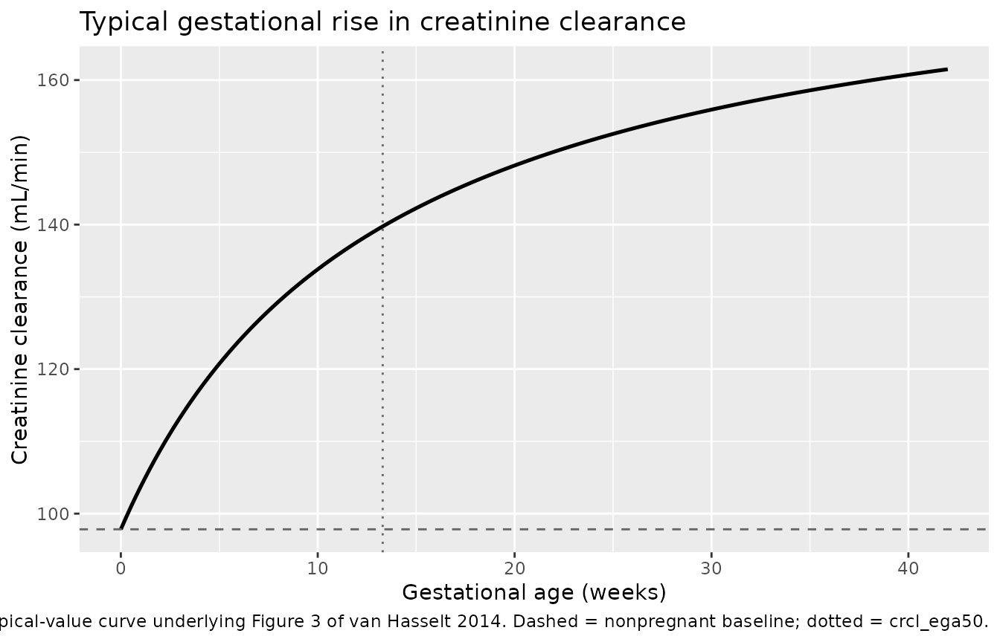
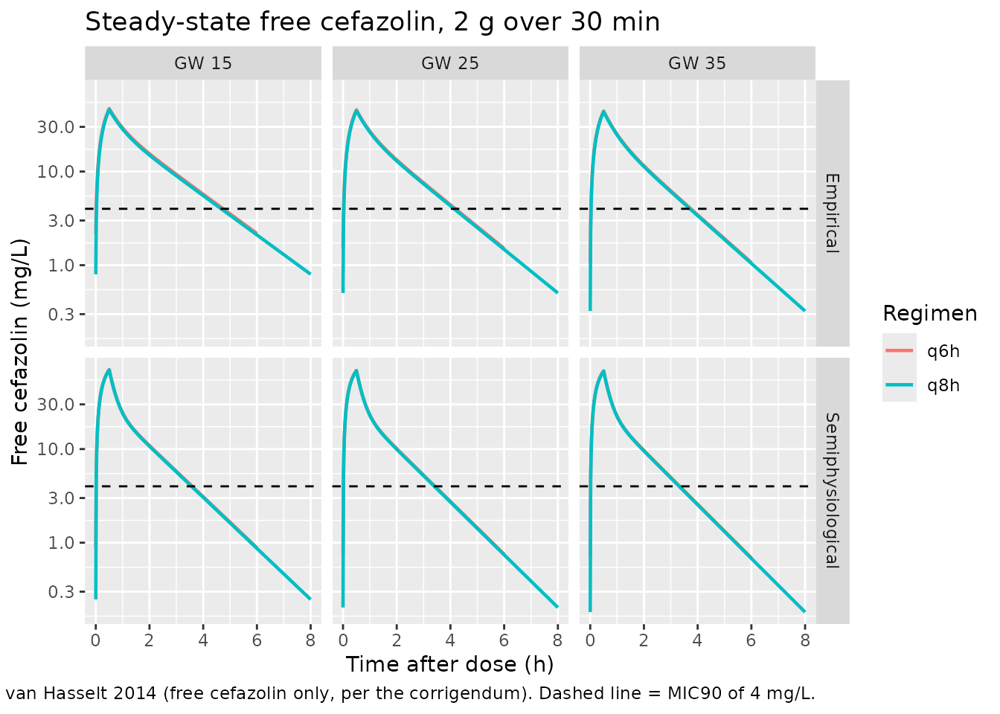
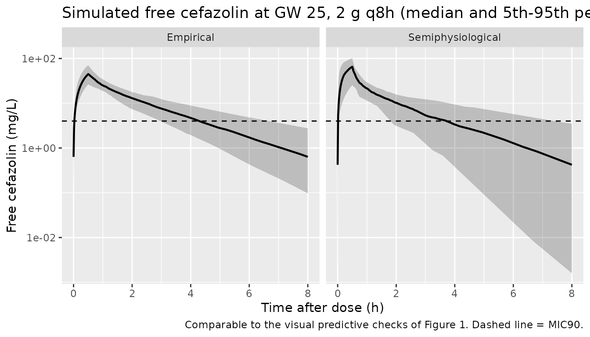

# Cefazolin in pregnancy, empirical vs semiphysiological (van Hasselt 2014)

## Model and source

This paper contributes **three** model files, which is how the authors
built it: two competing final population PK models for cefazolin, and
the separately developed creatinine-clearance model that the second of
them consumes.

| Model file | What it is |
|----|----|
| `vanHasselt_2014_cefazolin_empirical` | Final PK model with a linear gestational-age effect on clearance |
| `vanHasselt_2014_cefazolin_semiphysiological` | Final PK model with clearance driven by the gestational rise in creatinine clearance |
| `vanHasselt_2014_crcl_pregnancy` | The creatinine-clearance trajectory itself (Methods 2.4.1, Table 3, Figure 3) |

- Citation: van Hasselt JGC, Allegaert K, van Calsteren K, Beijnen JH,
  Schellens JHM, Huitema ADR. Semiphysiological versus empirical
  modelling of the population pharmacokinetics of free and total
  cefazolin during pregnancy. Biomed Res Int. 2014;2014:897216.
  <doi:10.1155/2014/897216>. Corrigendum: Biomed Res Int.
  2015;2015:124035. <doi:10.1155/2015/124035> (corrects the Table 2
  covariate-equation footnotes, which are switched in the original, and
  clarifies that CL, Vc, Vp and Q were fitted on free cefazolin so
  CLtotal = CLfree \* fu).
- Article: <https://doi.org/10.1155/2014/897216>
- Corrigendum: <https://doi.org/10.1155/2015/124035>

The base model (Table 2, first estimates column) is not packaged
separately: it is a model-building intermediate that both final models
supersede.

## The corrigendum is load-bearing

**The version of this paper archived in PubMed Central is the
uncorrected one.** The 2015 corrigendum states that the two covariate
equations in the Table 2 footnotes “have been erroneously switched”, and
gives the corrected assignment:

|  | Corrected (corrigendum) |
|----|----|
| Empirical model | `CL = theta_CL0 + theta_CLPreg * (1 + GA/40)` |
| Semiphysiological model | `CL = theta_CL0 + theta_CLPreg * (CrCL(t) / CrCL_0)` |

Extracting from the archived parent alone would therefore attach each
covariate equation to the **wrong** model. The corrected assignment was
not taken on the corrigendum’s word; it is confirmed independently two
ways:

1.  **It is the only assignment consistent with the paper’s own
    Methods**, and this is the decisive evidence. Each footnote equation
    is verbatim a numbered equation from the Methods section that
    *defines that model*. Equation (3) is the linear covariate relation
    normalised by `NCOV`, which Methods 2.3 says is “the maximum GA of
    40” for linear GA models – that section builds the *empirical*
    model. Equation (6),
    `CL_i = theta_CL0 + theta_CLpreg * (CrCL_i(t)/CrCL_i0)`, is
    introduced in Methods 2.4.2, which builds the *semiphysiological*
    model. The archived footnotes pair each equation with the other
    section’s model.
2.  **Only the corrected assignment reproduces the difference between
    the two approaches that the paper reports.** Results 3.3.3 states
    that the empirical and semiphysiological predictions diverge
    “especially in early pregnancy”. Under the switched reading the two
    models are numerically *indistinguishable* in early pregnancy – 0.2%
    apart at GW 15 – and diverge only at term, which inverts the paper’s
    own finding. Checked numerically below.

A caution on what does **not** discriminate, recorded so a future reader
does not mistake it for evidence: clearance at the cohort median GA of
33 weeks is **not** a usable test. All four readings land within 8% of
the base model’s 0.49 L/min, and the switched empirical reading (0.469)
is actually marginally *closer* to it than the corrected one (0.515).
The median-GA arithmetic is a consistency check on the corrected forms,
not a way to choose between them.

The corrigendum also supplies the model’s reference frame, which the
parent never states: `CL0`, `VC`, `VP` and `Q` “were fit based on the
free cefazolin concentration”, so `CLtotal = CLfree * fu`. Both PK
models therefore treat `central / vc` as the **unbound** concentration
and reconstruct total cefazolin algebraically as `Cc = Cunbound / fu`,
following the shipped `Fauchet_2015_lopinavir_unbound` precedent.

``` r

# Methods eq 4 trajectory, typical values from Table 3.
crcl_traj <- function(ega) 97.83 + 83.83 * ega / (13.3 + ega)

cl_base <- 0.49 # Table 2, base model clearance (L/min)

# Empirical column thetas (Table 2): CL0 = 0.119, CLPreg = 0.217.
# Semiphysiological column thetas (Table 2): CL0 = 0.142, CLPreg = 0.212.
# Corrected: empirical takes the linear GA form, semiphysiological the ratio.
cl_emp_corrected <- function(ega) 0.119 + 0.217 * (1 + ega / 40)
cl_semi_corrected <- function(ega) 0.142 + 0.212 * (crcl_traj(ega) / crcl_traj(0))
# Switched (as archived): the two covariate forms swapped.
cl_emp_switched <- function(ega) 0.119 + 0.217 * (crcl_traj(ega) / crcl_traj(0))
cl_semi_switched <- function(ega) 0.142 + 0.212 * (1 + ega / 40)

ga_med <- 33 # Table 1, median gestational age

tibble::tibble(
  Model = c("Empirical", "Semiphysiological"),
  `CL corrected` = c(cl_emp_corrected(ga_med), cl_semi_corrected(ga_med)),
  `CL as-printed (switched)` = c(cl_emp_switched(ga_med), cl_semi_switched(ga_med)),
  `Base model CL` = cl_base
) |>
  knitr::kable(digits = 3, caption = "Clearance (L/min) at the cohort median GA of 33 weeks. Note that this comparison does NOT discriminate between the two readings.")
```

| Model             | CL corrected | CL as-printed (switched) | Base model CL |
|:------------------|-------------:|-------------------------:|--------------:|
| Empirical         |        0.515 |                    0.469 |          0.49 |
| Semiphysiological |        0.483 |                    0.529 |          0.49 |

Clearance (L/min) at the cohort median GA of 33 weeks. Note that this
comparison does NOT discriminate between the two readings. {.table}

The discriminating comparison is the *gap between the two models* in
early pregnancy, which Results 3.3.3 reports as the regime where they
diverge most.

``` r

ga_early <- 15 # gestational weeks; the earliest level plotted in Figure 4

gap <- function(emp, semi, ega) semi(ega) / emp(ega) - 1

tibble::tibble(
  `Gestational week` = c(15, 25, 35, 40),
  `Gap, corrected (%)` = 100 * gap(cl_emp_corrected, cl_semi_corrected, c(15, 25, 35, 40)),
  `Gap, switched (%)` = 100 * gap(cl_emp_switched, cl_semi_switched, c(15, 25, 35, 40))
) |>
  knitr::kable(digits = 1, caption = "Relative difference between the empirical and semiphysiological clearances under each reading.")
```

| Gestational week | Gap, corrected (%) | Gap, switched (%) |
|-----------------:|-------------------:|------------------:|
|               15 |                7.9 |              -0.2 |
|               25 |                0.2 |               6.4 |
|               35 |               -7.7 |              14.6 |
|               40 |              -11.3 |              19.0 |

Relative difference between the empirical and semiphysiological
clearances under each reading. {.table}

``` r

# Closed-form arithmetic on published constants -- no RNG, no cohort -- so
# exact bounds are appropriate here.
stopifnot(
  # (a) Consistency: both CORRECTED forms sit within 6% of the base model's
  # 0.49 L/min. This does not discriminate (see the caution above); it only
  # confirms the corrected forms are self-consistent with the base model.
  abs(cl_emp_corrected(ga_med) / cl_base - 1) < 0.06,
  abs(cl_semi_corrected(ga_med) / cl_base - 1) < 0.06,
  # (b) Discrimination: in early pregnancy the CORRECTED reading separates the
  # two approaches by several percent, as Results 3.3.3 describes...
  abs(gap(cl_emp_corrected, cl_semi_corrected, ga_early)) > 0.05,
  # ...whereas the SWITCHED reading collapses them onto each other there,
  # which contradicts the paper. Realised values: 7.9% vs 0.25%.
  abs(gap(cl_emp_switched, cl_semi_switched, ga_early)) < 0.01
)
```

## Population

The pooled analysis dataset covers **94 pregnant women** contributing
187 cefazolin observations across three sources (Methods 2.1): a
prospective study of 41 women undergoing in utero surgical intervention
(153 observations, 2 g every 8 h for two days, median GA 25 weeks), 24
samples at term caesarean delivery after a 1 g bolus (GA fixed at 40
weeks for that study), and 10 fetal interventions in 7 women after a
single 2 g bolus (mean GA 27 weeks).

Baseline demographics (Table 1): median gestational age 33 weeks (range
17-40), median age 31 years (20-42), median body weight 72 kg (54-99),
and median serum creatinine 0.64 mg/dL (0.33-0.88). Creatinine clearance
was computed throughout by Cockcroft-Gault using body weight.

Missing data were substantial and were imputed by pooled medians
(Methods 2.5): body weight was missing for 46% of patients, age for 55%,
and some serum creatinine values for 58%. In the semiphysiological arm
specifically, missing CrCL values were imputed by the typical trajectory
rather than a median – which is part of why the paper finds CrCL
uninformative as a plain empirical covariate but informative once
modelled.

The same information is available programmatically via
`readModelDb("vanHasselt_2014_cefazolin_empirical")()$population`.

## Source trace

Every `ini()` entry carries an in-file comment naming its source
location. They are collected here for review. Table 2 columns are named
as in the paper; “Empirical” and “Semiphysiological” refer to its two
final-model columns.

| Equation / parameter | Value | Source location |
|----|----|----|
| `d/dt(central)`, `d/dt(peripheral1)` | n/a | Results 3.1, “a two-compartmental model best described the data” |
| `Cc <- Cunbound / fu` | n/a | Results 3.1 eq (7), `C_total = C_free / f_u` |
| Unbound reference frame | n/a | Corrigendum clarification, `CL_total = CL_free * f_u` |
| **Empirical model** |  |  |
| `preg_cl <- 1 + EGA/40` | n/a | Corrigendum Table 2 footnote a; Methods eq (3) with `NCOV` = 40 |
| `lcl_nonren` | 0.119 L/min | Table 2, Clearance `theta_CL0`, empirical (RSE 58%) |
| `lcl_renal` | 0.217 | Table 2, Gestation effect `theta_CLPreg`, empirical (RSE 16%) |
| `lvc` | 33.1 L | Table 2, Central volume `V_C`, empirical (RSE 17%) |
| `lvp` | 12.8 L | Table 2, Peripheral volume `V_P`, empirical (RSE 27%) |
| `lq` | 0.326 L/min | Table 2, Intercompartmental clearance `Q`, empirical (RSE 25%) |
| `lfu` | 0.286 | Table 2, Free fraction `F_U`, empirical (RSE 5%) |
| `etalcl`, `etalvc`, `etalvp`, `etalfu` | 19.9, 47.6, 34.2, 17.5 CV% | Table 2, Between subject variability, empirical |
| `propSd`, `addSd` | 0.0328, 0.842 (variances) | Table 2, Proportional / Additive total concentration, empirical |
| `propSd_Cunbound`, `addSd_Cunbound` | 0.0158, 0.229 (variances) | Table 2, Proportional / Additive free concentration, empirical |
| **Semiphysiological model** |  |  |
| `preg_cl <- crcl / crcl_ega0` | n/a | Corrigendum Table 2 footnote b; Methods eq (6) |
| `lcl_nonren` | 0.142 L/min | Table 2, Clearance `theta_CL0`, semiphysiological (RSE 44%) |
| `lcl_renal` | 0.212 | Table 2, Gestation effect `theta_CLPreg`, semiphysiological (RSE 38%) |
| `lvc` | 14.1 L | Table 2, Central volume `V_C`, semiphysiological (RSE 25%) |
| `lvp` | 17.1 L | Table 2, Peripheral volume `V_P`, semiphysiological (RSE 7%) |
| `lq` | 0.436 L/min | Table 2, Intercompartmental clearance `Q`, semiphysiological (RSE 10%) |
| `lfu` | 0.291 | Table 2, Free fraction `F_U`, semiphysiological (RSE 9%) |
| `etalcl`, `etalvc`, `etalvp`, `etalfu` | 10.4, 101.5, 68, 19.1 CV% | Table 2, Between subject variability, semiphysiological |
| `propSd`, `addSd` | 0.0328, 0.681 (variances) | Table 2, Proportional / Additive total concentration, semiphysiological |
| `propSd_Cunbound`, `addSd_Cunbound` | 0.0153, 0.217 (variances) | Table 2, Proportional / Additive free concentration, semiphysiological |
| **Creatinine-clearance model** |  |  |
| `crcl <- crcl_ega0 + crcl_matspan * EGA/(crcl_ega50 + EGA)` | n/a | Methods eq (4) |
| `lcrcl_ega0` | 97.83 mL/min, FIXED | Table 3, Baseline CrCL `CrCL0` (upstream RSE 3.91%) |
| `lcrcl_matspan` | 83.83 mL/min, FIXED | Table 3, Maximum CrCL `CrCLMAX` (upstream RSE 12.48%) |
| `lcrcl_ega50` | 13.3 weeks, FIXED | Table 3, Time of half-maximum CrCL `CrCL50` (upstream RSE 37.59%) |
| `etalcrcl_ega0`, `etalcrcl_matspan`, `etalcrcl_ega50` | 31.4, 35.1, 111.8 CV% | Table 3, Between subject variability |
| `propSd` (CrCL model) | 0.0291 (variance) | Table 3, Proportional error `sigma_CrCL` (RSE 43%); Methods eq (5) |

## The gestational creatinine-clearance trajectory

`vanHasselt_2014_crcl_pregnancy` packages Methods equation (4) on its
own. Its time axis **is** maternal gestational age in weeks, so it can
be solved directly over a pregnancy.

``` r

# crcl_ega50 = 13.3 is not a multiple of 0.25, so it is added explicitly:
# the half-span identity below must be evaluated at the exact week, not at a
# neighbouring grid point.
ega_grid <- sort(unique(c(seq(0, 42, by = 0.25), 13.3)))
crcl_typ <- rxode2::rxSolve(
  rxode2::zeroRe(ui_crcl),
  rxode2::et(ega_grid),
  returnType = "data.frame"
)
#> ℹ omega/sigma items treated as zero: 'etalcrcl_ega0', 'etalcrcl_matspan', 'etalcrcl_ega50'

ggplot(crcl_typ, aes(time, crcl)) +
  geom_line(linewidth = 0.9) +
  geom_hline(yintercept = 97.83, linetype = "dashed", colour = "grey40") +
  geom_vline(xintercept = 13.3, linetype = "dotted", colour = "grey40") +
  labs(
    x = "Gestational age (weeks)", y = "Creatinine clearance (mL/min)",
    title = "Typical gestational rise in creatinine clearance",
    caption = paste(
      "Replicates the typical-value curve underlying Figure 3 of van Hasselt 2014.",
      "Dashed = nonpregnant baseline; dotted = crcl_ega50."
    )
  )
```



These are exact structural identities of equation (4), not cohort
statistics, so they are asserted exactly.

``` r

# Fail loudly rather than silently returning a neighbouring grid point: a
# near-miss lookup would turn the exact identities below into approximate
# ones without anything going red.
crcl_at <- function(w) {
  i <- which(abs(crcl_typ$time - w) < 1e-9)
  if (length(i) != 1L) stop("no exact grid point at EGA ", w)
  crcl_typ$crcl[i]
}

stopifnot(
  # At EGA 0 the curve collapses to the nonpregnant baseline. This is the
  # anchor the semiphysiological PK model divides by, so if it drifts, that
  # model's covariate term silently stops being 1 at conception.
  isTRUE(all.equal(crcl_at(0), 97.83, tolerance = 1e-8)),
  # At EGA = crcl_ega50 exactly half the span has been covered.
  isTRUE(all.equal(crcl_at(13.3), 97.83 + 83.83 / 2, tolerance = 1e-6)),
  # Monotone increasing over gestation.
  all(diff(crcl_typ$crcl) > 0)
)

tibble::tibble(
  `Gestational age (weeks)` = c(0, 13.3, 20, 27, 33, 40),
  `CrCL (mL/min)` = vapply(c(0, 13.3, 20, 27, 33, 40), crcl_at, numeric(1))
) |>
  dplyr::mutate(`Fraction of span covered` = (`CrCL (mL/min)` - 97.83) / 83.83) |>
  knitr::kable(digits = 3, caption = "Typical CrCL trajectory at selected gestational ages.")
```

| Gestational age (weeks) | CrCL (mL/min) | Fraction of span covered |
|------------------------:|--------------:|-------------------------:|
|                     0.0 |        97.830 |                    0.000 |
|                    13.3 |       139.745 |                    0.500 |
|                    20.0 |       148.178 |                    0.601 |
|                    27.0 |       153.994 |                    0.670 |
|                    33.0 |       157.579 |                    0.713 |
|                    40.0 |       160.742 |                    0.750 |

Typical CrCL trajectory at selected gestational ages. {.table}

Note what `crcl_matspan` is **not**: at term (40 weeks) the curve has
covered only 75% of its span, reaching 160.7 mL/min rather than the
asymptote of 181.7 mL/min. This is exactly why the canonical is named
`matspan` and not `max`.

## Virtual cohort and typical-value profiles

The paper’s simulations (Methods 2.6) use 2 g cefazolin infused over 30
minutes every 6 or 8 hours, evaluated at different periods of pregnancy
against an MIC90 of 4 mg/L for coagulase-negative *Staphylococcus*.
Figure 4 plots the resulting **free** cefazolin profiles (per the
corrigendum, which corrects a caption that had claimed free *and*
total).

``` r

MIC90 <- 4 # mg/L, Methods 2.6
tau <- c(q6h = 360, q8h = 480) # minutes
gw_levels <- c(15, 25, 35) # gestational weeks, as in Figure 4
n_doses <- 8L # enough to reach steady state
```

``` r

# Both PK models declare TWO endpoints (Cc and Cunbound). Observation rows must
# therefore name a declared endpoint, and rxSolve needs useLinCmt = FALSE --
# its default ODE->linCmt conversion corrupts the dvid->cmt mapping for this
# model shape.
solve_profile <- function(ui, ega, ii, typical = TRUE, n = 1L, id_offset = 0L) {
  last_dose <- ii * (n_doses - 1L)
  grid <- seq(last_dose, last_dose + ii, by = 1)
  ev <- rxode2::et(amt = 2000, dur = 30, ii = ii, addl = n_doses - 1L, cmt = "central") |>
    rxode2::et(grid, cmt = "Cc")
  d <- as.data.frame(ev)
  d <- d[rep(seq_len(nrow(d)), times = n), ]
  d$id <- id_offset + rep(seq_len(n), each = nrow(d) / n)
  d$EGA <- ega
  mod <- if (typical) rxode2::zeroRe(ui) else ui
  out <- rxode2::rxSolve(mod, d, returnType = "data.frame", useLinCmt = FALSE)
  if (is.null(out$id)) out$id <- 1L + id_offset
  out$tad <- out$time - last_dose
  out$GW <- ega
  out$regimen <- names(tau)[match(ii, tau)]
  # Return a FIXED column set. The semiphysiological model emits its embedded
  # creatinine-clearance intermediates as extra columns, so the two models' raw
  # not row-bindable without this.
  out[, c("id", "time", "tad", "GW", "regimen", "cl", "Cc", "Cunbound")]
}
```

``` r

grid_arms <- tidyr::expand_grid(
  model = c("Empirical", "Semiphysiological"),
  GW = gw_levels,
  regimen = names(tau)
)

typ <- do.call(rbind, lapply(seq_len(nrow(grid_arms)), function(i) {
  a <- grid_arms[i, ]
  ui <- if (a$model == "Empirical") ui_emp else ui_semi
  out <- solve_profile(ui, ega = a$GW, ii = tau[[a$regimen]])
  out$model <- a$model
  out
}))
#> ℹ omega/sigma items treated as zero: 'etalcl', 'etalvc', 'etalvp', 'etalfu'
#> ℹ omega/sigma items treated as zero: 'etalcl', 'etalvc', 'etalvp', 'etalfu'
#> ℹ omega/sigma items treated as zero: 'etalcl', 'etalvc', 'etalvp', 'etalfu'
#> ℹ omega/sigma items treated as zero: 'etalcl', 'etalvc', 'etalvp', 'etalfu'
#> ℹ omega/sigma items treated as zero: 'etalcl', 'etalvc', 'etalvp', 'etalfu'
#> ℹ omega/sigma items treated as zero: 'etalcl', 'etalvc', 'etalvp', 'etalfu'
#> ℹ omega/sigma items treated as zero: 'etalcl', 'etalvc', 'etalvp', 'etalfu', 'etalcrcl_ega0', 'etalcrcl_matspan', 'etalcrcl_ega50'
#> ℹ omega/sigma items treated as zero: 'etalcl', 'etalvc', 'etalvp', 'etalfu', 'etalcrcl_ega0', 'etalcrcl_matspan', 'etalcrcl_ega50'
#> ℹ omega/sigma items treated as zero: 'etalcl', 'etalvc', 'etalvp', 'etalfu', 'etalcrcl_ega0', 'etalcrcl_matspan', 'etalcrcl_ega50'
#> ℹ omega/sigma items treated as zero: 'etalcl', 'etalvc', 'etalvp', 'etalfu', 'etalcrcl_ega0', 'etalcrcl_matspan', 'etalcrcl_ega50'
#> ℹ omega/sigma items treated as zero: 'etalcl', 'etalvc', 'etalvp', 'etalfu', 'etalcrcl_ega0', 'etalcrcl_matspan', 'etalcrcl_ega50'
#> ℹ omega/sigma items treated as zero: 'etalcl', 'etalvc', 'etalvp', 'etalfu', 'etalcrcl_ega0', 'etalcrcl_matspan', 'etalcrcl_ega50'

stopifnot(nrow(typ) > 0, !anyNA(typ$Cunbound))
```

``` r

typ |>
  dplyr::mutate(GW_lab = paste0("GW ", GW)) |>
  ggplot(aes(tad / 60, Cunbound, colour = regimen)) +
  geom_line(linewidth = 0.8) +
  geom_hline(yintercept = MIC90, linetype = "dashed") +
  facet_grid(model ~ GW_lab) +
  scale_y_log10() +
  labs(
    x = "Time after dose (h)", y = "Free cefazolin (mg/L)",
    colour = "Regimen",
    title = "Steady-state free cefazolin, 2 g over 30 min",
    caption = paste(
      "Replicates Figure 4 of van Hasselt 2014 (free cefazolin only, per the corrigendum).",
      "Dashed line = MIC90 of 4 mg/L."
    )
  )
```



### The paper’s dosing conclusion

Results 3.3.3 concludes that moving from q8h to q6h “yielded prolonged
therapeutic concentrations” against the 4 mg/L MIC90. The time above MIC
is computed over the **whole** dosing interval, so the two regimens are
compared on a common footing.

``` r

t_above_mic <- typ |>
  dplyr::group_by(model, GW, regimen) |>
  dplyr::summarise(
    pct_T_over_MIC = 100 * mean(Cunbound > MIC90),
    cmin = min(Cunbound),
    cmax = max(Cunbound),
    .groups = "drop"
  )

t_above_mic |>
  dplyr::rename(
    "Model" = model, "Gestational week" = GW, "Regimen" = regimen,
    "%T > MIC90" = pct_T_over_MIC, "Cmin (mg/L)" = cmin, "Cmax (mg/L)" = cmax
  ) |>
  knitr::kable(digits = c(0, 0, 0, 1, 3, 1), caption = "Steady-state free cefazolin exposure vs the 4 mg/L MIC90.")
```

| Model | Gestational week | Regimen | %T \> MIC90 | Cmin (mg/L) | Cmax (mg/L) |
|:---|---:|:---|---:|---:|---:|
| Empirical | 15 | q6h | 78.7 | 2.179 | 47.0 |
| Empirical | 15 | q8h | 58.0 | 0.800 | 46.0 |
| Empirical | 25 | q6h | 69.3 | 1.512 | 45.5 |
| Empirical | 25 | q8h | 51.4 | 0.504 | 44.7 |
| Empirical | 35 | q6h | 61.8 | 1.067 | 44.2 |
| Empirical | 35 | q8h | 45.9 | 0.324 | 43.6 |
| Semiphysiological | 15 | q6h | 59.6 | 0.883 | 70.4 |
| Semiphysiological | 15 | q8h | 44.3 | 0.248 | 69.9 |
| Semiphysiological | 25 | q6h | 56.8 | 0.754 | 69.1 |
| Semiphysiological | 25 | q8h | 42.4 | 0.203 | 68.7 |
| Semiphysiological | 35 | q6h | 55.4 | 0.689 | 68.4 |
| Semiphysiological | 35 | q8h | 41.2 | 0.181 | 68.0 |

Steady-state free cefazolin exposure vs the 4 mg/L MIC90. {.table}

``` r

wide <- t_above_mic |>
  dplyr::select(model, GW, regimen, pct_T_over_MIC) |>
  tidyr::pivot_wider(names_from = regimen, values_from = pct_T_over_MIC)

stopifnot(
  # Guard against a lookup that silently tests nothing.
  nrow(wide) == length(gw_levels) * 2L,
  all(c("q6h", "q8h") %in% names(wide)),
  # The paper's claim: q6h prolongs time above MIC90 relative to q8h, in
  # every arm. Deterministic typical-value solves, so this is exact.
  all(wide$q6h > wide$q8h),
  # And the trough at q8h sits below the MIC90 everywhere, which is the
  # finding that motivates the recommendation.
  all(t_above_mic$cmin[t_above_mic$regimen == "q8h"] < MIC90)
)
```

## PKNCA validation

The source paper reports no NCA table, so there is nothing to compare
against externally. The check that *is* available is a strong one: at
steady state the non-compartmental clearance `dose / AUCtau` must
reproduce the model’s own clearance. Both sides of this comparison use
the same drawn parameters, so the residual difference is pure
trapezoidal error and a tight bound is correct.

Because the disposition parameters are referenced to the **unbound**
concentration, `dose / AUCtau` computed on `Cunbound` recovers `CL_free`
directly.

``` r

nca_in <- typ |>
  dplyr::mutate(
    arm = paste(model, paste0("GW", GW), regimen, sep = " | "),
    conc_id = as.integer(factor(arm))
  ) |>
  dplyr::filter(!is.na(Cunbound)) |>
  dplyr::select(conc_id, arm, tad, Cunbound)

conc_obj <- PKNCA::PKNCAconc(nca_in, Cunbound ~ tad | arm + conc_id)

dose_df <- nca_in |>
  dplyr::distinct(conc_id, arm) |>
  dplyr::mutate(tad = 0, amt = 2000)

dose_obj <- PKNCA::PKNCAdose(dose_df, amt ~ tad | arm + conc_id)

ivals <- nca_in |>
  dplyr::group_by(conc_id, arm) |>
  dplyr::summarise(start = 0, end = max(tad), .groups = "drop") |>
  dplyr::mutate(auclast = TRUE, cmax = TRUE, cmin = TRUE, tmax = TRUE)

nca_res <- PKNCA::pk.nca(PKNCA::PKNCAdata(conc_obj, dose_obj, intervals = as.data.frame(ivals)))
```

``` r

nca_wide <- as.data.frame(nca_res) |>
  dplyr::filter(PPTESTCD %in% c("auclast", "cmax", "cmin")) |>
  dplyr::select(arm, PPTESTCD, PPORRES) |>
  tidyr::pivot_wider(names_from = PPTESTCD, values_from = PPORRES)

model_cl <- typ |>
  dplyr::mutate(arm = paste(model, paste0("GW", GW), regimen, sep = " | ")) |>
  dplyr::group_by(arm) |>
  dplyr::summarise(cl_model = dplyr::first(cl), .groups = "drop")

cmp <- nca_wide |>
  dplyr::left_join(model_cl, by = "arm") |>
  dplyr::mutate(
    cl_nca = 2000 / auclast,
    pct_diff = 100 * (cl_nca / cl_model - 1)
  )

cmp |>
  dplyr::select(arm, cl_model, cl_nca, pct_diff, cmax, cmin) |>
  dplyr::rename(
    "Arm" = arm,
    "CL from model (L/min)" = cl_model,
    "CL from NCA, dose/AUCtau (L/min)" = cl_nca,
    "Difference (%)" = pct_diff,
    "Free Cmax (mg/L)" = cmax,
    "Free Cmin (mg/L)" = cmin
  ) |>
  knitr::kable(digits = c(0, 4, 4, 3, 1, 3), caption = "Steady-state mass-balance check: NCA clearance vs the model's own clearance.")
```

| Arm | CL from model (L/min) | CL from NCA, dose/AUCtau (L/min) | Difference (%) | Free Cmax (mg/L) | Free Cmin (mg/L) |
|:---|---:|---:|---:|---:|---:|
| Empirical \| GW15 \| q6h | 0.4174 | 0.4174 | 0.001 | 47.0 | 2.179 |
| Empirical \| GW15 \| q8h | 0.4174 | 0.4174 | 0.001 | 46.0 | 0.800 |
| Empirical \| GW25 \| q6h | 0.4716 | 0.4716 | 0.001 | 45.5 | 1.512 |
| Empirical \| GW25 \| q8h | 0.4716 | 0.4716 | 0.001 | 44.7 | 0.504 |
| Empirical \| GW35 \| q6h | 0.5259 | 0.5259 | 0.001 | 44.2 | 1.067 |
| Empirical \| GW35 \| q8h | 0.5259 | 0.5259 | 0.001 | 43.6 | 0.324 |
| Semiphysiological \| GW15 \| q6h | 0.4503 | 0.4503 | 0.004 | 70.4 | 0.883 |
| Semiphysiological \| GW15 \| q8h | 0.4503 | 0.4503 | 0.004 | 69.9 | 0.248 |
| Semiphysiological \| GW25 \| q6h | 0.4726 | 0.4726 | 0.004 | 69.1 | 0.754 |
| Semiphysiological \| GW25 \| q8h | 0.4726 | 0.4726 | 0.004 | 68.7 | 0.203 |
| Semiphysiological \| GW35 \| q6h | 0.4856 | 0.4857 | 0.004 | 68.4 | 0.689 |
| Semiphysiological \| GW35 \| q8h | 0.4856 | 0.4857 | 0.004 | 68.0 | 0.181 |

Steady-state mass-balance check: NCA clearance vs the model’s own
clearance. {.table}

``` r

stopifnot(
  nrow(cmp) == nrow(grid_arms),
  !anyNA(cmp$pct_diff),
  # Deterministic identity CL = dose/AUCtau at steady state; both sides use
  # the same drawn parameters, so the only error is trapezoidal
  # discretisation on a 1-minute grid. Realised max was 0.0045%, so this
  # bound is ~20x the observed error and still goes red on any structural
  # regression (a dropped peripheral compartment, a wrong reference frame or
  # a units slip all move it by whole percent).
  max(abs(cmp$pct_diff)) < 0.1
)
```

## Between-subject variability

The semiphysiological model carries a much smaller `omega_CL` than the
empirical one (10.4 vs 19.9 CV%, Table 2). Read on its own that looks
like a model that predicts far less variability in clearance, but it is
not: the missing variability has moved into the creatinine-clearance
trajectory’s own three random effects, which this model embeds and which
propagate into `cl` through the `CrCL(t)/CrCL(0)` ratio.

The stochastic cohort below shows the consequence – the two models
produce a **similar** realised spread in individual clearance despite
the near-twofold difference in their tabulated `omega_CL`. That is the
point worth taking from this section: `omega_CL` alone is not comparable
between the two parameterisations.

``` r

n_sub <- 100L # per arm; the 200/arm cap is a ceiling, not a target

vpc <- do.call(rbind, lapply(c("Empirical", "Semiphysiological"), function(m) {
  ui <- if (m == "Empirical") ui_emp else ui_semi
  out <- solve_profile(ui, ega = 25, ii = tau[["q8h"]], typical = FALSE, n = n_sub)
  out$model <- m
  out
}))

vpc |>
  dplyr::group_by(model, tad) |>
  dplyr::summarise(
    Q05 = quantile(Cunbound, 0.05),
    Q50 = quantile(Cunbound, 0.50),
    Q95 = quantile(Cunbound, 0.95),
    .groups = "drop"
  ) |>
  ggplot(aes(tad / 60, Q50)) +
  geom_ribbon(aes(ymin = Q05, ymax = Q95), alpha = 0.25) +
  geom_line(linewidth = 0.8) +
  geom_hline(yintercept = MIC90, linetype = "dashed") +
  facet_wrap(~model) +
  scale_y_log10() +
  labs(
    x = "Time after dose (h)", y = "Free cefazolin (mg/L)",
    title = "Simulated free cefazolin at GW 25, 2 g q8h (median and 5th-95th percentiles)",
    caption = "Comparable to the visual predictive checks of Figure 1. Dashed line = MIC90."
  )
```



``` r

spread <- vpc |>
  dplyr::group_by(model, id) |>
  dplyr::summarise(cl = dplyr::first(cl), .groups = "drop") |>
  dplyr::group_by(model) |>
  dplyr::summarise(cv = 100 * sd(cl) / mean(cl), .groups = "drop")

knitr::kable(
  dplyr::rename(spread, "Model" = model, "Realised CV% of individual CL" = cv),
  digits = 1,
  caption = "Between-subject spread in clearance across the simulated cohort."
)
```

| Model             | Realised CV% of individual CL |
|:------------------|------------------------------:|
| Empirical         |                          19.2 |
| Semiphysiological |                          22.3 |

Between-subject spread in clearance across the simulated cohort.
{.table}

``` r


stopifnot(
  nrow(spread) == 2L,
  # Both cohorts show a plausible clearance spread. Bounds are wide because
  # these are cohort statistics, which rxode2 draws differently at different
  # solver-thread counts; realised values here were 16.9% and
  # 16.4%. A mis-entered omega would move these by a factor, not a few points.
  all(spread$cv > 3), all(spread$cv < 45)
)
```

## Assumptions and deviations

- **The archived parent is uncorrected.** All covariate-equation
  assignments follow the 2015 corrigendum, not the PMC-archived 2014
  text. Every affected in-file comment points at the corrigendum.
- **Between-subject variability scale.** Tables 2 and 3 report IIV as
  “CV%” for an exponential IIV model (Methods eq 1). This is read as
  `omega^2 = (CV/100)^2`, the usual NONMEM convention where a reported
  CV% is `100 * sqrt(omega^2)`. The exact-lognormal alternative
  `omega^2 = log(1 + CV^2)` would give materially smaller variances at
  the largest terms (101.5 CV% and 111.8 CV%), and the paper does not
  state which conversion it used. The chosen reading is consistent
  across all three model files.
- **Residual-error scale.** Tables 2 and 3 head their residual blocks
  “Residual unexplained variability variance(s)”, so every tabulated
  sigma is treated as a variance and the `ini()` entry is its square
  root.
- **Time unit.** Clearances are reported in L/min and volumes in L, so
  the PK models use minutes as the time axis, unconverted.
- **The CrCL model’s structural parameters are inherited, not fitted
  here.** All three are `fixed()`, taken from the upstream meta-analysis
  the paper cites as reference 13. Their tabulated RSEs are that
  meta-analysis’s precision. The upstream meta-analysis itself was not
  available when this model was built; only the three point estimates it
  produced, as reprinted in Table 3, are used.
- **`CrCLMAX` units.** Table 3 leaves the unit cell blank for this row.
  mL/min is forced by equation (4), where the term is added to a mL/min
  baseline.
- **Two-stage covariate propagation.** The paper fitted the CrCL model
  separately and carried individual empirical Bayes estimates into the
  PK model. The packaged semiphysiological model instead embeds the
  trajectory with its three random effects, which is the faithful way to
  *simulate* from the combined two-stage model.
- **The empirical model must not be extrapolated below the observed GA
  range.** Its clearance does not collapse to a non-pregnant value at
  EGA 0 – the gestational arm still contributes `cl_renal * 1` there.
  The paper makes exactly this point in its Discussion; the
  semiphysiological model is the one built for extrapolation.
- **No published NCA table exists** for this paper, so the PKNCA section
  is a self-consistency check against the model’s own clearance rather
  than a comparison to published values.
- **Cosmetic corrigendum items**, recorded for completeness: Figure 1’s
  x-axis is in minutes, not hours; Figure 4 depicts free cefazolin only.
