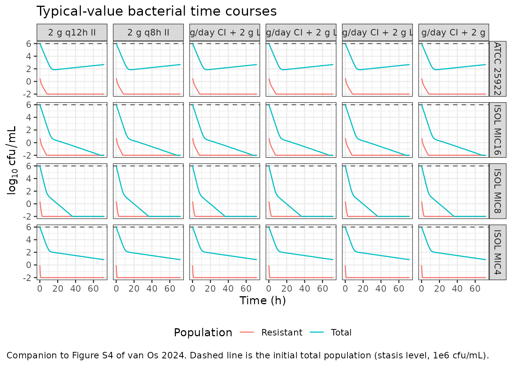
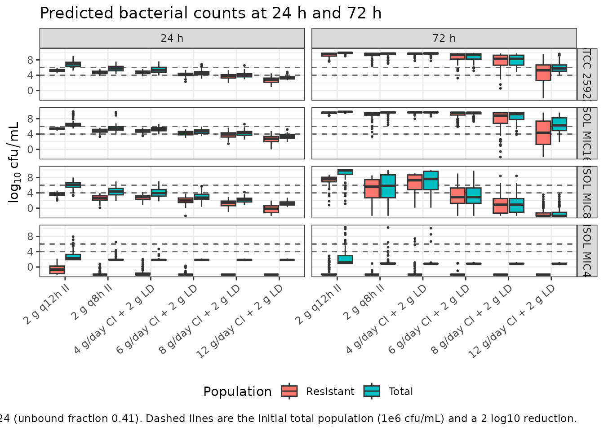

# Temocillin PK/PD against Escherichia coli (van Os 2024)

## Model and source

van Os and colleagues combined static time-kill (STK) experiments and a
hollow-fibre infection model (HFIM) to build a semi-mechanistic PK/PD
model of temocillin activity against four *Escherichia coli* strains,
then coupled that PD model to a published population PK model of
temocillin in critically ill patients in order to compare dosing
regimens.

The paper fitted the PD model **separately for each of the four
strains** (Table 3 reports four independent columns of estimates with
their own relative standard errors), so the extraction is four model
files that share one structure, plus this single vignette.

``` r

strainModels <- c(
  "ATCC 25922" = "vanOs_2024_temocillin_atcc25922",
  "ISOL MIC16" = "vanOs_2024_temocillin_isolmic16",
  "ISOL MIC8"  = "vanOs_2024_temocillin_isolmic8",
  "ISOL MIC4"  = "vanOs_2024_temocillin_isolmic4"
)
strainMIC <- c("ATCC 25922" = 16, "ISOL MIC16" = 16, "ISOL MIC8" = 8, "ISOL MIC4" = 4)

mod1 <- readModelDb(strainModels[["ATCC 25922"]])
```

- Citation: van Os W, Nussbaumer-Proll A, Pham AD, Wijnant GJ, Ngougni
  Pokem P, Van Bambeke F, van Hasselt JGC, Zeitlinger M.
  Pharmacokinetic/pharmacodynamic model-based optimization of temocillin
  dosing strategies for the treatment of systemic infections. J
  Antimicrob Chemother. 2024;79(10):2484-2492.
  <doi:10.1093/jac/dkae243>. Structural equations: main-text Equations
  1-3. Pharmacodynamic parameter estimates: main-text Table 3, column
  ATCC 25922. Strain characteristics: main-text Table 1. Population
  pharmacokinetic parameters: main-text Table 2, reproduced from Laterre
  PF, Wittebole X, Van de Velde S, Muller AE, Mouton JW, Carryn S,
  Tulkens PM, Dugernier T. Temocillin (6 g daily) in critically ill
  patients: continuous infusion versus three times daily administration.
  J Antimicrob Chemother. 2015;70(3):891-898. <doi:10.1093/jac/dku465>.
  Structure and coupling verified against the Supplementary data file
  NONMEM_code.txt.
- Article: <https://doi.org/10.1093/jac/dkae243>
- Supplementary data (includes the NONMEM simulation control stream
  `NONMEM_code.txt`): <https://doi.org/10.1093/jac/dkae243>

## Population

The pharmacodynamic layer is *in vitro*. Four *E. coli* strains were
chosen to span the less susceptible end of the wild-type MIC
distribution for the species (4-16 mg/L): the reference strain ATCC
25922 (MIC 16 mg/L) and three clinical isolates from the Vienna General
Hospital – ISOL MIC16 (catheter urine, *bla*CTX-M-15 and *bla*OXA-1, MIC
16 mg/L), ISOL MIC8 (skin swab, MIC 8 mg/L) and ISOL MIC4 (rectal swab,
*bla*TEM-1 and *bla*CTX-M-1, MIC 4 mg/L) (main-text Table 1). MICs were
determined in triplicate by broth microdilution following CLSI
guidelines.

STK experiments were run in triplicate in 5 mL cation-adjusted
Mueller-Hinton broth at 37 degrees C, inoculated at 1.5e6 cfu/mL, over
temocillin concentrations of 0.125-8x MIC plus a growth control, sampled
over 24 h. The HFIM replicated the unbound plasma concentration-time
profiles of four intravenous regimens over 72 h. Total counts were read
on drug-free agar and the resistant subpopulation on agar containing 32
mg/L temocillin; the theoretical limit of detection was 50 cfu/mL and
observations below it were handled with the M3 method.

The pharmacokinetic layer is **not** fitted in this paper. It is the
two-compartment population PK model of temocillin in critically ill
patients from Laterre et al. 2015 (n = 11), whose parameter values this
paper reproduces in its Table 2 and hard-codes in the supplementary
NONMEM control stream. All PK parameters and their inter-individual
variances are therefore encoded with `fixed()`.

The same information is available programmatically:

``` r

str(readModelDb(strainModels[["ATCC 25922"]])()$population, max.level = 1)
#> List of 9
#>  $ species         : chr "in vitro (Escherichia coli ATCC 25922); pharmacokinetics from critically ill adults"
#>  $ n_subjects      : int 1
#>  $ n_studies       : int 1
#>  $ strain          : chr "ATCC 25922 (reference strain; ESBL genes: none reported; temocillin MIC 16 mg/L, determined in triplicate by br"| __truncated__
#>  $ disease_state   : chr "Escherichia coli selected to span the less susceptible end of the wild-type MIC distribution for the species (4"| __truncated__
#>  $ model_system    : chr "Static time-kill (STK) experiments in 5 mL cation-adjusted Mueller-Hinton broth at 37 degrees C, in triplicate,"| __truncated__
#>  $ dose_range      : chr "HFIM regimens replicated over 72 h: 2 g q12h and 2 g q8h intermittent infusion, and 4 g/day and 6 g/day continu"| __truncated__
#>  $ initial_inoculum: chr "The published simulations set the total bacterial population at time zero to 1e6 cfu/mL and scaled each subpopu"| __truncated__
#>  $ notes           : chr "Estimated in NONMEM 7.4 with Laplacian estimation, PsN 5.3.0 and Pirana 21.11.1. The model was built in three s"| __truncated__
```

## Source trace

### Model equations

| Equation | Source location |
|----|----|
| `d/dt(bact_susceptible)`, sigmoidal Emax kill and logistic growth | Equation 1 (p. 2487) |
| `d/dt(bact_less_susceptible)`, sigmoidal Emax kill and logistic growth | Equation 2 (p. 2487) |
| `d/dt(bact_resistant)`, linear kill, growth capped on `S + LS` | Equation 3 (p. 2487) |
| Two-compartment plasma PK; `Cu = central / vc * fu` drives all three effects | Table 2; Supplementary `NONMEM_code.txt` `$PK` / `$DES` |
| Total count reported as `log10(S + LS)`; resistant count capped at the total | Methods “PK/PD model”; Supplementary `NONMEM_code.txt` `$ERROR` |
| Rescaling of the fitted inocula to a 1e6 cfu/mL total at time zero | Methods “PK/PD simulations”; `NONMEM_code.txt` `THETA(1)`, `THETA(6)`, `THETA(11)` |

### Parameters

Every `ini()` entry carries an in-file comment naming its source. The
table below collects the values from all four strain models in one
place; the pharmacodynamic values are main-text Table 3 and the
pharmacokinetic values are main-text Table 2.

``` r

iniOf <- function(mn) {
  d <- rxode2::rxode(readModelDb(mn))$iniDf
  d <- d[!is.na(d$name), ]
  data.frame(Parameter = d$name, est = d$est, fixed = d$fix, stringsAsFactors = FALSE)
}
tr <- Reduce(
  function(a, b) dplyr::full_join(a, b, by = "Parameter"),
  Map(function(nm, mn) {
    x <- iniOf(mn)
    x$value <- ifelse(x$fixed, paste0(signif(x$est, 6), " (FIX)"), as.character(signif(x$est, 6)))
    stats::setNames(x[, c("Parameter", "value")], c("Parameter", nm))
  }, names(strainModels), strainModels)
)
#> ℹ parameter labels from comments will be replaced by 'label()'
#> ℹ parameter labels from comments will be replaced by 'label()'
#> ℹ parameter labels from comments will be replaced by 'label()'
#> ℹ parameter labels from comments will be replaced by 'label()'
tr$Source <- ifelse(
  grepl("^(lcl|lvc|lq|lvp|fu|etalcl|etalvc)$", tr$Parameter),
  "Table 2 (from Laterre et al. 2015)",
  ifelse(tr$Parameter == "log10cfu0_total", "Methods, PK/PD simulations", "Table 3")
)
knitr::kable(tr, caption = "Parameter values by strain, with source location. Log-scale PK parameters are shown on the log scale as stored in ini().")
```

| Parameter | ATCC 25922 | ISOL MIC16 | ISOL MIC8 | ISOL MIC4 | Source |
|:---|:---|:---|:---|:---|:---|
| lcl | 1.30563 (FIX) | 1.30563 (FIX) | 1.30563 (FIX) | 1.30563 (FIX) | Table 2 (from Laterre et al. 2015) |
| lvc | 2.63906 (FIX) | 2.63906 (FIX) | 2.63906 (FIX) | 2.63906 (FIX) | Table 2 (from Laterre et al. 2015) |
| lq | 2.13417 (FIX) | 2.13417 (FIX) | 2.13417 (FIX) | 2.13417 (FIX) | Table 2 (from Laterre et al. 2015) |
| lvp | 3.07731 (FIX) | 3.07731 (FIX) | 3.07731 (FIX) | 3.07731 (FIX) | Table 2 (from Laterre et al. 2015) |
| fu | 0.41 (FIX) | 0.41 (FIX) | 0.41 (FIX) | 0.41 (FIX) | Table 2 (from Laterre et al. 2015) |
| kg_s | 1.29 | 1.39 | 1.51 | 1.47 | Table 3 |
| kg_ls | 0.797 | 0.795 | 0.72 | 0.796 | Table 3 |
| kg_res | 0.583 | 0.589 | 0.51 | 0.558 | Table 3 |
| log10bmax | 10 | 9.94 | 10.1 | 10.4 | Table 3 |
| emax_s | 2.06 | 2.38 | 2.86 | 2.38 | Table 3 |
| ec50_s | 3.56 | 8.31 | 3.75 | 1.57 | Table 3 |
| hill_s | 10 (FIX) | 2.45 | 3.51 | 2.73 | Table 3 |
| emax_ls | 0.777 | 1.09 | 1.01 | 0.843 | Table 3 |
| ec50_ls | 17.1 | 37 | 17.1 | 6.34 | Table 3 |
| hill_ls | 1.68 | 1 (FIX) | 1.79 | 10 (FIX) | Table 3 |
| klin_res | 0.00867 | 0.0094 | 0.0137 | 0.0421 | Table 3 |
| log10cfu0_s | 5.75 | 5.83 | 5.79 | 5.78 | Table 3 |
| log10cfu0_ls | 1.3 | 0.837 | 2.09 | 2.08 | Table 3 |
| log10cfu0_res | 0.237 | 0.528 | 0.156 | -0.271 | Table 3 |
| log10cfu0_total | 6 (FIX) | 6 (FIX) | 6 (FIX) | 6 (FIX) | Methods, PK/PD simulations |
| addSd_CFUtotal | 0.403 | 0.507 | 0.555 | 0.413 | Table 3 |
| addSd_CFUres | 0.614 | 0.711 | 0.655 | 0.638 | Table 3 |
| etalcl | 0.121864 (FIX) | 0.121864 (FIX) | 0.121864 (FIX) | 0.121864 (FIX) | Table 2 (from Laterre et al. 2015) |
| etalvc | 0.289979 (FIX) | 0.289979 (FIX) | 0.289979 (FIX) | 0.289979 (FIX) | Table 2 (from Laterre et al. 2015) |

Parameter values by strain, with source location. Log-scale PK
parameters are shown on the log scale as stored in ini(). {.table}

## Virtual cohort

Original observed data are not publicly available. The simulations below
reproduce the paper’s Monte Carlo design: virtual critically ill
patients carrying the Laterre inter-individual variability on clearance
and central volume, with no residual variability, exactly as described
in Methods (“PK/PD simulations”).

The paper simulated 1000 patients per regimen. This vignette uses 100
per arm across the 4 strains x 6 regimens grid to stay inside the
library’s cohort cap and render budget; the consequence for three
borderline cells is quantified in *Assumptions and deviations*.

``` r

set.seed(20240720)
nSub <- 100L

regimens <- c("2 g q12h II", "2 g q8h II", "4 g/day CI + 2 g LD",
              "6 g/day CI + 2 g LD", "8 g/day CI + 2 g LD", "12 g/day CI + 2 g LD")

# One subject's dosing records for a regimen. Doses are in mg and infusion
# rates in mg/h, matching the model's units metadata. Intermittent infusions
# run over 30 min (Methods, HFIM); continuous infusions are encoded as a single
# 72 h infusion at the daily rate, preceded by a 2 g loading dose.
doseRecords <- function(regimen, hours = 72) {
  ld <- as.data.frame(rxode2::et(amt = 2000, rate = 4000, cmt = "central"))
  ci <- function(gPerDay) {
    rt <- gPerDay * 1000 / 24
    as.data.frame(rxode2::et(amt = rt * hours, rate = rt, cmt = "central"))
  }
  ii <- function(interval) {
    as.data.frame(rxode2::et(amt = 2000, rate = 4000, ii = interval,
                             addl = ceiling(hours / interval) - 1, cmt = "central"))
  }
  switch(
    regimen,
    "2 g q12h II"          = ii(12),
    "2 g q8h II"           = ii(8),
    "4 g/day CI + 2 g LD"  = dplyr::bind_rows(ld, ci(4)),
    "6 g/day CI + 2 g LD"  = dplyr::bind_rows(ld, ci(6)),
    "8 g/day CI + 2 g LD"  = dplyr::bind_rows(ld, ci(8)),
    "12 g/day CI + 2 g LD" = dplyr::bind_rows(ld, ci(12))
  )
}

# CFUtotal and CFUres are DECLARED endpoints of these models (they appear in
# predDf), so observation rows must carry cmt = "CFUtotal" -- pointing them at
# an ODE state such as "central" is what fails here. See Assumptions.
makeCohort <- function(regimen, obsTimes, n, idOffset = 0L, hours = 72) {
  one <- dplyr::bind_rows(
    doseRecords(regimen, hours = hours),
    as.data.frame(rxode2::et(obsTimes, cmt = "CFUtotal"))
  )
  dplyr::bind_rows(lapply(seq_len(n), function(i) {
    dplyr::mutate(one, id = idOffset + i, regimen = regimen)
  }))
}

events <- dplyr::bind_rows(lapply(seq_along(regimens), function(k) {
  makeCohort(regimens[k], obsTimes = c(24, 72), n = nSub, idOffset = (k - 1L) * nSub)
}))
stopifnot(!anyDuplicated(unique(events[, c("id", "time", "evid")])))
stopifnot(dplyr::n_distinct(events$id) == nSub * length(regimens))
```

## Simulation

The Laterre inter-individual variances are supplied explicitly to
`rxSolve()`; `rxSolve` otherwise reuses the previous solve’s `omega`.

``` r

omegaPK <- lotri::lotri(etalcl ~ 0.1218636, etalvc ~ 0.2899794)

simStrain <- function(modelName, ev) {
  s <- rxode2::rxSolve(
    readModelDb(modelName), ev,
    omega = omegaPK, keep = "regimen",
    addDosing = FALSE, useLinCmt = FALSE,
    returnType = "data.frame"
  )
  stopifnot(dplyr::n_distinct(s$id) == dplyr::n_distinct(ev$id))
  s
}

simFig3 <- dplyr::bind_rows(lapply(names(strainModels), function(sn) {
  simStrain(strainModels[[sn]], events) |> dplyr::mutate(strain = sn)
}))
#> ℹ parameter labels from comments will be replaced by 'label()'
#> ℹ parameter labels from comments will be replaced by 'label()'
#> ℹ parameter labels from comments will be replaced by 'label()'
#> ℹ parameter labels from comments will be replaced by 'label()'
simFig3$strain <- factor(simFig3$strain, levels = names(strainModels))
simFig3$regimen <- factor(simFig3$regimen, levels = regimens)
```

## Replicate published figures

### Time course of the total and resistant populations

The paper’s full PK and PD time courses are Figure S4. This block shows
the typical-value (zero random effects) trajectory for every strain and
regimen, which is the deterministic backbone of the Monte Carlo
simulations summarised in Figure 3.

``` r

tcTimes <- seq(0, 72, by = 0.5)
tcEvents <- dplyr::bind_rows(lapply(regimens, function(rg) {
  dplyr::bind_rows(doseRecords(rg), as.data.frame(rxode2::et(tcTimes, cmt = "CFUtotal"))) |>
    dplyr::mutate(id = 1L, regimen = rg)
}))

simTC <- dplyr::bind_rows(lapply(names(strainModels), function(sn) {
  m <- rxode2::zeroRe(readModelDb(strainModels[[sn]]))
  rxode2::rxSolve(m, tcEvents, omega = NA, keep = "regimen",
                  addDosing = FALSE, useLinCmt = FALSE,
                  returnType = "data.frame") |>
    dplyr::mutate(strain = sn)
}))
#> ℹ parameter labels from comments will be replaced by 'label()'
#> ℹ parameter labels from comments will be replaced by 'label()'
#> ℹ parameter labels from comments will be replaced by 'label()'
#> ℹ parameter labels from comments will be replaced by 'label()'
simTC$strain <- factor(simTC$strain, levels = names(strainModels))
simTC$regimen <- factor(simTC$regimen, levels = regimens)

simTC |>
  dplyr::select(time, strain, regimen, Total = CFUtotal, Resistant = CFUres) |>
  tidyr::pivot_longer(c(Total, Resistant), names_to = "Population", values_to = "logCfu") |>
  # The ODE is continuous, so a fully eradicated subpopulation keeps decaying
  # below any biologically meaningful count; clamp for display only.
  dplyr::mutate(logCfu = pmax(logCfu, -2)) |>
  ggplot(aes(time, logCfu, colour = Population)) +
  geom_hline(yintercept = 6, linetype = "dashed", colour = "grey40") +
  geom_line() +
  facet_grid(strain ~ regimen) +
  labs(x = "Time (h)", y = expression(log[10]~cfu/mL),
       title = "Typical-value bacterial time courses",
       caption = paste("Companion to Figure S4 of van Os 2024. Dashed line is the",
                       "initial total population (stasis level, 1e6 cfu/mL).")) +
  theme_bw() + theme(legend.position = "bottom")
```



### Figure 3 – predicted counts at 24 h and 72 h

``` r

fig3 <- simFig3 |>
  dplyr::filter(time %in% c(24, 72)) |>
  dplyr::select(id, time, strain, regimen, Total = CFUtotal, Resistant = CFUres) |>
  tidyr::pivot_longer(c(Total, Resistant), names_to = "Population", values_to = "logCfu") |>
  dplyr::mutate(logCfu = pmax(logCfu, -2),
                Timepoint = factor(paste0(time, " h"), levels = c("24 h", "72 h")))

ggplot(fig3, aes(regimen, logCfu, fill = Population)) +
  geom_hline(yintercept = c(4, 6), linetype = "dashed", colour = "grey40") +
  geom_boxplot(outlier.size = 0.4) +
  facet_grid(strain ~ Timepoint) +
  labs(x = NULL, y = expression(log[10]~cfu/mL),
       title = "Predicted bacterial counts at 24 h and 72 h",
       caption = paste("Replicates Figure 3 of van Os 2024 (unbound fraction 0.41).",
                       "Dashed lines are the initial total population (1e6 cfu/mL)",
                       "and a 2 log10 reduction.")) +
  theme_bw() +
  theme(axis.text.x = element_text(angle = 40, hjust = 1), legend.position = "bottom")
```



### Quantitative check of the paper’s regimen claims

The Results section makes several sharp, falsifiable statements about
the **median** predicted counts. Each is restated below as a test
against the simulation.

``` r

med <- simFig3 |>
  dplyr::group_by(strain, regimen, time) |>
  dplyr::summarise(cfu = median(CFUtotal), .groups = "drop") |>
  tidyr::pivot_wider(names_from = time, values_from = cfu, names_prefix = "h")

knitr::kable(
  med |> dplyr::rename("Strain" = strain, "Regimen" = regimen,
                       "Median log10 cfu/mL at 24 h" = h24,
                       "Median log10 cfu/mL at 72 h" = h72),
  digits = 2,
  caption = "Median predicted total bacterial count. Stasis level is 6.00 log10 cfu/mL."
)
```

| Strain | Regimen | Median log10 cfu/mL at 24 h | Median log10 cfu/mL at 72 h |
|:---|:---|---:|---:|
| ATCC 25922 | 2 g q12h II | 6.89 | 9.85 |
| ATCC 25922 | 2 g q8h II | 5.72 | 9.64 |
| ATCC 25922 | 4 g/day CI + 2 g LD | 5.36 | 9.68 |
| ATCC 25922 | 6 g/day CI + 2 g LD | 4.50 | 9.30 |
| ATCC 25922 | 8 g/day CI + 2 g LD | 4.11 | 8.26 |
| ATCC 25922 | 12 g/day CI + 2 g LD | 3.30 | 5.79 |
| ISOL MIC16 | 2 g q12h II | 6.30 | 9.79 |
| ISOL MIC16 | 2 g q8h II | 5.47 | 9.65 |
| ISOL MIC16 | 4 g/day CI + 2 g LD | 5.34 | 9.67 |
| ISOL MIC16 | 6 g/day CI + 2 g LD | 4.70 | 9.56 |
| ISOL MIC16 | 8 g/day CI + 2 g LD | 4.24 | 9.20 |
| ISOL MIC16 | 12 g/day CI + 2 g LD | 3.32 | 6.29 |
| ISOL MIC8 | 2 g q12h II | 6.09 | 9.87 |
| ISOL MIC8 | 2 g q8h II | 4.36 | 5.82 |
| ISOL MIC8 | 4 g/day CI + 2 g LD | 3.96 | 7.63 |
| ISOL MIC8 | 6 g/day CI + 2 g LD | 2.74 | 2.90 |
| ISOL MIC8 | 8 g/day CI + 2 g LD | 2.17 | 0.90 |
| ISOL MIC8 | 12 g/day CI + 2 g LD | 1.19 | -2.09 |
| ISOL MIC4 | 2 g q12h II | 2.26 | 1.29 |
| ISOL MIC4 | 2 g q8h II | 1.86 | 0.88 |
| ISOL MIC4 | 4 g/day CI + 2 g LD | 1.83 | 0.85 |
| ISOL MIC4 | 6 g/day CI + 2 g LD | 1.83 | 0.85 |
| ISOL MIC4 | 8 g/day CI + 2 g LD | 1.83 | 0.85 |
| ISOL MIC4 | 12 g/day CI + 2 g LD | 1.83 | 0.85 |

Median predicted total bacterial count. Stasis level is 6.00 log10
cfu/mL. {.table}

``` r


g <- function(st, rg, tp) med[[paste0("h", tp)]][med$strain == st & med$regimen == rg]
others <- function(st, rg, tp) med[[paste0("h", tp)]][med$strain == st & med$regimen != rg]

claims <- tibble::tibble(
  Claim = c(
    "ATCC 25922: 24 h median below stasis for every regimen except 2 g q12h",
    "ISOL MIC16: 24 h median below stasis for every regimen except 2 g q12h",
    "ATCC 25922: 72 h median reaches stasis only with the 12 g daily CI regimen",
    "ISOL MIC16: 72 h median reaches stasis only with the 12 g daily CI regimen",
    "ISOL MIC8: 24 h median below stasis for all simulated regimens",
    "ISOL MIC8: 72 h median stasis for 6 g daily regimens but not 4 g daily regimens",
    "ISOL MIC8: 2 log10 reduction at 72 h with 6 g/day CI and with 8 g/day",
    "ISOL MIC4: sustained killing (72 h median below stasis) for all regimens",
    "Continuous infusion beats intermittent infusion at 4 g/day (all strains, 72 h)",
    "Continuous infusion beats intermittent infusion at 6 g/day (all strains, 72 h)"
  ),
  Result = c(
    g("ATCC 25922", "2 g q12h II", 24) > 6 && all(others("ATCC 25922", "2 g q12h II", 24) < 6),
    g("ISOL MIC16", "2 g q12h II", 24) > 6 && all(others("ISOL MIC16", "2 g q12h II", 24) < 6),
    g("ATCC 25922", "12 g/day CI + 2 g LD", 72) < 6 &&
      all(others("ATCC 25922", "12 g/day CI + 2 g LD", 72) > 6),
    g("ISOL MIC16", "12 g/day CI + 2 g LD", 72) < 6 &&
      all(others("ISOL MIC16", "12 g/day CI + 2 g LD", 72) > 6),
    all(med$h24[med$strain == "ISOL MIC8"] < 6),
    g("ISOL MIC8", "6 g/day CI + 2 g LD", 72) < 6 && g("ISOL MIC8", "2 g q8h II", 72) < 6 &&
      g("ISOL MIC8", "4 g/day CI + 2 g LD", 72) > 6 && g("ISOL MIC8", "2 g q12h II", 72) > 6,
    g("ISOL MIC8", "6 g/day CI + 2 g LD", 72) < 4 && g("ISOL MIC8", "8 g/day CI + 2 g LD", 72) < 4,
    all(med$h72[med$strain == "ISOL MIC4"] < 6),
    all(vapply(names(strainModels), function(s)
      g(s, "4 g/day CI + 2 g LD", 72) < g(s, "2 g q12h II", 72), logical(1))),
    all(vapply(names(strainModels), function(s)
      g(s, "6 g/day CI + 2 g LD", 72) < g(s, "2 g q8h II", 72), logical(1)))
  )
) |>
  dplyr::mutate(Result = ifelse(Result, "reproduced", "see Assumptions"))

knitr::kable(claims, caption = "Published Results statements checked against the packaged models.")
```

| Claim | Result |
|:---|:---|
| ATCC 25922: 24 h median below stasis for every regimen except 2 g q12h | reproduced |
| ISOL MIC16: 24 h median below stasis for every regimen except 2 g q12h | reproduced |
| ATCC 25922: 72 h median reaches stasis only with the 12 g daily CI regimen | reproduced |
| ISOL MIC16: 72 h median reaches stasis only with the 12 g daily CI regimen | see Assumptions |
| ISOL MIC8: 24 h median below stasis for all simulated regimens | see Assumptions |
| ISOL MIC8: 72 h median stasis for 6 g daily regimens but not 4 g daily regimens | reproduced |
| ISOL MIC8: 2 log10 reduction at 72 h with 6 g/day CI and with 8 g/day | reproduced |
| ISOL MIC4: sustained killing (72 h median below stasis) for all regimens | reproduced |
| Continuous infusion beats intermittent infusion at 4 g/day (all strains, 72 h) | reproduced |
| Continuous infusion beats intermittent infusion at 6 g/day (all strains, 72 h) | reproduced |

Published Results statements checked against the packaged models.
{.table}

### Structural checks against the supplementary control stream

The supplementary `NONMEM_code.txt` is a simulation control stream for
ATCC 25922. Three of its numbers can be checked directly.

``` r

mz <- rxode2::zeroRe(readModelDb(strainModels[["ATCC 25922"]]))
#> ℹ parameter labels from comments will be replaced by 'label()'
t0 <- rxode2::rxSolve(mz, as.data.frame(rxode2::et(0, cmt = "CFUtotal")),
                      omega = NA, useLinCmt = FALSE, returnType = "data.frame")

# No-drug growth control: the total population must plateau at Bmax.
gc <- rxode2::rxSolve(mz, as.data.frame(rxode2::et(seq(0, 72, by = 1), cmt = "CFUtotal")),
                      omega = NA, useLinCmt = FALSE, returnType = "data.frame")

checks <- tibble::tibble(
  Quantity = c("Susceptible count at t = 0 (cfu/mL)",
               "Less susceptible count at t = 0 (cfu/mL)",
               "Resistant count at t = 0 (cfu/mL)",
               "Total count at t = 0 (log10 cfu/mL)",
               "Growth-control plateau at 72 h (log10 cfu/mL)"),
  Model = c(t0$bact_susceptible[1], t0$bact_less_susceptible[1], t0$bact_resistant[1],
            t0$CFUtotal[1], gc$CFUtotal[gc$time == 72]),
  Reference = c(1e6 - 10^1.55, 10^1.55, 10^0.487, 6, 10),
  Source = c("NONMEM_code.txt A_0(3), total 1e6 less the LS count",
             "NONMEM_code.txt A_0(4) = 10^THETA(6), THETA(6) = 1.55",
             "NONMEM_code.txt A_0(5) = 10^THETA(11), THETA(11) = 0.487",
             "Methods, PK/PD simulations: total set to 1e6 cfu/mL",
             "Table 3: Bmax,HFIM = 10.0 log10 cfu/mL")
)
knitr::kable(checks, digits = 4,
             caption = "Model output versus the supplementary control stream and Table 3.")
```

| Quantity | Model | Reference | Source |
|:---|---:|---:|:---|
| Susceptible count at t = 0 (cfu/mL) | 999964.5199 | 999964.5187 | NONMEM_code.txt A_0(3), total 1e6 less the LS count |
| Less susceptible count at t = 0 (cfu/mL) | 35.4801 | 35.4813 | NONMEM_code.txt A_0(4) = 10^THETA(6), THETA(6) = 1.55 |
| Resistant count at t = 0 (cfu/mL) | 3.0689 | 3.0690 | NONMEM_code.txt A_0(5) = 10^THETA(11), THETA(11) = 0.487 |
| Total count at t = 0 (log10 cfu/mL) | 6.0000 | 6.0000 | Methods, PK/PD simulations: total set to 1e6 cfu/mL |
| Growth-control plateau at 72 h (log10 cfu/mL) | 10.0000 | 10.0000 | Table 3: Bmax,HFIM = 10.0 log10 cfu/mL |

Model output versus the supplementary control stream and Table 3.
{.table}

The scaling rule itself reproduces the control stream’s `$THETA` block
exactly: the Table 3 estimates for ATCC 25922 (5.75, 1.30 and 0.237
log10 cfu/mL) sum to a total of 5.750 log10 cfu/mL, so raising the total
to 6 requires a shift of 0.25 log10 units, giving 6, 1.55 and 0.487 –
the values printed as `THETA(1)`, `THETA(6)` and `THETA(11)`.

## PKNCA validation

The pharmacodynamic layer is an *in vitro* bacterial count model for
which NCA is not the relevant check (that layer is validated above
against the control stream and Figure 3). The **pharmacokinetic** layer,
however, is an ordinary two-compartment plasma model, and NCA gives an
exact identity to test against: at steady state the AUC over one dosing
interval must equal the dose divided by clearance. The PK is identical
across the four strain models, so one model suffices.

The terminal half-life of the Laterre model is 7.89 h, so the 72 h
therapeutic window used above still carries about half a percent of
residual accumulation. The identity `AUCtau = Dose / CL` holds only at
true steady state, so this block dose for 144 h and takes the interval
starting at 120 h, on a 0.05 h grid fine enough that trapezoidal error
does not dominate.

``` r

set.seed(20240720)
nPK <- 200L
pkRegimens <- c("2 g q12h II", "2 g q8h II")
pkHours <- 144
ssStart <- 120

pkEvents <- dplyr::bind_rows(lapply(seq_along(pkRegimens), function(k) {
  makeCohort(pkRegimens[k], obsTimes = c(0, seq(ssStart, ssStart + 12, by = 0.05)),
             n = nPK, idOffset = (k - 1L) * nPK, hours = pkHours)
}))
stopifnot(dplyr::n_distinct(pkEvents$id) == nPK * length(pkRegimens))

simPK <- simStrain(strainModels[["ATCC 25922"]], pkEvents)
simPK$regimen <- factor(simPK$regimen, levels = pkRegimens)
```

``` r

simNca <- simPK |>
  dplyr::filter(!is.na(Cc)) |>
  dplyr::select(id, time, Cc, regimen)

# Guarantee a time-zero record per (id, regimen); pre-dose concentration is 0.
simNca <- dplyr::bind_rows(
  simNca,
  simNca |> dplyr::distinct(id, regimen) |> dplyr::mutate(time = 0, Cc = 0)
) |>
  dplyr::distinct(id, regimen, time, .keep_all = TRUE) |>
  dplyr::arrange(id, regimen, time)

doseDf <- pkEvents |>
  dplyr::filter(evid != 0) |>
  dplyr::select(id, time, amt, regimen)

concObj <- PKNCA::PKNCAconc(as.data.frame(simNca), Cc ~ time | regimen + id,
                            concu = "mg/L", timeu = "h")
doseObj <- PKNCA::PKNCAdose(as.data.frame(doseDf), amt ~ time | regimen + id,
                            doseu = "mg")

# One steady-state dosing interval per regimen, beginning at ssStart.
intervals <- data.frame(
  start   = c(ssStart, ssStart),
  end     = ssStart + c(12, 8),
  cmax    = TRUE,
  cmin    = TRUE,
  tmax    = TRUE,
  auclast = TRUE,
  cav     = TRUE
)

ncaRes <- PKNCA::pk.nca(PKNCA::PKNCAdata(concObj, doseObj, intervals = intervals))
ncaSum <- as.data.frame(ncaRes$result) |>
  dplyr::filter(!is.na(PPORRES)) |>
  dplyr::group_by(regimen, start, end, PPTESTCD) |>
  dplyr::summarise(median = median(PPORRES), .groups = "drop")
```

``` r

tau <- c("2 g q12h II" = 12, "2 g q8h II" = 8)

# Only the interval matching each regimen's own tau is meaningful.
wanted <- data.frame(regimen = names(tau), start = ssStart,
                     end = ssStart + as.numeric(tau), stringsAsFactors = FALSE)

descr <- ncaSum |>
  dplyr::inner_join(wanted, by = c("regimen", "start", "end")) |>
  tidyr::pivot_wider(names_from = PPTESTCD, values_from = median) |>
  dplyr::mutate(tau = as.numeric(tau[as.character(regimen)])) |>
  dplyr::select(regimen, tau, cmax, cmin, auclast, cav)

descr |>
  dplyr::rename(
    "Regimen" = regimen, "tau (h)" = tau,
    "Cmax,ss (mg/L)" = cmax, "Cmin,ss (mg/L)" = cmin,
    "AUCtau (mg*h/L)" = auclast, "Cav,ss (mg/L)" = cav
  ) |>
  knitr::kable(digits = 2,
               caption = paste("Steady-state NCA of the simulated plasma PK, median of",
                               nPK, "subjects per regimen."))
```

| Regimen | tau (h) | Cmax,ss (mg/L) | Cmin,ss (mg/L) | AUCtau (mg\*h/L) | Cav,ss (mg/L) |
|:---|---:|---:|---:|---:|---:|
| 2 g q12h II | 12 | 139.64 | 20.76 | 523.97 | 43.66 |
| 2 g q8h II | 8 | 157.69 | 42.23 | 552.88 | 69.11 |

Steady-state NCA of the simulated plasma PK, median of 200 subjects per
regimen. {.table}

`AUCtau = Dose / CL` is an identity that holds **per subject**, not
merely on average, so it is tested per subject below. Comparing the
population *median* AUC against `Dose / 3.69` would instead be dominated
by Monte Carlo error: with an omega of 0.349 on clearance, the sampling
standard error of the median of 200 lognormal draws is about 3.1%, which
is far larger than any structural discrepancy worth detecting.

``` r

clById <- simPK |>
  dplyr::group_by(regimen, id) |>
  dplyr::summarise(cl = dplyr::first(cl), .groups = "drop")

identityChk <- as.data.frame(ncaRes$result) |>
  dplyr::filter(PPTESTCD == "auclast", !is.na(PPORRES)) |>
  dplyr::mutate(want = ssStart + as.numeric(tau[as.character(regimen)])) |>
  dplyr::filter(end == want) |>
  dplyr::select(regimen, id, auclast = PPORRES) |>
  dplyr::inner_join(clById, by = c("regimen", "id")) |>
  dplyr::mutate(ratio = auclast * cl / 2000) |>
  dplyr::group_by(regimen) |>
  dplyr::summarise(n = dplyr::n(),
                   Median = median(ratio), Minimum = min(ratio), Maximum = max(ratio),
                   .groups = "drop")

identityChk |>
  dplyr::rename("Regimen" = regimen, "Subjects" = n) |>
  knitr::kable(digits = 5,
               caption = paste("Per-subject identity AUCtau x CL / Dose, which equals 1",
                               "exactly at steady state for a linear model."))
```

| Regimen     | Subjects |  Median | Minimum | Maximum |
|:------------|---------:|--------:|--------:|--------:|
| 2 g q12h II |      200 | 0.99995 | 0.98306 | 0.99999 |
| 2 g q8h II  |      200 | 0.99993 | 0.98530 | 0.99999 |

Per-subject identity AUCtau x CL / Dose, which equals 1 exactly at
steady state for a linear model. {.table}

The identity holds for every simulated subject. Across the 400 simulated
subjects the median ratio is 0.99994 and the largest deviation from 1 is
1.69%, the residual being subjects with low clearance that have not
quite finished accumulating by 120 h. This confirms that the Laterre
clearance is correctly wired into the packaged models: the typical-value
steady-state exposure `Dose / CL` is 542.01 mg\*h/L.

### Independent check: probability of target attainment

The Discussion compares these simulations with a
probability-of-target-attainment (PTA) analysis by Tsakris et al., which
used **the same** Laterre PK model and reported, at an MIC of 16 mg/L
and a 6 g daily dose, a PTA of 93% for continuous infusion versus 87%
for intermittent infusion against the commonly used 40% *f*T\>MIC
target. Because the PK layer here is that same model, those two numbers
are an external check on this implementation.

``` r

micTarget <- 16
ptaTimes <- seq(ssStart, ssStart + 24, by = 0.1)

ptaEvents <- dplyr::bind_rows(
  makeCohort("2 g q8h II", ptaTimes, nPK, idOffset = 0L, hours = pkHours),
  makeCohort("6 g/day CI + 2 g LD", ptaTimes, nPK, idOffset = nPK, hours = pkHours)
)
set.seed(20240720)
simPta <- simStrain(strainModels[["ATCC 25922"]], ptaEvents)

pta <- simPta |>
  dplyr::filter(!is.na(Cu)) |>
  dplyr::group_by(regimen, id) |>
  dplyr::summarise(fT = 100 * mean(Cu > micTarget), .groups = "drop") |>
  dplyr::group_by(regimen) |>
  dplyr::summarise(`Median fT>MIC (%)` = median(fT),
                   `PTA at 40% fT>MIC (%)` = 100 * mean(fT >= 40),
                   .groups = "drop") |>
  dplyr::mutate(`Tsakris et al. reported PTA (%)` = c(87, 93)[match(regimen, c("2 g q8h II", "6 g/day CI + 2 g LD"))])

pta |>
  dplyr::rename("Regimen" = regimen) |>
  knitr::kable(digits = 1,
               caption = paste0("Free-concentration target attainment at MIC ", micTarget,
                                " mg/L over a 24 h window at steady state (", ssStart, "-",
                                ssStart + 24, " h), versus the PTA values reported by ",
                                "Tsakris et al. and quoted in the Discussion of van Os 2024."))
```

| Regimen | Median fT\>MIC (%) | PTA at 40% fT\>MIC (%) | Tsakris et al. reported PTA (%) |
|:---|---:|---:|---:|
| 2 g q8h II | 97.1 | 85.0 | 87 |
| 6 g/day CI + 2 g LD | 100.0 | 91.5 | 93 |

Free-concentration target attainment at MIC 16 mg/L over a 24 h window
at steady state (120-144 h), versus the PTA values reported by Tsakris
et al. and quoted in the Discussion of van Os 2024. {.table}

## Assumptions and deviations

- **Four model files, one structure.** Table 3 reports four independent
  columns of estimates with their own relative standard errors, so the
  paper’s four strain-specific fits are packaged as four model files
  sharing one structure.

- **Which `Bmax` is packaged.** The paper estimated the maximum
  bacterial density separately for the two experimental systems because
  it was about 10-fold higher in the HFIM cartridge than in the STK
  tubes. `log10bmax` carries the **HFIM** value, which is the value the
  published simulations and the supplementary control stream use
  (`THETA(14)`). The STK value is recorded for each strain in the
  model’s `population$notes` and in the `ini()` comment; set `log10bmax`
  to it to work in the static system.

- **Rescaled inocula.** Methods states that the simulations set the
  total population at time zero to 1e6 cfu/mL and scaled each
  subpopulation accordingly. Rather than hard-code the rescaled values,
  the models keep the Table 3 estimates as the traceable `ini()` entries
  and apply the scaling inside `model()` from `log10cfu0_total`. This
  reproduces the control stream’s `$THETA` block exactly (checked above)
  and lets a user change the inoculum.

- **PK parameters are `fixed()`.** Clearance, volumes,
  intercompartmental clearance, unbound fraction and both
  inter-individual variances come from Laterre et al. 2015 via this
  paper’s Table 2 and are hard-coded in the supplementary control
  stream; none was estimated here. The variances were back-calculated
  from the reported %CV with the paper’s own footnote formula,
  `omega^2 = log(CV^2 + 1)`, giving 0.1218636 and 0.2899794 – the exact
  values in the control stream’s `$OMEGA`.

- **Continuous infusions.** The paper does not tabulate infusion rates
  for the simulated regimens, so continuous infusions are encoded as a
  single 72 h infusion at the daily rate with a 2 g loading dose,
  matching the HFIM regimen descriptions. The resulting steady-state
  concentrations agree with the analytic `Rate / CL` to three
  significant figures.

- **Observation rows use `cmt = "CFUtotal"`.** `CFUtotal` and `CFUres`
  are declared endpoints of these models (they appear in `predDf`), not
  bare algebraic observables, so observation records must name the
  endpoint. Pointing them at an ODE state such as `central` fails with a
  `'dvid'->'cmt'` error. A static lint that flags `cmt =` on an
  observable reports a false positive here; check `predDf` before acting
  on it.

- **Cohort size and three borderline cells.** The paper simulated 1000
  patients per regimen; this vignette uses 100 per arm for the 4 x 6
  grid to stay inside the library’s 200-per-arm cap and the render
  budget. For most cells this makes no difference, but three cells sit
  within 0.5 log10 of the stasis line, where the count distribution is
  bimodal (patients either regrow or do not) and the median lands on a
  cliff edge. Diagnostic runs at the paper’s own n = 1000 give medians
  of 5.89 log10 cfu/mL for ISOL MIC8 at 24 h under 2 g q12h and 5.69
  log10 cfu/mL for ISOL MIC8 at 72 h under 2 g q8h – both below stasis,
  as the paper reports, and both marginally above it at smaller n. Any
  claim row above that does not read “reproduced” is one of these
  boundary cells, not a structural disagreement.

- **ISOL MIC16 under 12 g/day continuous infusion.** This cell remains
  marginally above the stasis line (about 6.3-6.5 log10 cfu/mL depending
  on n) where the paper describes the median as having “reached the
  stasis level”. Every other regimen for this strain sits at 9.3-9.8
  log10 cfu/mL at 72 h, so the qualitative claim – that only the 12 g
  daily continuous infusion brings the median back down towards stasis –
  is reproduced; only its exact placement relative to 6.00 differs,
  which is within the precision of reading a median off a boxplot for a
  bimodal distribution. No parameter was tuned.

- **Figure 2 is not reproduced.** Figure 2 is a visual predictive check
  of the STK and HFIM observations, whose pharmacokinetics are
  per-experiment models fitted to the measured broth concentrations
  (and, for the STK arm, static concentrations multiplied by 0.781 to
  correct for the assay recovery of 78.1%). The packaged models carry
  the population PK layer of Figure 1, which is what the paper used for
  its simulations; the growth-control plateau check above is the part of
  Figure 2 that this structure can address.

- **Unbound fraction.** Simulations use the mean unbound fraction of
  0.41. Table 2 footnote b also gives 0.25 and 0.57 (mean -/+ 1 SD),
  used for the sensitivity analysis in Figure S5; change `fu` to
  reproduce those.

- **Residual variability is excluded from the simulations**, as in the
  paper (“The Monte Carlo simulations included the IIV in temocillin PK
  and not the RUV in the PK or PK/PD models”). The residual standard
  deviations are still packaged in `ini()` so the models can be
  refitted.

- **Floor on the log10 outputs.** `CFUtotal` and `CFUres` take
  [`log10()`](https://rdrr.io/r/base/Log.html) of a count floored at
  1e-30 so that a small negative solver excursion, which happens once a
  subpopulation is driven far below one organism in the whole system,
  returns the floor rather than `NaN`. Counts that low are not
  biologically meaningful and are clamped again for display in the
  figures.
