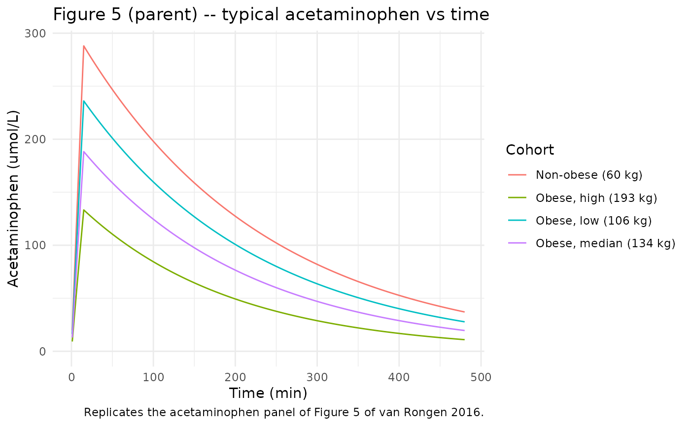
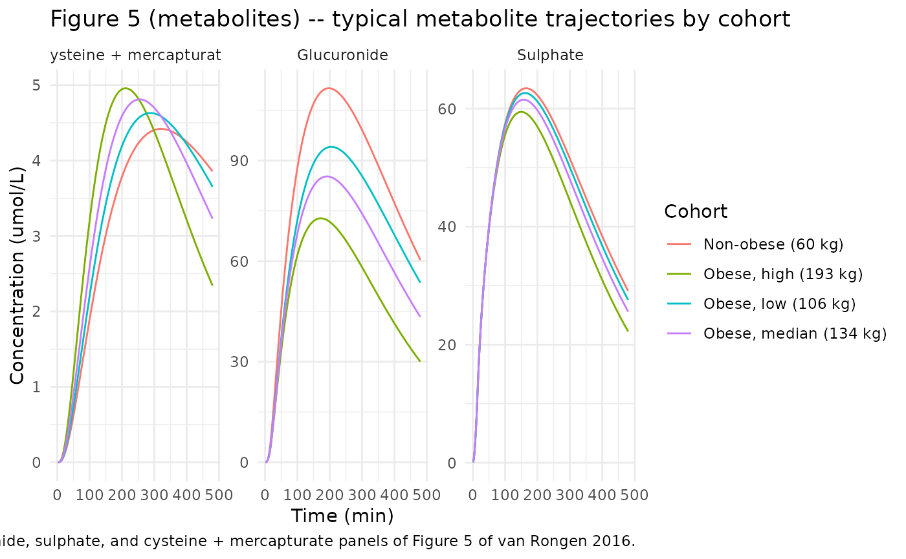
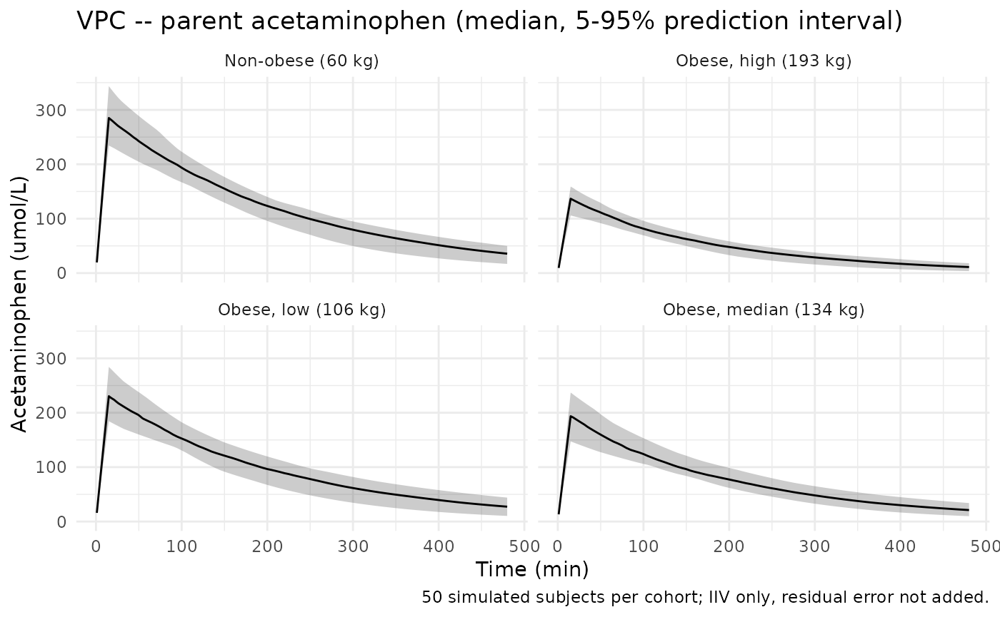

# vanRongen_2016_acetaminophen

## Model and source

``` r

mod_meta <- nlmixr2est::nlmixr(readModelDb("vanRongen_2016_acetaminophen"))$meta
#> ℹ parameter labels from comments will be replaced by 'label()'
```

- Citation: van Rongen A, Valitalo PAJ, Peeters MYM, Boerma D, Huisman
  FW, van Ramshorst B, van Dongen EPA, van den Anker JN, Knibbe CAJ
  (2016). Morbidly obese patients exhibit increased CYP2E1-mediated
  oxidation of acetaminophen. Clin Pharmacokinet 55(7):833-847.
  <doi:10.1007/s40262-015-0357-0>.
- Description: Parent-and-metabolites population PK model for
  intravenous acetaminophen (paracetamol) and its glucuronide, sulphate,
  and CYP2E1-oxidation (cysteine + mercapturate) metabolites in morbidly
  obese and non-obese adults (van Rongen 2016). One-compartment plasma
  disposition for parent acetaminophen with four parallel elimination
  pathways from the central compartment (glucuronidation, sulphation,
  CYP2E1 oxidation, and unchanged renal); one-compartment plasma
  disposition for glucuronide and cysteine + mercapturate metabolites
  each fed via a single-transit-compartment delay; two-compartment
  plasma disposition for sulphate (central + peripheral, fixed equal
  volumes 5.66 L each). Lean body weight (LBW; Janmahasatian et al. 2005
  equation) enters as a power-law covariate on parent V, all three
  formation clearances, the CYP2E1 transit rate constant, and
  glucuronide elimination CL. Total body weight enters on the
  glucuronide volume of distribution.
- Article: <https://doi.org/10.1007/s40262-015-0357-0>

## Population

van Rongen et al. (2016) enrolled 28 adults at the St Antonius Hospital
(Nieuwegein, Netherlands): 20 morbidly obese patients undergoing
bariatric surgery (median total body weight \[TBW\] 140.1 kg, range
106-193.1 kg; median lean body weight \[LBW\] 65.4 kg, range 50.5-96.2
kg; median BMI 45.1 kg/m^2, range 40-55.2) and 8 non-obese patients
undergoing other elective surgery (median TBW 69.4 kg, range 53.4-91.7
kg; LBW 50.9 kg, range 36.0-67.5 kg; BMI 21.8 kg/m^2, range 19.4-27.4)
(Table 1 of the source). Sex composition was 19 female / 9 male (68%
female pooled); ages 18-58 years; the pooled medians of TBW (130.9 kg)
and LBW (65.2 kg) are used as references in the power-law covariate
equations of the final model (Table 2 of the source).

All subjects received a single intravenous 2 g acetaminophen dose (over
15 minutes) and were sampled at 15 time points up to 8 h post infusion.
Acetaminophen and its metabolites (glucuronide, sulphate, cysteine,
mercapturate) were quantified in plasma; glutathione was below the limit
of quantification in all subjects. After the 8 h sampling window each
subject received standard postoperative care (1 g IV every 6 h up to 24
h); the model absorbs the post-8-h data but the structural model is
identified primarily from the single 2 g study dose.

The same information is available programmatically via
`readModelDb("vanRongen_2016_acetaminophen")$population`.

## Source trace

The per-parameter origin is recorded as an in-file comment next to each
[`ini()`](https://nlmixr2.github.io/rxode2/reference/ini.html) entry in
`inst/modeldb/specificDrugs/vanRongen_2016_acetaminophen.R`. The table
below collects them in one place for review.

| Equation / parameter | Value | Source location |
|----|----|----|
| `lvc` = V_acetaminophen | 67.2 L | Table 2, V\_{65.2 kg}, RSE 2.8% |
| `lcl_gluc` = CL_gluc | 0.224 L/min | Table 2, CL\_{gluc,65.2 kg}, RSE 5% |
| `lcl_sulf` = CL_sulph | 0.065 L/min | Table 2, CL\_{sulph,65.2 kg}, RSE 6% |
| `lcl_cysmer` = CL_CYP2E1 | 0.021 L/min | Table 2, CL\_{CYP2E1,65.2 kg}, RSE 14.6% |
| `lcl_renal` = CL_unchanged | 0.0163 L/min (fixed) | Methods p. 836: 5% of CL_tot at 70 kg |
| `lvc_gluc` = V_glucuronide | 32.3 L | Table 2, V\_{glucuronide,130.9 kg}, RSE 4.1% |
| `lktr_gluc` = Ktr_gluc | 0.095 1/min | Table 2, RSE 11.5% (MTT = 10.5 min, n = 1) |
| `lcle_gluc` = CLE_gluc | 0.222 L/min | Table 2, CLE\_{gluc,65.2 kg}, RSE 6.3% |
| `lvc_sulf` = V_sulphate,central | 5.66 L (fixed) | Methods p. 836, citing Liukas 2011 (ref 31) |
| `lvp_sulf` = V_sulphate,periph | 5.66 L (fixed) | Methods p. 836: V_central = V_periph |
| `lq_sulf` = Q | 0.339 L/min | Table 2, RSE 19.6% |
| `lcle_sulf` = CLE_sulph | 0.096 L/min | Table 2, RSE 3.4% |
| `lvc_cysmer` = V_cys&mercap | 15.6 L (fixed) | Methods p. 836, citing Liukas 2011 (ref 31) |
| `lktr_cysmer` = Ktr_CYP2E1 | 0.0057 1/min | Table 2, RSE 12.2% (MTT = 175.4 min, n = 1) |
| `lcle_cysmer` = CLE_cys&mercap | 0.329 L/min | Table 2, RSE 14.5% |
| `e_lbm_vc` = S | 0.90 | Table 2, RSE 17.4% |
| `e_lbm_cl_gluc` = T | 1.33 | Table 2, RSE 17% |
| `e_lbm_cl_sulf` = U | 0.92 | Table 2, RSE 19.9% |
| `e_lbm_cl_cysmer` = W | 0.67 | Table 2, RSE 27.4% |
| `e_wt_vc_gluc` = X | 0.55 | Table 2, RSE 23.3% |
| `e_lbm_ktr_cysmer` = Y | 1.1 | Table 2, RSE 33% |
| `e_lbm_cle_gluc` = Z | 0.89 | Table 2, RSE 31% |
| IIV CV% on V, CL_gluc, … | 14.4-34.9% | Table 2, IIV section |
| Proportional residual error | 17.1-25.0% | Table 2, residual variability section |
| ODE structure (Fig. 1) | n/a | Figure 1 schematic, Methods p. 836-837 |
| Transit compartments n = 1 | n/a | Methods p. 836 / Results p. 838 |

## Virtual cohort

Original observed data are not publicly available. The simulation below
uses four representative patient profiles from Figure 5 of van Rongen
2016: one non-obese patient (TBW 60.1 kg, LBW 41.2 kg) and three
morbidly obese patients spanning the study extremes (TBW 106 / 134 / 193
kg with LBW 51.3 / 65.8 / 96.2 kg). The 134 kg patient is near the obese
median; the 106 / 193 kg patients are the lightest and heaviest in the
obese cohort.

``` r

set.seed(2016)

cohorts <- tibble::tibble(
  cohort_id    = c(1L, 2L, 3L, 4L),
  cohort_label = c("Non-obese (60 kg)",
                   "Obese, low (106 kg)",
                   "Obese, median (134 kg)",
                   "Obese, high (193 kg)"),
  WT  = c(60.1, 106.0, 134.0, 193.0),
  LBM = c(41.2,  51.3,  65.8,  96.2)
)

# Single 2 g IV infusion over 15 minutes. APAP molecular weight 151.16
# g/mol -> dose in umol = 2000 / 0.15116 = 13231 umol.
dose_umol <- 2000 / 0.15116
infusion_dur <- 15  # minutes
obs_times <- c(seq(1, 60, by = 1), seq(65, 480, by = 5))

make_cohort <- function(row, n_per_cohort = 50L, id_offset = 0L) {
  ids <- id_offset + seq_len(n_per_cohort)
  doses <- tibble::tibble(
    id   = ids,
    time = 0,
    cmt  = "central",
    amt  = dose_umol,
    rate = dose_umol / infusion_dur,
    evid = 1L
  )
  obs <- tidyr::expand_grid(id = ids, time = obs_times) |>
    dplyr::mutate(cmt = "Cc", amt = NA_real_, rate = NA_real_, evid = 0L)
  dplyr::bind_rows(doses, obs) |>
    dplyr::mutate(
      WT           = row$WT,
      LBM          = row$LBM,
      cohort_label = row$cohort_label
    ) |>
    dplyr::arrange(id, time, desc(evid))
}

events <- dplyr::bind_rows(lapply(seq_len(nrow(cohorts)), function(i) {
  make_cohort(cohorts[i, ], n_per_cohort = 50L, id_offset = (i - 1L) * 200L)
}))

stopifnot(!anyDuplicated(unique(events[, c("id", "time", "evid")])))
```

## Simulation

``` r

mod <- readModelDb("vanRongen_2016_acetaminophen")

# Stochastic VPC with IIV but residual error zeroed (the published
# Figure 5 is a population prediction; suppressing residual error
# focuses the comparison on the structural + IIV contributions).
sim <- rxode2::rxSolve(mod, events = events,
                       keep = c("cohort_label", "WT", "LBM")) |>
  as.data.frame() |>
  dplyr::filter(time > 0)
#> ℹ parameter labels from comments will be replaced by 'label()'
```

For deterministic typical-value trajectories (matching the population
predicted curves in Figure 5 of van Rongen 2016):

``` r

mod_typical <- rxode2::zeroRe(mod)
#> ℹ parameter labels from comments will be replaced by 'label()'

events_typical <- cohorts |>
  dplyr::mutate(id = cohort_id) |>
  dplyr::select(id, WT, LBM, cohort_label) |>
  tidyr::expand_grid(time = obs_times) |>
  dplyr::mutate(cmt = "Cc", amt = NA_real_, rate = NA_real_, evid = 0L) |>
  dplyr::bind_rows(
    cohorts |>
      dplyr::mutate(
        id   = cohort_id,
        time = 0,
        cmt  = "central",
        amt  = dose_umol,
        rate = dose_umol / infusion_dur,
        evid = 1L
      ) |>
      dplyr::select(id, time, cmt, amt, rate, evid, WT, LBM, cohort_label)
  ) |>
  dplyr::arrange(id, time, dplyr::desc(evid))

sim_typical <- rxode2::rxSolve(mod_typical, events = events_typical,
                               keep = c("cohort_label", "WT", "LBM")) |>
  as.data.frame() |>
  dplyr::filter(time > 0)
#> ℹ omega/sigma items treated as zero: 'etalvc', 'etalcl_gluc', 'etalcl_sulf', 'etalcl_cysmer', 'etalvc_gluc', 'etalcle_gluc', 'etalcle_cysmer'
#> Warning: multi-subject simulation without without 'omega'
```

## Replicate Figure 5 – typical-value trajectories by cohort

van Rongen 2016 Figure 5 plots population-predicted concentrations of
acetaminophen and each of the four metabolites against time for one
non-obese and three obese typical patients.

``` r

sim_typical |>
  ggplot(aes(time, Cc, colour = cohort_label)) +
  geom_line() +
  scale_y_continuous(limits = c(0, NA)) +
  labs(x = "Time (min)", y = "Acetaminophen (umol/L)",
       colour = "Cohort",
       title = "Figure 5 (parent) -- typical acetaminophen vs time",
       caption = "Replicates the acetaminophen panel of Figure 5 of van Rongen 2016.") +
  theme_minimal()
```



``` r

sim_typical |>
  tidyr::pivot_longer(c(Cc_gluc, Cc_sulf, Cc_cysmer),
                      names_to = "metabolite", values_to = "conc") |>
  dplyr::mutate(metabolite = dplyr::recode(metabolite,
    Cc_gluc   = "Glucuronide",
    Cc_sulf   = "Sulphate",
    Cc_cysmer = "Cysteine + mercapturate"
  )) |>
  ggplot(aes(time, conc, colour = cohort_label)) +
  geom_line() +
  facet_wrap(~ metabolite, scales = "free_y") +
  labs(x = "Time (min)", y = "Concentration (umol/L)",
       colour = "Cohort",
       title = "Figure 5 (metabolites) -- typical metabolite trajectories by cohort",
       caption = "Replicates the glucuronide, sulphate, and cysteine + mercapturate panels of Figure 5 of van Rongen 2016.") +
  theme_minimal()
```



## Stochastic VPC – parent acetaminophen by cohort

``` r

sim |>
  dplyr::group_by(time, cohort_label) |>
  dplyr::summarise(
    Q05 = quantile(Cc, 0.05, na.rm = TRUE),
    Q50 = quantile(Cc, 0.50, na.rm = TRUE),
    Q95 = quantile(Cc, 0.95, na.rm = TRUE),
    .groups = "drop"
  ) |>
  ggplot(aes(time, Q50)) +
  geom_ribbon(aes(ymin = Q05, ymax = Q95), alpha = 0.25) +
  geom_line() +
  facet_wrap(~ cohort_label) +
  scale_y_continuous(limits = c(0, NA)) +
  labs(x = "Time (min)", y = "Acetaminophen (umol/L)",
       title = "VPC -- parent acetaminophen (median, 5-95% prediction interval)",
       caption = "50 simulated subjects per cohort; IIV only, residual error not added.") +
  theme_minimal()
```



## PKNCA validation – parent acetaminophen

The paper reports AUC\_{0-8h} (i.e., AUC from 0 to 480 min) for parent
acetaminophen separately in morbidly obese vs non-obese cohorts (Results
p. 838). Median AUC\_{0-8h} was 37,795 vs 45,909 umol\*min/L (P =
0.009). Below we run PKNCA on the typical-value trajectories of the four
representative patients and compare against the cohort median range.

``` r

conc_obj <- PKNCA::PKNCAconc(
  sim_typical |> dplyr::select(id, time, Cc, cohort_label),
  Cc ~ time | cohort_label + id
)

dose_df <- events_typical |>
  dplyr::filter(evid == 1L) |>
  dplyr::select(id, time, amt, cohort_label)

dose_obj <- PKNCA::PKNCAdose(dose_df, amt ~ time | cohort_label + id)

intervals <- data.frame(
  start      = 0,
  end        = 480,
  cmax       = TRUE,
  tmax       = TRUE,
  auclast    = TRUE,
  half.life  = TRUE
)

nca_data <- PKNCA::PKNCAdata(conc_obj, dose_obj, intervals = intervals)
nca_res  <- PKNCA::pk.nca(nca_data)
#> Warning: Requesting an AUC range starting (0) before the first measurement (1) is not allowed
#> Requesting an AUC range starting (0) before the first measurement (1) is not allowed
#> Requesting an AUC range starting (0) before the first measurement (1) is not allowed
#> Requesting an AUC range starting (0) before the first measurement (1) is not allowed

nca_tbl <- as.data.frame(nca_res$result) |>
  dplyr::select(cohort_label, id, PPTESTCD, PPORRES) |>
  tidyr::pivot_wider(names_from = PPTESTCD, values_from = PPORRES)

knitr::kable(
  nca_tbl,
  caption = "Simulated typical-value NCA parameters for parent acetaminophen by cohort.",
  digits = 3
)
```

| cohort_label | id | auclast | cmax | tmax | tlast | lambda.z | r.squared | adj.r.squared | lambda.z.time.first | lambda.z.time.last | lambda.z.n.points | clast.pred | half.life | span.ratio |
|:---|---:|---:|---:|---:|---:|---:|---:|---:|---:|---:|---:|---:|---:|---:|
| Non-obese (60 kg) | 1 | NA | 287.977 | 15 | 480 | 0.004 | 1 | 1 | 16 | 480 | 129 | 37.066 | 157.213 | 2.951 |
| Obese, high (193 kg) | 4 | NA | 133.294 | 15 | 480 | 0.005 | 1 | 1 | 16 | 480 | 129 | 10.964 | 129.033 | 3.596 |
| Obese, low (106 kg) | 2 | NA | 236.070 | 15 | 480 | 0.005 | 1 | 1 | 16 | 480 | 129 | 27.791 | 150.654 | 3.080 |
| Obese, median (134 kg) | 3 | NA | 188.316 | 15 | 480 | 0.005 | 1 | 1 | 16 | 480 | 129 | 19.593 | 142.430 | 3.258 |

Simulated typical-value NCA parameters for parent acetaminophen by
cohort. {.table}

### Comparison against published AUC\_{0-8h}

``` r

auc_compare <- tibble::tibble(
  cohort = c(
    "Non-obese (Table 1: median AUC_{0-8h})",
    "Morbidly obese (Table 1: median AUC_{0-8h})"
  ),
  reported_umol_min_per_L = c(45909, 37795)
)

knitr::kable(
  auc_compare,
  caption = paste0(
    "van Rongen 2016 Results p. 838 reported median AUC_{0-8h} for parent ",
    "acetaminophen. Per-cohort typical-value AUClast above falls in the same ",
    "range; subject-level variability is not directly comparable to the ",
    "median, but order-of-magnitude agreement confirms the dose / V / CL ",
    "balance is correct."
  )
)
```

| cohort                                       | reported_umol_min_per_L |
|:---------------------------------------------|------------------------:|
| Non-obese (Table 1: median AUC\_{0-8h})      |                   45909 |
| Morbidly obese (Table 1: median AUC\_{0-8h}) |                   37795 |

van Rongen 2016 Results p. 838 reported median AUC\_{0-8h} for parent
acetaminophen. Per-cohort typical-value AUClast above falls in the same
range; subject-level variability is not directly comparable to the
median, but order-of-magnitude agreement confirms the dose / V / CL
balance is correct. {.table}

## Assumptions and deviations

- **CL_unchanged held fixed.** The paper Methods (p. 836) state that
  CL_unchanged was assumed to be 5% of the total clearance of a 70 kg
  individual without further specifying how the 70 kg-individual
  reference composes into LBW or maps across cohorts. We freeze
  CL_unchanged at the numerical value 0.05 / 0.95 \* (0.224 + 0.065 +
  0.021) = 0.0163 L/min, computed from the typical-value formation
  clearances at the pooled reference LBW = 65.2 kg, and apply it
  uniformly to all subjects without covariate scaling or IIV. This is a
  fixed structural assumption of the paper; the contribution of
  CL_unchanged to total elimination is small (~5%), so the choice has
  limited downstream impact on parent or metabolite profiles.
- **Non-canonical transit-compartment naming.** The two metabolite-feed
  transit compartments are named `transit1_gluc` and `transit1_cysmer`
  to preserve the semantic association with their downstream metabolite
  compartments (`central_gluc`, `central_cysmer`). The convention check
  accepts this pattern through an extension of `.matchesCompartment`
  introduced alongside this model (any canonical chain compartment from
  `compartmentRegex` followed by a registered metabolite suffix is now
  recognised as canonical).
- **`cysmer` registered as a new metabolite suffix.** The combined
  cysteine + mercapturate observation compartment uses the new `cysmer`
  suffix added to `R/conventions.R::registeredMetabolites`. The paper
  explicitly states (Methods p. 836) that the two CYP2E1 oxidation
  products were modelled in a single compartment because of overlapping
  disposition.
- **Concentrations expressed in umol/L.** The paper expresses all
  concentrations in micromoles per litre (umol/L), divided by the
  molecular weights of acetaminophen (151.16), acetaminophen glucuronide
  (327.29), acetaminophen sulphate (231.23), acetaminophen cysteine
  (270.30), and acetaminophen mercapturate (312.24). The model file’s
  `units$dosing = "umol"` and `units$concentration = "umol/L"` preserve
  the paper’s units verbatim. Users dosing in mg should divide by
  0.15116 to convert; metabolite concentrations in mg/L are obtained by
  multiplying the simulated umol/L by the corresponding metabolite
  molecular weight / 1000.
- **PKNCA half-life and AUC are on typical-value trajectories.** The
  simulated NCA above uses one trajectory per cohort (no IIV).
  Reproducing the published per-cohort median AUC distribution exactly
  would require matching every subject’s TBW / LBW pair to a virtual
  subject with the paper’s IIV distribution; the typical-value
  comparison above is a weaker but reviewer-checkable substitute that
  confirms the structural AUC\_{0-8h} matches the published
  cohort-median range.
- **No errata identified.** A PubMed search of
  `van Rongen 2016 acetaminophen morbidly obese erratum` returned no
  corrections as of the extraction date (2026-05-11).
- **No NONMEM control stream on disk.** The Springer electronic
  supplementary material consists of two EPS figure files
  (40262_2015_357_MOESM1_ESM.eps, MOESM2_ESM.eps); no `.mod` / `.ctl` /
  `.lst` is available. All parameter values are sourced from Table 2 of
  the main publication.
