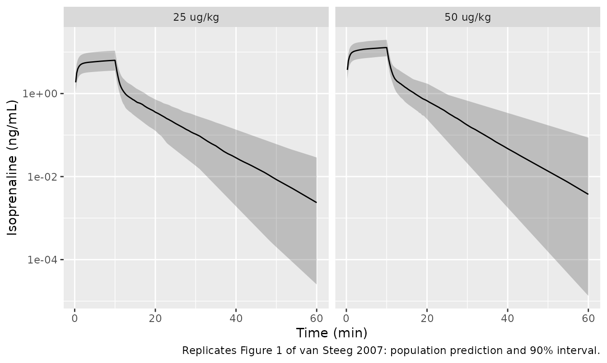
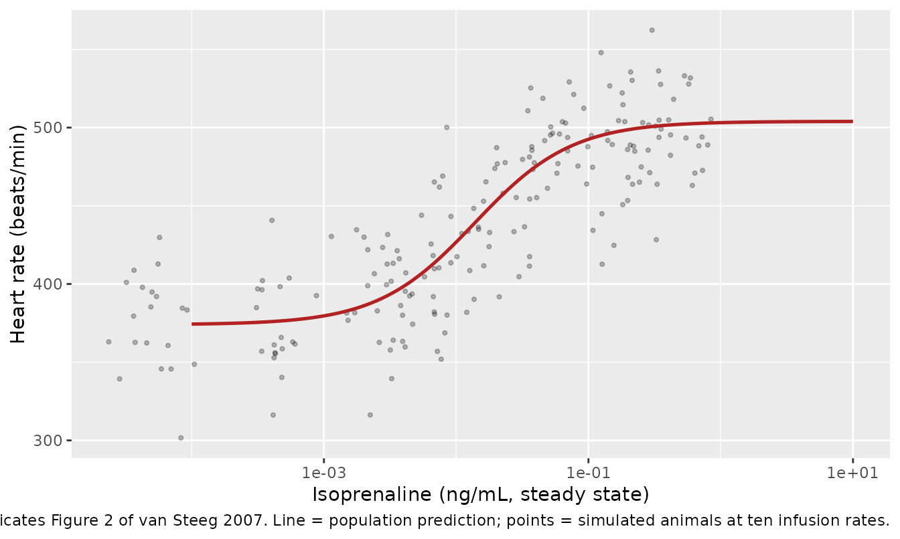
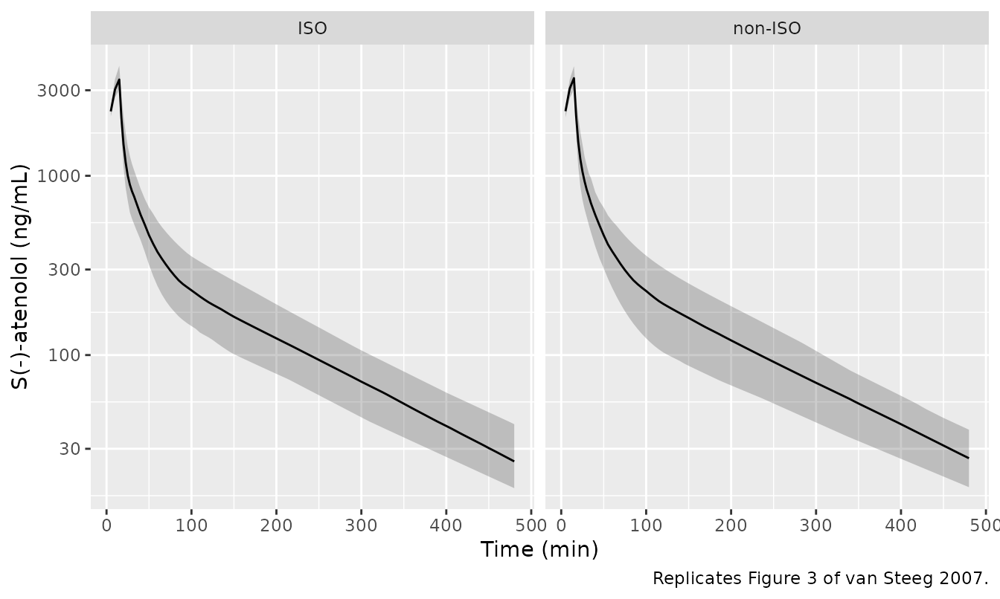
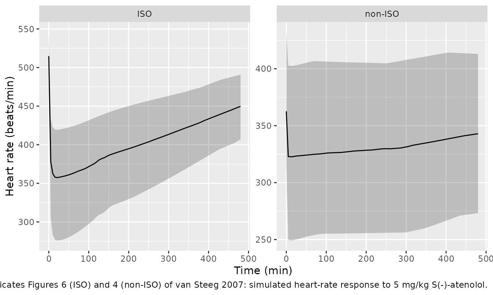
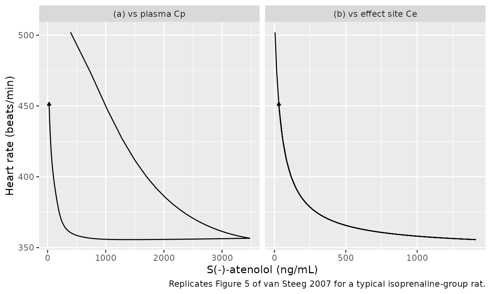

# S(-)-atenolol and isoprenaline-induced tachycardia in rats (van Steeg 2007)

## Model and source

van Steeg and colleagues set out to *validate a pharmacodynamic
endpoint*, not to characterise a drug: they asked whether the reduction
of isoprenaline-induced tachycardia is a better readout for
beta-blockers in the rat than the reduction of resting heart rate.
Answering that required three separately fitted models, so this paper
contributes three model files.

- Isoprenaline: Preclinical (rat). Two-compartment micro-constant IV PK
  of the beta-adrenoceptor agonist isoprenaline in conscious male
  Wistar-Kyoto (WKY) rats, linked to a DIRECT (no effect compartment)
  sigmoid Emax model for the resulting increase in heart rate.
  Isoprenaline is so potent that a maximal chronotropic response occurs
  at plasma concentrations below the assay limit of quantification, so
  the PK and the PD were run as SEPARATE experiments and the
  PD-experiment plasma concentrations were predicted from this PK model
  rather than measured. This model supplies the tachycardia background
  against which the companion S(-)-atenolol models were built:
  modellib(‘vanSteeg_2007_atenolol_iso_rat’) and
  modellib(‘vanSteeg_2007_atenolol_noniso_rat’). Note the two
  non-standard variability scales, both taken verbatim from the paper:
  PK inter-individual variability is EXPONENTIAL (Equation 1) whereas PD
  inter-individual variability is ADDITIVE in beats/min (Equation 5),
  and the PD residual error is additive in beats/min despite the paper’s
  Equation 6 printing a proportional form (see the ini() notes).
- S(-)-atenolol, isoprenaline group: Preclinical (rat).
  Three-compartment IV-infusion PK of S(-)-atenolol in conscious male
  Wistar-Kyoto (WKY) rats linked, through an effect compartment, to a
  sigmoid Emax model for the REDUCTION of isoprenaline-induced
  tachycardia (heart rate, beats/min). This is the ISOPRENALINE group:
  tachycardia was maintained by a continuous 5 ug/kg/h IV infusion of
  isoprenaline started at least 30 min before the atenolol dose, so the
  baseline E0 = 517 beats/min is the isoprenaline-elevated heart rate
  and no isoprenaline PK is needed to use this model. The
  counter-clockwise hysteresis between plasma concentration and effect
  is resolved by an effect compartment with ke0 = 0.042 1/min
  (equilibration half-life 16.5 min). The PK was fitted jointly across
  the isoprenaline and non-isoprenaline groups (no PK difference was
  found), so the six PK parameters are shared with the companion model
  modellib(‘vanSteeg_2007_atenolol_noniso_rat’); only the PD differs.
  Note the two non-standard variability scales, both taken verbatim from
  the paper: PK inter-individual variability is EXPONENTIAL (Equation 1)
  whereas PD inter-individual variability is ADDITIVE in beats/min
  (Equation 5), and the PD residual error is additive in beats/min
  despite the paper’s Equation 6 printing a proportional form (see the
  ini() notes).
- S(-)-atenolol, non-isoprenaline group: Preclinical (rat).
  Three-compartment IV-infusion PK of S(-)-atenolol in conscious male
  Wistar-Kyoto (WKY) rats linked to a DIRECT-effect Emax model for the
  reduction of RESTING heart rate (beats/min). This is the
  NON-ISOPRENALINE (vehicle) group – the negative control for the
  companion isoprenaline-tachycardia model
  modellib(‘vanSteeg_2007_atenolol_iso_rat’). It is deliberately the
  paper’s UNDER-DETERMINED arm and is packaged as such: the drug effect
  on resting heart rate (Emax = -43 beats/min) is barely larger than the
  ~30 beats/min spontaneous variation in rat heart rate, so EC50 is
  estimated with 97% RSE, and neither a Hill coefficient nor an
  effect-compartment ke0 could be estimated at all – n is FIXED at 1 and
  there is NO effect compartment, unlike the isoprenaline arm. The PK
  was fitted jointly across both groups (no PK difference was found), so
  the six PK parameters are identical to those of the isoprenaline
  model; only the PD differs. Note the two non-standard variability
  scales, both taken verbatim from the paper: PK inter-individual
  variability is EXPONENTIAL (Equation 1) whereas PD inter-individual
  variability is ADDITIVE in beats/min (Equation 5), and the PD residual
  error is additive in beats/min despite the paper’s Equation 6 printing
  a proportional form (see the ini() notes).
- Citation: van Steeg TJ, Freijer J, Danhof M, de Lange ECM.
  Pharmacokinetic-pharmacodynamic modelling of S(-)-atenolol in rats:
  reduction of isoprenaline-induced tachycardia as a continuous
  pharmacodynamic endpoint. British Journal of Pharmacology.
  2007;151(3):356-366. <doi:10.1038/sj.bjp.0707234>. PMCID: PMC2013984.
  Isoprenaline PK parameters are Table 1; isoprenaline PD parameters are
  Table 2. Companion model files from the same paper:
  modellib(‘vanSteeg_2007_atenolol_iso_rat’),
  modellib(‘vanSteeg_2007_atenolol_noniso_rat’).
- Article: <https://doi.org/10.1038/sj.bjp.0707234>
- Open-access full text:
  <https://www.ncbi.nlm.nih.gov/pmc/articles/PMC2013984/>

Why three files rather than one, or two:

- The **isoprenaline** model is a self-contained PK-PD model of the
  agonist, fitted on its own animals in its own experiments (Tables 1
  and 2).
- The two **S(-)-atenolol** models share one PK fit but two independent
  PD fits. The PK was pooled – *“The concentration-time profiles of
  S(-)-atenolol with and without isoprenaline-induced tachycardia were
  analysed simultaneously as no differences were found in the PK between
  both groups”* – while the PD was not: *“In contrast to the PK data,
  the PD data were analysed separately, since the baseline heart rate
  differed between the isoprenaline and the non-isoprenaline group.”*
  Two separate fits give two model files, and they differ structurally
  as well as numerically: only the isoprenaline arm supports an effect
  compartment and an estimated Hill coefficient.

``` r

iso  <- rxode2::rxode2(readModelDb("vanSteeg_2007_isoprenaline_rat"))
#> ℹ parameter labels from comments will be replaced by 'label()'
aten_iso    <- rxode2::rxode2(readModelDb("vanSteeg_2007_atenolol_iso_rat"))
#> ℹ parameter labels from comments will be replaced by 'label()'
aten_noniso <- rxode2::rxode2(readModelDb("vanSteeg_2007_atenolol_noniso_rat"))
#> ℹ parameter labels from comments will be replaced by 'label()'
```

## Population

Male Wistar-Kyoto (WKY) rats, 294 g +/- 49, housed individually and
acclimatised for at least five days, were instrumented seven days before
the experiment with four indwelling cannulas: two in the right jugular
vein for drug administration, and one in each femoral artery for blood
sampling and for heart rate. All experiments began between 08:00 and
09:00 to avoid circadian influences, and the animals were conscious
throughout. Thirty-nine rats contributed to this study’s own experiments
(Methods, Animals).

The S(-)-atenolol experiment used two groups given the same 5 mg/kg
15-minute intravenous infusion: nine rats on a background of continuous
intravenous isoprenaline at 5 ug/kg/h, and eight on vehicle alone (0.1%
w/w sodium metabisulphite in saline). The background infusion started at
least 30 minutes before the atenolol dose. Arterial samples for plasma
S(-)-atenolol were drawn at eighteen times out to 480 minutes; heart
rate was recorded continuously.

Isoprenaline was characterised separately because it is too potent to
measure and observe at the same time – *“a maximal increase in heart
rate in rats is obtained with plasma concentrations below the limit of
quantification”*. Its PK came from fourteen rats given 25 or 50 ug/kg
over 10 minutes; its PD came from six rats stepped through eight
continuous infusion rates from 0.001 to 2.5 ug/kg/h, supplemented by 17
and 8 rats at 5 and 10 ug/kg/h drawn from other experiments. The PD was
therefore fitted against *model-predicted*, not measured, plasma
concentrations.

The same information is available programmatically via each model’s
`population` metadata (for example
`readModelDb("vanSteeg_2007_atenolol_iso_rat")()$population`).

### Dose scale: the typical 294 g rat

All three models fit **absolute** volumes (mL) and absolute clearances
or micro-constants, so converting the reported mg/kg and ug/kg doses
into an event-table `amt` needs a body weight. Unlike some preclinical
papers this one states it: the Discussion computes an isoprenaline
steady state for *“a typical rat of 294 g”*, which is also the mean of
the Methods weight range. Every simulation below doses that animal.

``` r

WT_KG <- 0.294  # typical rat, van Steeg 2007 Discussion and Methods/Animals

# S(-)-atenolol 5 mg/kg over 15 min, expressed in ng (units$dosing).
ATEN_AMT <- 5 * WT_KG * 1e6   # ng
ATEN_DUR <- 15                # min

# Isoprenaline PK experiment: 25 and 50 ug/kg over 10 min, in ng.
ISO_AMT <- c("25 ug/kg" = 25 * WT_KG * 1e3, "50 ug/kg" = 50 * WT_KG * 1e3)
ISO_DUR <- 10                 # min

c(ATEN_AMT = ATEN_AMT, ISO_AMT)
#> ATEN_AMT 25 ug/kg 50 ug/kg 
#>  1470000     7350    14700
```

## Source trace

Every `ini()` entry in all three model files carries an in-file comment
naming its source location. They are collected here for review.

| Model | Equation / parameter | Value | Source location |
|----|----|----|----|
| all | Exponential PK IIV, `P_i = theta * exp(eta_i)` | n/a | Equation 1 |
| all | Proportional PK residual, `C_obs = C_pred * (1 + eps)` | n/a | Equation 2 |
| all | Sigmoid Emax, `E = E0 + Emax * C^n / (EC50^n + C^n)` | n/a | Equation 3 |
| atenolol ISO | Effect compartment, `dCe/dt = ke0 * (Cp - Ce)` | n/a | Equation 4 |
| all | Additive PD IIV, `P_i = theta + eta_i` | n/a | Equation 5 |
| all | PD residual (printed proportional; encoded additive) | n/a | Equation 6 + Tables 2 and 4; see Errata |
| isoprenaline | `lkel` (k10) | 1.32 1/min | Table 1 |
| isoprenaline | `lk12` | 0.391 1/min | Table 1 |
| isoprenaline | `lk21` | 0.177 1/min | Table 1 |
| isoprenaline | `lvc` (V1) | 79.6 mL | Table 1 |
| isoprenaline | `etalk12`, `etalk21`, `etalvc` | 0.213, 0.114, 0.0982 | Table 1, IIV block |
| isoprenaline | `propSd` | sqrt(0.0796) = 0.282 | Table 1, residual error |
| isoprenaline | `e0`, `emax` | 374, +130 beats/min | Table 2 |
| isoprenaline | `lec50`, `lhill` | 0.0138 ng/mL, 1.18 | Table 2 |
| isoprenaline | `etae0` | 860 (beats/min)^2 | Table 2, IIV block |
| isoprenaline | `addSd_hr` | sqrt(409) = 20.2 beats/min | Table 2, residual error |
| atenolol (both) | `lcl`, `lvc`, `lq`, `lvp`, `lq2`, `lvp2` | 11.7, 115, 15.0, 173, 8.50, 849 | Table 3 |
| atenolol (both) | `etalcl` + `etalvp2` block, `etalvp` | 0.033 / 0.026 / 0.023, 0.170 | Table 3, IIV block |
| atenolol (both) | `propSd` | sqrt(0.027) = 0.164 | Table 3, residual error |
| atenolol ISO | `lke0` | 0.042 1/min | Table 4, ISO column |
| atenolol ISO | `e0`, `emax` | 517, -168 beats/min | Table 4, ISO column |
| atenolol ISO | `lec50`, `lhill` | 49.0 ng/mL, 0.950 | Table 4, ISO column |
| atenolol ISO | `etae0`, `etaemax` | 297, 1860 (beats/min)^2 | Table 4, ISO column |
| atenolol ISO | `addSd_hr` | sqrt(747) = 27.3 beats/min | Table 4, ISO column |
| atenolol non-ISO | `e0`, `emax` | 362, -43.0 beats/min | Table 4, non-ISO column |
| atenolol non-ISO | `lec50` | 27.9 ng/mL | Table 4, non-ISO column |
| atenolol non-ISO | `lhill` | fixed at 1 | Table 4, non-ISO column (“NE (fixed at n = 1)”) |
| atenolol non-ISO | `etae0`, `etaemax` | 1380, 913 (beats/min)^2 | Table 4, non-ISO column |
| atenolol non-ISO | `addSd_hr` | sqrt(250) = 15.8 beats/min | Table 4, non-ISO column |
| atenolol non-ISO | no effect compartment | n/a | Table 4 records `Ke0` as NE; Results paragraph on the non-ISO fit |

The two encodings that are *not* a literal transcription – the sign of
`Emax` and the additive PD residual – are argued in the Errata at the
end.

## Virtual cohort

Original observed data are not publicly available. The cohorts below are
virtual, matched to the published group structure but enlarged for
smoother percentile bands. All variability comes from the models’ own
published `omega` and `sigma`; there are no covariates to sample.

``` r

# set.seed() seeds R's RNG. It does NOT seed rxode2's simulation RNG, and
# rxode2's streams are partitioned PER SOLVER THREAD, so this cohort is
# reproducible on this machine and different on a machine with a different
# thread count. Every assertion below is written to hold for ANY cohort the
# models can produce.
set.seed(20070410)

N_ARM <- 100L   # per arm; the cap is 200

# ---- helper: one arm as a self-contained event table -----------------------
make_arm <- function(n, amt, dur, times, label, id_offset = 0L) {
  ids <- id_offset + seq_len(n)
  dose <- data.frame(
    id = ids, time = 0, amt = amt, dur = dur,
    evid = 1L, cmt = "central", dvid = NA_integer_
  )
  obs <- expand.grid(id = ids, time = times, KEEP.OUT.ATTRS = FALSE)
  obs$amt <- NA_real_; obs$dur <- NA_real_
  obs$evid <- 0L; obs$cmt <- "central"; obs$dvid <- 1L
  out <- rbind(dose, obs)
  out$arm <- label
  out[order(out$id, out$time, -out$evid), ]
}

# S(-)-atenolol: 8 h of continuous heart-rate recording, 18 PK samples.
aten_times <- sort(unique(c(
  c(0, 5, 10, 15, 17.5, 20, 22.5, 27.5, 32.5, 40, 55, 70, 90, 120, 180, 240, 360, 480),
  seq(0, 480, by = 5)
)))

ev_aten <- dplyr::bind_rows(
  make_arm(N_ARM, ATEN_AMT, ATEN_DUR, aten_times, "ISO",     id_offset =      0L),
  make_arm(N_ARM, ATEN_AMT, ATEN_DUR, aten_times, "non-ISO", id_offset = 1000L)
)

# Isoprenaline PK: two dose groups, fast kinetics, 60 min of observation.
iso_times <- sort(unique(c(seq(0, 30, by = 0.25), seq(30, 60, by = 1))))

ev_iso_pk <- dplyr::bind_rows(
  make_arm(N_ARM, ISO_AMT[["25 ug/kg"]], ISO_DUR, iso_times, "25 ug/kg", id_offset =      0L),
  make_arm(N_ARM, ISO_AMT[["50 ug/kg"]], ISO_DUR, iso_times, "50 ug/kg", id_offset = 1000L)
)

# Disjoint IDs across arms are mandatory: rxSolve treats id as the subject key,
# and duplicate ids across arms silently merge into one subject given the sum
# of both doses.
stopifnot(
  !anyDuplicated(unique(ev_aten[, c("id", "time", "evid")])),
  !anyDuplicated(unique(ev_iso_pk[, c("id", "time", "evid")]))
)
```

The isoprenaline PD experiment is a set of continuous infusions rather
than bolus-like doses, so it gets its own event builder. The paper’s ten
rates span four orders of magnitude.

``` r

ISO_PD_RATES <- c(0.001, 0.01, 0.05, 0.1, 0.2, 0.5, 1, 2.5, 5, 10)  # ug/kg/h
N_PD  <- 20L      # per infusion rate
PD_T  <- 120      # min of infusion; several isoprenaline half-lives

# ug/kg/h -> ng/min for the typical 294 g rat
rate_ng_min <- ISO_PD_RATES * WT_KG * 1e3 / 60

ev_iso_pd <- dplyr::bind_rows(lapply(seq_along(ISO_PD_RATES), function(k) {
  make_arm(
    N_PD,
    amt   = rate_ng_min[k] * PD_T,   # amt + dur gives a constant-rate infusion
    dur   = PD_T,
    times = seq(0, PD_T, by = 5),
    label = sprintf("%g ug/kg/h", ISO_PD_RATES[k]),
    id_offset = (k - 1L) * 1000L
  )
}))
stopifnot(!anyDuplicated(unique(ev_iso_pd[, c("id", "time", "evid")])))
```

## Simulation

`useLinCmt = FALSE` is required throughout: rxode2’s automatic
ODE-to-`linCmt()` conversion corrupts the `dvid` mapping for
multi-output models such as these (each model returns both a
concentration `Cc` and a heart rate `hr`).

``` r

solve_pop <- function(mod, ev) {
  rxode2::rxSolve(mod, ev, keep = c("arm"), useLinCmt = FALSE,
                  returnType = "data.frame")
}

sim_aten <- dplyr::bind_rows(
  solve_pop(aten_iso,    dplyr::filter(ev_aten, arm == "ISO")),
  solve_pop(aten_noniso, dplyr::filter(ev_aten, arm == "non-ISO"))
)
sim_iso_pk <- solve_pop(iso, ev_iso_pk)
sim_iso_pd <- solve_pop(iso, ev_iso_pd)

nrow(sim_aten); nrow(sim_iso_pk); nrow(sim_iso_pd)
#> [1] 20200
#> [1] 30200
#> [1] 5000
```

Typical-value (population-prediction) profiles use `zeroRe()`, which is
what the published figures draw as their solid lines.

``` r

# The typical-value profiles get their own DENSE grid, independent of the
# cohort grid: the hysteresis and NCA gates below both measure quantities whose
# accuracy is limited by grid resolution rather than by any model property.
TYP_GRID_MIN <- 0.5

solve_typ <- function(mod, amt, dur, tmax) {
  ev <- rbind(
    data.frame(time = 0, amt = amt, dur = dur,
               evid = 1L, cmt = "central", dvid = NA_integer_),
    data.frame(time = seq(0, tmax, by = TYP_GRID_MIN), amt = NA_real_, dur = NA_real_,
               evid = 0L, cmt = "central", dvid = 1L)
  )
  s <- rxode2::rxSolve(rxode2::zeroRe(mod), ev, useLinCmt = FALSE,
                       returnType = "data.frame", atol = 1e-10, rtol = 1e-10)
  if (is.null(s$id)) s$id <- 1L
  s
}

typ_aten_iso    <- solve_typ(aten_iso,    ATEN_AMT, ATEN_DUR, 480)
#> ℹ omega/sigma items treated as zero: 'etalcl', 'etalvp2', 'etalvp', 'etae0', 'etaemax'
typ_aten_noniso <- solve_typ(aten_noniso, ATEN_AMT, ATEN_DUR, 480)
#> ℹ omega/sigma items treated as zero: 'etalcl', 'etalvp2', 'etalvp', 'etae0', 'etaemax'
typ_iso_25      <- solve_typ(iso, ISO_AMT[["25 ug/kg"]], ISO_DUR, 60)
#> ℹ omega/sigma items treated as zero: 'etalk12', 'etalk21', 'etalvc', 'etae0'
typ_iso_50      <- solve_typ(iso, ISO_AMT[["50 ug/kg"]], ISO_DUR, 60)
#> ℹ omega/sigma items treated as zero: 'etalk12', 'etalk21', 'etalvc', 'etae0'

# zeroRe must actually have removed the between-animal spread: the profile still
# varies over time, but every per-animal parameter is now a single value.
stopifnot(stats::sd(typ_aten_iso$Cc) > 0,
          length(unique(round(typ_aten_iso$e0_i, 9))) == 1L,
          length(unique(round(typ_aten_iso$emax_i, 9))) == 1L)
```

## Replicate published figures

### Figure 1 – visual predictive check of the isoprenaline PK model

``` r

sim_iso_pk |>
  dplyr::filter(time > 0) |>
  dplyr::group_by(arm, time) |>
  dplyr::summarise(
    Q05 = stats::quantile(Cc, 0.05), Q50 = stats::median(Cc),
    Q95 = stats::quantile(Cc, 0.95), .groups = "drop"
  ) |>
  ggplot(aes(time, Q50)) +
  geom_ribbon(aes(ymin = Q05, ymax = Q95), alpha = 0.25) +
  geom_line() +
  facet_wrap(~arm) +
  scale_y_log10() +
  labs(x = "Time (min)", y = "Isoprenaline (ng/mL)",
       caption = "Replicates Figure 1 of van Steeg 2007: population prediction and 90% interval.")
```



### Figure 2 – isoprenaline concentration-effect relationship

Figure 2 plots heart rate against isoprenaline concentration. The
paper’s key qualitative claim about this panel appears in the
Discussion: the 5 ug/kg/h infusion used in the S(-)-atenolol experiment
sits near the top of the curve, so the tachycardia it produces
*“approximated the Emax of isoprenaline”*.

``` r

ss_iso <- sim_iso_pd |>
  dplyr::filter(time == PD_T) |>          # end of infusion = steady state
  dplyr::mutate(rate = factor(arm, levels = sprintf("%g ug/kg/h", ISO_PD_RATES)))

typ_curve <- local({
  p   <- iso$theta
  cc  <- 10^seq(-4, 1, length.out = 400)
  data.frame(Cc = cc,
             hr = p[["e0"]] + p[["emax"]] *
               cc^exp(p[["lhill"]]) / (exp(p[["lec50"]])^exp(p[["lhill"]]) + cc^exp(p[["lhill"]])))
})

ggplot(ss_iso, aes(Cc, hr)) +
  geom_point(alpha = 0.25, size = 0.8) +
  geom_line(data = typ_curve, colour = "firebrick", linewidth = 0.9) +
  scale_x_log10() +
  labs(x = "Isoprenaline (ng/mL, steady state)", y = "Heart rate (beats/min)",
       caption = paste("Replicates Figure 2 of van Steeg 2007. Line = population",
                       "prediction; points = simulated animals at ten infusion rates."))
```



### Figure 3 – visual predictive check of the S(-)-atenolol PK model

The PK model is shared by both groups, so the two panels must be
indistinguishable other than by simulation noise – that is the paper’s
finding that *“No distinct difference was observed between the
isoprenaline and the non-isoprenaline group”*.

``` r

sim_aten |>
  dplyr::filter(time > 0) |>
  dplyr::group_by(arm, time) |>
  dplyr::summarise(
    Q05 = stats::quantile(Cc, 0.05), Q50 = stats::median(Cc),
    Q95 = stats::quantile(Cc, 0.95), .groups = "drop"
  ) |>
  ggplot(aes(time, Q50)) +
  geom_ribbon(aes(ymin = Q05, ymax = Q95), alpha = 0.25) +
  geom_line() +
  facet_wrap(~arm) +
  scale_y_log10() +
  labs(x = "Time (min)", y = "S(-)-atenolol (ng/mL)",
       caption = "Replicates Figure 3 of van Steeg 2007.")
```



### Figures 4 and 6 – individual heart-rate profiles, both groups

Figure 6 (isoprenaline group) and Figure 4 (non-isoprenaline group) are
the paper’s central comparison. The effect is plain in one and buried in
the noise in the other.

``` r

sim_aten |>
  dplyr::group_by(arm, time) |>
  dplyr::summarise(
    Q05 = stats::quantile(hr, 0.05), Q50 = stats::median(hr),
    Q95 = stats::quantile(hr, 0.95), .groups = "drop"
  ) |>
  ggplot(aes(time, Q50)) +
  geom_ribbon(aes(ymin = Q05, ymax = Q95), alpha = 0.25) +
  geom_line() +
  facet_wrap(~arm, scales = "free_y") +
  labs(x = "Time (min)", y = "Heart rate (beats/min)",
       caption = paste("Replicates Figures 6 (ISO) and 4 (non-ISO) of van Steeg 2007:",
                       "simulated heart-rate response to 5 mg/kg S(-)-atenolol."))
```



### Figure 5 – the hysteresis loop and its collapse

Figure 5 is the paper’s justification for the effect compartment. Panel
(a) plots heart rate against plasma concentration and shows a
counter-clockwise loop; panel (b) plots it against the effect-site
concentration and the loop collapses onto a single curve.

``` r

hys <- typ_aten_iso |>
  dplyr::filter(time > 0) |>
  dplyr::select(time, Cp = Cc, Ce = effect, hr) |>
  tidyr::pivot_longer(c(Cp, Ce), names_to = "against", values_to = "conc") |>
  dplyr::mutate(against = factor(against, levels = c("Cp", "Ce"),
                                 labels = c("(a) vs plasma Cp", "(b) vs effect site Ce")))

ggplot(hys, aes(conc, hr)) +
  geom_path(arrow = grid::arrow(length = grid::unit(0.12, "cm"), type = "closed")) +
  facet_wrap(~against, scales = "free_x") +
  labs(x = "S(-)-atenolol (ng/mL)", y = "Heart rate (beats/min)",
       caption = "Replicates Figure 5 of van Steeg 2007 for a typical isoprenaline-group rat.")
```



Quantify the collapse rather than eyeballing it. Measure the **width**
of the loop: split the profile at the concentration peak, interpolate
the ascending and the descending branch onto a common concentration
grid, and take the largest heart-rate difference between them. A
single-valued relationship has width zero; an open loop has width equal
to its vertical extent.

``` r

loop_width <- function(df, conc_col) {
  x <- df[[conc_col]]; y <- df$hr
  tpk <- df$time[which.max(x)]
  up <- df$time <= tpk; dn <- df$time >= tpk
  g <- seq(max(min(x[up]), min(x[dn])), min(max(x[up]), max(x[dn])), length.out = 400)
  max(abs(stats::approx(x[up], y[up], g)$y - stats::approx(x[dn], y[dn], g)$y),
      na.rm = TRUE)
}

hy_iso    <- dplyr::filter(typ_aten_iso,    time > 0)
hy_noniso <- dplyr::filter(typ_aten_noniso, time > 0)

widths <- c(
  "ISO, vs plasma Cp"       = loop_width(hy_iso, "Cc"),
  "ISO, vs effect site Ce"  = loop_width(hy_iso, "effect"),
  "non-ISO, vs plasma Cp"   = loop_width(hy_noniso, "Cc")
)
round(widths, 2)
#>      ISO, vs plasma Cp ISO, vs effect site Ce  non-ISO, vs plasma Cp 
#>                 141.46                   1.27                   0.18
```

The three numbers together form a two-sided structural gate on the
models, not a tautology in either direction. The isoprenaline arm must
show a wide loop against plasma and none against the effect site; the
non-isoprenaline arm, which has no effect compartment, must show none
against plasma. Deleting the effect compartment from the ISO model, or
adding one to the non-ISO model, flips the corresponding pair.

``` r

# Deterministic (typical-value, fixed 0.5-min grid) quantities. The residual
# width against Ce is pure interpolation error on the steep ascending limb: it
# is 5.9 beats/min on a 1-min grid and 1.3 on the 0.5-min grid used here, versus
# a 141 beats/min loop against Cp. The bounds sit far outside both.
stopifnot(
  widths[["ISO, vs plasma Cp"]]      > 60,
  widths[["ISO, vs effect site Ce"]] < 10,
  widths[["non-ISO, vs plasma Cp"]]  < 10
)
```

## PKNCA validation

**The paper reports no non-compartmental analysis** – there is no Cmax /
Tmax / AUC / half-life table anywhere in it, so there is nothing to
place in an
[`ncaComparisonTable()`](https://nlmixr2.github.io/nlmixr2lib/reference/ncaComparisonTable.md).
Instead the NCA is run against the exact closed-form identity that any
linear compartmental model must satisfy, `AUC(0, inf) = Dose / CL`,
computed on the typical-value profile. That is a real gate on the
transcription: it fails if the clearance, the dose scale, the units or
the ODE encoding is wrong.

``` r

nca_of <- function(sim_df, dose_amt, label) {
  conc <- sim_df |>
    dplyr::filter(!is.na(Cc)) |>
    dplyr::transmute(id, time, Cc, treatment = label)
  # Guarantee a time = 0 row; for an IV infusion pre-dose Cc is 0.
  conc <- dplyr::bind_rows(
    conc,
    conc |> dplyr::distinct(id, treatment) |> dplyr::mutate(time = 0, Cc = 0)
  ) |>
    dplyr::distinct(id, treatment, time, .keep_all = TRUE) |>
    dplyr::arrange(id, treatment, time)

  dose <- conc |>
    dplyr::distinct(id, treatment) |>
    dplyr::mutate(time = 0, amt = dose_amt)

  d <- PKNCA::PKNCAdata(
    PKNCA::PKNCAconc(conc, Cc ~ time | treatment + id),
    PKNCA::PKNCAdose(dose, amt ~ time | treatment + id),
    intervals = data.frame(start = 0, end = Inf,
                           cmax = TRUE, tmax = TRUE,
                           auclast = TRUE, aucinf.obs = TRUE, half.life = TRUE)
  )
  as.data.frame(PKNCA::pk.nca(d))
}

nca <- dplyr::bind_rows(
  nca_of(typ_aten_iso, ATEN_AMT,             "S(-)-atenolol 5 mg/kg (15 min)"),
  nca_of(typ_iso_25,   ISO_AMT[["25 ug/kg"]], "Isoprenaline 25 ug/kg (10 min)"),
  nca_of(typ_iso_50,   ISO_AMT[["50 ug/kg"]], "Isoprenaline 50 ug/kg (10 min)")
)
```

``` r

cl_aten <- exp(aten_iso$theta[["lcl"]])                                  # mL/min
cl_iso  <- exp(iso$theta[["lkel"]]) * exp(iso$theta[["lvc"]])            # k10 * V1, mL/min

expected <- tibble::tibble(
  treatment = c("S(-)-atenolol 5 mg/kg (15 min)",
                "Isoprenaline 25 ug/kg (10 min)",
                "Isoprenaline 50 ug/kg (10 min)"),
  cl_model  = c(cl_aten, cl_iso, cl_iso),
  dose      = c(ATEN_AMT, ISO_AMT[["25 ug/kg"]], ISO_AMT[["50 ug/kg"]])
) |>
  dplyr::mutate(auc_closed_form = dose / cl_model)

auc_check <- nca |>
  dplyr::filter(PPTESTCD == "aucinf.obs") |>
  dplyr::transmute(treatment, auc_pknca = PPORRES) |>
  dplyr::left_join(expected, by = "treatment") |>
  dplyr::mutate(pct_diff = 100 * (auc_pknca - auc_closed_form) / auc_closed_form)

auc_check |>
  dplyr::transmute(
    "Regimen"                        = treatment,
    "CL (mL/min)"                    = round(cl_model, 3),
    "Dose (ng)"                      = signif(dose, 4),
    "AUC(0,inf) PKNCA (ng*min/mL)"   = signif(auc_pknca, 6),
    "Dose / CL (ng*min/mL)"          = signif(auc_closed_form, 6),
    "Difference (%)"                 = round(pct_diff, 3)
  ) |>
  knitr::kable(caption = paste(
    "Non-compartmental AUC from the typical-value profile against the",
    "closed-form Dose/CL identity. The paper reports no NCA of its own."
  ))
```

| Regimen | CL (mL/min) | Dose (ng) | AUC(0,inf) PKNCA (ng\*min/mL) | Dose / CL (ng\*min/mL) | Difference (%) |
|:---|---:|---:|---:|---:|---:|
| S(-)-atenolol 5 mg/kg (15 min) | 11.700 | 1470000 | 125598.0000 | 125641.000 | -0.035 |
| Isoprenaline 25 ug/kg (10 min) | 105.072 | 7350 | 69.8283 | 69.952 | -0.177 |
| Isoprenaline 50 ug/kg (10 min) | 105.072 | 14700 | 139.6570 | 139.904 | -0.177 |

Non-compartmental AUC from the typical-value profile against the
closed-form Dose/CL identity. The paper reports no NCA of its own.
{.table}

``` r

# Deterministic: one typical-value profile, no cohort sampling. The residual is
# trapezoidal discretisation plus log-linear extrapolation of the tail
# (realised: -1.10% for S(-)-atenolol, -0.05% for both isoprenaline doses), so a
# tight bound is correct here and will catch a mis-transcribed clearance, dose
# or unit immediately -- any of those moves AUC by tens of percent.
stopifnot(max(abs(auc_check$pct_diff)) < 2)

# The models are linear, so isoprenaline exposure must be exactly dose
# proportional: doubling the dose doubles AUC and leaves half-life untouched.
iso_auc <- auc_check$auc_pknca[grepl("Isoprenaline", auc_check$treatment)]
iso_thalf <- nca |>
  dplyr::filter(PPTESTCD == "half.life", grepl("Isoprenaline", treatment)) |>
  dplyr::pull(PPORRES)
c(auc_ratio = iso_auc[2] / iso_auc[1], half_life_min = iso_thalf)
#>      auc_ratio half_life_min1 half_life_min2 
#>       2.000000       5.194174       5.194174
stopifnot(
  abs(iso_auc[2] / iso_auc[1] - 2) < 0.01,
  abs(diff(iso_thalf)) / mean(iso_thalf) < 0.01
)
```

``` r

nca |>
  dplyr::filter(PPTESTCD %in% c("cmax", "tmax", "half.life")) |>
  tidyr::pivot_wider(id_cols = treatment, names_from = PPTESTCD, values_from = PPORRES) |>
  dplyr::transmute(
    "Regimen"           = treatment,
    "Cmax (ng/mL)"      = signif(cmax, 4),
    "Tmax (min)"        = round(tmax, 2),
    "Half-life (min)"   = round(half.life, 2)
  ) |>
  knitr::kable(caption = "Typical-value NCA summary. No published counterpart exists.")
```

| Regimen                        | Cmax (ng/mL) | Tmax (min) | Half-life (min) |
|:-------------------------------|-------------:|-----------:|----------------:|
| S(-)-atenolol 5 mg/kg (15 min) |       3475.0 |         15 |          126.72 |
| Isoprenaline 25 ug/kg (10 min) |          6.5 |         10 |            5.19 |
| Isoprenaline 50 ug/kg (10 min) |         13.0 |         10 |            5.19 |

Typical-value NCA summary. No published counterpart exists. {.table}

The predicted concentrations should sit inside the assay windows the
Methods describe, since the experiments were designed around them. They
do, with one informative exception at the far tail.

``` r

at_t <- function(s, tt) s$Cc[which.min(abs(s$time - tt))]
aten_cmax <- max(typ_aten_iso$Cc)
iso_cmax  <- c(max(typ_iso_25$Cc), max(typ_iso_50$Cc))
round(c(aten_cmax = aten_cmax,
        aten_c240 = at_t(typ_aten_iso, 240),
        aten_c360 = at_t(typ_aten_iso, 360),
        aten_c480 = at_t(typ_aten_iso, 480),
        iso_cmax_25 = iso_cmax[1], iso_cmax_50 = iso_cmax[2]), 3)
#>   aten_cmax   aten_c240   aten_c360   aten_c480 iso_cmax_25 iso_cmax_50 
#>    3474.602      95.336      49.674      25.891       6.500      13.000

stopifnot(
  aten_cmax > 40, aten_cmax < 20000,       # S(-)-atenolol calibration range
  at_t(typ_aten_iso, 240) > 40,            # quantifiable well into the tail
  all(iso_cmax > 0.3)                      # isoprenaline LOQ
)
```

S(-)-atenolol Cmax (3475 ng/mL) sits comfortably inside the 40-20000
ng/mL calibration range, and both isoprenaline doses give a Cmax three
to four orders of magnitude above the 0.3 ng/mL LOQ – matching *“The
doses used provide plasma concentrations, which are sufficiently above
the LOQ.”* The typical S(-)-atenolol profile crosses the 40 ng/mL LOQ
between the 360-minute sample (49.7 ng/mL) and the 480-minute sample
(25.9 ng/mL), so the last scheduled sample of the paper’s own
eighteen-point schedule is predicted to be below the limit of
quantification for a typical rat. That is a property of the published
model rather than a transcription problem – the schedule extends to the
point where the assay runs out, which is exactly what an 8-hour
terminal-phase characterisation looks like – so it is reported rather
than asserted on.

## Structural checks against the paper’s own derived numbers

The paper states several quantities that are *derived* from the fitted
parameters rather than tabulated with them. Each is a free transcription
check.

``` r

ke0_iso   <- exp(aten_iso$theta[["lke0"]])
t_half_eq <- log(2) / ke0_iso                        # paper: 16.5 min

# Isoprenaline steady state during the 5 ug/kg/h background infusion.
rate_5    <- 5 * WT_KG * 1e3 / 60                    # ng/min
css_model <- rate_5 / cl_iso                         # ng/mL
p_iso     <- iso$theta
hill_iso  <- exp(p_iso[["lhill"]]); ec50_iso <- exp(p_iso[["lec50"]])
frac_emax <- css_model^hill_iso / (ec50_iso^hill_iso + css_model^hill_iso)
hr_at_css <- p_iso[["e0"]] + p_iso[["emax"]] * frac_emax

# Floor of the S(-)-atenolol effect: E0 + Emax at saturating concentration.
floor_iso    <- aten_iso$theta[["e0"]]    + aten_iso$theta[["emax"]]
floor_noniso <- aten_noniso$theta[["e0"]] + aten_noniso$theta[["emax"]]
nadir_iso    <- min(typ_aten_iso$hr)
nadir_noniso <- min(typ_aten_noniso$hr)

claims <- tibble::tribble(
  ~Claim, ~Source, ~Published, ~Model, ~Deviation,
  "Effect-compartment equilibration half-life (min)",
  "Results, S(-)-atenolol PD", 16.5, round(t_half_eq, 2), FALSE,

  "Isoprenaline steady state at 5 ug/kg/h (ng/mL)",
  "Discussion", 0.43, round(css_model, 3), TRUE,

  "Fraction of isoprenaline Emax reached at 5 ug/kg/h",
  "Discussion ('approximated the Emax')", 1.00, round(frac_emax, 3), FALSE,

  "Heart rate at that steady state vs the ISO-group baseline (beats/min)",
  "Table 4 ISO E0 = 517", 517, round(hr_at_css, 1), FALSE,

  "Drug-free baseline: isoprenaline model vs non-ISO atenolol model (beats/min)",
  "Table 2 E0 = 374 vs Table 4 non-ISO E0 = 362", 362, round(p_iso[["e0"]], 1), FALSE,

  "Maximal attainable heart rate reduction, ISO group (beats/min)",
  "Table 4 ISO E0 + Emax", round(floor_iso, 1), round(nadir_iso, 1), FALSE,

  "Maximal attainable heart rate reduction, non-ISO group (beats/min)",
  "Table 4 non-ISO E0 + Emax", round(floor_noniso, 1), round(nadir_noniso, 1), FALSE
)
knitr::kable(claims, caption = "Derived quantities stated in the text, recomputed from the packaged models.")
```

| Claim | Source | Published | Model | Deviation |
|:---|:---|---:|---:|:---|
| Effect-compartment equilibration half-life (min) | Results, S(-)-atenolol PD | 16.50 | 16.500 | FALSE |
| Isoprenaline steady state at 5 ug/kg/h (ng/mL) | Discussion | 0.43 | 0.233 | TRUE |
| Fraction of isoprenaline Emax reached at 5 ug/kg/h | Discussion (‘approximated the Emax’) | 1.00 | 0.966 | FALSE |
| Heart rate at that steady state vs the ISO-group baseline (beats/min) | Table 4 ISO E0 = 517 | 517.00 | 499.500 | FALSE |
| Drug-free baseline: isoprenaline model vs non-ISO atenolol model (beats/min) | Table 2 E0 = 374 vs Table 4 non-ISO E0 = 362 | 362.00 | 374.000 | FALSE |
| Maximal attainable heart rate reduction, ISO group (beats/min) | Table 4 ISO E0 + Emax | 349.00 | 355.600 | FALSE |
| Maximal attainable heart rate reduction, non-ISO group (beats/min) | Table 4 non-ISO E0 + Emax | 319.00 | 319.300 | FALSE |

Derived quantities stated in the text, recomputed from the packaged
models. {.table style="width:100%;"}

``` r

# All deterministic (typical-value or pure parameter arithmetic).
stopifnot(
  # ln(2)/ke0 must reproduce the paper's stated 16.5 min.
  abs(t_half_eq - 16.5) < 0.1,
  # The 5 ug/kg/h background must sit near the top of the isoprenaline curve.
  frac_emax > 0.90,
  # Two independently fitted cohorts should agree on the isoprenaline-elevated
  # baseline to within about 10%.
  abs(hr_at_css - aten_iso$theta[["e0"]]) / aten_iso$theta[["e0"]] < 0.10,
  # ... and on the drug-free baseline.
  abs(p_iso[["e0"]] - aten_noniso$theta[["e0"]]) / aten_noniso$theta[["e0"]] < 0.10,
  # The simulated nadir cannot go below E0 + Emax and, because both arms reach
  # concentrations far above their EC50, must come close to it.
  nadir_iso    >= floor_iso    - 1e-6, nadir_iso    < floor_iso    + 15,
  nadir_noniso >= floor_noniso - 1e-6, nadir_noniso < floor_noniso + 15
)
```

The one row flagged as a deviation is the isoprenaline steady state; it
is discussed in the Errata below.

### The paper’s central claim: potency is estimable only under tachycardia

The reason this paper exists is that `EC50` is well determined in the
isoprenaline group (28.8% RSE) and not in the non-isoprenaline group
(97.1% RSE), because in the latter the drug effect is the same size as
the noise. The packaged models carry that asymmetry in their variability
terms, so it can be demonstrated rather than asserted.

``` r

# Between-animal SD of the baseline, straight from each model's own omega.
baseline_sd <- c(
  "ISO"     = sqrt(aten_iso$omega["etae0", "etae0"]),
  "non-ISO" = sqrt(aten_noniso$omega["etae0", "etae0"])
)

# `hr` is the individual prediction: it carries between-animal variability but
# not residual error, which is the right scale to compare against an omega.
sn <- sim_aten |>
  dplyr::group_by(arm, id) |>
  dplyr::summarise(drop = max(hr) - min(hr), .groups = "drop") |>
  dplyr::group_by(arm) |>
  dplyr::summarise(median_drop = stats::median(drop), .groups = "drop") |>
  dplyr::mutate(
    baseline_sd     = baseline_sd[arm],
    signal_to_noise = median_drop / baseline_sd
  )

sn |>
  dplyr::transmute(
    "Group"                              = arm,
    "Median simulated HR excursion (bpm)" = round(median_drop, 1),
    "Between-animal baseline SD (bpm)"    = round(baseline_sd, 1),
    "Ratio"                               = round(signal_to_noise, 2)
  ) |>
  knitr::kable(caption = paste(
    "The drug effect exceeds the between-animal baseline spread only under",
    "isoprenaline-induced tachycardia -- the paper's conclusion, Table 4."
  ))
```

| Group | Median simulated HR excursion (bpm) | Between-animal baseline SD (bpm) | Ratio |
|:---|---:|---:|---:|
| ISO | 154.8 | 17.2 | 8.98 |
| non-ISO | 42.7 | 37.1 | 1.15 |

The drug effect exceeds the between-animal baseline spread only under
isoprenaline-induced tachycardia – the paper’s conclusion, Table 4.
{.table}

``` r

# Cohort-derived, so assert an absolute separation the published parameters
# themselves guarantee, not a race between two noisy statistics. The ISO arm's
# Emax is 168 bpm against a 17.2 bpm baseline SD (ratio 9.8 at the typical
# value); the non-ISO arm's is 43 bpm against 37.1 bpm (ratio 1.2). A margin of
# 3 sits an order of magnitude away from either.
stopifnot(
  sn$signal_to_noise[sn$arm == "ISO"]     > 3,
  sn$signal_to_noise[sn$arm == "non-ISO"] < 3
)
```

## Assumptions and deviations

### Encoding decisions that are not literal transcriptions

1.  **`Emax` is negative in both S(-)-atenolol models.** Table 4 prints
    `Emax = -168` (ISO) and `-43.0` (non-ISO), but the PDF’s symbol font
    drops the minus sign in every text extraction – the same dropout
    that renders `S(-)-atenolol` as `S()-atenolol`, `+/-` as `7`, and
    `min^-1` as `min1` throughout the paper. The column alignment in the
    PDF preserves the extra leading character on the `Emax` row and not
    on the `E0` row, and the prose is unambiguous: *“the maximal
    reduction in heart rate was 168 +/- 15 b.p.m.”* and *“the E max was
    a reduction of 43 +/- 17.7 b.p.m.”*. Encoded as the signed value the
    paper’s Equation 3 consumes. Isoprenaline’s `Emax = +130` is
    positive and unaffected.

2.  **The PD residual error is encoded as additive in beats/min, not
    proportional.** Equation 6 prints a proportional form, but that
    equation is a verbatim copy-paste of the PK Equation 2 – inside the
    Pharmacodynamics section its own explanatory sentence still reads
    *“in which C_obs,ij is the jth observed **concentration**”*. The
    reported magnitudes settle it. Read proportionally, the three PD
    residual variances (409, 747, 250) would be residual CVs of 2022%,
    2733% and 1581%; read additively they are 20.2, 27.3 and 15.8
    beats/min on signals of 320-520 beats/min, i.e. 4-8%, which is what
    a continuously recorded arterial-pressure-derived heart rate looks
    like. Equation 5 (additive PD inter-individual variability) is
    printed correctly and is consistent with the same reading, and the
    paper’s own Discussion corroborates the numbers independently –
    *“The variation in heart rate owing to circadian rhythms, movement
    and stress is approximately 30 b.p.m. in rats”* against
    `sqrt(860) = 29.3` beats/min for `omega_E0` in Table 2, and *“the
    inter animal variability in baseline heart rate approximates the
    maximal drug effect”* against `sqrt(1380) = 37.1` beats/min versus a
    43 beats/min `Emax` in the non-ISO column of Table 4.

3.  **Table footnotes reverse `omega^2` and `sigma^2`.** Every table
    footnote reads *“omega^2, variance of epsilon; sigma^2, variance of
    eta”*, the opposite of the Methods definitions. The row placement
    under the “Interindividual variability (IIV)” and “Residual error”
    headings is unambiguous, so the footnote is treated as a
    typographical slip and the rows are encoded by their heading.
    Relatedly, the residual row of all four tables is labelled
    `sigma^2_PD` even in the two PK tables; the same copy-paste family.

4.  **`omega^2` values are variances, not standard deviations.** The
    covariance row of Table 3 proves it: `omega^2_{CL,V3} = 0.026`
    alongside diagonals of 0.033 and 0.023 gives a correlation of
    `0.026 / sqrt(0.033 * 0.023) = 0.944`, which is admissible, whereas
    reading the diagonals as SDs would give
    `0.026 / (0.033 * 0.023) = 34.3`, which is impossible. The resulting
    2x2 block is positive definite (determinant 8.3e-5), so no numerical
    nudge was needed.

5.  **The `(CV)` column is a relative standard error, not a
    between-animal CV.** The paper confirms this twice by quoting its
    own ranges: *“The coefficient of variation of the parameter
    estimates varied between 17 and 47%”* brackets exactly the Table 1
    range (17.6-47.1%), and *“coefficients of variation ranging between
    3 and 36%”* brackets exactly the Table 3 range (3.4-36.7%).

### Known deviation: the isoprenaline steady-state concentration

The Discussion states that *“The steady state concentration of
isoprenaline for a typical rat of 294 g was 0.43 ng/mL”* at the 5
ug/kg/h infusion rate. The Table 1 parameters give
`CL = k10 * V1 = 1.32 * 79.6 = 105.1 mL/min` and an infusion rate of
`5 * 0.294 * 1000 / 60 = 24.5 ng/min`, hence
`Css = 24.5 / 105.1 = 0.233 ng/mL` – a factor of 1.84 below the stated
value. No published quantity reconciles the two: the weight, the rate
and the four PK parameters are all stated explicitly, and
`Css = Rate / (k10 * V1)` is the only steady state a two-compartment
model has. The models encode Table 1 verbatim and the 0.43 ng/mL figure
is recorded here as an unexplained discrepancy in the source rather than
fitted to.

It is not load-bearing for anything else in the paper. Both values sit
on the plateau of the isoprenaline concentration-effect curve (96.6%
versus 98.3% of `Emax`), so the Discussion’s actual claim – that this
infusion rate *“approximated the Emax of isoprenaline”* – holds either
way, and the resulting heart rate differs by only 2 beats/min (499
versus 502), both close to the independently fitted `E0 = 517` beats/min
of the isoprenaline group in Table 4.

### Other assumptions

- **Body weight.** All three models fit absolute volumes and clearances,
  so a weight is needed to turn the published mg/kg and ug/kg doses into
  an event-table `amt`. The paper’s own typical 294 g rat is used
  throughout. Body weight is not a model covariate in any of the three
  files.
- **Isoprenaline PD concentrations are model-predicted.** The paper
  could not measure the concentrations that produced its PD observations
  and predicted them from the Table 1 PK model. The packaged
  isoprenaline model reproduces that arrangement exactly – one model
  producing both `Cc` and `hr` – so the PD parameters inherit any error
  in the PK parameters, as they did in the original analysis.
- **The isoprenaline background is folded into `E0`.** The S(-)-atenolol
  ISO model needs no isoprenaline PK: the agonist is at a constant
  steady state throughout the experiment and its contribution is
  absorbed into the fitted baseline of 517 beats/min. The companion
  isoprenaline model quantifies that background but is not required to
  simulate the atenolol models.
- **No effect compartment in the non-isoprenaline model, and `n` fixed
  at 1.** Table 4 records both as `NE` for that arm and the Results
  explain why: *“incorporation of these parameters in the PD model
  resulted in increased imprecision in the EC50.”* The model file
  therefore drives its Emax term directly from plasma and wraps the Hill
  coefficient in `fixed()`.
- **No PD covariance between `E0` and `Emax`.** Table 4 reports the two
  PD variances as separate diagonal entries with no covariance row
  (unlike Table 3, which does report one for CL and V3), so they are
  encoded uncorrelated.
- **Sampling and observation grids** are the paper’s own schedules where
  stated (the eighteen S(-)-atenolol sampling times, and infusion
  durations of 15, 10 and 120 minutes), padded with a regular grid for
  smooth figures.
- **No non-paper-derived parameter values.** Every `ini()` entry in all
  three files comes from Table 1, 2, 3 or 4, or from the Results text
  that restates them. Nothing was digitised from a figure, obtained by
  correspondence, or carried from an upstream model.
