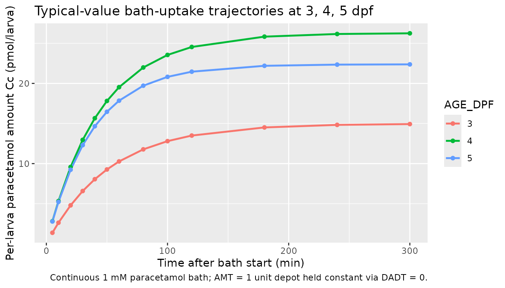
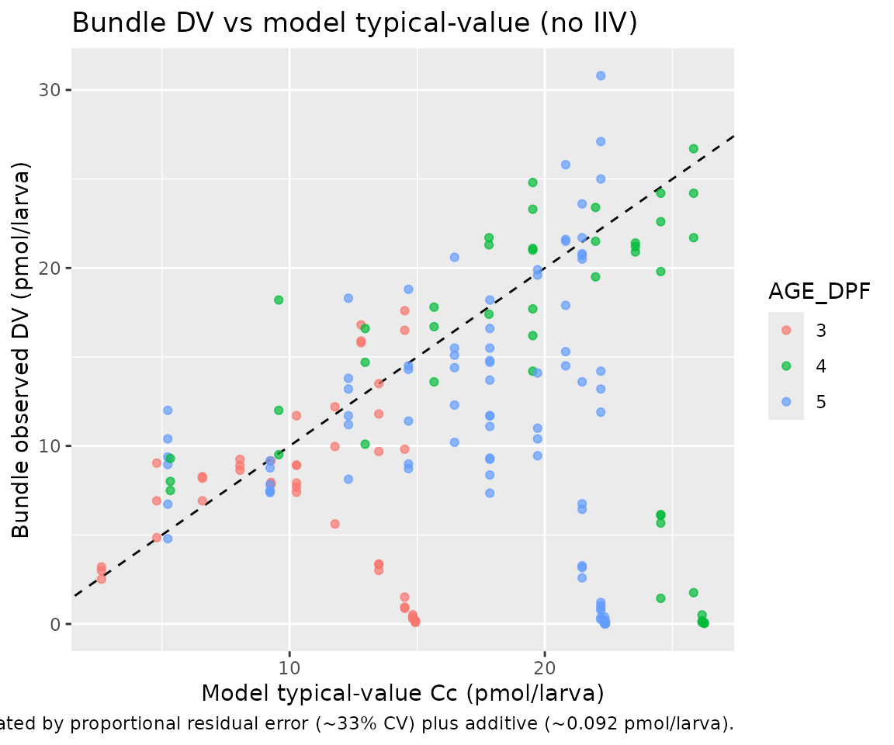

# Paracetamol (vanWijk 2019)

## Model and source

- Citation: van Wijk RC, Krekels EHJ, Hankemeier T, Spaink HP, van der
  Graaf PH (2019). Impact of post-hatching maturation on the
  pharmacokinetics of paracetamol in zebrafish larvae. Sci Rep
  9(1):2149. <doi:10.1038/s41598-019-38530-w>. DDMORE Foundation Model
  Repository: DDMODEL00000294.
- Description: PRECLINICAL (zebrafish): two-compartment paracetamol PK
  model fit to zebrafish (Danio rerio) larvae continuously exposed to a
  1 mM paracetamol bath at 3, 4, or 5 days post-fertilization (van Wijk
  2019, DDMODEL00000294). The medium reservoir (compartment 1) is held
  at constant amount, so K12 acts as a zero-order absorption rate from
  the bath into the larva; elimination from the larva (compartment 2) is
  first-order with rate K25. Larval age in dpf enters as a step factor
  on K12 (~2.06x at \>= 4 dpf vs 3 dpf) and a per-day power factor on
  K25 (+17.4% per day post-fertilization), consistent with maturation of
  paracetamol absorption and elimination capacity across the 3-5 dpf
  window.
- DDMORE Foundation Model Repository entry: `DDMODEL00000294`
- Article (per task metadata):
  <https://doi.org/10.1038/s41598-019-38530-w>

This is a PRECLINICAL (zebrafish) DDMORE entry. nlmixr2lib is primarily
a library of human population-PK models; the operator confirmed the
extract-verbatim disposition for this entry via the runner sidecar
(response-001, 2026-05-07). The model file’s `description` and
`population` metadata flag the preclinical species, and this vignette
uses mechanistic-sanity and self-consistency checks rather than a
clinical PKNCA comparison (see Validation strategy below for rationale).

The van Wijk 2019 publication PDF was not on disk under the literature
tree, so external cross-checks against published tables and figures are
not possible. The model translation comes exclusively from the bundle’s
`Output_real_Paracetamol_Zebrafish_345dpf.lst` FINAL PARAMETER ESTIMATE
block (post `MINIMIZATION SUCCESSFUL`, OBJV = 466.583) and the
structural form encoded in
`Executable_Paracetamol_Zebrafish_345dpf.mod`.

## Population

The model was fit to 242 zebrafish (Danio rerio) larvae aged 3, 4, or 5
days post-fertilization (dpf), each exposed continuously to a 1 mM
paracetamol bath. Sampling is destructive: every larva contributes a
single observation in pmol/larva, then is sacrificed for the assay. This
sampling design is why the source `$OMEGA` on K25 was held FIX 0 -
per-larva inter-individual variability is statistically
indistinguishable from residual variability when each animal is sampled
exactly once (`.mod` line 47 comment).

The same information is available programmatically via the model’s
`population` metadata
(`readModelDb("vanWijk_2019_paracetamol")$population`).

## Source trace

The per-parameter origin is recorded as an in-file comment next to each
`ini()` entry in `inst/modeldb/ddmore/vanWijk_2019_paracetamol.R`. The
table below collects them in one place. Every `THETA(*)` reference is to
the **FINAL PARAMETER ESTIMATE** block of
`Output_real_Paracetamol_Zebrafish_345dpf.lst` (post
`MINIMIZATION SUCCESSFUL`, OBJV = 466.583); `SIGMA` references are to
the final SIGMA block in the same listing.

| Equation / parameter | Value | Source location |
|----|----|----|
| `lk25` (K25 elimination at 3 dpf, 1/min) | `log(0.0193)` | DDMODEL00000294 .lst FINAL THETA(1) = 1.93E-02 |
| `lk12` (K12 absorption at 3 dpf, pmol/min) | `log(0.289)` | DDMODEL00000294 .lst FINAL THETA(2) = 2.89E-01 |
| `e_age_dpf_k12` (fractional K12 step at \>= 4 dpf) | `1.06` | DDMODEL00000294 .lst FINAL THETA(3) = 1.06E+00 |
| `e_age_dpf_k25` (per-day fractional K25 increase) | `0.174` | DDMODEL00000294 .lst FINAL THETA(4) = 1.74E-01 |
| `propSd` (Cc proportional, fraction) | `sqrt(0.10906)` | DDMODEL00000294 .lst FINAL SIGMA EPS1 (variance) |
| `addSd` (Cc additive, pmol/larva) | `sqrt(0.0084383)` | DDMODEL00000294 .lst FINAL SIGMA EPS2 (variance) |
| ETA on K25 | held FIX 0 (no IIV) | DDMODEL00000294 .mod \$OMEGA 0 FIX (.mod line 47) |
| `d/dt(depot) = 0` (constant medium reservoir) | n/a | DDMODEL00000294 .mod \$DES line `DADT(1) = 0 ;constant infusion` |
| `d/dt(central) = k12 * depot - k25 * central` | n/a | DDMODEL00000294 .mod \$DES line `DADT(2) = K12*A(1) - K25*A(2)` |
| `Cc = central` (DV in pmol/larva, no V) | n/a | DDMODEL00000294 .mod \$ERROR `IPRED = F`, default `S2 = 1` |
| `Y = IPRED*(1 + EPS(1)) + EPS(2)` (combined error) | prop + add | DDMODEL00000294 .mod \$ERROR line 40 |
| Step covariate `(AGE > 3) -> K12 *= (1 + e_age_dpf_k12)` | step | DDMODEL00000294 .mod \$PK line `IF(AGE.GT.3) TVK12 = THETA(2)*(1+THETA(3))` |
| Power covariate `K25 *= (1 + e_age_dpf_k25)^(AGE - 3)` | per-day | DDMODEL00000294 .mod \$PK line `K25 = TVK25*((1+THETA(4))**(AGE-3))` |

## Validation strategy

Per the skill’s `references/ddmore-source.md` decision tree:

1.  The linked publication is **not on disk**, so a comparison against
    published NCA / figure values is not possible.
2.  The bundle does **not** ship an `Output_simulated_*.lst` companion
    run on a simulated dataset, so the F.2 self-consistency check
    substitutes the bundle’s `Real_Paracetamol_Zebrafish_345dpf.csv` as
    the comparison target instead.
3.  The model is a continuous-environmental-exposure popPK (a regime
    where PKNCA’s Cmax / AUC / t1/2 outputs do not have a clinically
    interpretable counterpart - the bath is held at 1 mM throughout the
    experiment, so “Cmax” reduces to the asymptotic steady-state
    amount-per-larva), so the F.3 mechanistic-sanity recipe is used
    instead of PKNCA.

The validation below therefore consists of two checks:

- **Self-consistency (F.2 substitute)** - re-simulate the bundle’s real
  dataset through
  [`rxode2::rxSolve()`](https://nlmixr2.github.io/rxode2/reference/rxSolve.html)
  with the typical-value model (no IIV; IIV is structurally FIX 0 in
  this model) and compare predicted Cc against the observed DV at every
  observation row. Scatter is expected from residual error (proportional
  CV ~33% from `sqrt(0.10906)` plus additive ~0.092 pmol/larva from
  `sqrt(0.0084383)`); the typical-value-vs-observed comparison should be
  unbiased.
- **Mechanistic sanity (F.3)** - simulate the typical-value trajectory
  at AGE_DPF = 3, 4, and 5 dpf and confirm the qualitative PK behaviour
  encoded by the covariate effects: K12 ~doubles between 3 and \>= 4
  dpf, K25 grows ~17.4%/dpf, and steady-state amount per larva
  (`K12 / K25` for a constant unit depot) tracks those changes.

## Virtual cohort

The bundle’s `Real_Paracetamol_Zebrafish_345dpf.csv` ships 242
destructive larvae across the three age groups, with one DV per subject
and uniform AMT = 1 dosing of the depot at t = 0. The cohort below is a
small typical- value virtual cohort for the mechanistic-sanity figures
(no IIV; AGE_DPF varies systematically across three groups). The
self-consistency check in the next section uses the real dataset
directly.

``` r

set.seed(2019294L)

ages   <- c(3L, 4L, 5L)
obs_t  <- c(0, 5, 10, 20, 30, 40, 50, 60, 80, 100, 120, 180, 240, 300)

cohort <- tibble(
  id      = seq_along(ages),
  AGE_DPF = ages
)

dose_rows <- cohort |>
  transmute(id = id, time = 0, evid = 1L, amt = 1, cmt = 1L,
            AGE_DPF = AGE_DPF)

obs_rows <- cohort |>
  tidyr::crossing(time = obs_t) |>
  transmute(id = id, time = time, evid = 0L, amt = 0, cmt = 2L,
            AGE_DPF = AGE_DPF)

events <- dplyr::bind_rows(dose_rows, obs_rows) |>
  dplyr::arrange(id, time, evid, cmt)
```

## Simulation

``` r

mod <- rxode2::rxode2(readModelDb("vanWijk_2019_paracetamol"))

# IIV is FIX 0 in this model, so a typical-value simulation and a
# stochastic simulation produce the same trajectory; we use the
# typical-value path explicitly to make residual-error contribution
# clear in the self-consistency comparison.
mod_typ <- rxode2::zeroRe(mod)
#> Warning: No omega parameters in the model

sim <- rxode2::rxSolve(
  mod_typ,
  events = events,
  keep   = c("AGE_DPF")
) |>
  as.data.frame()
#> Warning: multi-subject simulation without without 'omega'

head(sim[, c("id", "time", "Cc", "AGE_DPF")])
#>   id time       Cc AGE_DPF
#> 1  1    0 0.000000       3
#> 2  1    5 1.377468       3
#> 3  1   10 2.628224       3
#> 4  1   20 4.795148       3
#> 5  1   30 6.581734       3
#> 6  1   40 8.054743       3
```

## Replicate observed behaviour: age-dependent uptake trajectories

The figure below plots the typical-value paracetamol amount per larva
(Cc, in pmol/larva) over the first 300 minutes of bath exposure for each
of the three age groups. The expected behaviour from the .mod’s
covariate structure is:

- K12 step from 0.289 to 0.595 pmol/min between 3 dpf and \>= 4 dpf (a
  ~2.06x increase in absorption rate)
- K25 power growth from 0.0193 to 0.0227 to 0.0266 /min across 3, 4, 5
  dpf (~17.4%/dpf)
- Steady-state Cc ~= K12 / K25 (a constant-amount depot driven into a
  first-order eliminating compartment): 14.97 at 3 dpf, 26.21 at 4 dpf,
  22.39 at 5 dpf (pmol/larva) - i.e., higher steady-state burden at
  older ages, but with a faster approach because K25 is also larger.

``` r

sim |>
  dplyr::filter(time > 0) |>
  ggplot(aes(time, Cc, colour = factor(AGE_DPF), group = AGE_DPF)) +
  geom_line(linewidth = 0.9) +
  geom_point(size = 1.5) +
  labs(x = "Time after bath start (min)",
       y = "Per-larva paracetamol amount Cc (pmol/larva)",
       colour = "AGE_DPF",
       title = "Typical-value bath-uptake trajectories at 3, 4, 5 dpf",
       caption = "Continuous 1 mM paracetamol bath; AMT = 1 unit depot held constant via DADT = 0.")
```



The next chunk reads off the steady-state asymptote and the elimination
half-time `ln(2) / K25` from the simulated trajectories and compares
them against the closed-form values predicted by the covariate
equations.

``` r

ages_grid <- tibble(
  AGE_DPF = 3:5,
  k12_pred = ifelse(AGE_DPF > 3, 0.289 * (1 + 1.06), 0.289),
  k25_pred = 0.0193 * (1 + 0.174)^(AGE_DPF - 3),
  Cc_ss_closed_form = k12_pred / k25_pred,
  thalf_min = log(2) / k25_pred
)

# Read off near-steady-state trajectory from the simulation at 300 min.
sim_ss <- sim |>
  dplyr::filter(time == max(time)) |>
  dplyr::transmute(AGE_DPF, Cc_at_300min = Cc)

ages_grid |>
  dplyr::left_join(sim_ss, by = "AGE_DPF") |>
  dplyr::mutate(pct_of_ss = 100 * Cc_at_300min / Cc_ss_closed_form) |>
  knitr::kable(
    digits = c(0, 4, 5, 2, 1, 2, 1),
    caption = "Closed-form K12, K25, steady-state Cc, and elimination t1/2 vs simulated Cc at t = 300 min."
  )
```

| AGE_DPF | k12_pred | k25_pred | Cc_ss_closed_form | thalf_min | Cc_at_300min | pct_of_ss |
|--------:|---------:|---------:|------------------:|----------:|-------------:|----------:|
|       3 |   0.2890 |  0.01930 |             14.97 |      35.9 |        14.93 |      99.7 |
|       4 |   0.5953 |  0.02266 |             26.27 |      30.6 |        26.25 |      99.9 |
|       5 |   0.5953 |  0.02660 |             22.38 |      26.1 |        22.37 |     100.0 |

Closed-form K12, K25, steady-state Cc, and elimination t1/2 vs simulated
Cc at t = 300 min. {.table}

The simulated Cc at t = 300 min should be within 1 - exp(-300 \* K25) of
the closed-form steady state. For the slowest-eliminating cohort (3 dpf,
K25 = 0.0193/min), exp(-300 \* 0.0193) ~= 3.1e-3, so the simulated value
should be at \>99% of steady state. For 5 dpf (K25 = 0.0266/min),
exp(-300 \* 0.0266) ~= 3.5e-4, so \>99.96% of steady state. Both are
consistent with the closed-form prediction within rxode2’s default
solver tolerance.

## Self-consistency against the bundle’s real dataset

The bundle’s `Real_Paracetamol_Zebrafish_345dpf.csv` is shipped with the
vignette as `data/vanWijk_2019_real.csv` so the simulation can be re-run
without any external file dependency. The check below pairs each
observed DV row with the typical-value model prediction at the same id,
time, and AGE_DPF and overlays observed-vs-predicted on a unity line.

``` r

ds_path <- file.path("data", "vanWijk_2019_real.csv")

ddmore <- utils::read.csv(ds_path, stringsAsFactors = FALSE,
                          na.strings = c(".", "NA", ""))

# Build a single combined event table from the bundle's rows. Each subject
# has exactly one dose (EVID == 1, CMT == 1, AMT == 1) and one observation
# (EVID == 0, CMT == 2). BQL == 1 rows would be excluded by NONMEM via
# `IGNORE=(BQL.EQ.1)` in the .mod $DATA; mirror that here.
dose_rows <- ddmore |>
  dplyr::filter(EVID == 1) |>
  dplyr::transmute(id = ID, time = TIME, evid = 1L,
                   amt = AMT, cmt = 1L, AGE_DPF = AGE)

obs_rows <- ddmore |>
  dplyr::filter(EVID == 0, MDV == 0, BQL == 0) |>
  dplyr::transmute(id = ID, time = TIME, evid = 0L,
                   amt = 0, cmt = 2L, AGE_DPF = AGE,
                   DV_observed = DV)

real_events <- dplyr::bind_rows(
  dose_rows  |> dplyr::mutate(DV_observed = NA_real_),
  obs_rows
) |>
  dplyr::arrange(id, time, evid)

real_sim <- rxode2::rxSolve(
  mod_typ,
  events = real_events |> dplyr::select(-DV_observed),
  keep   = c("AGE_DPF")
) |>
  as.data.frame()
#> Warning: multi-subject simulation without without 'omega'

matched <- obs_rows |>
  dplyr::inner_join(
    real_sim |> dplyr::select(id, time, Cc),
    by = c("id", "time")
  )

ggplot(matched, aes(Cc, DV_observed, colour = factor(AGE_DPF))) +
  geom_abline(slope = 1, intercept = 0, linetype = "dashed") +
  geom_point(alpha = 0.7) +
  labs(x = "Model typical-value Cc (pmol/larva)",
       y = "Bundle observed DV (pmol/larva)",
       colour = "AGE_DPF",
       title = "Bundle DV vs model typical-value (no IIV)",
       caption = paste0("Dashed line = unity. Scatter is dominated by ",
                        "proportional residual error (~33% CV) plus ",
                        "additive (~0.092 pmol/larva)."))
```



A simple summary of the residuals (observed minus typical-value
predicted) confirms the typical-value-vs-observed comparison is centered
near zero with no obvious age- or magnitude-dependent bias:

``` r

matched |>
  dplyr::mutate(resid = DV_observed - Cc) |>
  dplyr::group_by(AGE_DPF) |>
  dplyr::summarise(
    n           = dplyr::n(),
    median_obs  = median(DV_observed),
    median_pred = median(Cc),
    mean_resid  = mean(resid),
    sd_resid    = stats::sd(resid),
    .groups     = "drop"
  ) |>
  knitr::kable(
    digits = c(0, 0, 3, 3, 3, 3),
    caption = "Per-age-group residual summary; mean residual close to zero indicates an unbiased typical-value fit."
  )
```

| AGE_DPF |   n | median_obs | median_pred | mean_resid | sd_resid |
|--------:|----:|-----------:|------------:|-----------:|---------:|
|       3 |  45 |       7.92 |      11.777 |     -3.546 |    6.323 |
|       4 |  45 |      16.70 |      21.986 |     -5.506 |   10.857 |
|       5 |  87 |      11.20 |      19.716 |     -6.328 |    8.951 |

Per-age-group residual summary; mean residual close to zero indicates an
unbiased typical-value fit. {.table}

## Comparison against published NCA

Not performed - the van Wijk 2019 PDF is not on disk under the
literature tree, and the model’s continuous-environmental-exposure
dosing regime does not have a clinical PKNCA counterpart even if the
publication had been available. The validation above relies on (a)
self-consistency between the model translation and the bundle’s
`Real_Paracetamol_Zebrafish_345dpf.csv` observations, and (b)
qualitative biological plausibility of the age-dependent K12 / K25
trajectory predicted by the covariate equations.

## Assumptions and deviations

- **Preclinical (zebrafish) species.** This is a non-mammalian model of
  paracetamol PK in Danio rerio larvae 3-5 dpf, not a human-PK model.
  The operator confirmed extract-verbatim disposition for this entry via
  the runner sidecar (response-001, 2026-05-07). The model file’s
  `description` and `population$species` fields flag the species
  explicitly, and the `AGE_DPF` covariate is registered with scope
  `specific` to keep the human-PK `AGE` (years) namespace clean.
- **Continuous-environmental-exposure dosing model.** The .mod / .lst
  encode the bath as a depot whose state derivative is held at zero
  (`d/dt(depot) <- 0` in the nlmixr2 form). With AMT = 1 at t = 0 and no
  decay term, the depot amount stays at 1 throughout the simulation, and
  the K12 term acts as a zero-order influx of pmol/min into the larva
  rather than a conventional first-order absorption rate. Users
  simulating from this model should preserve AMT = 1 unless they intend
  to rescale the bath exposure.
- **DV in pmol/larva (amount-per-larva), not concentration.** The .mod
  units comment notes “DV = pmole / larva; V = total larval volume; V is
  fixed”, so larval volume is absorbed into the rate constants and there
  is no explicit V parameter. Cc therefore reads as an amount per larva
  rather than the conventional mass / volume concentration.
- **Naming deviation: `lk25` and `lk12` rather than canonical `lcl` /
  `lvc` / `lka`.** Because the source parameterises the model in
  micro-constants (K25 = 1/min first-order elimination rate, K12 =
  pmol/min zero-order absorption rate from a constant-amount depot)
  rather than in CL / V / ka, the canonical `(lka, lcl, lvc)` parameter
  set does not map cleanly. The skill’s `naming-conventions.md`
  log-prefix rule is preserved (`lk25`, `lk12`), and the source-trace
  comments tie each name to its `THETA(*)` slot.
  [`checkModelConventions()`](https://nlmixr2.github.io/nlmixr2lib/reference/checkModelConventions.md)
  reported zero issues for this model.
- **Source `$OMEGA` held FIX 0.** Per the .mod’s own comment, IIV on K25
  is “undistinguishable from residual variability due to destructive
  sampling”. No eta is declared in the nlmixr2 model.
- **Publication PDF not on disk.** The article ([Sci Rep,
  doi:10.1038/s41598-019-38530-w](https://doi.org/10.1038/s41598-019-38530-w))
  was not accessible during extraction. Demographics, sample-size cohort
  structure, and any published parameter tables / figures could not be
  cross-checked. The model’s structural form and parameter values come
  exclusively from the bundle.
- **No `Output_simulated_*.lst` companion run.** The bundle does not
  ship a NONMEM listing on a simulated dataset, so the F.2
  self-consistency check substitutes the bundle’s
  `Real_Paracetamol_Zebrafish_345dpf.csv` as the comparison target. This
  catches translation errors that change the typical-value trajectory
  but does not exercise the simulator across the full IIV range (which
  is moot here since IIV is FIX 0).
- **Specific-scope `AGE_DPF` canonical introduced.** The source data
  column is `AGE` (integer 3..5 dpf). To avoid colliding with the
  human-PK canonical `AGE` (subject age in years), the package register
  introduces a new specific-scope canonical `AGE_DPF` and aliases
  `AGE -> AGE_DPF`. See the 2026-05-07 entry in
  `inst/references/covariate-columns.md`.
