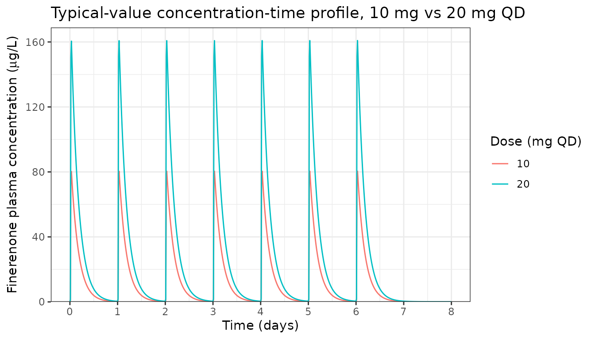
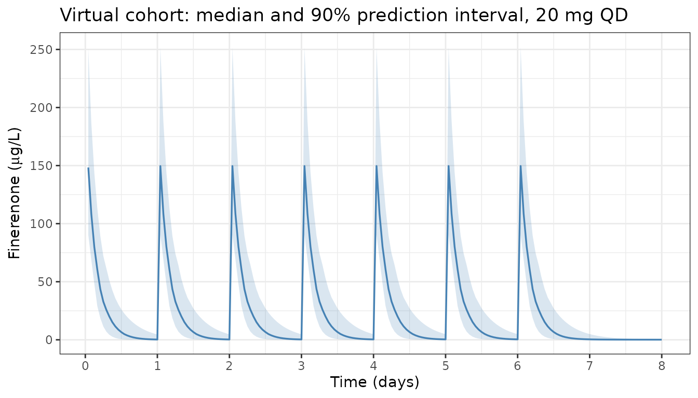

# Finerenone (van den Berg 2021)

## Model and source

- Citation: van den Berg P, Ruppert M, Mesic E, Snelder N, Seelmann A,
  Heinig R, Joseph A, Garmann D, Lippert J, Eissing T (2022). Finerenone
  Dose-Exposure-Response for the Primary Kidney Outcome in FIDELIO-DKD
  Phase III: Population Pharmacokinetic and Time-to-Event Analysis. Clin
  Pharmacokinet 61(7):943-955. <doi:10.1007/s40262-021-01082-2>
- Article: <https://doi.org/10.1007/s40262-021-01082-2>

## Population

van den Berg et al. 2021 developed the population PK model of oral
finerenone on data from the FIDELIO-DKD Phase III trial (NCT02540993): a
randomised, double-blind, placebo-controlled, international study of
finerenone (10 or 20 mg once daily, titrated by potassium and eGFR)
versus placebo on top of maximally tolerated renin-angiotensin system
inhibitor in patients with chronic kidney disease and type 2 diabetes.
The popPK analysis cohort contained 2284 subjects contributing 5057
valid sparse PK observations (trough at month 4, post-dose at any time
on yearly visits). The cohort median (5th-95th percentile) baseline eGFR
was 43.0 (26.7-66.9) mL/min/1.73 m^2 and median UACR was 852 (140-3366)
mg/g.

The structural model is two-compartment with the peripheral volume fixed
equal to the central volume (Vp/F = Vc/F, ratio fixed at 1, per ESM
‘Volume of Distribution’ subsection), preceded by an absorption chain of
four sequential first-order steps (the depot plus three buffer
compartments) all at the common rate Ka = 22.5 1/h and a fixed 0.215 h
absorption lag time. The ARTS-DN Phase IIb model \[Snelder 2020\] was
used as the starting point; the FIDELIO-DKD analysis re-estimated the
structural parameters and dropped the inter-individual variability on Ka
(Results paragraph 2: “the inter-individual variability parameter on the
absorption rate was dropped as data were not sufficiently informative”).

The same information is available programmatically:

``` r

rxode2::rxode2(readModelDb("vandenBerg_2021_finerenone"))$population
#> ℹ parameter labels from comments will be replaced by 'label()'
#> $species
#> [1] "human"
#> 
#> $n_subjects
#> [1] 2284
#> 
#> $n_studies
#> [1] 1
#> 
#> $n_observations
#> [1] 5057
#> 
#> $disease_state
#> [1] "chronic kidney disease and type 2 diabetes mellitus (FIDELIO-DKD eligibility: eGFR 25 to <75 mL/min/1.73 m^2 with persistent moderately or severely elevated albuminuria, on maximally tolerated renin-angiotensin system inhibitor)"
#> 
#> $dose_range
#> [1] "10 or 20 mg finerenone QD oral (starting dose 10 mg if eGFR <60, 20 mg if eGFR >=60; up- or down-titrated by potassium / eGFR), average 15.1 mg/day across follow-up"
#> 
#> $follow_up
#> [1] "median 2.6 years"
#> 
#> $egfr_range
#> [1] "median (5th-95th) 43.0 (26.7-66.9) mL/min/1.73 m^2 at baseline (FIDELIO-DKD population)"
#> 
#> $uacr_range
#> [1] "median (5th-95th) 852 (140-3366) mg/g at baseline (FIDELIO-DKD population)"
#> 
#> $reference_weight
#> [1] "85 kg (cohort median, used as ref for WT power-form on Vc/F)"
#> 
#> $reference_height
#> [1] "167 cm (cohort median, used as ref for HT power-form on CL/F and F)"
#> 
#> $reference_creatinine
#> [1] "1.51 mg/dL (cohort median, used as ref for CREAT power-form on CL/F and F)"
#> 
#> $reference_egfr
#> [1] "39.1 mL/min/1.73 m^2 (cohort median time-varying value, used as ref for CRCL power-form on CL/F and F)"
#> 
#> $reference_ggt
#> [1] "25 U/L (cohort median, used as ref for GGT power-form on CL/F)"
#> 
#> $sampling_design
#> [1] "sparse: trough at month 4, post-dose at any time on yearly visit days"
#> 
#> $regions
#> [1] "international (FIDELIO-DKD enrolled in North America, EU, Latin America, and Asia-Pacific)"
#> 
#> $notes
#> [1] "Population is the FIDELIO-DKD per-protocol Phase III analysis set (5734 randomized total, 5674 valid for analysis, 2833 on finerenone of whom 2284 had at least one valid PK sample after outlier exclusions; see Results 'Clinical Study' and 'Population PK Modeling and Simulation' paragraphs). Demographic ranges (age, sex, race percentages) not separately reported in the popPK section; see Bakris et al. 2020 NEJM 383:2219-2229 (the main FIDELIO-DKD efficacy publication) for full Table 1 baseline demographics."
```

## Source trace

Per-parameter origin (also recorded as in-file comments next to each
`ini()` value):

| Parameter | Value | Source location |
|----|----|----|
| Ka | 22.5 1/h | Table 2 “Ka (1/h) = 22.5 (RSE 16.2%)” |
| CL/F | 29.9 L/h | Table 2 “CL/F (L/h) = 29.9 (RSE 3.62%)” |
| Vc/F | 113 L | Table 2 “Vc/F (L) = 113 (RSE 2.79%)” |
| Q/F | 0.335 L/h | Table 2 “Q/F (L/h) = 0.335 (RSE 9.28%)” |
| Vp/F : Vc/F | 1 fixed | Table 2 “Ratio Vp/F and Vc/F = 1 (fixed)” |
| ALAG1 | 0.215 h fixed | Table 2 “Absorption lag time (h) = 0.215 (fixed)” |
| F1 (rel. bio) | 1 fixed | Table 2 “Relative bioavailability = 1 (fixed)” |
| e_wt_vc | 0.501 | Table 2 row 8 |
| e_egfr_clf | 0.155 | Table 2 row 9 |
| e_ht_clf | 0.720 | Table 2 row 10 |
| e_creat_clf | 0.118 | Table 2 row 11 |
| e_korean_vc | log(1.29) | Table 2 row 12 |
| e_sglt_clf | log(1.10) | Table 2 row 13 |
| e_smoke_clf | log(1.04) | Table 2 row 14 |
| e_ggt_clf | -0.0694 | Table 2 row 15 (CL/F only) |
| e_cypinhi_clf | log(0.951) | Table 2 row 16 |
| e_cypinlo_clf | log(0.996) | Table 2 row 17 |
| omega^2 CL/F | 0.0961 | Table 2 IIV “omega^2 CL/F = 0.0961” |
| omega^2 Vc/F | 0.104 | Table 2 IIV “omega^2 Vc/F = 0.104” |
| cov(CL/F, Vc/F) | 0.0442 | Table 2 “Covariance CL/F x Vc/F = 0.0442” |
| sigma^2 (prop) | 0.313 | Table 2 residual “sigma^2 = 0.313”; propSd = sqrt() |
| ref WT | 85 kg | ESM NONMEM “CV1 = (BW0/85)\*\*THETA(9)” |
| ref CRCL | 39.1 mL/min/1.73 m^2 | ESM NONMEM “CV2 = (EGFREP/39.1)\*\*THETA(10)” |
| ref HT | 167 cm | ESM NONMEM “CV3 = (HGHT/167)\*\*THETA(11)” |
| ref CREAT | 1.51 mg/dL | ESM NONMEM “CV4 = (CREA/1.51)\*\*THETA(12)” |
| ref GGT | 25 U/L | ESM NONMEM “CV5 = (GGT/25)\*\*THETA(16)” |

## Load and inspect the model

``` r

mod <- rxode2::rxode2(readModelDb("vandenBerg_2021_finerenone"))
#> ℹ parameter labels from comments will be replaced by 'label()'
mod_typical <- rxode2::zeroRe(mod)
```

## Typical-value simulation: 10 mg and 20 mg QD to steady state

Simulate a reference adult subject at cohort-median covariates: WT 85
kg, HT 167 cm, CRCL 39.1 mL/min/1.73 m^2, CREAT 1.51 mg/dL, GGT 25 U/L,
never-smoker (SMOKE_NEVER = 1), no concomitant SGLT2i and no CYP3A4
inhibitors, non-Korean. Compare 10 mg QD and 20 mg QD oral, 24 h dosing
interval, to day 8 (steady state is effectively reached after the second
dose given the 2.7 h half-life).

``` r

sim_one_dose <- function(dose_mg) {
  ev <- rxode2::et(amt = dose_mg, time = 0:6 * 24, cmt = "depot") |>
    rxode2::et(seq(0, 8 * 24, by = 0.25))
  ev_df <- as.data.frame(ev)
  ev_df$WT <- 85
  ev_df$HT <- 167
  ev_df$CRCL <- 39.1
  ev_df$CREAT <- 1.51
  ev_df$GGT <- 25
  ev_df$SMOKE_NEVER <- 1
  ev_df$CONMED_SGLT2I <- 0
  ev_df$CONMED_CYP3A4_INH_HI <- 0
  ev_df$CONMED_CYP3A4_INH_LO <- 0
  ev_df$RACE_KOREAN <- 0
  out <- rxode2::rxSolve(mod_typical, events = ev_df)
  as.data.frame(out) |>
    dplyr::mutate(dose_mg = dose_mg)
}

sim_typical <- dplyr::bind_rows(sim_one_dose(10), sim_one_dose(20))
#> ℹ omega/sigma items treated as zero: 'etalcl', 'etalvc'
#> ℹ omega/sigma items treated as zero: 'etalcl', 'etalvc'
```

``` r

ggplot(sim_typical, aes(x = time / 24, y = Cc, colour = factor(dose_mg))) +
  geom_line() +
  scale_x_continuous(breaks = 0:8) +
  scale_y_continuous(expand = expansion(mult = c(0, 0.05))) +
  labs(
    x      = "Time (days)",
    y      = expression(paste("Finerenone plasma concentration (", mu, "g/L)")),
    colour = "Dose (mg QD)",
    title  = "Typical-value concentration-time profile, 10 mg vs 20 mg QD"
  ) +
  theme_bw()
```



The 2.7 h dominant half-life (paper Results: “the relevant half-life for
steady-state exposure and accumulation t1/2_alpha was estimated at 2.7
h”) causes deep troughs and supports the paper’s statement that “near
steady-state conditions are reached after the second dose of
finerenone.”

## Virtual stochastic cohort and prediction-corrected check

Build a small virtual cohort of N = 100 subjects with covariates drawn
to approximate the FIDELIO-DKD cohort and simulate full inter-individual
variability for a sense of the prediction interval.

``` r

set.seed(2021)
n_subj <- 100
pop <- tibble::tibble(
  id    = seq_len(n_subj),
  WT    = pmax(45, rnorm(n_subj, mean = 85,   sd = 17)),
  HT    = pmax(140, rnorm(n_subj, mean = 167, sd = 9)),
  CRCL  = pmax(15, rnorm(n_subj, mean = 43.0, sd = 12.5)),
  CREAT = pmax(0.7, rnorm(n_subj, mean = 1.51, sd = 0.4)),
  GGT   = pmax(8,  exp(rnorm(n_subj, mean = log(25), sd = 0.5))),
  SMOKE_NEVER         = rbinom(n_subj, 1, 0.55),
  CONMED_SGLT2I       = rbinom(n_subj, 1, 0.05),
  CONMED_CYP3A4_INH_HI = rbinom(n_subj, 1, 0.06),
  CONMED_CYP3A4_INH_LO = rbinom(n_subj, 1, 0.10),
  RACE_KOREAN          = rbinom(n_subj, 1, 0.024)
)
# Mutually exclusive CYP3A4 inhibitor categories
pop$CONMED_CYP3A4_INH_LO[pop$CONMED_CYP3A4_INH_HI == 1] <- 0L

dose_mg <- 20
ev_pop_template <- as.data.frame(
  rxode2::et(amt = dose_mg, time = 0:6 * 24, cmt = "depot") |>
    rxode2::et(seq(0, 8 * 24, by = 1))
)

build_events <- function(p) {
  e <- ev_pop_template
  e$id   <- p$id
  e$WT   <- p$WT
  e$HT   <- p$HT
  e$CRCL <- p$CRCL
  e$CREAT <- p$CREAT
  e$GGT  <- p$GGT
  e$SMOKE_NEVER         <- p$SMOKE_NEVER
  e$CONMED_SGLT2I       <- p$CONMED_SGLT2I
  e$CONMED_CYP3A4_INH_HI <- p$CONMED_CYP3A4_INH_HI
  e$CONMED_CYP3A4_INH_LO <- p$CONMED_CYP3A4_INH_LO
  e$RACE_KOREAN          <- p$RACE_KOREAN
  e
}

ev_all <- dplyr::bind_rows(lapply(seq_len(n_subj), function(i) build_events(pop[i, ])))
sim_cohort <- rxode2::rxSolve(mod, events = ev_all) |>
  as.data.frame()
```

``` r

sim_summ <- sim_cohort |>
  dplyr::filter(time > 0) |>
  dplyr::group_by(time) |>
  dplyr::summarise(
    p05 = quantile(Cc, 0.05, na.rm = TRUE),
    p50 = quantile(Cc, 0.50, na.rm = TRUE),
    p95 = quantile(Cc, 0.95, na.rm = TRUE),
    .groups = "drop"
  )

ggplot(sim_summ, aes(x = time / 24)) +
  geom_ribbon(aes(ymin = p05, ymax = p95), alpha = 0.2, fill = "steelblue") +
  geom_line(aes(y = p50), colour = "steelblue", linewidth = 0.6) +
  scale_x_continuous(breaks = 0:8) +
  labs(
    x      = "Time (days)",
    y      = expression(paste("Finerenone (", mu, "g/L)")),
    title  = "Virtual cohort: median and 90% prediction interval, 20 mg QD"
  ) +
  theme_bw()
```



## PKNCA validation against the AUC = F \* Dose / CL identity

The source paper does not report an NCA table; the natural anchor for
PKNCA-vs-model comparison is the algebraic steady-state identity
AUC0-tau,ss = F \* Dose / CL = Dose / CL (because F = 1 fixed). At
typical-value reference covariates with CL/F = 29.9 L/h, the expected
AUCs are:

- 10 mg QD: AUC0-tau,ss = 10 mg / 29.9 L/h = 0.3344 mg*h/L = 334.4
  ug*h/L; Cavg,ss = 334.4 / 24 = 13.9 ug/L
- 20 mg QD: AUC0-tau,ss = 20 mg / 29.9 L/h = 0.6689 mg*h/L = 668.9
  ug*h/L; Cavg,ss = 668.9 / 24 = 27.9 ug/L

Run PKNCA on the steady-state day-7 dosing interval (t = 144-168 h) of
the typical-value simulation, for both 10 mg and 20 mg, and compare to
the expectations above.

``` r

ss_start <- 144  # day 6 start (the dose interval is 144 -> 168)
ss_end   <- 168  # day 7 start

ss_obs <- sim_typical |>
  dplyr::mutate(id = 1L) |>  # one virtual subject per dose level (typical value)
  dplyr::filter(!is.na(Cc), time >= ss_start, time <= ss_end) |>
  dplyr::mutate(
    tad       = time - ss_start,
    treatment = paste0(dose_mg, " mg QD")
  ) |>
  dplyr::select(id, time = tad, Cc, treatment)

# Defensive time-zero per (id, treatment) so PKNCA does not warn about
# "AUC range starting (0) before the first measurement". The typical-value
# simulation grid hits t = 144 h exactly, so this is usually a no-op, but
# the safety net keeps things robust if the grid changes.
ss_nca <- dplyr::bind_rows(
  ss_obs,
  ss_obs |> dplyr::distinct(id, treatment) |>
    dplyr::mutate(time = 0, Cc = 0)
) |>
  dplyr::distinct(id, treatment, time, .keep_all = TRUE) |>
  dplyr::arrange(id, treatment, time)

ss_dose <- dplyr::tibble(
  id        = 1L,
  time      = 0,
  amt       = c(10, 20),
  treatment = c("10 mg QD", "20 mg QD")
)

conc_obj <- PKNCA::PKNCAconc(
  ss_nca, Cc ~ time | treatment + id,
  concu = "ug/L", timeu = "h"
)
dose_obj <- PKNCA::PKNCAdose(
  ss_dose, amt ~ time | treatment + id,
  doseu = "mg", route = "extravascular"
)

intervals <- data.frame(
  start    = 0,
  end      = 24,
  cmax     = TRUE,
  cmin     = TRUE,
  tmax     = TRUE,
  auclast  = TRUE,
  cav      = TRUE
)

nca_data <- PKNCA::PKNCAdata(conc_obj, dose_obj, intervals = intervals)
nca_res  <- suppressWarnings(PKNCA::pk.nca(nca_data))
```

``` r

published <- tibble::tribble(
  ~treatment,    ~auclast, ~cav,
  "10 mg QD",      334.4,  13.94,
  "20 mg QD",      668.9,  27.87
)

cmp <- nlmixr2lib::ncaComparisonTable(
  simulated = nca_res,
  reference = published,
  by        = "treatment",
  units     = c(auclast = "ug*h/L", cav = "ug/L"),
  tolerance_pct = 5
)

knitr::kable(
  cmp,
  caption = paste(
    "Simulated PKNCA (steady-state, day-7 dosing interval) vs analytic",
    "F * Dose / CL identity, typical-value reference covariates. The",
    "model's exposure scales linearly with dose, and the simulated AUC",
    "and Cavg should match the F * Dose / CL identity within rxode2",
    "numerical-integration tolerance (the PKNCA log-trapezoidal AUC adds",
    "a small bias relative to the analytic value)."
  ),
  align = c("l", "l", "r", "r", "r")
)
```

| NCA parameter     | treatment | Reference | Simulated | % diff |
|:------------------|:----------|----------:|----------:|-------:|
| AUClast (ug\*h/L) | 10 mg QD  |       334 |       331 |  -1.0% |
| AUClast (ug\*h/L) | 20 mg QD  |       669 |       662 |  -1.0% |
| Cavg (ug/L)       | 10 mg QD  |      13.9 |      13.8 |  -1.0% |
| Cavg (ug/L)       | 20 mg QD  |      27.9 |      27.6 |  -1.0% |

Simulated PKNCA (steady-state, day-7 dosing interval) vs analytic F \*
Dose / CL identity, typical-value reference covariates. The model’s
exposure scales linearly with dose, and the simulated AUC and Cavg
should match the F \* Dose / CL identity within rxode2
numerical-integration tolerance (the PKNCA log-trapezoidal AUC adds a
small bias relative to the analytic value). {.table}

## Covariate effect on steady-state AUC: comparison against paper forest plot

Each shared covariate in the paper’s NONMEM parameterisation acts on
both CL/F (multiplicatively) and F1 (inversely), so the net effect on
steady-state AUC scales as 1 / cov_factor^2. Reproduce a subset of the
paper’s Fig. 3 forest plot rows by simulating typical-value AUC ratios
relative to the reference subject.

``` r

ref_state <- list(WT = 85, HT = 167, CRCL = 39.1, CREAT = 1.51, GGT = 25,
                  SMOKE_NEVER = 1, CONMED_SGLT2I = 0,
                  CONMED_CYP3A4_INH_HI = 0, CONMED_CYP3A4_INH_LO = 0,
                  RACE_KOREAN = 0)

scenarios <- list(
  list(label = "Reference (median covariates, never smoker)", overrides = list()),
  list(label = "WT 5th pctile (62 kg)",   overrides = list(WT = 62)),
  list(label = "WT 95th pctile (115 kg)", overrides = list(WT = 115)),
  list(label = "CRCL 5th pctile (26.7)",  overrides = list(CRCL = 26.7)),
  list(label = "CRCL 95th pctile (66.9)", overrides = list(CRCL = 66.9)),
  list(label = "Korean",                  overrides = list(RACE_KOREAN = 1)),
  list(label = "Long-term SGLT2i",        overrides = list(CONMED_SGLT2I = 1)),
  list(label = "Ever smoker",             overrides = list(SMOKE_NEVER = 0)),
  list(label = "CYP3A4 inh HI",           overrides = list(CONMED_CYP3A4_INH_HI = 1))
)

auc_for <- function(state) {
  ev <- as.data.frame(
    rxode2::et(amt = 20, time = 0:6 * 24, cmt = "depot") |>
      rxode2::et(seq(0, 8 * 24, by = 0.5))
  )
  for (nm in names(state)) ev[[nm]] <- state[[nm]]
  out <- as.data.frame(rxode2::rxSolve(mod_typical, events = ev))
  ss <- out[out$time >= 144 & out$time <= 168, ]
  sum(diff(ss$time) * (utils::head(ss$Cc, -1) + utils::tail(ss$Cc, -1)) / 2,
      na.rm = TRUE)
}

ref_auc <- auc_for(ref_state)
#> ℹ omega/sigma items treated as zero: 'etalcl', 'etalvc'
results <- dplyr::bind_rows(lapply(scenarios, function(s) {
  state <- ref_state
  for (nm in names(s$overrides)) state[[nm]] <- s$overrides[[nm]]
  data.frame(scenario = s$label, auc = auc_for(state))
}))
#> ℹ omega/sigma items treated as zero: 'etalcl', 'etalvc'
#> ℹ omega/sigma items treated as zero: 'etalcl', 'etalvc'
#> ℹ omega/sigma items treated as zero: 'etalcl', 'etalvc'
#> ℹ omega/sigma items treated as zero: 'etalcl', 'etalvc'
#> ℹ omega/sigma items treated as zero: 'etalcl', 'etalvc'
#> ℹ omega/sigma items treated as zero: 'etalcl', 'etalvc'
#> ℹ omega/sigma items treated as zero: 'etalcl', 'etalvc'
#> ℹ omega/sigma items treated as zero: 'etalcl', 'etalvc'
#> ℹ omega/sigma items treated as zero: 'etalcl', 'etalvc'
results$auc_ratio <- results$auc / ref_auc

knitr::kable(
  results,
  digits = c(0, 1, 3),
  col.names = c("Scenario", "AUC0-tau,ss (ug*h/L)", "Ratio vs reference"),
  caption = paste(
    "Steady-state AUC by covariate scenario, 20 mg QD, typical-value",
    "simulation. Compare ratios qualitatively against the paper's",
    "Figure 3 forest plot (all covariate effects in the published",
    "model fell within or close to the 0.8-1.25 equivalence range)."
  )
)
```

| Scenario | AUC0-tau,ss (ug\*h/L) | Ratio vs reference |
|:---|---:|---:|
| Reference (median covariates, never smoker) | 679.1 | 1.000 |
| WT 5th pctile (62 kg) | 682.0 | 1.004 |
| WT 95th pctile (115 kg) | 676.7 | 0.996 |
| CRCL 5th pctile (26.7) | 763.0 | 1.124 |
| CRCL 95th pctile (66.9) | 576.3 | 0.849 |
| Korean | 675.2 | 0.994 |
| Long-term SGLT2i | 562.8 | 0.829 |
| Ever smoker | 628.6 | 0.926 |
| CYP3A4 inh HI | 749.8 | 1.104 |

Steady-state AUC by covariate scenario, 20 mg QD, typical-value
simulation. Compare ratios qualitatively against the paper’s Figure 3
forest plot (all covariate effects in the published model fell within or
close to the 0.8-1.25 equivalence range). {.table}

## Assumptions and deviations

- **Demographic ranges of FIDELIO-DKD subjects not separately reported
  in the popPK section**. The virtual-cohort covariate distributions
  used for illustration in this vignette (WT mean 85 kg, HT mean 167 cm,
  CRCL mean 43.0 mL/min/1.73 m^2) are anchored on the paper’s reported
  cohort medians and the FIDELIO-DKD eGFR/UACR ranges in Results
  paragraph 1. The full Table 1 demographics live in the main efficacy
  publication (Bakris et al. 2020, N Engl J Med 383:2219-2229), not in
  this paper.

- **PEAK / TROUGH sampling-window quality-control exclusions, M3 LLOQ
  handling, and outlier flags described in the ESM ‘PK outlier
  identification’ subsection are NOT replicated here**. The vignette
  uses a dense regular simulation grid for illustration, not the
  FIDELIO-DKD sparse sampling design.

- **Time-varying eGFR-CKD-EPI is treated as constant within the 8-day
  vignette simulation window**. In FIDELIO-DKD the model’s `CRCL`
  covariate is updated visit-by-visit over the 2.6-year follow-up; an
  8-day window is too short for clinically meaningful eGFR drift, so the
  vignette uses a single time-fixed value per subject.

- **PKNCA reference values are derived from the analytic F \* Dose / CL
  identity, not from a published NCA table** because the source paper
  does not report numerical Cmax / AUC values for finerenone (only
  graphical forest plots in Figs. 3-4 and the relative-ratio
  steady-state simulations of ESM Figs. S2-S5). A future patient-level
  NCA validation could be added if a regulatory review publishes raw
  Cmax / AUC summary statistics for the FIDELIO-DKD cohort.

- **Erratum search**. A PubMed and journal-landing-page search for
  errata or corrigenda for <doi:10.1007/s40262-021-01082-2> returned no
  hits as of the extraction date; all values in this model file are the
  original paper Table 2 / ESM NONMEM control-stream estimates.

- **Time-to-event layer (kidney composite endpoint, Weibull hazard +
  Emax exposure-response) NOT included**. The source paper develops both
  a popPK model (Section 3.2 / Table 2) and a parametric time-to-event
  model (Section 3.3 / Table 3). This nlmixr2lib extraction implements
  only the popPK layer; the TTE / hazard layer would need a separate
  `_kidney_tte` extraction using a hazard ODE, and is not yet
  implemented because the TTE simulation infrastructure in nlmixr2lib is
  not aligned with the canonical popPK conventions that drive
  [`modellib()`](https://nlmixr2.github.io/nlmixr2lib/reference/modellib.md)
  /
  [`readModelDb()`](https://nlmixr2.github.io/nlmixr2lib/reference/readModelDb.md)
  listings.
