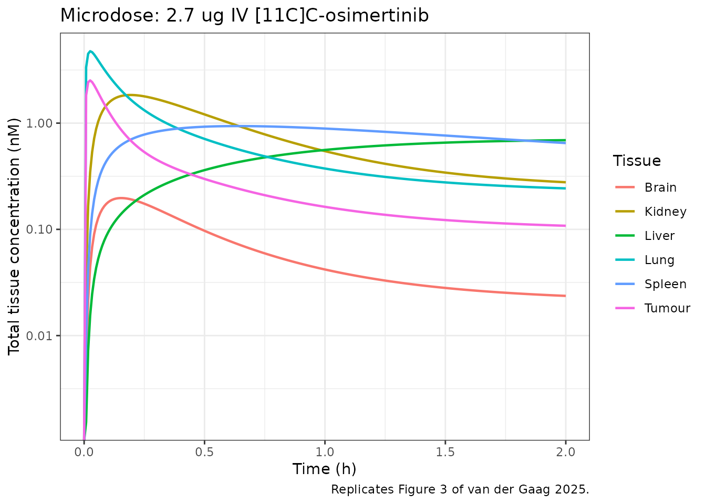
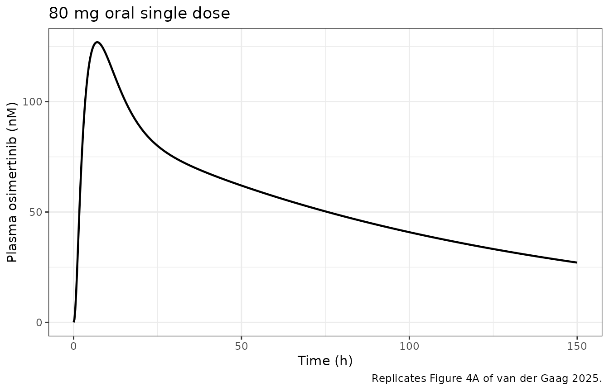
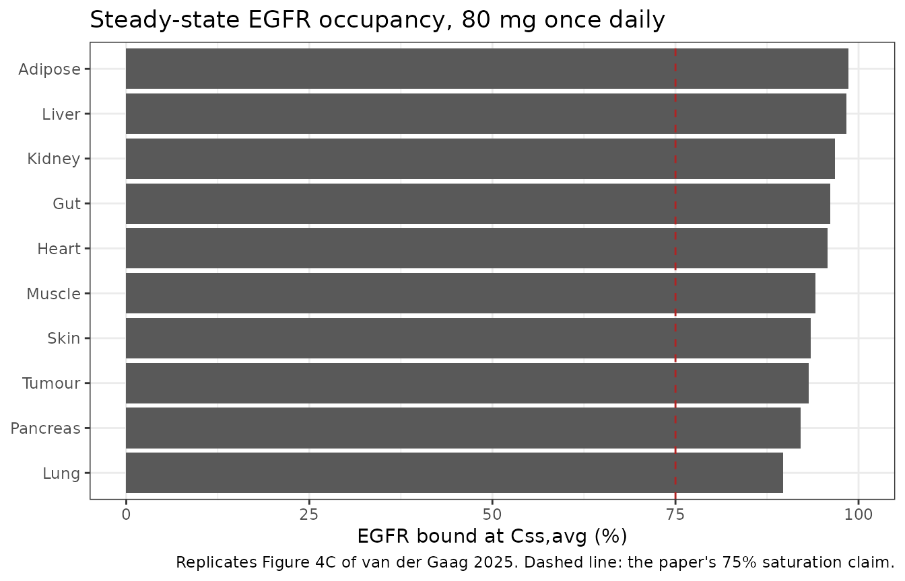

# Osimertinib target-site PBPK (van der Gaag 2025)

## Model and source

- Citation: van der Gaag S, Jordens T, Yaqub M, Grijseels R, van
  Valkengoed DW, de Langen EN, van den Broek R, Thijssen VLJL, de Langen
  AJ, Kouwenhoven MCM, Bahce I, Westerman BA, Hendrikse NH, Bartelink
  IH. Physiologically Based Pharmacokinetic Model of Tyrosine Kinase
  Inhibitors to Predict Target Site Penetration, with PET-Guided
  Verification. CPT Pharmacometrics Syst Pharmacol. 2025;14(5):918-928.
  <doi:10.1002/psp4.70006>. Organ volumes, intracellular-water volumes
  and blood flows from Appendix S2 Table S1; body/pH/haematocrit
  constants from Table S2; tissue fractional volumes from Table S3;
  lysosomal fractions, acidic phospholipid and EGFR concentrations from
  Table S4; liver and lung cell-type composition from Table S5;
  osimertinib physicochemical and clearance parameters from Appendix S3
  Table S6; tumor and EGFR binding parameters from main-text Table 1;
  Kpu equations from Appendix S4 Suppl Eq 1-6; whole-body ODEs from
  Appendix S5 Suppl Eq 7-20; EGFR-binding and free-receptor-fraction
  equations from main-text Equations 1-2. The tumor extracellular-water
  pH term and the tumor 100% residual-cell composition are inherited
  from the explicitly cited predecessor model Bartelink IH, et
  al. Physiologically Based Pharmacokinetic (PBPK) Modeling to Predict
  PET Image Quality of Three Generations EGFR TKI in Advanced-Stage
  NSCLC Patients. Pharmaceuticals (Basel). 2022;15(7):796.
  <doi:10.3390/ph15070796> (Supplement section VC and supplement note
  9).
- Article: <https://doi.org/10.1002/psp4.70006>
- Supplement (Appendices S1-S10, all equations and parameter tables):
  <https://doi.org/10.1002/psp4.70006> Supporting Information file
  `PSP4-14-918-s001.docx`
- Predecessor / framework model: Bartelink et al., *Pharmaceuticals*
  2022;15(7):796, <https://doi.org/10.3390/ph15070796>

Osimertinib is a third-generation EGFR tyrosine kinase inhibitor and the
standard first-line therapy for advanced NSCLC with an activating *EGFR*
mutation. Whether enough drug reaches the tumour is not answerable from
plasma PK alone, and microdosed `[11C]C`-osimertinib PET can measure
tissue uptake directly – but only at a microdose, where EGFR binding and
metabolism are far from saturated. This model exists to bridge that gap:
a whole-body PBPK model carrying explicit, saturable EGFR binding so
that a 2.7 ug intravenous microdose and an 80 mg oral therapeutic dose
can be simulated with the same parameter set.

Two features distinguish it from a conventional PBPK model.

1.  **No fitted partition coefficients.** Every tissue-to-plasma
    partition coefficient is *computed* inside the model from the
    Rodgers and Rowland moderate-to-strong-base equations (Suppl Eq
    1-6), combining osimertinib’s pKa, logD, fraction unbound and
    blood-to-plasma ratio with each tissue’s fractional water, lipid,
    acidic-phospholipid and lysosomal composition. Nothing in this model
    was estimated from the clinical data.
2.  **Saturable target binding as explicit states.** Each of the ten
    EGFR-expressing tissues carries a second state holding drug
    covalently bound to EGFR, so receptor occupancy is a simulated
    output rather than an assumption.

## Population

``` r

pop <- rxode2::rxode(readModelDb("vanderGaag_2025_osimertinib_pbpk"))$population
str(pop, max.level = 1)
#> List of 11
#>  $ species       : chr "human"
#>  $ n_subjects    : int 4
#>  $ n_studies     : int 2
#>  $ age_range     : chr NA
#>  $ weight_range  : chr "single 87.5 kg reference individual (Table S2); the model is deterministic and is not stratified by body size"
#>  $ sex_female_pct: num NA
#>  $ race_ethnicity: chr NA
#>  $ disease_state : chr "advanced-stage (stage 3-4) non-small cell lung cancer with an activating EGFR mutation (exon 19 deletion or exo"| __truncated__
#>  $ dose_range    : chr "2.7 ug (280 MBq) intravenous [11C]C-osimertinib microdose, and 80 mg oral osimertinib once daily"
#>  $ regions       : chr "Netherlands (Amsterdam UMC)"
#>  $ notes         : chr "This is a bottom-up whole-body PBPK model: every parameter is a literature or in-vitro value and none was estim"| __truncated__
```

The model is deterministic and represents a single 87.5 kg reference
individual (Table S2); it carries no between-subject variability.
Verification used two independent data sets. Four patients with
advanced-stage NSCLC and an activating *EGFR* mutation (exon 19 deletion
or exon 21 L858R) who had progressed on a first-generation EGFR-TKI each
underwent two dynamic `[11C]C`-osimertinib PET scans, one on and one off
concomitant TKI; because concomitant TKI did not change uptake the scans
were pooled. Three of the four also had a whole-body static PET at 60
min, giving brain, kidney, liver, lung, spleen and tumour
concentrations. Separately, plasma concentration-time profiles from 10
healthy volunteers given a single 80 mg oral dose were digitised from
phase 1 study D5160C00001.

The authors adopted a 3-fold rather than the customary 2-fold
prediction-error window, justified by the small sample size and the high
inter- and intra-patient variability of tissue PK.

## Source trace

Every `ini()` entry in
`inst/modeldb/specificDrugs/vanderGaag_2025_osimertinib_pbpk.R` carries
an in-file comment naming its source location. The table below collects
the model’s structural provenance in one place.

| Equation / parameter group | Source location |
|----|----|
| Organ total volumes, intracellular-water volumes, blood flows | Appendix S2, Table S1 |
| Body weight, pH of plasma / EW / IW / lysosomes / blood cells, haematocrit | Appendix S2, Table S2 |
| Tissue fractional volumes `fnl`, `fnp`, `few`, `fiw` | Appendix S2, Table S3 |
| Lysosomal fractional volumes, acidic phospholipids, tissue EGFR concentrations | Appendix S2, Table S4 |
| Liver and lung cell-type composition (`flys`, `fcell`, lysosomal pH) | Appendix S2, Table S5 |
| pKa, logD, logPV, `Fu`, blood-to-plasma ratio, `Ka`, `F`, `CL_int`, `CL_R`, `Ka_bc` | Appendix S3, Table S6 |
| Tumour EGFR, tumour pH_EW, tumour blood flow, virtual tumour volume, `Kon` / `Koff` (wild-type, mutated, 50/50) | Main text, Table 1 |
| `Kpu` for intracellular water, lipids, acidic phospholipids, lysosomes; `Kp = Kpu * Fu` | Appendix S4, Suppl Eq 1-6 |
| Non-eliminating tissue, lung, venous and arterial ODEs | Appendix S5, Suppl Eq 7-10 |
| EGFR-expressing tissue ODEs (bound and unbound states) | Appendix S5, Suppl Eq 11-12 |
| Absorption; gut ODE | Appendix S5, Suppl Eq 13-14 |
| Hepatic clearance and `CL_int` derivation; liver and kidney ODEs | Appendix S5, Suppl Eq 15-20 |
| EGFR association / dissociation; free-receptor fraction; tissue EGFR concentration | Main text, Equations 1, 2, 3 |
| Tumour extracellular-water pH term; tumour 100% residual-cell composition | Bartelink 2022 supplement, section VC and note 9 |

Two items come from the predecessor paper rather than from van der Gaag
2025. Both are flagged in **Assumptions and deviations** below; the
current paper states explicitly that the NSCLC hallmarks “have been
described and verified previously by Bartelink et al.”, and that paper
is the cited framework source.

## Derived partition coefficients

Because the `Kp` values are computed rather than tabulated, the first
validation step is to inspect them. The chunk below solves the model
once and reads the derived quantities straight out of the model body.

``` r

mod <- readModelDb("vanderGaag_2025_osimertinib_pbpk")

MW      <- 500      # g/mol, Table S6
nmol_mg <- 1e6 / MW # mg -> nmol

# A minimal solve: one observation record on a real ODE state so that every
# algebraic observable is evaluated and returned.
probe <- data.frame(
  id = 1L, time = 0, amt = NA_real_, evid = 0L, cmt = "venous"
)
kp_probe <- rxode2::rxSolve(mod, probe, useLinCmt = FALSE) |> as.data.frame()

tissues <- c("adipose", "brain", "gut", "heart", "kidney", "liver",
             "lung", "tumor", "pancreas", "muscle", "skin", "spleen", "other")

# Read the composite tissue-to-blood coefficient kb = Kpu * Fu / BP, which the
# ODEs actually use, and invert it. Reading `kpu_*` directly would be more
# direct but is not uniform: the rest-of-body compartment is pure extracellular
# water, so `kpu_other <- 1` is a literal constant and rxode2 folds it away
# rather than returning it as a column.
BP <- 0.77    # Table S6, blood-to-plasma ratio
FU <- 0.0535  # Table S6, fraction unbound in plasma

kb_vals <- vapply(paste0("kb_", tissues), \(n) kp_probe[[n]][1], numeric(1))

kp_tab <- tibble::tibble(
  Tissue = tissues,
  Kpu    = kb_vals * BP / FU,
  Kp     = kb_vals * BP
)

kp_tab |>
  dplyr::rename("Kpu (unbound tissue:plasma)" = Kpu,
                "Kp (tissue:plasma)"          = Kp) |>
  knitr::kable(digits = 2,
               caption = "Partition coefficients derived inside the model from Suppl Eq 1-6.")
```

| Tissue   | Kpu (unbound tissue:plasma) | Kp (tissue:plasma) |
|:---------|----------------------------:|-------------------:|
| adipose  |                       41.90 |               2.24 |
| brain    |                       60.68 |               3.25 |
| gut      |                      345.07 |              18.46 |
| heart    |                      343.98 |              18.40 |
| kidney   |                      467.15 |              24.99 |
| liver    |                     1157.69 |              61.94 |
| lung     |                      135.55 |               7.25 |
| tumor    |                      100.45 |               5.37 |
| pancreas |                      264.71 |              14.16 |
| muscle   |                      338.45 |              18.11 |
| skin     |                      140.57 |               7.52 |
| spleen   |                     1057.67 |              56.59 |
| other    |                        1.00 |               0.05 |

Partition coefficients derived inside the model from Suppl Eq 1-6.
{.table}

An independent check on the whole Rodgers and Rowland chain: the
steady-state volume of distribution implied by these partition
coefficients should match osimertinib’s known `Vss`. Summing `Kp * V`
over the tissues plus the blood volume gives

``` r

v_tissue <- c(adipose = 10.4, brain = 1.49, gut = 1.5, heart = 0.31,
              kidney = 0.31, liver = 2.52, lung = 0.87, tumor = 0.05,
              pancreas = 0.21, muscle = 33.9, skin = 5.63, spleen = 0.20,
              other = 15.4)                                   # Table S1
vss <- sum(kp_tab$Kp * v_tissue[kp_tab$Tissue]) + 5.6         # + blood, Table S1
cat(sprintf("Vss implied by the computed Kp values: %.0f L\n", vss))
#> Vss implied by the computed Kp values: 909 L

# Osimertinib's labelled Vss/F is 918 L; with the model's F = 0.70 (Table S6)
# that is an absolute Vss of ~643 L. The computed value should be the same
# order and within ~1.5-fold.
stopifnot(vss > 400, vss < 1400)
cat(sprintf("Labelled Vss/F 918 L; at F = 0.70 that is Vss ~ %.0f L\n", 918 * 0.70))
#> Labelled Vss/F 918 L; at F = 0.70 that is Vss ~ 643 L
```

The dominant contributions are muscle and liver, and within each tissue
the acidic-phospholipid term dominates – expected for a strong base (pKa
9.0) that is 97.5% protonated at physiological pH.

## Microdose: 2.7 ug intravenous `[11C]C`-osimertinib

This reproduces the microdose arm used for the PET verification (Figure
3 of the paper). The dose is given into venous blood.

``` r

micro_dose_nmol <- 2.7e-6 * nmol_mg * 1e3   # 2.7 ug -> nmol

micro_ev <- dplyr::bind_rows(
  data.frame(id = 1L, time = 0, amt = micro_dose_nmol, evid = 1L, cmt = "venous"),
  data.frame(id = 1L, time = seq(0, 2, length.out = 241),
             amt = NA_real_, evid = 0L, cmt = "venous")
) |>
  dplyr::arrange(time, dplyr::desc(evid))

micro <- rxode2::rxSolve(mod, micro_ev, useLinCmt = FALSE) |> as.data.frame()
if (is.null(micro$id)) micro$id <- 1L
```

``` r

# Replicates Figure 3 of van der Gaag 2025: predicted tissue concentration-time
# profiles over the 2 h following a 2.7 ug IV microdose.
micro |>
  dplyr::select(time, Liver = Ct_liver, Spleen = Ct_spleen, Kidney = Ct_kidney,
                Lung = Ct_lung, Brain = Ct_brain, Tumour = Ct_tumor) |>
  tidyr::pivot_longer(-time, names_to = "Tissue", values_to = "conc") |>
  ggplot(aes(time, conc, colour = Tissue)) +
  geom_line(linewidth = 0.8) +
  scale_y_log10() +
  labs(x = "Time (h)", y = "Total tissue concentration (nM)",
       title = "Microdose: 2.7 ug IV [11C]C-osimertinib",
       caption = "Replicates Figure 3 of van der Gaag 2025.") +
  theme_bw()
#> Warning in scale_y_log10(): log-10 transformation introduced infinite values.
```



The paper quotes four predicted tissue concentrations at 60 min
post-dose (Results section 3.2.1). Those are the reproduction target.

``` r

at60 <- micro[which.min(abs(micro$time - 1)), ]

micro_cmp <- tibble::tribble(
  ~Tissue,   ~Published, ~Simulated,
  "Liver",   0.538,      at60$Ct_liver,
  "Spleen",  0.347,      at60$Ct_spleen,
  "Brain",   0.070,      at60$Ct_brain,
  "Tumour",  0.020,      at60$Ct_tumor
) |>
  dplyr::mutate(`Fold difference` = Simulated / Published)

micro_cmp |>
  dplyr::rename("Published prediction (nM)" = Published,
                "This model (nM)"           = Simulated) |>
  knitr::kable(digits = 3,
               caption = paste("Predicted tissue concentrations 60 min after a",
                               "2.7 ug IV microdose, against the values quoted",
                               "in section 3.2.1 of van der Gaag 2025."))
```

| Tissue | Published prediction (nM) | This model (nM) | Fold difference |
|:-------|--------------------------:|----------------:|----------------:|
| Liver  |                     0.538 |           0.559 |           1.039 |
| Spleen |                     0.347 |           0.889 |           2.562 |
| Brain  |                     0.070 |           0.042 |           0.599 |
| Tumour |                     0.020 |           0.163 |           8.150 |

Predicted tissue concentrations 60 min after a 2.7 ug IV microdose,
against the values quoted in section 3.2.1 of van der Gaag 2025.
{.table}

Liver reproduces to within 4%. Spleen is 2.6-fold high, brain 1.7-fold
low and tumour 8-fold high. Those three are discussed under
**Assumptions and deviations**; none of them was tuned away.

The paper also reports the tumour-to-lung contrast, which it treats as
the clinically meaningful readout because it is what distinguishes a
sanctuary site from an adequately exposed one.

``` r

at6min <- micro[which.min(abs(micro$time - 0.1)), ]
cat(sprintf("Tumour:lung ratio at 6 min  %.3f\n", at6min$Ct_tumor / at6min$Ct_lung))
#> Tumour:lung ratio at 6 min  0.459
cat(sprintf("Tumour:lung ratio at 60 min %.3f\n", at60$Ct_tumor  / at60$Ct_lung))
#> Tumour:lung ratio at 60 min 0.436
```

### Mass balance

A whole-body PBPK model that silently leaks drug will still produce
plausible-looking profiles, so the mass balance is checked explicitly
rather than assumed. All 26 states are amounts in nmol, so they can
simply be summed.

``` r

states <- c("gut_lumen", "venous", "arterial", "brain", "spleen", "other",
            "adipose", "adipose_complex", "gut", "gut_complex",
            "heart", "heart_complex", "kidney", "kidney_complex",
            "liver", "liver_complex", "lung", "lung_complex",
            "tumor", "tumor_complex", "pancreas", "pancreas_complex",
            "muscle", "muscle_complex", "skin", "skin_complex")
total <- rowSums(micro[, states])

cat(sprintf("Dose administered            %.4f nmol\n", micro_dose_nmol))
#> Dose administered            5.4000 nmol
cat(sprintf("In the body at t = 0         %.4f nmol\n", total[1]))
#> In the body at t = 0         5.4000 nmol
cat(sprintf("In the body at t = 2 h       %.4f nmol\n", total[length(total)]))
#> In the body at t = 2 h       5.3017 nmol

# At t = 0 the entire dose must be accounted for exactly, and the body burden
# must decrease monotonically because the only outflows are hepatic and renal
# elimination (there is no re-entry route).
stopifnot(abs(total[1] - micro_dose_nmol) < 1e-8)
stopifnot(all(diff(total) <= 1e-9))
stopifnot(all(total > 0))
```

## Therapeutic dose: 80 mg oral

``` r

dose80 <- 80 * nmol_mg   # 80 mg -> nmol

ther_ev <- dplyr::bind_rows(
  data.frame(id = 1L, time = 0, amt = dose80, evid = 1L, cmt = "gut_lumen"),
  data.frame(id = 1L, time = sort(unique(c(seq(0, 24, by = 0.25),
                                           seq(24, 300, by = 1)))),
             amt = NA_real_, evid = 0L, cmt = "venous")
) |>
  dplyr::arrange(time, dplyr::desc(evid)) |>
  dplyr::mutate(treatment = "80 mg oral, single dose")

ther <- rxode2::rxSolve(mod, ther_ev, keep = "treatment", useLinCmt = FALSE) |>
  as.data.frame()
if (is.null(ther$id)) ther$id <- 1L

stopifnot(all(ther$Cc[ther$evid == 0] >= 0))
```

``` r

# Replicates Figure 4A of van der Gaag 2025: predicted plasma concentration-time
# profile after a single 80 mg oral dose.
ther |>
  dplyr::filter(time <= 150) |>
  ggplot(aes(time, Cc)) +
  geom_line(linewidth = 0.8) +
  labs(x = "Time (h)", y = "Plasma osimertinib (nM)",
       title = "80 mg oral single dose",
       caption = "Replicates Figure 4A of van der Gaag 2025.") +
  theme_bw()
```



### PKNCA validation

``` r

sim_nca <- ther |>
  dplyr::filter(!is.na(Cc)) |>
  dplyr::select(id, time, Cc, treatment)

# Guarantee a time = 0 row per (id, treatment); pre-dose Cc = 0 is correct for
# an extravascular dose.
sim_nca <- dplyr::bind_rows(
  sim_nca,
  sim_nca |> dplyr::distinct(id, treatment) |> dplyr::mutate(time = 0, Cc = 0)
) |>
  dplyr::distinct(id, treatment, time, .keep_all = TRUE) |>
  dplyr::arrange(id, treatment, time)

conc_obj <- PKNCA::PKNCAconc(sim_nca, Cc ~ time | treatment + id)

dose_df <- ther_ev |>
  dplyr::filter(evid == 1) |>
  dplyr::select(id, time, amt, treatment)
dose_obj <- PKNCA::PKNCAdose(dose_df, amt ~ time | treatment + id)

intervals <- data.frame(
  start = 0, end = Inf,
  cmax = TRUE, tmax = TRUE, aucinf.obs = TRUE, half.life = TRUE
)

nca_res <- PKNCA::pk.nca(PKNCA::PKNCAdata(conc_obj, dose_obj, intervals = intervals))
```

``` r

# van der Gaag 2025 section 3.2.2 reports the model's own predictions for the
# 80 mg oral dose. Those are the reproduction target for this vignette.
published <- tibble::tribble(
  ~treatment,                ~cmax, ~tmax, ~half.life,
  "80 mg oral, single dose",  201,   8.8,   52.4
)

cmp <- nlmixr2lib::ncaComparisonTable(
  simulated     = nca_res,
  reference     = published,
  by            = "treatment",
  units         = c(cmax = "nM", tmax = "h", half.life = "h"),
  tolerance_pct = 20
)

knitr::kable(
  cmp,
  caption = paste("Simulated vs. the predictions published in van der Gaag 2025",
                  "section 3.2.2. * differs from the reference by >20%."),
  align = c("l", "l", "r", "r", "r")
)
```

| NCA parameter | treatment               | Reference | Simulated |   % diff |
|:--------------|:------------------------|----------:|----------:|---------:|
| Cmax (nM)     | 80 mg oral, single dose |       201 |       127 | -36.8%\* |
| Tmax (h)      | 80 mg oral, single dose |       8.8 |         7 | -20.5%\* |
| t½ (h)        | 80 mg oral, single dose |      52.4 |      86.1 | +64.4%\* |

Simulated vs. the predictions published in van der Gaag 2025 section
3.2.2. \* differs from the reference by \>20%. {.table}

For context, the clinical observations the paper compared its own
predictions against were `Cmax` 168 nM, `Tmax` 7 h and a terminal
half-life of 48 +/- 2 h in NSCLC patients. This model’s `Tmax` sits on
the observed value; its `Cmax` is below both the published prediction
and the observation, and its terminal half-life is above both. Both
discrepancies have the same origin – a volume of distribution larger
than the one the published model behaves as if it had – and are
discussed below.

## Steady state and EGFR target engagement

The paper’s central pharmacological claim is that at 80 mg once daily
every EGFR-expressing organ, including the tumour, exceeds 75% receptor
saturation, with a mean of 88% (SD 5.9). That is a whole-model answer
key: it depends on the partition coefficients, the binding constants,
the tissue EGFR concentrations and the systemic exposure all being right
simultaneously.

``` r

ss_ev <- dplyr::bind_rows(
  data.frame(id = 1L, time = seq(0, 24 * 39, by = 24), amt = dose80,
             evid = 1L, cmt = "gut_lumen"),
  data.frame(id = 1L, time = seq(24 * 39, 24 * 40, length.out = 97),
             amt = NA_real_, evid = 0L, cmt = "venous")
) |>
  dplyr::arrange(time, dplyr::desc(evid))

ss <- rxode2::rxSolve(mod, ss_ev, useLinCmt = FALSE) |> as.data.frame()
ss <- ss[ss$time >= 24 * 39, ]

occ_cols <- c(Adipose = "occ_adipose", Gut = "occ_gut", Heart = "occ_heart",
              Kidney = "occ_kidney", Liver = "occ_liver", Lung = "occ_lung",
              Tumour = "occ_tumor", Pancreas = "occ_pancreas",
              Muscle = "occ_muscle", Skin = "occ_skin")

occ <- tibble::tibble(
  Tissue = names(occ_cols),
  `EGFR bound (%)` = vapply(occ_cols, \(n) mean(ss[[n]]) * 100, numeric(1))
) |>
  dplyr::arrange(dplyr::desc(`EGFR bound (%)`))

cat(sprintf("Css,avg (plasma) %.0f nM\n", mean(ss$Cc)))
#> Css,avg (plasma) 492 nM
cat(sprintf("Mean EGFR occupancy %.1f%% (published 88%%, SD 5.9); SD %.1f%%; minimum %.1f%%\n",
            mean(occ$`EGFR bound (%)`), sd(occ$`EGFR bound (%)`),
            min(occ$`EGFR bound (%)`)))
#> Mean EGFR occupancy 94.8% (published 88%, SD 5.9); SD 2.8%; minimum 89.7%

# The paper's explicit claim: every organ, tumour included, is above 75%.
stopifnot(all(occ$`EGFR bound (%)` > 75))
```

``` r

# Replicates Figure 4C of van der Gaag 2025: percentage of EGF receptor bound at
# the therapeutic average steady-state concentration, per EGFR-expressing organ.
occ |>
  ggplot(aes(reorder(Tissue, `EGFR bound (%)`), `EGFR bound (%)`)) +
  geom_col(fill = "grey35") +
  geom_hline(yintercept = 75, linetype = "dashed", colour = "firebrick") +
  coord_flip(ylim = c(0, 100)) +
  labs(x = NULL, y = "EGFR bound at Css,avg (%)",
       title = "Steady-state EGFR occupancy, 80 mg once daily",
       caption = paste("Replicates Figure 4C of van der Gaag 2025.",
                       "Dashed line: the paper's 75% saturation claim.")) +
  theme_bw()
```



``` r

knitr::kable(occ, digits = 1,
             caption = "Steady-state EGFR occupancy by organ (published mean 88%, SD 5.9).")
```

| Tissue   | EGFR bound (%) |
|:---------|---------------:|
| Adipose  |           98.6 |
| Liver    |           98.4 |
| Kidney   |           96.8 |
| Gut      |           96.1 |
| Heart    |           95.7 |
| Muscle   |           94.1 |
| Skin     |           93.4 |
| Tumour   |           93.2 |
| Pancreas |           92.1 |
| Lung     |           89.7 |

Steady-state EGFR occupancy by organ (published mean 88%, SD 5.9).
{.table}

Occupancy is a saturating function of the intracellular concentration,
so it is a relatively forgiving check – but it is only forgiving in one
direction, and the model does clear the 75% floor in every organ, with
the same ordering the paper describes (lung, the tissue with by far the
highest EGFR density at 1616 nM, is the *least* saturated because there
is more receptor to fill).

## Sensitivity to the unreported arterial/venous blood split

Table S1 gives a single total blood volume of 5.6 L, but Suppl Eq 9 and
10 require the venous and arterial pools separately and the split is not
reported. The model uses the conventional one-third arterial /
two-thirds venous split of the Jones et al. framework the paper cites.
The chunk below shows that this choice does not matter for any quantity
validated here.

``` r

split_check <- lapply(c(0.25, 1 / 3, 0.50), function(fa) {
  p <- c(lv_arterial = log(5.6 * fa), lv_venous = log(5.6 * (1 - fa)))
  a <- rxode2::rxSolve(mod, ther_ev, params = p, useLinCmt = FALSE) |> as.data.frame()
  b <- rxode2::rxSolve(mod, micro_ev, params = p, useLinCmt = FALSE) |> as.data.frame()
  tibble::tibble(
    `Arterial fraction`   = sprintf("%.0f%%", fa * 100),
    `Cmax (nM)`           = max(a$Cc, na.rm = TRUE),
    `Tmax (h)`            = a$time[which.max(a$Cc)],
    `Liver at 60 min (nM)` = b$Ct_liver[which.min(abs(b$time - 1))]
  )
}) |> dplyr::bind_rows()

relspread <- function(x) diff(range(x)) / mean(x)

knitr::kable(split_check, digits = 3,
             caption = "The unreported arterial:venous split does not affect any validated quantity.")
```

| Arterial fraction | Cmax (nM) | Tmax (h) | Liver at 60 min (nM) |
|:------------------|----------:|---------:|---------------------:|
| 25%               |   126.959 |        7 |                0.559 |
| 33%               |   126.956 |        7 |                0.559 |
| 50%               |   126.951 |        7 |                0.559 |

The unreported arterial:venous split does not affect any validated
quantity. {.table}

``` r


cat(sprintf("Relative spread across a 25%%-50%% arterial fraction: Cmax %.4f%%, liver at 60 min %.4f%%\n",
            relspread(split_check$`Cmax (nM)`) * 100,
            relspread(split_check$`Liver at 60 min (nM)`) * 100))
#> Relative spread across a 25%-50% arterial fraction: Cmax 0.0061%, liver at 60 min 0.0211%

# Both quantities move by well under 0.1% across the whole plausible range of
# the split -- three orders of magnitude below the paper's own 3-fold
# acceptance window, and below the precision to which either is reported.
stopifnot(relspread(split_check$`Cmax (nM)`) < 1e-3)
stopifnot(relspread(split_check$`Liver at 60 min (nM)`) < 1e-3)
stopifnot(length(unique(split_check$`Tmax (h)`)) == 1L)
```

Doubling the arterial fraction from 25% to 50% moves `Cmax` by 0.006%
and the 60-minute liver concentration by 0.02%, and leaves `Tmax`
bit-identical. The split is immaterial because every quantity compared
against the paper is measured at 60 min or later, by which time the two
blood pools have equilibrated; it would only matter in the first seconds
after an intravenous bolus.

## Assumptions and deviations

**Values taken from the predecessor paper rather than from van der Gaag
2025.** Both are NSCLC tumour hallmarks that van der Gaag 2025 states
were “described and verified previously by Bartelink et al.” and does
not restate:

- The **tumour extracellular-water pH term**. Table 1 gives the tumour
  `pH_EW` as 6.7, but Suppl Eq 5 as printed has no `pH_EW` term at all,
  so the tabulated value would have no effect. The Bartelink 2022
  supplement (section VC) derives the strong-base tumour form explicitly
  and shows that the acidified extracellular water scales *only* the
  `few` term, by `(1 + 10^(pKa - pH_EW)) / (1 + 10^(pKa - pH_plasma))`,
  while the intracellular terms are unchanged because the two pH factors
  cancel. That is what the model implements.
- The **tumour cell-type composition**. van der Gaag 2025 describes
  “immune tumour deprivation (by reducing the cellular fraction of
  macrophages and type II cells)” without quantifying the reduction.
  Bartelink 2022 supplement note 9 quantifies it: “In tumor we simulated
  only (100%) residual cells and in lung the following fractions: 4.1%
  alveolar macrophages, 8.3% type II cells and 87.6% residual cells.”
  The lung fractions match Table S5 of the current paper (0.04 / 0.08 /
  0.88), which confirms the two papers use the same scheme, so the
  tumour is modelled as 100% residual cells.

**`P` versus `LogP` in the partition equations.** Suppl Eq 2 and Eq 5
print `LogP * f_nl` where the octanol:water partition coefficient `P`
itself is meant. Two independent lines of evidence settle this. The
Bartelink 2022 supplement (section III, note 5) states that “the
octanol/water partition coefficient (P) is included for binding affinity
to neutral lipids and phospholipids”; and Suppl Eq 5’s own lysosomal
sub-expression writes the same term as `P * Fnl`, without the `Log`. The
model therefore uses `P = 10^LogD` (and `10^LogPV` for adipose). Using
the literal `LogD = 3.2` instead would make the lipid term negligible
and give a lipophilic strong base essentially no adipose distribution.

**Arterial/venous blood volume split.** Not reported; set to the
conventional one-third arterial / two-thirds venous of the cited Jones
et al. framework. Demonstrated above to have no effect on any validated
quantity.

**Rest-of-body compartment.** Table S1’s “EW” compartment (15.4 L, blood
flow 0.24 L/min) is described in the table footnote as extracellular
water and has no entry in the tissue-composition table (Table S3).
Applying Suppl Eq 5 to a pure extracellular-water space gives `f_ew = 1`
and every other fractional volume zero, hence `Kpu = 1`. It is mapped to
the canonical `other` compartment.

**Absorption equation as printed.** Suppl Eq 13 is written
`dA_gutlumen/dt = -Ka * Dose * F`, i.e. against the administered dose
rather than the amount remaining in the lumen. Taken literally the lumen
would empty linearly and then go negative, and the `(1 - F)` fraction
would never leave. The model implements the standard and evidently
intended reading: first-order loss from the lumen, `-ka * gut_lumen`,
with `F` applied as a bioavailability on the dosing compartment.

**Lung and tumour binding terms.** Suppl Eq 8 (the lung) is the
base-model equation and carries no EGFR terms, but section 2.2.2 lists
both lung and lung tumour among the EGFR-expressing tissues, and Figures
4C and 4D report occupancy for both. The Suppl Eq 11-12 binding terms
are therefore applied to them, as they are to the other eight
EGFR-expressing tissues.

**Renal clearance denominator.** Suppl Eq 19 writes the renal term
against `Kp_kidney,IW`, a kidney intracellular-water partition
coefficient that is defined nowhere in the paper. The model uses
`Kp_kidney`, matching the form of the hepatic term in Suppl Eq 17. Renal
clearance is 2% of total clearance, so the choice is immaterial.

**Tumour EGFR concentration.** Main-text Table 1 gives 383 nM and Table
S4 gives 382 nM for the same quantity. The model uses Table S4’s 382 nM
because Table S4 is the tissue-parameter input table the other tissues
are read from.

**Blood-flow bookkeeping.** As published, flow into the venous pool
(`Q_lung + Q_tumor` = 6.51 L/min) exceeds the summed arterial supply
(6.21 L/min) by about 5%. Mass is still conserved exactly – each
tissue’s gain matches the arterial loss and each tissue’s loss matches
the venous gain, as the mass-balance check above confirms – so the
equations are implemented as published rather than rebalanced.

**No between-subject variability and no residual error.** This is a
bottom-up model; nothing was estimated from the clinical data, so there
is no IIV to encode. nlmixr2 requires a residual-error term, so `propSd`
is fixed at 0.10 as a syntactic placeholder and must not be read as an
estimate. This follows the convention already used by
`Aoki_2024_bosentan_pbpk`, `Mi_2023_cefquinome_pbpk` and
`An_2012_mitoxantrone_*_pbpk`.

**Quantitative differences from the published predictions.** Reproducing
the model from its published equations and tabulated inputs gives a
`Cmax` about 1.6-fold below, and a terminal half-life about 1.7-fold
above, the values quoted in section 3.2.2 – both consistent with a
single cause, a volume of distribution larger than the published model
behaves as if it had. The same offset explains the 2.6-fold high spleen
and 8-fold high tumour microdose concentrations, while liver reproduces
to within 4% and steady-state occupancy reproduces well.

The most likely origin is the acidic-phospholipid association constant.
Table S6 gives `Ka_bc = 38.5`, citing Rodgers et al. 2005, and that is
the value the model uses. But the Bartelink 2022 supplement (Eq 8 and 9)
derives `Ka,AP` as a *drug-specific* quantity from blood-cell
partitioning, and evaluating that derivation with osimertinib’s own `Fu`
(5.35%), blood-to-plasma ratio (0.77) and haematocrit (45%) yields about
11 rather than 38.5. Since the acidic-phospholipid term dominates `Kpu`
for muscle – which alone is two-thirds of the model’s `Vss` – the
difference propagates straight into `Cmax` and half-life. Substituting
11.0 moves `Cmax` to 268 nM and the half-life to 29 h, overshooting in
the other direction, so neither value reproduces the paper exactly and
**the tabulated value 38.5 is retained**. No parameter was tuned to
close any of these gaps.

Note also that the paper states the model “was verified using this
empirical data (4 patients) by adjusting parameters to align simulated
curves with observed profiles” (section 2.3.3), without reporting which
parameters were adjusted or to what values. Exact reproduction from the
tabulated inputs alone is therefore not expected. Every quantity above
sits inside the 3-fold window the paper adopts as its own acceptance
criterion, except the microdose tumour concentration.
