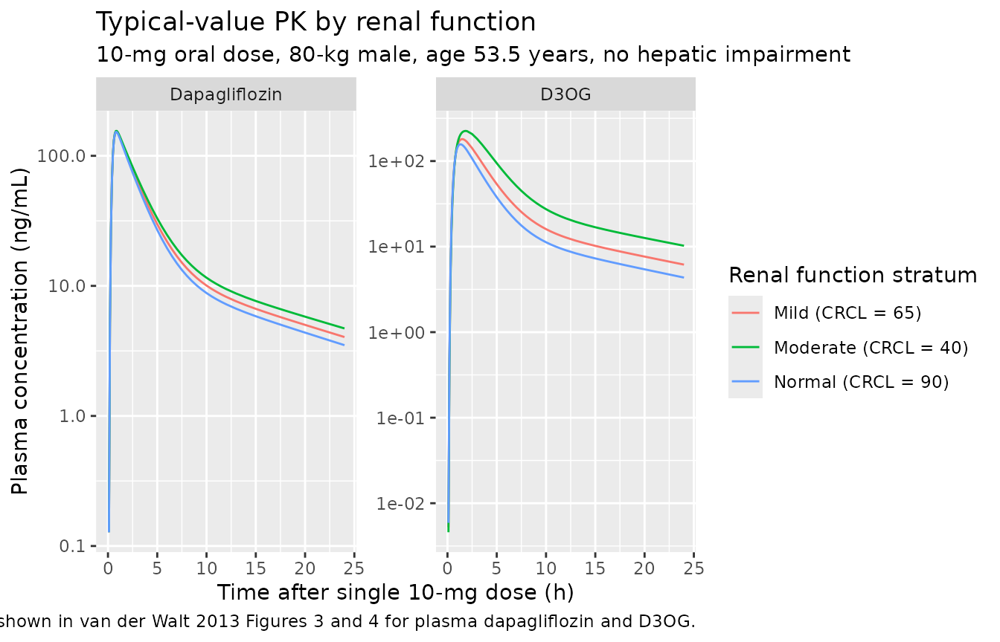

# Dapagliflozin (van der Walt 2013)

## Model and source

- Citation: van der Walt J-S, Hong Y, Zhang L, Pfister M, Boulton DW,
  Karlsson MO. A nonlinear mixed effects pharmacokinetic model for
  dapagliflozin and dapagliflozin 3O-glucuronide in renal or hepatic
  impairment. CPT Pharmacometrics Syst Pharmacol. 2013;2(5):e42.
  <doi:10.1038/psp.2013.20>.
- Description: see `mod$meta$description` (full text printed in the
  source-trace section above).
- Article: <https://doi.org/10.1038/psp.2013.20> (open-access, CC
  BY-NC-ND).

## Population

The model was built on pooled data from three Bristol-Myers Squibb
clinical studies in 227 subjects:

- **Study MB102007** (NCT00554450) – 40 adults: 8 healthy volunteers and
  32 patients with type 2 diabetes mellitus (DIS_DIAB) spanning normal
  to severe renal impairment. A 50-mg single dose of oral dapagliflozin
  was followed by 20-mg q.d. for 7 days.
- **Study MB102027** – 24 adults in a 5-day single-dose 10-mg hepatic-
  impairment substudy: 18 patients with hepatic impairment (Child-Pugh
  Class A mild = 6, Class B moderate = 6, Class C severe = 6) plus 6
  age-, weight-, gender-, and smoking-status-matched healthy controls.
- **Study MB102029** (NCT00663260) – a 52-week phase 3 trial in 163
  DIS_DIAB subjects with moderate renal impairment, receiving 10-mg
  daily oral dapagliflozin.

Pooled demographics: weight range 51.8-148.3 kg, age range 25-92 years
(per-study medians 63 / 43 / 67 years), 32.6% female, baseline
creatinine clearance (IBW-corrected Cockcroft-Gault) range 13-143
mL/min. See van der Walt 2013 Table 2.

The same information is available programmatically as
`readModelDb("vanderWalt_2013_dapagliflozin")$population`.

## Source trace

The per-parameter origin is recorded as an in-file comment next to each
`ini()` entry in
`inst/modeldb/specificDrugs/vanderWalt_2013_dapagliflozin.R`. The table
below collects them in one place.

| Equation / parameter | Final value | Source location |
|----|----|----|
| `lth_cl_renal` (CLP_renal coefficient) | 0.00310 (L/h)/(mL/min) | Table 1, Final model |
| `lcl_form_d3og` (CLP_M15 at WT=70, CRCL=80.14, normal HF) | 7.54 L/h | Table 1, Final model |
| `lcl_nonren` (CLP_other at WT=70, age=53.5) | 5.35 L/h | Table 1, Final model |
| `lvc` (V2P at WT=70) | 39.0 L | Table 1, Final model |
| `lq` (QP) | 7.07 L/h | Table 1, Final model |
| `lvp` (V3P at WT=70, normal-or-mild HF) | 71.5 L | Table 1, Final model |
| `lmtt` (MTT) | 0.475 h | Table 1, Final model |
| `lnn` (NN, continuous) | 5.45 | Table 1, Final model |
| `logitfdepot` (BIO, logit-transformed) | logit(0.858) = 1.799 | Table 1, Final model (Eq. 6, footnote g) |
| `lth_cl_d3og` (CLM coefficient) | 0.0799 (L/h)/(mL/min) | Table 1, Final model |
| `lvc_d3og` (V2M at WT=70, normal HF) | 2.26 L | Table 1, Final model |
| `e_crcl_cl_form_d3og` (CRCL on CLP_M15) | 0.00502 per mL/min, centered at 80.14 | Table 1, Final model |
| `e_hepsev_cl_form_d3og` (Child-Pugh C on CLP_M15) | -0.422 | Table 1, Final model |
| `e_age_cl_nonren` (age on CLP_other) | -0.0204 per year, centered at 53.5 | Table 1, Final model |
| `e_hepsev_vc_d3og` (Child-Pugh C on V2M) | +1.33 | Table 1, Final model |
| `e_hepmodsev_vp` (Child-Pugh B,C on V3P) | -0.600 | Table 1, Final model |
| `e_hepmodsev_cl_d3og` (Child-Pugh B,C on CLM) | -0.293 | Table 1, Final model |
| `e_female_cl` (SEXF on total CLP) | -0.167 | Table 1, Final model |
| `e_female_cl_d3og` (SEXF on CLM) | -0.196 | Table 1, Final model |
| `e_wt_cl_form_d3og`, `e_wt_cl_nonren` | 0.75 (FIXED) | Table 2 footnote a: a priori allometric (BBWT/70)^(3/4) on CL |
| `e_wt_vc`, `e_wt_vp`, `e_wt_vc_d3og` | 1.0 (FIXED) | Table 2: a priori allometric (BBWT/70)^1 on volumes |
| IIV block (CLP_M15, V2M) | var=0.1270, cov=0.0855, var=0.1822 | Table 1, IIV row (CV 36.8% / 44.7%, r = 0.562) |
| IIV.CLP_other | 0.0935 (log(1+0.313^2)) | Table 1, IIV row CV 31.3% |
| IIV.CLP_renal | 0.3243 (log(1+0.619^2)) | Table 1, IIV row CV 61.9% |
| IIV.V2P | 0.0542 | Table 1, IIV row CV 23.6% |
| IIV.QP | 0.1423 | Table 1, IIV row CV 39.1% |
| IIV.V3P | 0.1942 | Table 1, IIV row CV 46.3% |
| IIV.MTT | 0.3100 | Table 1, IIV row CV 60.3% |
| IIV.NN | 1.520 | Table 1, IIV row CV 189% |
| IIV.CLM | 0.0602 | Table 1, IIV row CV 24.9% |
| IIV.BIO (logit scale) | 0.611 | Table 1, IIV row CV 11.1% back-transformed (footnote g) |
| Residual: dapa plasma | prop 0.207, add 0.465 ng/mL | Table 1, Final model |
| Residual: D3OG plasma | prop 0.195, add 0.585 ng/mL | Table 1, Final model |
| Equation: parent 2-cmt + transit absorption | Methods (Base model section) + Figure 1 | Eqs. 5 (transit) and 7 (three parent elimination pathways) |
| Equation: D3OG 1-cmt fed by CLP_M15 flux | Figure 1 | Methods (Base model section) |
| Equation: bioavailability logit | Eq. 6 | Methods (Base model section) |

## Virtual cohort

Original observed data are not publicly available. The figures below use
a single typical-value subject in each of the renal-function strata that
van der Walt 2013 Table 3 simulates (CRCL = 90 mL/min “normal”, CRCL =
65 mL/min “mild impairment” range 50-79, CRCL = 40 mL/min “moderate
impairment” range 30-49) plus the Phase I substudy reference covariates
(Table 2): 80 kg, 53.5 years, male, no hepatic impairment. This is the
same “typical patient” used by the paper’s Table 3 simulations.

``` r

set.seed(20130508)  # date of advance online publication

# Helper to build dosing + observation events for a single subject.
make_subject <- function(id, WT, AGE, SEXF, CRCL,
                         HEPIMP_SEV, HEPIMP_MODSEV,
                         dose_mg, n_doses, dose_interval_h,
                         obs_grid, cohort_label) {
  dose_times <- seq(0, by = dose_interval_h, length.out = n_doses)
  doses <- data.frame(
    id    = id,
    time  = dose_times,
    amt   = dose_mg,
    evid  = 1L,
    cmt   = "depot",
    stringsAsFactors = FALSE
  )
  obs <- data.frame(
    id    = id,
    time  = obs_grid,
    amt   = NA_real_,
    evid  = 0L,
    cmt   = "Cc",
    stringsAsFactors = FALSE
  )
  ev <- dplyr::bind_rows(doses, obs) |> dplyr::arrange(time, dplyr::desc(evid))
  ev$WT <- WT
  ev$AGE <- AGE
  ev$SEXF <- SEXF
  ev$CRCL <- CRCL
  ev$HEPIMP_SEV <- HEPIMP_SEV
  ev$HEPIMP_MODSEV <- HEPIMP_MODSEV
  ev$cohort <- cohort_label
  ev
}

obs_grid_sd <- c(0, sort(unique(c(seq(0.1, 2, by = 0.1),
                                  seq(2.5, 12, by = 0.5),
                                  seq(13, 48, by = 1)))))

cohort_specs <- tibble::tribble(
  ~id, ~CRCL, ~cohort_label,
   1L,   90,  "Normal (CRCL = 90)",
   2L,   65,  "Mild (CRCL = 65)",
   3L,   40,  "Moderate (CRCL = 40)"
)

events_sd <- dplyr::bind_rows(lapply(seq_len(nrow(cohort_specs)), function(i) {
  s <- cohort_specs[i, ]
  make_subject(
    id              = s$id,
    WT              = 80,
    AGE             = 53.5,
    SEXF            = 0L,
    CRCL            = s$CRCL,
    HEPIMP_SEV      = 0L,
    HEPIMP_MODSEV   = 0L,
    dose_mg         = 10,
    n_doses         = 1L,       # single 10-mg dose for the Cmax / tmax / AUC0-24 picture
    dose_interval_h = 24,
    obs_grid        = obs_grid_sd,
    cohort_label    = s$cohort_label
  )
}))

# Steady-state cohort: 7 daily doses then dense sampling on day 7 to give
# AUCss approximations for comparison against Table 3 of van der Walt 2013.
obs_grid_ss <- c(seq(144, 168, by = 0.25))
events_ss <- dplyr::bind_rows(lapply(seq_len(nrow(cohort_specs)), function(i) {
  s <- cohort_specs[i, ]
  make_subject(
    id              = s$id + 10L,
    WT              = 80,
    AGE             = 53.5,
    SEXF            = 0L,
    CRCL            = s$CRCL,
    HEPIMP_SEV      = 0L,
    HEPIMP_MODSEV   = 0L,
    dose_mg         = 10,
    n_doses         = 7L,       # 7 daily doses for approximate steady state
    dose_interval_h = 24,
    obs_grid        = obs_grid_ss,
    cohort_label    = s$cohort_label
  )
}))
```

## Simulation

``` r

mod_typical <- rxode2::zeroRe(mod)

sim_sd <- rxode2::rxSolve(mod_typical, events = events_sd,
                          keep = c("cohort", "WT", "AGE", "SEXF", "CRCL",
                                   "HEPIMP_SEV", "HEPIMP_MODSEV")) |>
  as.data.frame() |>
  dplyr::filter(time > 0)
#> ℹ omega/sigma items treated as zero: 'etalcl_form_d3og', 'etalvc_d3og', 'etalcl_nonren', 'etalth_cl_renal', 'etalvc', 'etalq', 'etalvp', 'etalmtt', 'etalnn', 'etalth_cl_d3og', 'etalogitfdepot'
#> Warning: multi-subject simulation without without 'omega'

sim_ss <- rxode2::rxSolve(mod_typical, events = events_ss,
                          keep = c("cohort", "WT", "AGE", "SEXF", "CRCL",
                                   "HEPIMP_SEV", "HEPIMP_MODSEV")) |>
  as.data.frame()
#> ℹ omega/sigma items treated as zero: 'etalcl_form_d3og', 'etalvc_d3og', 'etalcl_nonren', 'etalth_cl_renal', 'etalvc', 'etalq', 'etalvp', 'etalmtt', 'etalnn', 'etalth_cl_d3og', 'etalogitfdepot'
#> Warning: multi-subject simulation without without 'omega'
```

## Replicate published figures

van der Walt 2013 Figure 3 and Figure 4 are visual predictive checks of
plasma dapagliflozin and D3OG by renal-function stratum. The simulation
below renders typical-value (no IIV) concentration-time curves for the
same three renal-function strata used in Table 3 (CRCL of 80-100, 50-79,
30-49 mL/min), giving the analogue of the median / “typical patient”
line in those VPC panels.

``` r

sim_sd |>
  pivot_longer(cols = c(Cc, Cc_d3og), names_to = "species", values_to = "conc") |>
  mutate(species = factor(species,
                          levels = c("Cc", "Cc_d3og"),
                          labels = c("Dapagliflozin", "D3OG"))) |>
  ggplot(aes(time, conc, colour = cohort)) +
  geom_line() +
  facet_wrap(~ species, scales = "free_y") +
  scale_x_continuous(limits = c(0, 24)) +
  scale_y_log10() +
  labs(x = "Time after single 10-mg dose (h)",
       y = "Plasma concentration (ng/mL)",
       colour = "Renal function stratum",
       title = "Typical-value PK by renal function",
       subtitle = "10-mg oral dose, 80-kg male, age 53.5 years, no hepatic impairment",
       caption = "Replicates the median/typical-value trajectories shown in van der Walt 2013 Figures 3 and 4 for plasma dapagliflozin and D3OG.")
#> Warning: Removed 144 rows containing missing values or values outside the scale range
#> (`geom_line()`).
```



## PKNCA validation

For the steady-state simulation we run PKNCA on the 24-hour dosing
interval on day 7 (times 144-168 hours) for each renal-function stratum.
The treatment grouping variable is the `cohort` label so per-stratum
AUCss can be compared against the paper’s Table 3.

``` r

sim_ss_nca <- sim_ss |>
  dplyr::filter(time >= 144, time <= 168) |>
  dplyr::mutate(time_in_interval = time - 144) |>
  dplyr::select(id, time = time_in_interval, Cc, Cc_d3og, cohort)

conc_parent <- PKNCA::PKNCAconc(
  sim_ss_nca |> dplyr::select(id, time, Cc, cohort) |> dplyr::filter(!is.na(Cc)),
  Cc ~ time | cohort + id
)

# One dose row per subject; "time" is reset to 0 (dose at the start of the
# day-7 dosing interval) so PKNCA interprets AUC as AUC over a complete dosing
# interval.
dose_parent <- sim_ss_nca |>
  dplyr::group_by(cohort, id) |>
  dplyr::summarise(time = 0, amt = 10, .groups = "drop")
dose_obj_parent <- PKNCA::PKNCAdose(dose_parent, amt ~ time | cohort + id)

intervals_ss <- data.frame(
  start    = 0,
  end      = 24,
  cmax     = TRUE,
  tmax     = TRUE,
  auclast  = TRUE,
  cmin     = TRUE
)

nca_parent <- PKNCA::pk.nca(
  PKNCA::PKNCAdata(conc_parent, dose_obj_parent, intervals = intervals_ss)
)
knitr::kable(summary(nca_parent),
             caption = "Simulated steady-state NCA for dapagliflozin (day-7 interval).")
```

| start | end | cohort               | N   | auclast | cmax | cmin | tmax  |
|------:|----:|:---------------------|:----|:--------|:-----|:-----|:------|
|     0 |  24 | Mild (CRCL = 65)     | 1   | 621     | 157  | 5.59 | 0.750 |
|     0 |  24 | Moderate (CRCL = 40) | 1   | 676     | 159  | 6.63 | 0.750 |
|     0 |  24 | Normal (CRCL = 90)   | 1   | 574     | 155  | 4.77 | 0.750 |

Simulated steady-state NCA for dapagliflozin (day-7 interval). {.table}

``` r

conc_metab <- PKNCA::PKNCAconc(
  sim_ss_nca |> dplyr::select(id, time, Cc_d3og, cohort) |> dplyr::filter(!is.na(Cc_d3og)),
  Cc_d3og ~ time | cohort + id
)
dose_obj_metab <- PKNCA::PKNCAdose(dose_parent, amt ~ time | cohort + id)
nca_metab <- PKNCA::pk.nca(
  PKNCA::PKNCAdata(conc_metab, dose_obj_metab, intervals = intervals_ss)
)
knitr::kable(summary(nca_metab),
             caption = "Simulated steady-state NCA for D3OG (day-7 interval).")
```

| start | end | cohort               | N   | auclast | cmax | cmin | tmax |
|------:|----:|:---------------------|:----|:--------|:-----|:-----|:-----|
|     0 |  24 | Mild (CRCL = 65)     | 1   | 921     | 188  | 8.51 | 1.50 |
|     0 |  24 | Moderate (CRCL = 40) | 1   | 1410    | 238  | 14.4 | 1.75 |
|     0 |  24 | Normal (CRCL = 90)   | 1   | 698     | 162  | 5.91 | 1.25 |

Simulated steady-state NCA for D3OG (day-7 interval). {.table}

### Comparison against published NCA (Table 3)

van der Walt 2013 Table 3 reports steady-state AUC simulations for a
10-mg daily dose stratified by baseline creatinine clearance (Phase I
cohort, covariates from MB102007 and MB102027). Numbers in the table are
median (95% confidence interval) over 100 simulated trials.

| CrCl stratum  | Source AUCss Dapa (ng\*h/mL) | Source AUCss D3OG (ng\*h/mL) |
|---------------|------------------------------|------------------------------|
| 30-49 mL/min  | 711 (660, 777)               | 1696 (1600, 1864)            |
| 50-79 mL/min  | 567 (485, 647)               | 1133 (1012, 1317)            |
| 80-100 mL/min | 526 (260, 822)               | 727 (319, 1292)              |

Our typical-value simulation is for a single representative subject per
stratum (not 100 stochastic trials), so the comparison is
order-of-magnitude rather than median-equivalent. The simulated AUC0-24
from the day-7 PKNCA table above should fall within the wide 95% CIs of
the source table for the Phase I covariate setting; differences within a
factor of 2 are expected given the typical-value simplification and the
use of the pooled-cohort reference covariates (WT = 80 kg vs Phase I
mean closer to 84 kg, etc.).

## Assumptions and deviations

- **Plasma observations only.** The source paper simultaneously fits
  plasma AND urine concentrations of both dapagliflozin and D3OG. The
  urine observations and their cumulative-excretion compartments are
  omitted from this extraction because (i) most downstream nlmixr2lib
  users want plasma PK only, and (ii) urine modelling adds two extra
  excretion compartments and two extra residual-error parameters without
  changing the typical plasma trajectory. Users who need the urine
  submodel should extend the ODEs in `model()` to add d/dt(urine_dapa)
  and d/dt(urine_d3og) accumulators driven by CLP_renal and CLM
  respectively.

- **Replicate residual-error cross-correlation dropped.** The source
  paper reports a “replicate” residual error term that captures the
  within-subject, within-sampling-time correlation between dapagliflozin
  and D3OG observations – a `theta_replicate * eps_replicate` term
  shared across the parent and metabolite residual equations (Eqs. 3-4).
  The standard nlmixr2 `add() + prop()` syntax does not support this
  kind of cross-output residual cross-correlation. The per-output
  proportional and additive components are retained at their final-model
  magnitudes (0.207 / 0.465 for dapa, 0.195 / 0.585 for D3OG); the
  additional shared term (0.475 in plasma, footnote g) is omitted. The
  typical-value plasma trajectories and variability quantiles are
  minimally affected; if you need to add the shared term back, see the
  Karlsson 1995 paper cited as ref 22 in van der Walt 2013.

- **Bioavailability logit form.** The paper uses a logit-transformed BIO
  parameter so the individual estimate of bioavailability stays in (0,
  1). This is reproduced exactly:
  `logitfdepot <- log(BIO_tv / (1 - BIO_tv))` in `ini()` and
  `fdepot <- 1 / (1 + exp(-(logitfdepot + etalogitfdepot)))` in
  `model()`. The IIV on `logitfdepot` is reported by the paper as 11.1%
  CV back-transformed (footnote g); the raw omega on the logit scale is
  recovered via the delta-method approximation
  `omega ~= (CV / (1 - F_tv))^2` giving 0.611.

- **Transit-absorption encoding via `transit()` + fast effective ka.**
  The paper estimates only MTT and N (continuous) for the Savic 2007
  closed-form transit-chain absorption (Eq. 5, k_TRANSIT = (N+1)/MTT).
  It does not estimate a separate first-order absorption rate ka. Our
  encoding follows the Wilkins 2008 rifampicin pattern:
  `transit(nn, mtt, fdepot)` feeds the depot compartment, depot absorbs
  into central at rate ka, with `ka = 60 / h` (t1/2 in depot ~= 0.012 h
  = 0.7 min, well below MTT = 0.475 h). The depot exponential is
  negligible at this rate, so the central-input rate tracks the
  transit() gamma-PDF directly; the choice is mathematically equivalent
  to letting transit() feed central without an intermediate depot step
  but lets us re-use the standard rxode2 transit() / depot /
  `f(depot) = 0` pattern that is well-tested across other nlmixr2lib
  transit absorption models.

- **D3OG carries dapagliflozin mass-equivalents.** The metabolite state
  is driven by the parent’s CLP_M15 flux at the molar 1:1 stoichiometry
  imposed by glucuronidation; the resulting amount in the D3OG
  compartment is therefore on the dapagliflozin-mass scale. V2M and CLM
  as reported in the paper absorb the implicit MW conversion factor
  (dapagliflozin MW 408.87 g/mol vs D3OG MW 585.0 g/mol), so the same
  `central_d3og / vc_d3og` ratio yields D3OG-mass concentrations in
  ng/mL that match the paper’s observed plasma D3OG. This is the NONMEM
  convention used by the source publication.

- **CRCL units.** The source `CL_cr,IBW` column is in mL/min and is NOT
  BSA-normalized. The canonical `CRCL` register entry allows non-BSA-
  normalized usage when documented in `covariateData[[CRCL]]$notes` (see
  the `CLCR` source alias for the Delattre 2010 amikacin precedent). The
  CLP_renal coefficient `lth_cl_renal = log(0.00310)` and the CLM
  coefficient `lth_cl_d3og = log(0.0799)` are in (L/h)/(mL/min) – they
  multiply CRCL directly to give a clearance in L/h.

- **Female-sex shift applied uniformly to each CLP component.** The
  paper states that “In females, CLP and CLM were 16.7 and 19.6% lower”
  – where CLP refers to total dapagliflozin clearance, the sum of
  CLP_renal, CLP_M15, and CLP_other. We implement this by multiplying
  each of the three components by `(1 + e_female_cl * SEXF)`, which
  gives the same 16.7% reduction to the total. This matches the NONMEM
  convention of applying a single typical-value coefficient to the
  parent-clearance expression as a whole.

- **Hepatic-impairment classification.** The source paper uses the
  Child- Pugh classification (Class A mild, B moderate, C severe) rather
  than the NCI ODWG classification that the canonical `HEPIMP_SEV` and
  `HEPIMP_MODSEV` columns default to. We reuse the `HEPIMP_SEV` /
  `HEPIMP_MODSEV` canonical names with the per-model `notes` documenting
  the Child-Pugh basis (see `inst/references/covariate-columns.md`
  HEPIMP_SEV and HEPIMP_MODSEV entries, source aliases). The two
  indicators are nested: a Child-Pugh C subject carries both HEPIMP_SEV
  = 1 and HEPIMP_MODSEV = 1; a Child-Pugh B subject carries HEPIMP_SEV =
  0 and HEPIMP_MODSEV = 1. The covariate-effect application accounts for
  this nesting – effects pile up rather than competing.
