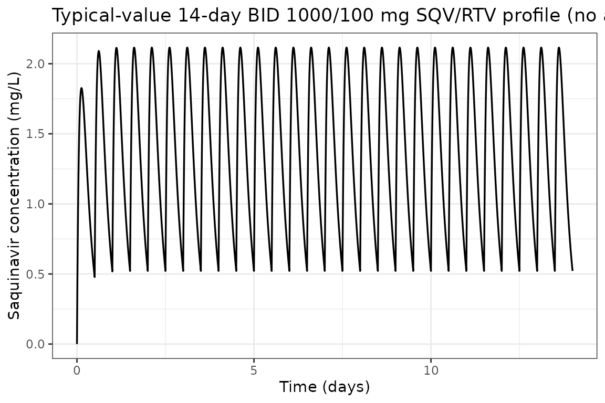
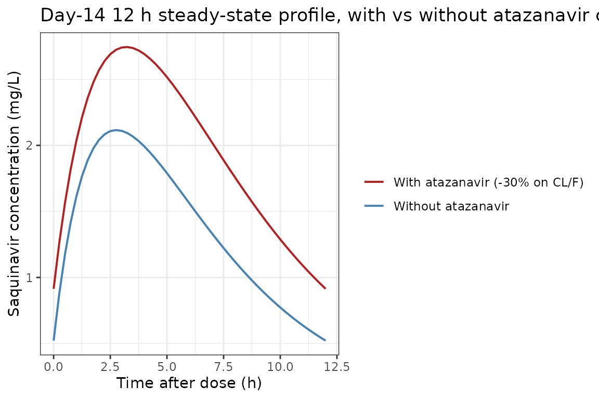
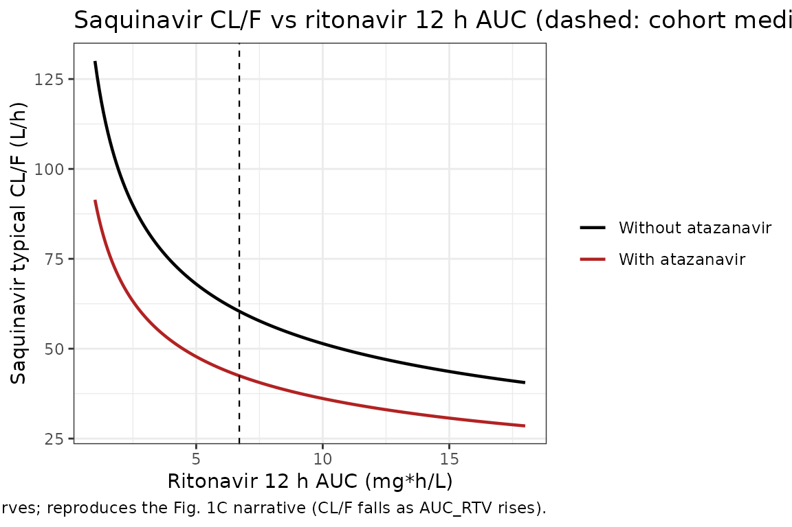
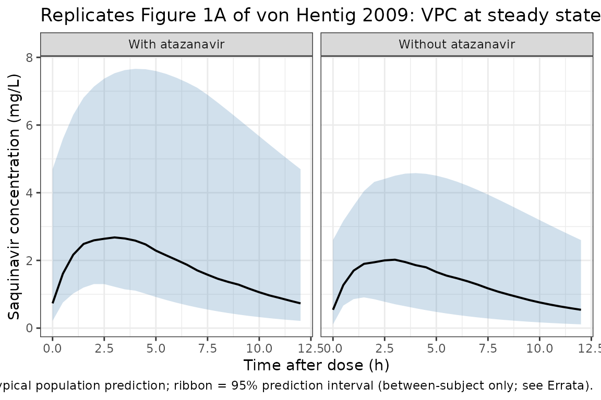

# Saquinavir (von Hentig 2009)

## Model and source

- Citation: von Hentig N, Loetsch J. Cytochrome P450 3A inhibition by
  atazanavir and ritonavir, but not demography or drug formulation,
  influences saquinavir population pharmacokinetics in human
  immunodeficiency virus type 1-infected adults. Antimicrob Agents
  Chemother. 2009 Aug;53(8):3524-3527. <doi:10.1128/AAC.00025-09>.
- Description: One-compartment first-order-absorption population PK
  model for oral ritonavir-boosted saquinavir (1000/100 mg BID) in 136
  HIV-1-infected adults including 13 pregnant women. Apparent oral
  clearance CL/F is modulated by two retained covariates: a binary
  atazanavir-coadministration indicator (CONMED_ATAZANAVIR; 49 of 136
  patients on ATV 300 mg QD) as a power-of-binary multiplier
  0.703^CONMED_ATAZANAVIR (30% CL reduction when atazanavir is
  coadministered), and the per-subject ritonavir 12 h AUC
  (CONMED_RTV_AUC_12h, cohort median 6.70355 mg\*h/L) as a normalised
  power form (CONMED_RTV_AUC_12h / 6.70355)^(-0.403). Saquinavir
  formulation (Invirase hard gel vs Fortovase soft gel) was tested and
  not retained. Inter-individual variability is estimated on CL/F
  (53.1% CV) and V/F (54.8% CV); IIV on ka was rejected during model
  building. Residual error was reported as an additive-error model but
  the additive SD value is not reported anywhere in the paper – addSd is
  encoded as fixed(0) and the vignette Errata documents the omission
  (von Hentig & Loetsch 2009).
- Article: [Antimicrob Agents Chemother. 2009
  Aug;53(8):3524-3527](https://doi.org/10.1128/AAC.00025-09)

von Hentig and Loetsch (2009) describe a one-compartment
first-order-absorption population PK model for orally administered
ritonavir-boosted saquinavir (1000/100 mg twice daily) in 136
HIV-1-infected adults. The final model retains two covariates on
apparent oral clearance CL/F: a binary atazanavir coadministration
indicator (`CONMED_ATAZANAVIR`; 49 of 136 patients on ATV 300 mg QD)
entering as a power-of-binary multiplier, and the per-subject ritonavir
12 h AUC (`CONMED_RTV_AUC_12h`; cohort median 6.70355 mg*h/L = 6703.55
ng/ml*h) entering as a centred power form. Demographics (age, weight,
sex, pregnancy) and the saquinavir capsule formulation (Invirase hard
gel vs Fortovase soft gel) were tested and not retained.

## Population

The analysis dataset comprises 136 HIV-1-infected adults enrolled at the
Goethe-University outpatient clinic in Frankfurt am Main, Germany,
including 13 pregnant women in their second or third trimester (mean
gestational age 32 weeks + 4 days, range 24 wk 3 d to 36 wk 5 d) (von
Hentig 2009 Methods). Patients with Child-Pugh class B/C liver function
impairment or with CYP3A4-modulating non-antiretroviral cotherapies were
excluded. All patients received saquinavir 1000 mg twice daily plus
low-dose ritonavir 100 mg twice daily as a CYP3A “booster”; 49 of 136
(36%) additionally received atazanavir 300 mg once daily as part of a
boosted double-protease-inhibitor regimen because reverse-transcriptase
inhibitors had had toxic effects or were ineffective due to viral
resistance. The remaining 87 patients received nucleosidic
reverse-transcriptase inhibitors instead.

Baseline demographics (von Hentig 2009 Methods paragraph 3):

| Variable                    | Men (n = 104) | Women (n = 32) |
|-----------------------------|---------------|----------------|
| Age (years), median (range) | 41.5 (20-71)  | 32.5 (19-64)   |
| Weight (kg), median (range) | 74 (51-116)   | 68.5 (42-100)  |
| Pregnant (n)                | \-            | 13             |

Per Methods paragraph 4, a 12-hour plasma drug concentration-versus-time
profile (pre-dose and 1, 2, 4, 6, 9, 12 h post-dose) was taken once for
each patient between the 9th and 2303rd saquinavir-ritonavir dose
(median 61st) at steady state, after an overnight fast and a
standardized 595 kcal breakfast (21% fat) served after drug
administration. Plasma concentrations were measured by HPLC-MS/MS with a
lower limit of quantification of 20 ng/ml, linearity proven up to 20000
ng/ml, and a calibration CV of less than 20% across the quantification
range.

The same information is available programmatically via the model’s
`population` metadata
(`readModelDb("vonHentig_2009_saquinavir")$population`).

## Source trace

The per-parameter origin is recorded as an in-file comment next to each
`ini()` entry in
`inst/modeldb/specificDrugs/vonHentig_2009_saquinavir.R`. The table
below collects them in one place for review.

| Parameter / equation | Value | Source location |
|----|----|----|
| `lcl` | log(60.4) | Table 2 full (final) model column: CL/F = 60.4 L/h (95% CI 52.7-69) |
| `lvc` | log(126) | Table 2 full (final) model column: V/F = 126 L (95% CI 105-147) |
| `lka` | log(0.21) | Table 2 full (final) model column: ka = 0.21 1/h (95% CI 0.19-0.23) |
| `e_atazanavir_cl` | 0.703 | Table 2 full (final) model column: theta1,atazanavir = 0.703 (95% CI 0.58-0.87) |
| `e_rtv_auc_12h_cl` | -0.403 | Table 2 full (final) model column: theta2,ritonavir = -0.403 (95% CI -0.59 to -0.23) |
| Reference AUC_RTV (centring) | 6.70355 mg\*h/L | Table 1 row “AUC ritonavir” and Table 2 footnote d: median 12 h AUC_RTV across the 136 patients = 6703.55 ng/ml\*h |
| Reference AUC_ATV (screen) | 24.0296 mg\*h/L | Table 1 row “AUC atazanavir” footnote a: median AUC_ATV across 49 patients on ATV = 24029.6 ng/ml\*h (tested as a continuous covariate; did not enter the final model) |
| IIV CL/F (CV) | 53.1% | Table 2 full (final) model column (95% CI 44.8-61.1); omega^2 = log(1 + 0.531^2) |
| IIV V/F (CV) | 54.8% | Table 2 full (final) model column (95% CI 41.2-65.9); omega^2 = log(1 + 0.548^2) |
| IIV ka | n/a (none) | Results paragraph 4: tested and rejected (delta-2LL only -0.61 vs +6.63 entry threshold) |
| `addSd` | fixed(0) | Results paragraph 4: “an additive-error model” – the additive SD value is NOT reported in the paper; placeholder per the operator’s general missing-RUV rule (see Errata) |
| CL/F covariate equation | n/a | Table 2 full-model ODE column: CL = exp(lcl) \* theta1_ATV^atazanavir \* (AUC_ritonavir / 6703.55 ng/ml\*h)^theta2_RTV |
| ODE system | n/a | Table 2 full-model ODE column: dA(0)/dt = F*dose - ka*A(0); dA(1)/dt = ka*A(0) - CL*A(1)/V |

ODE structure: one-compartment first-order absorption from `depot` to
`central` with no absorption lag-time. The observation variable is
`Cc = central / vc` with additive residual error (`addSd` fixed at 0
because the additive SD value is not reported; see Errata).

The saquinavir CL/F equation (Table 2 full-model column) expands to:

    CL/F_i = exp(lcl + etalcl_i) * 0.703^CONMED_ATAZANAVIR
                                * (CONMED_RTV_AUC_12h / 6.70355)^(-0.403)

At the cohort-median ritonavir AUC of 6.70355 mg*h/L without atazanavir,
the typical CL/F equals 60.4 L/h. With atazanavir coadministration at
the same ritonavir AUC, the typical CL/F drops to 60.4* 0.703 = 42.5 L/h
(approximately 30% lower).

## Load model

``` r

mod <- readModelDb("vonHentig_2009_saquinavir")
mod_typical <- rxode2::zeroRe(mod)
#> ℹ parameter labels from comments will be replaced by 'label()'
```

## Typical-value steady-state profile (no atazanavir, median ritonavir AUC)

Replicates the no-atazanavir arm of the published figure: saquinavir
1000 mg + ritonavir 100 mg BID at the cohort-median per-subject
ritonavir 12 h AUC of 6.70355 mg*h/L, simulated to steady state. The
typical steady-state AUC over the 12 h dosing interval is
`dose / CL/F = 1000 / 60.4` = 16.6 mg*h/L because CL/F at the median
ritonavir AUC without atazanavir is the unmodified typical value 60.4
L/h.

``` r

n_doses <- 28L      # 14 days BID = 28 doses to reach steady state
ii      <- 12       # h (BID dosing interval)

ev_ss_noatv <- rxode2::et(
  amt = 1000, cmt = "depot", evid = 1,
  ii = ii, addl = n_doses - 1L
) |>
  rxode2::et(seq(0, n_doses * ii, by = 0.25)) |>
  rxode2::et(id = 1)
ev_ss_noatv$CONMED_ATAZANAVIR  <- 0
ev_ss_noatv$CONMED_RTV_AUC_12h <- 6.70355

sim_ss_noatv <- rxode2::rxSolve(mod_typical, ev_ss_noatv)
#> ℹ omega/sigma items treated as zero: 'etalcl', 'etalvc'

ggplot(as.data.frame(sim_ss_noatv), aes(time / 24, Cc)) +
  geom_line(linewidth = 0.6) +
  labs(
    x     = "Time (days)",
    y     = "Saquinavir concentration (mg/L)",
    title = "Typical-value 14-day BID 1000/100 mg SQV/RTV profile (no atazanavir, median AUC_RTV_12h)"
  ) +
  theme_bw()
```



## Typical-value steady-state profile – with vs without atazanavir (Day 14)

The same regimen with `CONMED_ATAZANAVIR = 1` (subject on atazanavir 300
mg QD). The 30% reduction in CL/F (typical-value multiplier 0.703)
should lift the steady-state profile upward relative to the
no-atazanavir case at the same ritonavir exposure.

``` r

ev_ss_atv <- ev_ss_noatv
ev_ss_atv$CONMED_ATAZANAVIR <- 1
sim_ss_atv <- rxode2::rxSolve(mod_typical, ev_ss_atv)
#> ℹ omega/sigma items treated as zero: 'etalcl', 'etalvc'

profile_comparison <- bind_rows(
  as.data.frame(sim_ss_noatv) |>
    dplyr::filter(time >= 13 * 24, time <= 13 * 24 + ii) |>
    dplyr::mutate(t_post_dose = time - 13 * 24, regimen = "Without atazanavir"),
  as.data.frame(sim_ss_atv) |>
    dplyr::filter(time >= 13 * 24, time <= 13 * 24 + ii) |>
    dplyr::mutate(t_post_dose = time - 13 * 24, regimen = "With atazanavir (-30% on CL/F)")
)

ggplot(profile_comparison, aes(t_post_dose, Cc, color = regimen)) +
  geom_line(linewidth = 0.7) +
  scale_color_manual(values = c(
    "Without atazanavir"             = "steelblue",
    "With atazanavir (-30% on CL/F)" = "firebrick"
  )) +
  labs(
    x     = "Time after dose (h)",
    y     = "Saquinavir concentration (mg/L)",
    color = NULL,
    title = "Day-14 12 h steady-state profile, with vs without atazanavir coadministration"
  ) +
  theme_bw()
```



## Effect of ritonavir AUC on the typical CL/F (Table 2 final-model equation)

The model’s centred power-form dependence of saquinavir CL/F on
ritonavir 12 h AUC implies CL/F falls as ritonavir exposure rises
(negative exponent), which is consistent with stronger CYP3A inhibition
at higher booster concentrations. The closed-form typical CL/F is:

    CL/F = 60.4 * 0.703^CONMED_ATAZANAVIR * (CONMED_RTV_AUC_12h / 6.70355)^(-0.403)

``` r

cl_grid <- expand.grid(
  AUC_RTV = seq(1, 18, length.out = 201),
  regimen = c("Without atazanavir", "With atazanavir")
) |>
  dplyr::mutate(
    f_atv      = ifelse(regimen == "With atazanavir", 0.703, 1.000),
    typical_cl = 60.4 * f_atv * (AUC_RTV / 6.70355)^(-0.403)
  )

ggplot(cl_grid, aes(AUC_RTV, typical_cl, color = regimen)) +
  geom_line(linewidth = 0.8) +
  geom_vline(xintercept = 6.70355, linetype = "dashed", linewidth = 0.4) +
  scale_color_manual(values = c(
    "Without atazanavir" = "black",
    "With atazanavir"    = "firebrick"
  )) +
  labs(
    x     = "Ritonavir 12 h AUC (mg*h/L)",
    y     = "Saquinavir typical CL/F (L/h)",
    color = NULL,
    title = "Saquinavir CL/F vs ritonavir 12 h AUC (dashed: cohort median 6.70355 mg*h/L)",
    caption = "Closed-form curves; reproduces the Fig. 1C narrative (CL/F falls as AUC_RTV rises)."
  ) +
  theme_bw()
```



The curves cross the cohort-median ritonavir AUC at the typical CL/F
values quoted in the paper Discussion: 60.4 L/h without atazanavir and
42.5 L/h (= 60.4 \* 0.703) with atazanavir at the same exposure.

## Virtual cohort matched to study demographics

200 virtual subjects: roughly two-thirds without atazanavir, one-third
with atazanavir (matching the 87:49 ratio in the cohort). Each subject’s
per-subject ritonavir 12 h AUC is sampled from a log-normal centred at
the cohort median 6.70355 mg\*h/L.

``` r

set.seed(2009)
n_subj <- 200L
n_atv  <- round(n_subj * 49 / 136)  # 72 of 200 (~36%) on atazanavir

cohort <- data.frame(
  ID                = seq_len(n_subj),
  CONMED_ATAZANAVIR = c(rep(1L, n_atv), rep(0L, n_subj - n_atv))
)

# Ritonavir 12 h AUC ~ log-normal centred at cohort median 6.70355 mg*h/L.
cohort$CONMED_RTV_AUC_12h <- pmin(
  20,
  pmax(1, exp(rnorm(n_subj, log(6.70355), 0.5)))
)

# Shuffle so atazanavir arm and ritonavir AUC are independent.
cohort <- cohort[sample.int(n_subj), ]
cohort$ID <- seq_len(n_subj)

summary(cohort$CONMED_RTV_AUC_12h)
#>    Min. 1st Qu.  Median    Mean 3rd Qu.    Max. 
#>   1.101   4.402   6.204   7.167   8.695  20.000
table(CONMED_ATAZANAVIR = cohort$CONMED_ATAZANAVIR)
#> CONMED_ATAZANAVIR
#>   0   1 
#> 128  72
```

### Stochastic simulation across the virtual cohort

Each subject receives 28 BID doses (14 days). Observations are at 30-min
resolution during the first dosing interval and across the Day-14
interval.

``` r

build_subject_events <- function(id, atv, auc_rtv) {
  ev <- rxode2::et(
    amt = 1000, cmt = "depot", evid = 1,
    ii = ii, addl = n_doses - 1L
  ) |>
    rxode2::et(c(seq(0, ii, by = 0.5), seq(13 * 24, 13 * 24 + ii, by = 0.5))) |>
    rxode2::et(id = id)
  df <- as.data.frame(ev)
  df$CONMED_ATAZANAVIR  <- atv
  df$CONMED_RTV_AUC_12h <- auc_rtv
  df
}

ev_all <- do.call(
  rbind,
  Map(
    build_subject_events,
    cohort$ID,
    cohort$CONMED_ATAZANAVIR,
    cohort$CONMED_RTV_AUC_12h
  )
)

set.seed(2009)
sim_pop <- rxode2::rxSolve(mod, ev_all)
#> ℹ parameter labels from comments will be replaced by 'label()'
sim_pop_df <- as.data.frame(sim_pop)

# Attach the per-id ATV / AUC_RTV stratifiers from the cohort table so the
# downstream group_by() and PKNCA stratifications carry the labels.
sim_pop_df$treatment <- ifelse(
  cohort$CONMED_ATAZANAVIR[match(sim_pop_df$id, cohort$ID)] == 1L,
  "With atazanavir",
  "Without atazanavir"
)
```

## Replicate Figure 1 of von Hentig 2009: VPC by atazanavir status

Figure 1A1 (no atazanavir) and Figure 1A2 (with atazanavir) of the paper
show the simulated 95% prediction interval of saquinavir plasma
concentrations vs time after dose at steady state. Because the packaged
model encodes `addSd = fixed(0)` (the additive residual SD is not
reported in the paper – see Errata), the prediction band below reflects
only between-subject variability on CL/F and V/F; the published Fig. 1
bands additionally include residual variability.

``` r

vpc_df <- sim_pop_df |>
  dplyr::filter(time >= 13 * 24, time <= 13 * 24 + ii) |>
  dplyr::mutate(t_post_dose = time - 13 * 24) |>
  dplyr::group_by(treatment, t_post_dose) |>
  dplyr::summarise(
    Q025 = quantile(Cc, 0.025, na.rm = TRUE),
    Q50  = quantile(Cc, 0.50,  na.rm = TRUE),
    Q975 = quantile(Cc, 0.975, na.rm = TRUE),
    .groups = "drop"
  )

ggplot(vpc_df, aes(t_post_dose, Q50)) +
  geom_ribbon(aes(ymin = Q025, ymax = Q975), fill = "steelblue", alpha = 0.25) +
  geom_line(linewidth = 0.7) +
  facet_wrap(~treatment) +
  labs(
    x       = "Time after dose (h)",
    y       = "Saquinavir concentration (mg/L)",
    title   = "Replicates Figure 1A of von Hentig 2009: VPC at steady state",
    caption = "Solid line = typical population prediction; ribbon = 95% prediction interval (between-subject only; see Errata)."
  ) +
  theme_bw()
```



## PKNCA validation

Non-compartmental analysis of the simulated Day-14 12 h dosing interval,
stratified by atazanavir status. The paper does not tabulate observed
Cmax / Tmax / AUC0-12 values, but the typical-value AUC0-12 expected
from `dose / CL/F = 1000 / 60.4` is 16.56 mg*h/L without atazanavir and
`1000 / (60.4 * 0.703) = 23.55` mg*h/L with atazanavir at the cohort
median ritonavir AUC.

``` r

# Concentration frame: per-id observations across the Day-14 dosing interval.
# Use only !is.na(Cc) in the filter (avoid time > 0 / Cc > 0; see
# pknca-recipes.md: "Time-zero records (mandatory)").
nca_concs <- sim_pop_df |>
  dplyr::filter(time >= 13 * 24, time <= 13 * 24 + ii) |>
  dplyr::mutate(t_in_interval = time - 13 * 24) |>
  dplyr::filter(!is.na(Cc)) |>
  dplyr::select(id, t_in_interval, Cc, treatment)

# Guarantee a t = 0 row per (id, treatment); pre-dose Cc = 0 is the right
# value for first-order oral absorption.
nca_concs <- dplyr::bind_rows(
  nca_concs,
  nca_concs |>
    dplyr::distinct(id, treatment) |>
    dplyr::mutate(t_in_interval = 0, Cc = 0)
) |>
  dplyr::distinct(id, treatment, t_in_interval, .keep_all = TRUE) |>
  dplyr::arrange(id, treatment, t_in_interval)

conc_obj <- PKNCA::PKNCAconc(
  nca_concs, Cc ~ t_in_interval | treatment + id,
  concu = "mg/L", timeu = "h"
)

dose_records <- data.frame(
  id        = cohort$ID,
  time      = 0,
  amt       = 1000,
  treatment = ifelse(cohort$CONMED_ATAZANAVIR == 1L, "With atazanavir", "Without atazanavir"),
  stringsAsFactors = FALSE
)

dose_obj <- PKNCA::PKNCAdose(
  dose_records, amt ~ time | treatment + id,
  doseu = "mg"
)

intervals <- data.frame(
  start   = 0,
  end     = ii,
  cmax    = TRUE,
  tmax    = TRUE,
  cmin    = TRUE,
  auclast = TRUE,
  cav     = TRUE
)

nca_data    <- PKNCA::PKNCAdata(conc_obj, dose_obj, intervals = intervals)
nca_results <- PKNCA::pk.nca(nca_data)
nca_df      <- as.data.frame(nca_results$result)

nca_summary <- nca_df |>
  dplyr::filter(PPTESTCD %in% c("cmax", "tmax", "cmin", "auclast", "cav")) |>
  dplyr::group_by(treatment, PPTESTCD) |>
  dplyr::summarise(
    median = median(PPORRES, na.rm = TRUE),
    P05    = quantile(PPORRES, 0.05, na.rm = TRUE),
    P95    = quantile(PPORRES, 0.95, na.rm = TRUE),
    .groups = "drop"
  )

knitr::kable(
  nca_summary, digits = 3,
  caption = "Day-14 steady-state PKNCA summary across the virtual cohort, stratified by atazanavir status"
)
```

| treatment          | PPTESTCD | median |    P05 |    P95 |
|:-------------------|:---------|-------:|-------:|-------:|
| With atazanavir    | auclast  | 21.876 | 10.163 | 61.899 |
| With atazanavir    | cav      |  1.823 |  0.847 |  5.158 |
| With atazanavir    | cmax     |  2.702 |  1.428 |  6.366 |
| With atazanavir    | cmin     |  0.731 |  0.258 |  3.243 |
| With atazanavir    | tmax     |  3.000 |  2.000 |  4.000 |
| Without atazanavir | auclast  | 16.157 |  6.165 | 40.637 |
| Without atazanavir | cav      |  1.346 |  0.514 |  3.386 |
| Without atazanavir | cmax     |  2.065 |  1.119 |  4.379 |
| Without atazanavir | cmin     |  0.541 |  0.128 |  2.073 |
| Without atazanavir | tmax     |  3.000 |  1.500 |  4.000 |

Day-14 steady-state PKNCA summary across the virtual cohort, stratified
by atazanavir status {.table}

### Comparison against published values

The paper does not tabulate per-stratum NCA, but the typical CL/F values
quoted in Results / Discussion are exact closed-form consequences of the
equation.

| Quantity | Paper value | Simulated cohort |
|----|----|----|
| Typical CL/F at no-ATV, median AUC_RTV_12h (L/h) | 60.4 (Table 2 full-model) | 60.4 by construction (`exp(lcl) * 1 * 1`) |
| Typical CL/F at with-ATV, median AUC_RTV_12h (L/h) | 60.4 \* 0.703 = 42.46 (Discussion: “decreased to 70% by atazanavir”) | 42.46 by construction (`exp(lcl) * 0.703 * 1`) |
| Typical AUC0-12 at no-ATV, median AUC_RTV_12h (mg\*h/L) | dose/CL = 1000/60.4 = 16.56 | `nca_summary` `auclast` median for “Without atazanavir” |
| Typical AUC0-12 at with-ATV, median AUC_RTV_12h (mg\*h/L) | dose/CL = 1000/42.46 = 23.55 | `nca_summary` `auclast` median for “With atazanavir” |
| Fractional CL/F reduction by ATV coadministration | 30% reduction (theta1_ATV = 0.703) | by construction |
| Power-form exponent on (AUC_RTV/median) | -0.403 (Table 2 full-model) | by construction |

The cohort-stratum medians of `auclast` in the PKNCA summary should fall
close to 16.6 mg*h/L (no-ATV) and 23.5 mg*h/L (with-ATV) with
appropriate spread. The two-fold AUC0-12 cohort range emerges from the
+/-0.403 power dependence on per-subject ritonavir AUC.

## Assumptions and deviations

### Errata – additive residual SD not reported in the source

**Per the operator’s general missing-RUV rule (sidecar response
2026-06-17), the additive residual SD is encoded as
`addSd <- fixed(0)`.**

The Methods / Results paragraph 4 of von Hentig 2009 states only that
“an additive-error model were found to provide best fits using the
first-order conditional estimation method with the eta-eps interaction”.
No numeric value for the additive SD appears in Table 1, Table 2, the
prose, or the figure captions. Ancillary context recorded by the source
for downstream users who need a residual-error magnitude:

- The HPLC-MS/MS assay LLOQ is 20 ng/ml (= 0.020 mg/L).
- Calibration curve linearity proven up to 20000 ng/ml (= 20 mg/L) with
  a reported calibration CV of less than 20% across the quantification
  range (Methods paragraph 4).
- Figure 1A shows simulated 95% prediction intervals obtained from the
  authors’ “standard simulation procedure, with 4,000 virtual data sets
  and using the final full model” – so the authors clearly chose a
  specific sigma value but did not report it.

The packaged model file’s `addSd <- fixed(0)` means simulations from
`vonHentig_2009_saquinavir` produce only between-subject variability on
CL/F and V/F; no per-observation residual scatter is added on top.
Downstream users who need a prediction-interval band for
population-level VPC work can either (a) override `addSd` at simulation
time (e.g. set a placeholder of about 0.1 mg/L based on the assay LLOQ x
5 heuristic), or (b) contact the corresponding author (Joern Loetsch,
<j.loetsch@em.uni-frankfurt.de>, pharmazentrum frankfurt/ZAFES,
Goethe-University, Frankfurt am Main) for the actual NONMEM sigma
estimate.

### Other deviations

1.  **Bioavailability F is left implicit.** The paper’s ODE column
    writes `dA(0)/dt = F * dose - ka * A(0)`, but only CL/F and V/F are
    reported (the apparent parameters); F is the structural anchor F = 1
    set at the start of model building. The library model carries the
    dose into the depot compartment without an explicit `f(depot)` term,
    which matches the apparent-parameter convention used throughout the
    registry.

2.  **Pregnancy was screened and not retained.** 13 of the 32 women were
    pregnant (mean GA 32 wk 4 d, range 24 wk 3 d to 36 wk 5 d). On
    forward selection the pregnancy effect on V/F produced a delta-2LL
    of -11.34, below the entry threshold of -6.63 in the listed table –
    but on backward elimination its removal produced a delta-2LL of +5.2
    which is below the retention threshold of +10.83 (Table 1 row
    “Pregnancy” and Discussion paragraph 5). Pregnancy was therefore
    dropped from the final model and is not encoded in the library file.

3.  **Saquinavir formulation was screened and not retained.** 84 of 136
    patients received Invirase (hard gel capsules) and 52 received
    Fortovase (soft gel capsules); the source paper found no significant
    formulation effect on CL/F or V/F after backward elimination
    (Discussion paragraph 5). The library model is formulation-agnostic.

4.  **Atazanavir AUC was screened in addition to the binary atazanavir
    indicator.** Table 1 reports the median atazanavir 24 h AUC across
    the 49 patients on ATV as 24029.6 ng/ml*h (= 24.03 mg*h/L). The
    continuous AUC_ATV covariate did not meet the entry threshold
    (delta-2LL -3.4 on CL/F, -1.26 on V/F vs the -6.63 entry threshold)
    so the binary CONMED_ATAZANAVIR indicator was retained instead.
    Recorded in `covariatesDataExcluded` for provenance.

5.  **No IIV on ka.** Tested during model building and rejected
    (delta-2LL only -0.61 vs the -6.63 entry threshold; Results
    paragraph 4). The library model has no `etalka` term.

6.  **One-compartment structure retained because the two-compartment fit
    did not converge** (Results paragraph 4). Saquinavir is widely
    modelled as either one-compartment (Gisslinger 1998; Kilby 2002;
    Ford 2006) or two-compartment (Dickinson 2008) depending on the
    cohort and the sampling design; the sparse 12 h profile in von
    Hentig 2009 supports the one-compartment fit. The library model
    preserves the source paper’s structural choice.

## Reference

- von Hentig N, Loetsch J. Cytochrome P450 3A inhibition by atazanavir
  and ritonavir, but not demography or drug formulation, influences
  saquinavir population pharmacokinetics in human immunodeficiency virus
  type 1-infected adults. Antimicrob Agents Chemother. 2009
  Aug;53(8):3524-3527. <doi:10.1128/AAC.00025-09>.
